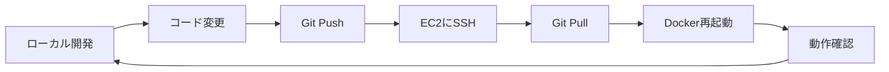

# AWS開発ワークフロー - Video Message App

## 開発サイクルの全体像



## 1. 初回セットアップ（1回だけ）

```bash
# Terraformでインフラ作成（初回のみ）
cd terraform/simple
./setup.sh  # EC2インスタンス作成

# EC2は作りっぱなしでOK（削除しない）
```

## 2. 日常の開発サイクル

### 方法A: Git経由でデプロイ（推奨）

```bash
# 1. ローカルで開発
code .  # VSCodeで編集

# 2. ローカルでテスト（オプション）
docker compose up -d
# http://localhost:55434 で確認

# 3. 変更をコミット&プッシュ
git add .
git commit -m "機能追加"
git push

# 4. EC2にデプロイ
ssh -i your-key.pem ubuntu@<EC2_IP>
cd video-message-app
git pull
docker compose down
docker compose up -d

# 5. ブラウザで確認
# http://<EC2_IP>:55434
```

### 方法B: 直接ファイル転送（素早いテスト用）

```bash
# 1. ローカルで変更

# 2. 変更ファイルを直接転送
scp -i your-key.pem backend/main.py ubuntu@<EC2_IP>:~/video-message-app/backend/

# 3. EC2でDocker再起動
ssh -i your-key.pem ubuntu@<EC2_IP>
cd video-message-app
docker compose restart backend  # 該当サービスのみ再起動

# 4. 確認
curl http://<EC2_IP>:55433/health
```

### 方法C: VSCode Remote SSH（最も便利）

```bash
# 1. VSCode拡張機能インストール
# "Remote - SSH" 拡張機能をインストール

# 2. VSCodeから直接EC2に接続
# Command Palette > "Remote-SSH: Connect to Host"
# ubuntu@<EC2_IP>

# 3. EC2上で直接編集
# ファイルを編集すると即座に反映

# 4. ターミナルから再起動
docker compose restart backend
```

## 3. 自動デプロイスクリプト

```bash
# deploy.sh を作成（ローカル）
cat > deploy.sh << 'EOF'
#!/bin/bash
EC2_IP="YOUR_EC2_IP"
KEY_FILE="your-key.pem"

echo "🚀 Deploying to AWS..."

# コード更新
ssh -i $KEY_FILE ubuntu@$EC2_IP << 'ENDSSH'
  cd video-message-app
  git pull
  docker compose down
  docker compose up -d
  echo "✅ Deployment complete!"
  docker compose ps
ENDSSH

echo "🌐 Application URLs:"
echo "Frontend: http://$EC2_IP:55434"
echo "Backend: http://$EC2_IP:55433"
EOF

chmod +x deploy.sh

# 使い方
./deploy.sh  # これだけでデプロイ完了
```

## 4. 開発環境の起動・停止

### 朝の作業開始

```bash
# EC2起動（停止していた場合）
aws ec2 start-instances --instance-ids <INSTANCE_ID>

# または AWS Console から起動
```

### 夜の作業終了

```bash
# EC2停止（コスト削減）
aws ec2 stop-instances --instance-ids <INSTANCE_ID>

# または AWS Console から停止
```

### 自動起動・停止（設定済みの場合）

```yaml
平日:
  08:00: 自動起動
  19:00: 自動停止
  
週末: 停止したまま
```

## 5. 典型的な1日の流れ

```bash
# 09:00 - 作業開始
# EC2は自動起動済み（8:00に起動）

# 09:30 - 機能開発
# ローカルで開発
npm run dev  # Frontend
python main.py  # Backend

# 11:00 - AWS環境でテスト
git push
./deploy.sh  # 自動デプロイ

# 12:00 - 昼休み

# 13:00 - バグ修正
# VSCode Remote SSHで直接EC2を編集
docker compose logs -f  # ログ確認
docker compose restart backend

# 17:00 - 最終確認
# ブラウザでテスト

# 18:00 - 作業終了
git push  # 最終コミット
# EC2は19:00に自動停止
```

## 6. よくある開発パターン

### Frontend変更時

```bash
# ローカルで変更
cd frontend
npm run build

# EC2にデプロイ
git push
ssh ec2 "cd app && git pull && docker compose restart frontend"
```

### Backend API追加時

```bash
# ローカルで開発
cd backend
# 新しいエンドポイント追加

# ローカルテスト
python main.py
curl http://localhost:55433/api/new-endpoint

# EC2デプロイ
git push
./deploy.sh
```

### 環境変数変更時

```bash
# EC2に直接ログイン
ssh -i key.pem ubuntu@ec2

# 環境変数編集
nano video-message-app/backend/.env

# 再起動
docker compose restart backend
```

## 7. デバッグ方法

### ログ確認

```bash
# EC2にSSH
ssh -i key.pem ubuntu@ec2

# 全サービスのログ
docker compose logs

# 特定サービスのログ
docker compose logs -f backend

# 最新100行
docker compose logs --tail=100 frontend
```

### コンテナ内部確認

```bash
# コンテナに入る
docker compose exec backend bash

# Pythonデバッグ
docker compose exec backend python
>>> import app
>>> # デバッグコード実行
```

## 8. CI/CD導入（オプション）

### GitHub Actions設定

```yaml
# .github/workflows/deploy.yml
name: Deploy to AWS

on:
  push:
    branches: [main]

jobs:
  deploy:
    runs-on: ubuntu-latest
    steps:
      - uses: actions/checkout@v2
      
      - name: Deploy to EC2
        env:
          HOST: ${{ secrets.EC2_HOST }}
          KEY: ${{ secrets.EC2_KEY }}
        run: |
          echo "$KEY" > key.pem
          chmod 600 key.pem
          ssh -o StrictHostKeyChecking=no -i key.pem ubuntu@$HOST << 'EOF'
            cd video-message-app
            git pull
            docker compose down
            docker compose up -d
          EOF
```

## 9. コスト管理

### 日次コスト確認

```bash
# AWS Cost Explorer で確認
# または CLIで
aws ce get-cost-and-usage \
  --time-period Start=2024-01-01,End=2024-01-31 \
  --granularity DAILY \
  --metrics "UnblendedCost" \
  --group-by Type=DIMENSION,Key=SERVICE
```

### 使用時間の最適化

```bash
# 実際の使用時間を記録
EC2稼働時間: 平日9-18時 = 9時間 × 22日 = 198時間/月
コスト: $0.1 × 198 = $19.8/月（t3.large）
```

## 10. トラブルシューティング

### EC2に繋がらない

```bash
# Elastic IPの確認
aws ec2 describe-addresses

# セキュリティグループ確認
aws ec2 describe-security-groups --group-ids sg-xxx
```

### Dockerコンテナが起動しない

```bash
# EC2のリソース確認
df -h  # ディスク容量
free -h  # メモリ
docker system prune -a  # 不要なイメージ削除
```

### 変更が反映されない

```bash
# キャッシュクリア
docker compose down
docker compose build --no-cache
docker compose up -d
```

## まとめ

**開発サイクルは非常にシンプル:**

1. **EC2は常時存在**（作ったら削除しない）
2. **ローカルで開発** → **Git Push** → **EC2でPull**
3. **自動停止でコスト削減**（使わない時は停止）
4. **VSCode Remote SSH**で直接編集も可能

**setup.shは初回のみ:**
- インフラ作成は最初の1回だけ
- 以降は起動・停止とデプロイのみ

---

*Simple, Fast, Cost-Effective Development Workflow*