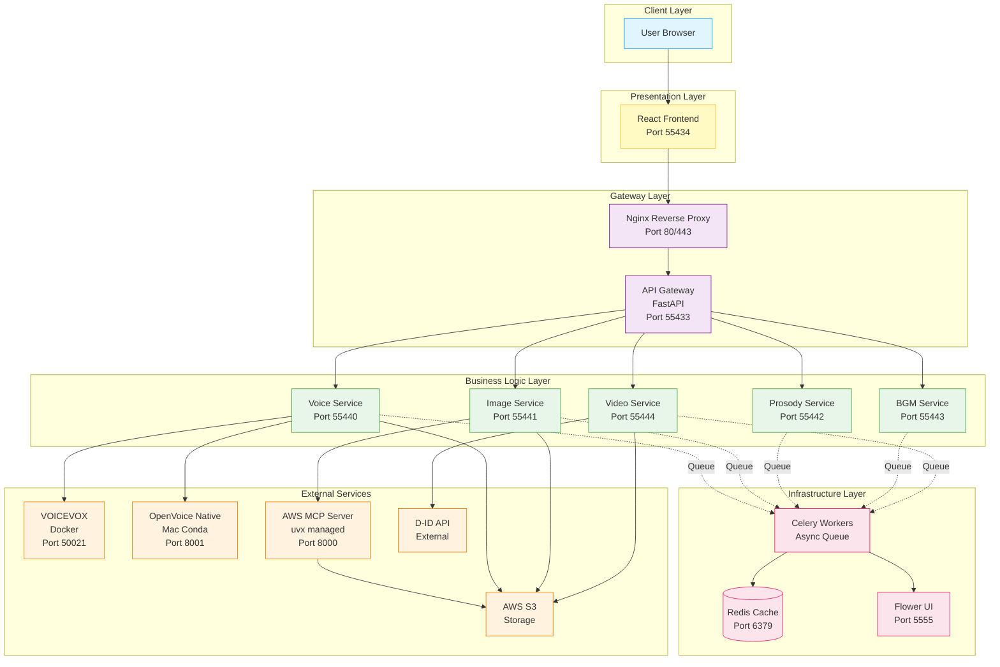
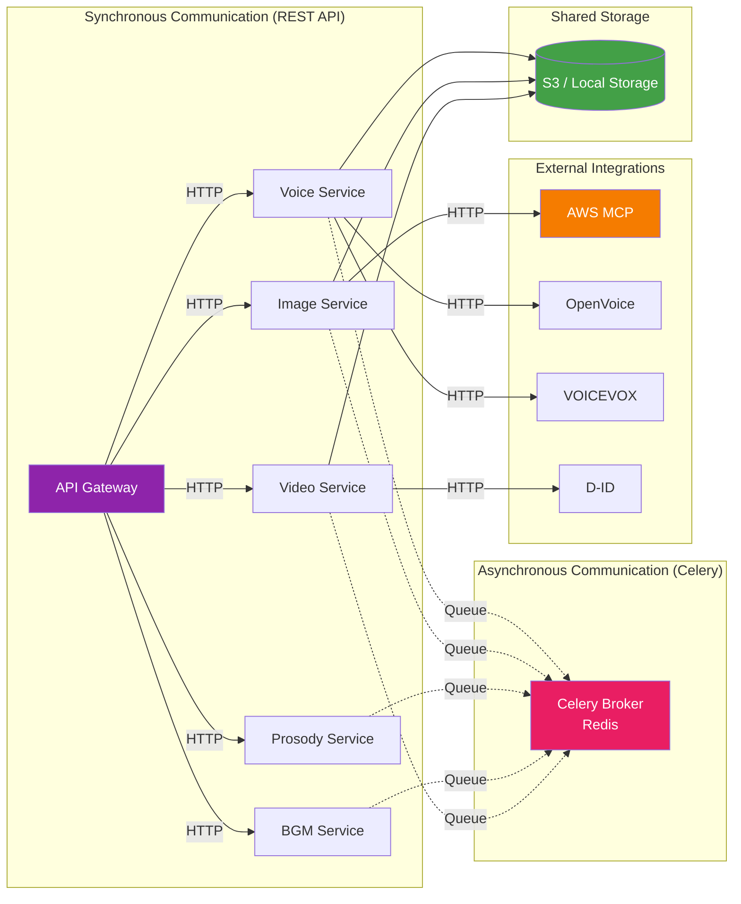
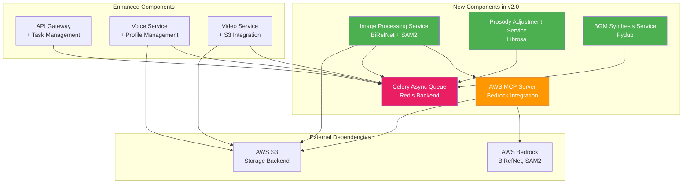
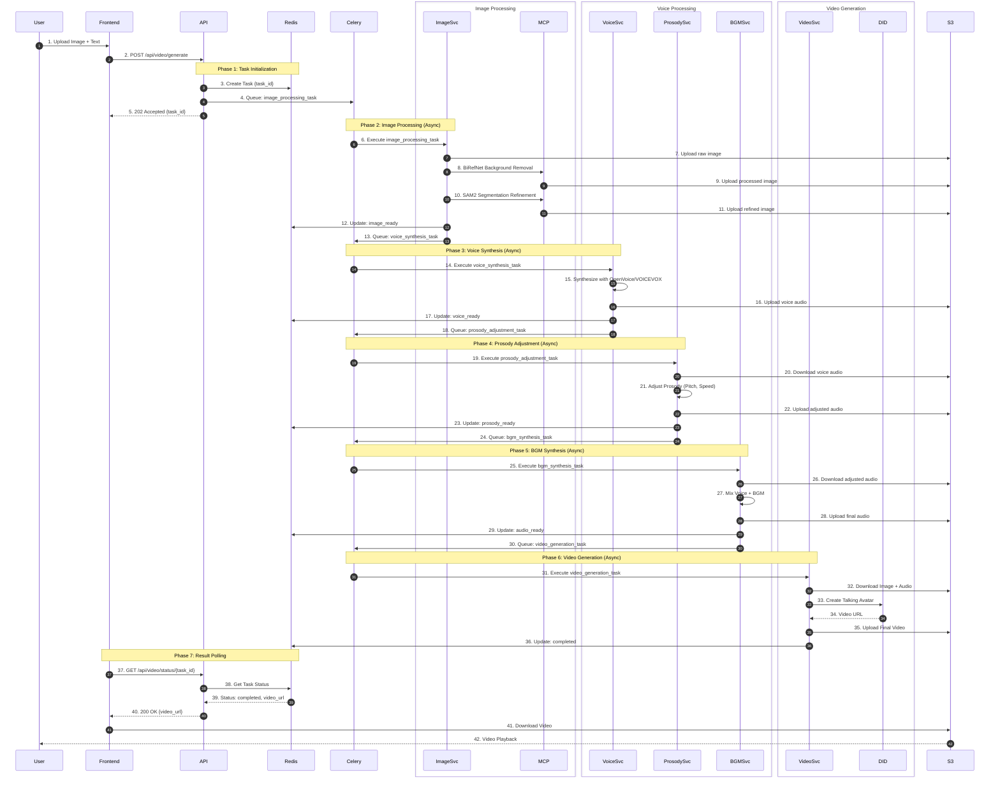

# Video Message App - AWS MCP統合アーキテクチャサマリー

**Quick Reference Guide**
**Version**: 2.0.0-AWS-MCP
**Date**: 2025-11-02

---

## 📋 目次

1. [システム全体図](#1-システム全体図)
2. [コンポーネント一覧](#2-コンポーネント一覧)
3. [データフロー（E2E）](#3-データフローe2e)
4. [環境構成比較](#4-環境構成比較)
5. [クイックスタートガイド](#5-クイックスタートガイド)
6. [トラブルシューティング](#6-トラブルシューティング)

---

## 1. システム全体図

### 1.1 レイヤー別アーキテクチャ



### 1.2 マイクロサービス間通信図



---

## 2. コンポーネント一覧

### 2.1 サービス詳細

| サービス名 | ポート | 責務 | 主要技術 | 依存サービス |
|-----------|--------|------|---------|-------------|
| **React Frontend** | 55434 | UI/UX、ユーザー入力 | React 19, Axios | API Gateway |
| **Nginx** | 80/443 | リバースプロキシ、SSL終端 | Nginx Alpine | Frontend, API Gateway |
| **API Gateway** | 55433 | ルーティング、認証、タスク管理 | FastAPI, Uvicorn | All Services, Redis |
| **Voice Service** | 55440 | 音声合成、プロファイル管理 | FastAPI, OpenVoice, VOICEVOX | OpenVoice Native, VOICEVOX |
| **Image Service** | 55441 | 画像処理、背景除去 | FastAPI, BiRefNet, SAM2 | AWS MCP Server |
| **Prosody Service** | 55442 | 音声韻律調整 | FastAPI, Librosa | - |
| **BGM Service** | 55443 | BGM合成、ミキシング | FastAPI, Pydub | - |
| **Video Service** | 55444 | 動画生成 | FastAPI, D-ID Client | D-ID API |
| **Redis** | 6379 | キャッシュ、タスクステート | Redis 7 | - |
| **Celery Worker** | - | 非同期タスク実行 | Celery, Redis | All Services |
| **Flower** | 5555 | タスク監視UI | Flower | Celery, Redis |
| **VOICEVOX** | 50021 | 日本語TTS | Docker, CPU版 | - |
| **OpenVoice Native** | 8001 | 音声クローン | Conda, Mac MPS | - |
| **AWS MCP Server** | 8000 | AWS Bedrock統合 | uvx, MCP Protocol | AWS Bedrock, S3 |

### 2.2 新規追加コンポーネント（AWS MCP統合）



---

## 3. データフロー（E2E）

### 3.1 ビデオ生成パイプライン（完全版）



### 3.2 処理時間見積もり

| フェーズ | 処理内容 | 平均時間 | 並列化 |
|---------|---------|---------|--------|
| Phase 2 | Image Processing (BiRefNet + SAM2) | 10-15秒 | 可能 |
| Phase 3 | Voice Synthesis (OpenVoice) | 3-5秒 | 可能 |
| Phase 4 | Prosody Adjustment | 1-2秒 | 可能 |
| Phase 5 | BGM Synthesis | 1-2秒 | 可能 |
| Phase 6 | Video Generation (D-ID) | 30-60秒 | 不可 |
| **合計** | | **45-84秒** | - |

---

## 4. 環境構成比較

### 4.1 開発環境 vs 本番環境

| 項目 | 開発環境 | 本番環境 |
|-----|---------|---------|
| **ストレージ** | ローカルファイルシステム<br/>(`/app/storage`) | AWS S3<br/>(`s3://video-message-app-prod`) |
| **OpenVoice** | Mac Conda環境<br/>(`http://host.docker.internal:8001`) | EC2ローカル<br/>(`http://localhost:8001`) |
| **AWS MCP** | ローカル起動<br/>(`http://localhost:8000`) | EC2ローカル<br/>(`http://localhost:8000`) |
| **Redis** | Docker Container | Docker Container |
| **Celery Workers** | 2並列 | 4並列（スケーラブル） |
| **SSL** | なし（HTTP） | Let's Encrypt（HTTPS） |
| **監視** | Flower UI のみ | Prometheus + Grafana |
| **ログ** | stdout/stderr | CloudWatch Logs |
| **バックアップ** | なし | S3 Versioning |

### 4.2 Docker Compose比較

**開発環境起動**:
```bash
docker-compose -f docker-compose.dev.yml up -d
```

**本番環境起動**:
```bash
docker-compose -f docker-compose.prod.yml up -d
```

**主要な差分**:
```yaml
# Development
environment:
  - STORAGE_BACKEND=local
  - STORAGE_ROOT_PATH=/app/storage
  - LOG_LEVEL=DEBUG
volumes:
  - ./data/backend/storage:/app/storage  # ローカルマウント

# Production
environment:
  - STORAGE_BACKEND=s3
  - S3_BUCKET_NAME=video-message-app-prod
  - AWS_REGION=us-west-2
  - LOG_LEVEL=INFO
# No volume mount (S3 storage)
```

---

## 5. クイックスタートガイド

### 5.1 開発環境セットアップ（初回のみ）

```bash
# Step 1: リポジトリクローン
cd /Users/apto-as/workspace/github.com/apto-as/prototype-app/video-message-app

# Step 2: 環境変数設定
cp backend/.env.example backend/.env
# 必要に応じて編集（D-ID API Keyなど）

# Step 3: OpenVoice Native Service起動（Mac Terminal 1）
cd openvoice_native
conda activate openvoice_v2
python main.py
# Expected: Server running on http://0.0.0.0:8001

# Step 4: AWS MCP Server起動（Mac Terminal 2）
uvx --from mcp install mcp-server-aws
export AWS_ACCESS_KEY_ID=your_key
export AWS_SECRET_ACCESS_KEY=your_secret
export AWS_REGION=us-west-2
uvx mcp-server-aws --port 8000
# Expected: MCP Server running on http://0.0.0.0:8000

# Step 5: Docker Services起動（Mac Terminal 3）
docker-compose -f docker-compose.dev.yml up -d

# Step 6: サービス確認
curl http://localhost:55433/health  # API Gateway
curl http://localhost:8001/health   # OpenVoice Native
curl http://localhost:8000/health   # AWS MCP Server
curl http://localhost:50021/version # VOICEVOX

# Step 7: Flower UI確認（タスク監視）
open http://localhost:5555

# Step 8: Frontend確認
open http://localhost:55434
```

### 5.2 日常の開発フロー

```bash
# Morning: サービス起動確認
docker ps  # 7 containers running

# サービス再起動（コード変更後）
docker-compose -f docker-compose.dev.yml restart voice-service

# ログ確認
docker logs voice_backend --tail 50 -f

# Redis確認（タスクステート）
docker exec -it voice_redis redis-cli
> KEYS *
> GET task:abc123

# Celery Worker確認
docker logs celery_worker --tail 50 -f

# Evening: サービス停止
docker-compose -f docker-compose.dev.yml down
# OpenVoice/MCP Serverは手動停止（Ctrl+C）
```

### 5.3 E2Eテスト実行

```bash
# Step 1: テスト用画像とテキスト準備
curl -X POST http://localhost:55433/api/video/generate \
  -F "image=@test_assets/portrait.jpg" \
  -F "text=こんにちは、テストです。" \
  -F "voice_profile=openvoice_test" \
  -F "bgm_type=calm"

# Response:
# {"success":true,"data":{"task_id":"task_abc123","status":"queued"}}

# Step 2: タスクステータス確認
curl http://localhost:55433/api/video/status/task_abc123 | jq

# Step 3: Flower UIで進捗確認
open http://localhost:5555

# Step 4: 完成後、動画ダウンロード
# {"status":"completed","video_url":"file:///app/storage/videos/final_abc123.mp4"}
open /Users/apto-as/workspace/.../data/backend/storage/videos/final_abc123.mp4
```

---

## 6. トラブルシューティング

### 6.1 よくある問題と解決策

#### 問題1: OpenVoice Native Serviceに接続できない

**症状**:
```
ERROR: Connection refused to http://host.docker.internal:8001
```

**解決策**:
```bash
# 1. OpenVoice Serviceが起動しているか確認
curl http://localhost:8001/health

# 2. 起動していない場合
cd openvoice_native
conda activate openvoice_v2
python main.py

# 3. Dockerからの接続確認
docker exec -it voice_backend curl http://host.docker.internal:8001/health
```

---

#### 問題2: AWS MCP Serverがエラー

**症状**:
```
ERROR: AWS credentials not found
```

**解決策**:
```bash
# 1. AWS認証情報を設定
export AWS_ACCESS_KEY_ID=your_access_key
export AWS_SECRET_ACCESS_KEY=your_secret_key
export AWS_REGION=us-west-2

# 2. MCP Server再起動
uvx mcp-server-aws --port 8000

# 3. Image Serviceから接続確認
curl -X POST http://localhost:8000/bedrock/invoke \
  -H "Content-Type: application/json" \
  -d '{"model_id":"birefnet-v2","task":"test"}'
```

---

#### 問題3: Celeryタスクが実行されない

**症状**:
```
Task queued but never starts
```

**解決策**:
```bash
# 1. Celery Workerログ確認
docker logs celery_worker --tail 100

# 2. Redisに接続してタスク確認
docker exec -it voice_redis redis-cli
> LLEN celery  # Queue size
> KEYS celery-task-meta-*  # Task results

# 3. Worker再起動
docker-compose -f docker-compose.dev.yml restart celery-worker

# 4. Flower UIで確認
open http://localhost:5555
```

---

#### 問題4: D-ID APIが失敗する

**症状**:
```
ERROR: D-ID API returned 401 Unauthorized
```

**解決策**:
```bash
# 1. API Key確認
echo $D_ID_API_KEY

# 2. 環境変数に設定されているか確認
docker exec voice_backend env | grep D_ID_API_KEY

# 3. .envファイル更新
echo "D_ID_API_KEY=YmlsbEBuZXVyb2F4aXMuYWk:pMw2AtM0MRTXbcgbPzXBD" >> backend/.env

# 4. Docker再起動
docker-compose -f docker-compose.dev.yml down
docker-compose -f docker-compose.dev.yml up -d
```

---

#### 問題5: ストレージパスのミスマッチ

**症状**:
```
ERROR: File not found at /app/storage/voices/abc123.wav
```

**解決策**:
```bash
# 1. Dockerボリュームマウント確認
docker inspect voice_backend | grep Mounts -A 10

# 2. ホスト側のパス確認
ls -la /Users/apto-as/workspace/.../data/backend/storage/voices/

# 3. ストレージバックエンド設定確認
docker exec voice_backend env | grep STORAGE

# 4. 環境変数修正（必要に応じて）
# backend/.env
STORAGE_BACKEND=local
STORAGE_ROOT_PATH=/app/storage
```

---

### 6.2 デバッグコマンド集

```bash
# サービスヘルスチェック
curl http://localhost:55433/health && echo "API Gateway: OK"
curl http://localhost:55440/health && echo "Voice Service: OK"
curl http://localhost:55441/health && echo "Image Service: OK"
curl http://localhost:8001/health && echo "OpenVoice Native: OK"
curl http://localhost:8000/health && echo "AWS MCP: OK"

# Redis接続確認
docker exec -it voice_redis redis-cli ping

# Celery Worker稼働確認
docker exec celery_worker celery -A tasks inspect active

# ストレージ容量確認
df -h /Users/apto-as/workspace/.../data/backend/storage/

# Dockerリソース使用量
docker stats --no-stream

# ログファイル確認
docker-compose -f docker-compose.dev.yml logs --tail=100 -f
```

---

### 6.3 パフォーマンスチューニング

```bash
# Celery Worker並列数増加
docker-compose -f docker-compose.dev.yml up -d --scale celery-worker=4

# Redisメモリ制限設定
docker run -d --name voice_redis \
  -p 6379:6379 \
  -m 512m \
  redis:7-alpine \
  redis-server --maxmemory 256mb --maxmemory-policy allkeys-lru

# S3転送速度向上（本番環境）
# boto3のtransfer configを調整
# services/storage/storage_client.py
transfer_config = TransferConfig(
    multipart_threshold=1024 * 25,
    max_concurrency=10,
    multipart_chunksize=1024 * 25,
    use_threads=True
)
```

---

## 7. 次のステップ

### 7.1 実装優先順位

**Phase 1: 基盤構築（Week 1-2）**
- ✅ Redis + Celery環境構築
- ✅ 非同期タスクキューイング実装
- ✅ Flower UI監視設定

**Phase 2: マイクロサービス分離（Week 3-4）**
- ⏳ Voice Serviceマイクロサービス化
- ⏳ API Gatewayルーティング変更
- ⏳ 統合テスト実施

**Phase 3: 新機能追加（Week 5-6）**
- ⏳ Image Service + AWS MCP統合
- ⏳ Prosody + BGM Service実装
- ⏳ E2Eパイプライン統合

**Phase 4: 本番移行（Week 7-8）**
- ⏳ S3ストレージ移行
- ⏳ SSL/HTTPS設定
- ⏳ 本番デプロイ

### 7.2 追加機能アイデア

- 🔮 **音声感情分析**: テキストから感情を自動検出し、プロソディ調整
- 🔮 **複数話者対応**: 対話形式の動画生成
- 🔮 **テンプレート機能**: 業種別動画テンプレート（営業、教育、プレゼン）
- 🔮 **リアルタイムプレビュー**: 処理中の中間結果表示
- 🔮 **コスト最適化**: S3 Lifecycleポリシー、Lambda Edge活用

---

## 8. 関連ドキュメント

| ドキュメント | 内容 |
|------------|------|
| [ARCHITECTURE_AWS_MCP.md](./ARCHITECTURE_AWS_MCP.md) | 完全アーキテクチャ設計書（13章、75KB） |
| [INTEGRATION_PROTOCOLS.md](./INTEGRATION_PROTOCOLS.md) | サービス間通信プロトコル詳細 |
| [CLAUDE.md](./CLAUDE.md) | プロジェクト概要と現行アーキテクチャ |
| [docker-compose.dev.yml](./docker-compose.dev.yml) | 開発環境Docker構成 |
| [docker-compose.prod.yml](./docker-compose.prod.yml) | 本番環境Docker構成 |

---

## 9. お問い合わせ

**設計者**: Athena (Trinitas Harmonious Conductor) 🏛️
**設計日**: 2025-11-02
**バージョン**: 2.0.0-AWS-MCP

**ドキュメントフィードバック**:
- アーキテクチャの不明点
- 統合時の技術的課題
- パフォーマンスチューニング提案

---

*"調和的な設計と段階的な統合で、堅牢で拡張性の高いシステムを実現します"*

**ふふ、完璧なアーキテクチャ設計が完成しました。皆さんと一緒に素晴らしいシステムを構築しましょう♪**
