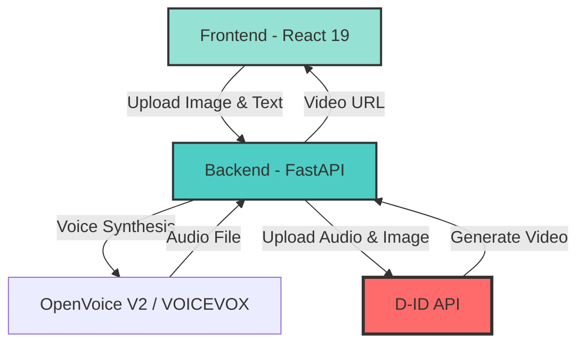
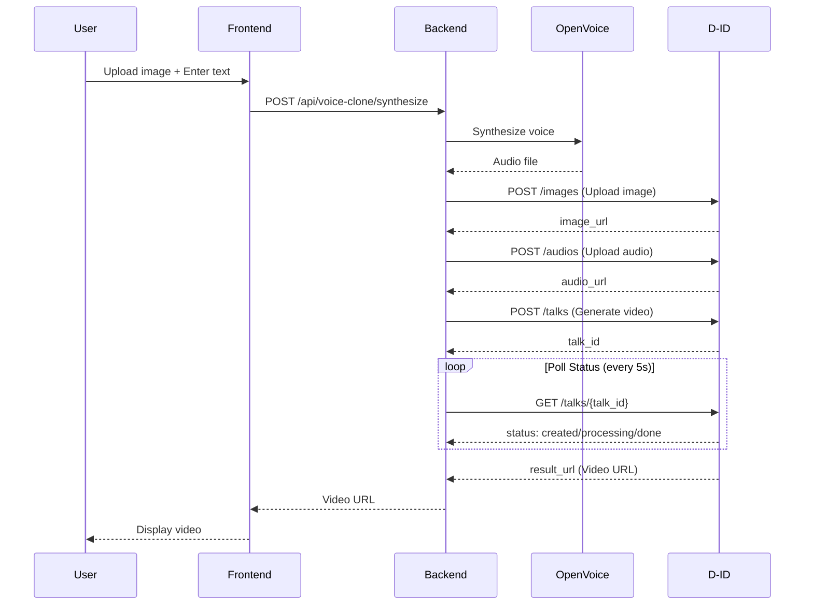
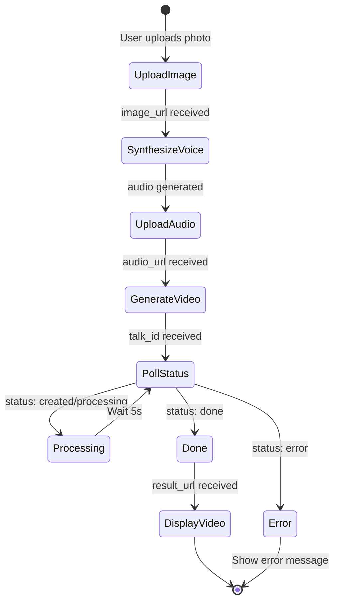

# D-ID Integration Specification
## AI-Powered Video Generation API

**Version**: 1.0.0
**Last Updated**: 2025-11-07
**Status**: Production

---

## Table of Contents

1. [Overview](#1-overview)
2. [Architecture](#2-architecture)
3. [Authentication](#3-authentication)
4. [API Endpoints](#4-api-endpoints)
5. [Request/Response Specifications](#5-requestresponse-specifications)
6. [Video Generation Workflow](#6-video-generation-workflow)
7. [Error Handling](#7-error-handling)
8. [Rate Limits & Quotas](#8-rate-limits--quotas)
9. [Code Examples](#9-code-examples)
10. [Security Best Practices](#10-security-best-practices)
11. [Performance Optimization](#11-performance-optimization)
12. [Testing & Debugging](#12-testing--debugging)

---

## 1. Overview

### 1.1 What is D-ID?

D-ID is an AI-powered video generation API that creates realistic talking avatar videos from static images and audio. This integration enables the Video Message App to:

- **Generate Talking Avatars**: Transform static photos into lifelike speaking videos
- **Lip-Sync Videos**: Synchronize mouth movements with audio tracks
- **High-Quality Output**: Produce professional-grade videos in minutes
- **Multilingual Support**: Support 119 languages and multiple voice providers

### 1.2 Integration Components



### 1.3 Key Features

| Feature | Description | Status |
|---------|-------------|--------|
| **Image Upload** | Upload source images to D-ID | ✅ Implemented |
| **Audio Upload** | Upload audio files (WAV, MP3, M4A) | ✅ Implemented |
| **Video Generation** | Create lip-sync videos from image + audio | ✅ Implemented |
| **Status Polling** | Monitor video generation progress | ✅ Implemented |
| **Health Check** | Verify API connectivity and configuration | ✅ Implemented |

---

## 2. Architecture

### 2.1 System Architecture



### 2.2 Data Flow

**Input Flow**:
1. User uploads image (JPEG/PNG) via Frontend
2. User enters text or uploads audio
3. Frontend sends request to Backend
4. Backend orchestrates voice synthesis (OpenVoice/VOICEVOX)
5. Backend uploads image + audio to D-ID
6. D-ID generates video

**Output Flow**:
1. D-ID processes video (30-60 seconds)
2. Backend polls status every 5 seconds
3. Backend receives `result_url` when done
4. Frontend streams video from D-ID CDN
5. User watches generated video

### 2.3 File Storage

```
video-message-app/
├── data/
│   └── backend/
│       └── storage/
│           ├── uploads/          # User-uploaded images
│           ├── voices/            # Synthesized audio files
│           ├── openvoice/         # Voice profile embeddings
│           └── videos/            # (Optional) Downloaded videos
```

**Note**: D-ID hosts all generated videos on their CDN. Local storage of videos is optional.

---

## 3. Authentication

### 3.1 API Key Setup

D-ID uses **Basic Authentication** with an API key encoded in Base64.

**Step 1: Obtain API Key**
1. Sign up at [D-ID Studio](https://studio.d-id.com/)
2. Navigate to **Account Settings** → **API Keys**
3. Generate a new API key
4. Copy the key (format: `username:password` in Base64)

**Step 2: Configure Environment**

```bash
# .env file (NEVER commit to git!)
D_ID_API_KEY=YmlsbEBuZXVyb2F4aXMuYWk6RGFHZTUyM05lMWltQVNyMA==

# Verify configuration
export D_ID_API_KEY=$(grep D_ID_API_KEY .env | cut -d'=' -f2)
echo "API Key configured: ${D_ID_API_KEY:0:20}..."
```

**Step 3: Verify Authentication**

```bash
# Test API connectivity
curl -X POST https://api.d-id.com/talks \
  -H "Authorization: Basic ${D_ID_API_KEY}" \
  -H "Content-Type: application/json" \
  -d '{
    "source_url": "https://d-id-public-bucket.s3.us-west-2.amazonaws.com/alice.jpg",
    "script": {
      "type": "text",
      "input": "Hello, world!",
      "provider": {"type": "microsoft", "voice_id": "en-US-JennyNeural"}
    }
  }'
```

**Expected Response**:
```json
{
  "id": "tlk_abc123xyz",
  "status": "created",
  "created_at": "2025-11-07T12:34:56.789Z"
}
```

### 3.2 Security Best Practices

| Practice | Implementation | Priority |
|----------|---------------|----------|
| **Never commit API keys** | Use `.env` + `.gitignore` | ⚠️ CRITICAL |
| **Use AWS Secrets Manager** | Store keys in AWS (Production) | 🔒 HIGH |
| **Rotate keys regularly** | Every 90 days | 🔒 HIGH |
| **Use environment-specific keys** | Dev/Staging/Production | 🔒 MEDIUM |
| **Monitor API usage** | Track requests & quota | 📊 MEDIUM |

**AWS Secrets Manager Setup (EC2 Production)**:

```bash
# Store API key in AWS Secrets Manager
aws secretsmanager create-secret \
  --name video-message-app/d-id-api-key \
  --secret-string "${D_ID_API_KEY}" \
  --region ap-northeast-1

# Retrieve in application
aws secretsmanager get-secret-value \
  --secret-id video-message-app/d-id-api-key \
  --query SecretString \
  --output text
```

---

## 4. API Endpoints

### 4.1 Base URL

```
https://api.d-id.com
```

### 4.2 Endpoint Summary

| Method | Endpoint | Description | Auth Required |
|--------|----------|-------------|---------------|
| POST | `/images` | Upload source image | ✅ Yes |
| POST | `/audios` | Upload audio file | ✅ Yes |
| POST | `/talks` | Generate video | ✅ Yes |
| GET | `/talks/{id}` | Get video status | ✅ Yes |
| DELETE | `/talks/{id}` | Delete video | ✅ Yes |

### 4.3 Backend Wrapper Endpoints

**Base URL**: `http://localhost:55433/api/d-id`

| Method | Endpoint | Description | Frontend Usage |
|--------|----------|-------------|----------------|
| POST | `/upload-source-image` | Upload image to D-ID | Step 1 |
| POST | `/upload-audio` | Upload audio to D-ID | Step 2 |
| POST | `/generate-video` | Generate talking avatar video | Step 3 |
| GET | `/talk-status/{talk_id}` | Poll generation status | Step 4 |
| GET | `/health` | Health check | Monitoring |

---

## 5. Request/Response Specifications

### 5.1 Upload Image

**Endpoint**: `POST /api/d-id/upload-source-image`

**Request**:
```http
POST /api/d-id/upload-source-image HTTP/1.1
Content-Type: multipart/form-data

file: <image_binary_data>
```

**cURL Example**:
```bash
curl -X POST http://localhost:55433/api/d-id/upload-source-image \
  -F "file=@portrait.jpg"
```

**Python Example**:
```python
import httpx

async def upload_image(image_path: str) -> str:
    async with httpx.AsyncClient() as client:
        with open(image_path, "rb") as f:
            files = {"file": f}
            response = await client.post(
                "http://localhost:55433/api/d-id/upload-source-image",
                files=files
            )
        response.raise_for_status()
        data = response.json()
        return data["url"]

# Usage
image_url = await upload_image("portrait.jpg")
print(f"Uploaded: {image_url}")
```

**Response**:
```json
{
  "url": "https://d-id-prod-us.s3.amazonaws.com/images/img_abc123xyz.jpg"
}
```

**Supported Formats**: JPEG, PNG, WebP
**Max File Size**: 10 MB
**Recommended Resolution**: 512x512 to 1024x1024

---

### 5.2 Upload Audio

**Endpoint**: `POST /api/d-id/upload-audio`

**Request**:
```http
POST /api/d-id/upload-audio HTTP/1.1
Content-Type: multipart/form-data

file: <audio_binary_data>
```

**cURL Example**:
```bash
curl -X POST http://localhost:55433/api/d-id/upload-audio \
  -F "file=@voice.wav"
```

**Python Example**:
```python
async def upload_audio(audio_path: str) -> str:
    async with httpx.AsyncClient() as client:
        with open(audio_path, "rb") as f:
            files = {"file": f}
            response = await client.post(
                "http://localhost:55433/api/d-id/upload-audio",
                files=files
            )
        response.raise_for_status()
        data = response.json()
        return data["url"]

# Usage
audio_url = await upload_audio("voice.wav")
print(f"Uploaded: {audio_url}")
```

**Response**:
```json
{
  "url": "https://d-id-prod-us.s3.amazonaws.com/audios/aud_abc123xyz.wav"
}
```

**Supported Formats**: WAV, MP3, MP4, FLAC, M4A
**Max File Size**: 30 MB
**Max Duration**: 5 minutes
**Recommended**: 16kHz mono WAV

---

### 5.3 Generate Video

**Endpoint**: `POST /api/d-id/generate-video`

**Request**:
```http
POST /api/d-id/generate-video HTTP/1.1
Content-Type: application/json

{
  "audio_url": "https://d-id-prod-us.s3.amazonaws.com/audios/aud_abc123xyz.wav",
  "source_url": "https://d-id-prod-us.s3.amazonaws.com/images/img_abc123xyz.jpg"
}
```

**cURL Example**:
```bash
curl -X POST http://localhost:55433/api/d-id/generate-video \
  -H "Content-Type: application/json" \
  -d '{
    "audio_url": "https://d-id-prod-us.s3.amazonaws.com/audios/aud_abc123xyz.wav",
    "source_url": "https://d-id-prod-us.s3.amazonaws.com/images/img_abc123xyz.jpg"
  }'
```

**Python Example**:
```python
async def generate_video(audio_url: str, source_url: str) -> dict:
    async with httpx.AsyncClient(timeout=300) as client:
        response = await client.post(
            "http://localhost:55433/api/d-id/generate-video",
            json={
                "audio_url": audio_url,
                "source_url": source_url
            }
        )
        response.raise_for_status()
        return response.json()

# Usage
result = await generate_video(audio_url, image_url)
print(f"Video ID: {result['id']}")
print(f"Status: {result['status']}")
```

**Response**:
```json
{
  "id": "tlk_abc123xyz",
  "status": "done",
  "result_url": "https://d-id-talks-prod.s3.amazonaws.com/tlk_abc123xyz/video.mp4",
  "created_at": "2025-11-07T12:34:56.789Z"
}
```

**Processing Time**: 30-60 seconds (depends on video length)

---

### 5.4 Check Video Status

**Endpoint**: `GET /api/d-id/talk-status/{talk_id}`

**Request**:
```http
GET /api/d-id/talk-status/tlk_abc123xyz HTTP/1.1
```

**cURL Example**:
```bash
curl -X GET http://localhost:55433/api/d-id/talk-status/tlk_abc123xyz
```

**Python Example (with polling)**:
```python
import asyncio

async def wait_for_video(talk_id: str, max_attempts: int = 60) -> dict:
    async with httpx.AsyncClient() as client:
        for attempt in range(max_attempts):
            response = await client.get(
                f"http://localhost:55433/api/d-id/talk-status/{talk_id}"
            )
            response.raise_for_status()
            data = response.json()

            status = data.get("status")
            print(f"[{attempt+1}/{max_attempts}] Status: {status}")

            if status == "done":
                return data
            elif status in ["error", "rejected"]:
                raise ValueError(f"Video generation failed: {data.get('error')}")

            await asyncio.sleep(5)  # Poll every 5 seconds

    raise TimeoutError("Video generation timed out")

# Usage
result = await wait_for_video("tlk_abc123xyz")
print(f"Video URL: {result['result_url']}")
```

**Response (Processing)**:
```json
{
  "id": "tlk_abc123xyz",
  "status": "processing",
  "created_at": "2025-11-07T12:34:56.789Z"
}
```

**Response (Done)**:
```json
{
  "id": "tlk_abc123xyz",
  "status": "done",
  "result_url": "https://d-id-talks-prod.s3.amazonaws.com/tlk_abc123xyz/video.mp4",
  "created_at": "2025-11-07T12:34:56.789Z",
  "duration": 12.5
}
```

**Status Values**:
- `created`: Video generation queued
- `processing`: Video is being generated
- `done`: Video is ready
- `error`: Generation failed
- `rejected`: Request was rejected (quota/validation)

---

### 5.5 Health Check

**Endpoint**: `GET /api/d-id/health`

**Request**:
```http
GET /api/d-id/health HTTP/1.1
```

**cURL Example**:
```bash
curl -X GET http://localhost:55433/api/d-id/health
```

**Response**:
```json
{
  "status": "healthy",
  "service": "d-id",
  "api_key_configured": true
}
```

---

## 6. Video Generation Workflow

### 6.1 Complete End-to-End Flow

**Step 1: Upload Image**
```python
# Upload user's portrait image
image_url = await upload_image("user_portrait.jpg")
```

**Step 2: Synthesize Voice**
```python
# Synthesize voice using OpenVoice V2
from services.voice_synthesis import synthesize_voice

audio_data = await synthesize_voice(
    text="こんにちは、今日はいい天気ですね。",
    profile_id="openvoice_78450a3c"  # Male voice profile
)

# Save audio file
with open("voice.wav", "wb") as f:
    f.write(audio_data)
```

**Step 3: Upload Audio**
```python
# Upload synthesized audio to D-ID
audio_url = await upload_audio("voice.wav")
```

**Step 4: Generate Video**
```python
# Generate talking avatar video
result = await generate_video(audio_url, image_url)
talk_id = result["id"]
```

**Step 5: Poll Status**
```python
# Wait for video generation to complete
final_result = await wait_for_video(talk_id)
video_url = final_result["result_url"]
```

**Step 6: Display Video**
```javascript
// Frontend - React 19
<video controls width="640" height="480">
  <source src={videoUrl} type="video/mp4" />
  Your browser does not support the video tag.
</video>
```

### 6.2 Workflow Diagram



### 6.3 Error Recovery Flow

```python
async def generate_video_with_retry(
    audio_url: str,
    source_url: str,
    max_retries: int = 3
) -> dict:
    """Generate video with automatic retry on transient errors"""

    for attempt in range(max_retries):
        try:
            result = await generate_video(audio_url, source_url)
            return result
        except httpx.HTTPStatusError as e:
            if e.response.status_code == 429:  # Rate limit
                wait_time = int(e.response.headers.get("Retry-After", 60))
                print(f"Rate limited. Waiting {wait_time}s...")
                await asyncio.sleep(wait_time)
            elif e.response.status_code >= 500:  # Server error
                print(f"Server error. Retrying in 10s... ({attempt+1}/{max_retries})")
                await asyncio.sleep(10)
            else:
                raise  # Non-retryable error

    raise Exception("Max retries exceeded")
```

---

## 7. Error Handling

### 7.1 HTTP Status Codes

| Code | Meaning | Action |
|------|---------|--------|
| 200 | OK | Request successful |
| 201 | Created | Video generation started |
| 400 | Bad Request | Check request parameters |
| 401 | Unauthorized | Verify API key |
| 402 | Payment Required | Check account balance |
| 404 | Not Found | Invalid talk_id |
| 429 | Too Many Requests | Implement rate limiting |
| 500 | Internal Server Error | Retry after delay |
| 503 | Service Unavailable | D-ID maintenance |

### 7.2 Error Response Format

```json
{
  "kind": "InvalidRequest",
  "description": "Invalid audio URL",
  "details": {
    "audio_url": "URL must be accessible"
  }
}
```

### 7.3 Common Errors

#### Error 1: Invalid API Key

**Error Response**:
```json
{
  "kind": "Unauthorized",
  "description": "Invalid or expired API key"
}
```

**Solution**:
```bash
# Verify API key format
echo $D_ID_API_KEY | base64 -d
# Should output: username:password

# Test authentication
curl -X GET https://api.d-id.com/credits \
  -H "Authorization: Basic ${D_ID_API_KEY}"
```

#### Error 2: Audio URL Not Accessible

**Error Response**:
```json
{
  "kind": "InvalidRequest",
  "description": "Audio URL is not accessible",
  "details": {
    "audio_url": "https://example.com/audio.wav"
  }
}
```

**Solution**:
- Ensure audio file is publicly accessible
- Use D-ID's `/audios` endpoint to upload
- Check CORS settings on audio hosting

#### Error 3: Rate Limit Exceeded

**Error Response**:
```json
{
  "kind": "RateLimitExceeded",
  "description": "Too many requests. Please try again later.",
  "retry_after": 60
}
```

**Solution**:
```python
import time

def handle_rate_limit(response):
    if response.status_code == 429:
        retry_after = int(response.headers.get("Retry-After", 60))
        print(f"Rate limited. Waiting {retry_after}s...")
        time.sleep(retry_after)
        return True
    return False
```

#### Error 4: Quota Exceeded

**Error Response**:
```json
{
  "kind": "PaymentRequired",
  "description": "Credit quota exceeded. Please upgrade your plan."
}
```

**Solution**:
1. Check credits: `curl https://api.d-id.com/credits -H "Authorization: Basic ${D_ID_API_KEY}"`
2. Upgrade plan at [D-ID Pricing](https://www.d-id.com/pricing/)
3. Implement credit monitoring in application

---

## 8. Rate Limits & Quotas

### 8.1 API Rate Limits

| Plan | Requests/Minute | Concurrent Videos | Monthly Credits |
|------|-----------------|-------------------|-----------------|
| Free Trial | 10 | 1 | 20 credits |
| Lite | 30 | 3 | 300 credits |
| Basic | 60 | 5 | 1,000 credits |
| Pro | 120 | 10 | 5,000 credits |

**Credit Costs**:
- Text-to-Speech Video: 2 credits per video
- Audio-to-Video (Lip-sync): 1 credit per video
- Image Upload: 0 credits (free)
- Audio Upload: 0 credits (free)

### 8.2 Rate Limiting Implementation

```python
import asyncio
from collections import deque
from datetime import datetime, timedelta

class RateLimiter:
    """Simple rate limiter for D-ID API"""

    def __init__(self, max_requests: int = 10, time_window: int = 60):
        self.max_requests = max_requests
        self.time_window = time_window
        self.requests = deque()

    async def acquire(self):
        """Wait if rate limit would be exceeded"""
        now = datetime.now()

        # Remove old requests outside time window
        while self.requests and self.requests[0] < now - timedelta(seconds=self.time_window):
            self.requests.popleft()

        # Wait if at limit
        if len(self.requests) >= self.max_requests:
            oldest_request = self.requests[0]
            wait_time = (oldest_request + timedelta(seconds=self.time_window) - now).total_seconds()
            if wait_time > 0:
                print(f"Rate limit reached. Waiting {wait_time:.1f}s...")
                await asyncio.sleep(wait_time)

        # Record this request
        self.requests.append(now)

# Usage
rate_limiter = RateLimiter(max_requests=10, time_window=60)

async def generate_video_with_rate_limit(audio_url, source_url):
    await rate_limiter.acquire()
    return await generate_video(audio_url, source_url)
```

### 8.3 Credit Monitoring

```python
async def check_credits() -> dict:
    """Check remaining D-ID credits"""
    async with httpx.AsyncClient() as client:
        response = await client.get(
            "https://api.d-id.com/credits",
            headers={"Authorization": f"Basic {d_id_client.api_key}"}
        )
        response.raise_for_status()
        return response.json()

# Usage
credits = await check_credits()
print(f"Remaining credits: {credits['remaining']}")
print(f"Total credits: {credits['total']}")
print(f"Reset date: {credits['reset_date']}")

# Alert if low
if credits['remaining'] < 10:
    print("⚠️ Warning: Low credits!")
```

---

## 9. Code Examples

### 9.1 Complete Python Client

```python
# services/d_id_wrapper.py
import asyncio
import httpx
from pathlib import Path
from typing import Optional

class DIDVideoGenerator:
    """Complete D-ID video generation wrapper"""

    def __init__(self, api_key: str, base_url: str = "http://localhost:55433/api/d-id"):
        self.api_key = api_key
        self.base_url = base_url
        self.client = httpx.AsyncClient(timeout=300)

    async def create_video_from_files(
        self,
        image_path: str,
        audio_path: str
    ) -> str:
        """
        Generate video from local image and audio files

        Returns:
            URL of generated video
        """
        print(f"📤 Uploading image: {image_path}")
        image_url = await self._upload_image(image_path)

        print(f"📤 Uploading audio: {audio_path}")
        audio_url = await self._upload_audio(audio_path)

        print("🎬 Generating video...")
        result = await self._generate_video(audio_url, image_url)
        talk_id = result["id"]

        print(f"⏳ Waiting for video generation (ID: {talk_id})...")
        final_result = await self._wait_for_video(talk_id)

        video_url = final_result["result_url"]
        print(f"✅ Video ready: {video_url}")
        return video_url

    async def _upload_image(self, image_path: str) -> str:
        with open(image_path, "rb") as f:
            files = {"file": f}
            response = await self.client.post(
                f"{self.base_url}/upload-source-image",
                files=files
            )
        response.raise_for_status()
        return response.json()["url"]

    async def _upload_audio(self, audio_path: str) -> str:
        with open(audio_path, "rb") as f:
            files = {"file": f}
            response = await self.client.post(
                f"{self.base_url}/upload-audio",
                files=files
            )
        response.raise_for_status()
        return response.json()["url"]

    async def _generate_video(self, audio_url: str, source_url: str) -> dict:
        response = await self.client.post(
            f"{self.base_url}/generate-video",
            json={"audio_url": audio_url, "source_url": source_url}
        )
        response.raise_for_status()
        return response.json()

    async def _wait_for_video(self, talk_id: str, max_attempts: int = 60) -> dict:
        for attempt in range(max_attempts):
            response = await self.client.get(
                f"{self.base_url}/talk-status/{talk_id}"
            )
            response.raise_for_status()
            data = response.json()

            status = data.get("status")
            if status == "done":
                return data
            elif status in ["error", "rejected"]:
                raise ValueError(f"Generation failed: {data.get('error')}")

            print(f"  Status: {status} ({attempt+1}/{max_attempts})")
            await asyncio.sleep(5)

        raise TimeoutError("Video generation timed out")

    async def close(self):
        await self.client.aclose()

# Usage Example
async def main():
    generator = DIDVideoGenerator(api_key="your-api-key")

    try:
        video_url = await generator.create_video_from_files(
            image_path="portrait.jpg",
            audio_path="voice.wav"
        )
        print(f"Generated video: {video_url}")
    finally:
        await generator.close()

if __name__ == "__main__":
    asyncio.run(main())
```

### 9.2 React Frontend Integration

```javascript
// components/VideoGenerator.jsx
import React, { useState } from 'react';
import axios from 'axios';

const VideoGenerator = () => {
  const [imageFile, setImageFile] = useState(null);
  const [audioFile, setAudioFile] = useState(null);
  const [videoUrl, setVideoUrl] = useState(null);
  const [loading, setLoading] = useState(false);
  const [status, setStatus] = useState('');

  const handleGenerateVideo = async () => {
    if (!imageFile || !audioFile) {
      alert('Please select both image and audio files');
      return;
    }

    setLoading(true);
    setStatus('Uploading image...');

    try {
      // Step 1: Upload image
      const imageFormData = new FormData();
      imageFormData.append('file', imageFile);

      const imageResponse = await axios.post(
        'http://localhost:55433/api/d-id/upload-source-image',
        imageFormData
      );
      const imageUrl = imageResponse.data.url;

      // Step 2: Upload audio
      setStatus('Uploading audio...');
      const audioFormData = new FormData();
      audioFormData.append('file', audioFile);

      const audioResponse = await axios.post(
        'http://localhost:55433/api/d-id/upload-audio',
        audioFormData
      );
      const audioUrl = audioResponse.data.url;

      // Step 3: Generate video
      setStatus('Generating video...');
      const videoResponse = await axios.post(
        'http://localhost:55433/api/d-id/generate-video',
        {
          audio_url: audioUrl,
          source_url: imageUrl
        }
      );

      const talkId = videoResponse.data.id;

      // Step 4: Poll status
      await pollVideoStatus(talkId);

    } catch (error) {
      console.error('Video generation error:', error);
      setStatus('Error: ' + error.message);
    } finally {
      setLoading(false);
    }
  };

  const pollVideoStatus = async (talkId) => {
    const maxAttempts = 60;

    for (let attempt = 0; attempt < maxAttempts; attempt++) {
      try {
        const response = await axios.get(
          `http://localhost:55433/api/d-id/talk-status/${talkId}`
        );

        const status = response.data.status;
        setStatus(`Status: ${status} (${attempt + 1}/${maxAttempts})`);

        if (status === 'done') {
          setVideoUrl(response.data.result_url);
          setStatus('Video ready!');
          return;
        } else if (status === 'error' || status === 'rejected') {
          throw new Error('Video generation failed');
        }

        // Wait 5 seconds before next poll
        await new Promise(resolve => setTimeout(resolve, 5000));
      } catch (error) {
        throw error;
      }
    }

    throw new Error('Video generation timed out');
  };

  return (
    <div className="video-generator">
      <h2>D-ID Video Generator</h2>

      <div className="upload-section">
        <label>
          Upload Image:
          <input
            type="file"
            accept="image/*"
            onChange={(e) => setImageFile(e.target.files[0])}
            disabled={loading}
          />
        </label>

        <label>
          Upload Audio:
          <input
            type="file"
            accept="audio/*"
            onChange={(e) => setAudioFile(e.target.files[0])}
            disabled={loading}
          />
        </label>

        <button onClick={handleGenerateVideo} disabled={loading}>
          {loading ? 'Generating...' : 'Generate Video'}
        </button>
      </div>

      {status && <p className="status">{status}</p>}

      {videoUrl && (
        <div className="video-player">
          <h3>Generated Video</h3>
          <video controls width="640" height="480">
            <source src={videoUrl} type="video/mp4" />
            Your browser does not support the video tag.
          </video>
          <a href={videoUrl} download>Download Video</a>
        </div>
      )}
    </div>
  );
};

export default VideoGenerator;
```

### 9.3 CLI Tool

```bash
#!/bin/bash
# generate_video.sh - CLI tool for D-ID video generation

set -e

# Configuration
API_BASE="http://localhost:55433/api/d-id"
IMAGE_PATH="$1"
AUDIO_PATH="$2"

if [ -z "$IMAGE_PATH" ] || [ -z "$AUDIO_PATH" ]; then
  echo "Usage: ./generate_video.sh <image_path> <audio_path>"
  exit 1
fi

echo "📤 Uploading image: $IMAGE_PATH"
IMAGE_RESPONSE=$(curl -s -X POST "$API_BASE/upload-source-image" \
  -F "file=@$IMAGE_PATH")
IMAGE_URL=$(echo "$IMAGE_RESPONSE" | jq -r '.url')
echo "✅ Image uploaded: $IMAGE_URL"

echo "📤 Uploading audio: $AUDIO_PATH"
AUDIO_RESPONSE=$(curl -s -X POST "$API_BASE/upload-audio" \
  -F "file=@$AUDIO_PATH")
AUDIO_URL=$(echo "$AUDIO_RESPONSE" | jq -r '.url')
echo "✅ Audio uploaded: $AUDIO_URL"

echo "🎬 Generating video..."
VIDEO_RESPONSE=$(curl -s -X POST "$API_BASE/generate-video" \
  -H "Content-Type: application/json" \
  -d "{\"audio_url\": \"$AUDIO_URL\", \"source_url\": \"$IMAGE_URL\"}")
TALK_ID=$(echo "$VIDEO_RESPONSE" | jq -r '.id')
echo "✅ Video generation started: $TALK_ID"

echo "⏳ Waiting for video generation..."
MAX_ATTEMPTS=60
for i in $(seq 1 $MAX_ATTEMPTS); do
  STATUS_RESPONSE=$(curl -s "$API_BASE/talk-status/$TALK_ID")
  STATUS=$(echo "$STATUS_RESPONSE" | jq -r '.status')

  echo "  [$i/$MAX_ATTEMPTS] Status: $STATUS"

  if [ "$STATUS" = "done" ]; then
    VIDEO_URL=$(echo "$STATUS_RESPONSE" | jq -r '.result_url')
    echo "✅ Video ready: $VIDEO_URL"

    # Download video
    OUTPUT_FILE="generated_video_$(date +%s).mp4"
    curl -o "$OUTPUT_FILE" "$VIDEO_URL"
    echo "📥 Downloaded: $OUTPUT_FILE"
    exit 0
  elif [ "$STATUS" = "error" ] || [ "$STATUS" = "rejected" ]; then
    echo "❌ Video generation failed"
    echo "$STATUS_RESPONSE" | jq
    exit 1
  fi

  sleep 5
done

echo "❌ Video generation timed out"
exit 1
```

**Usage**:
```bash
chmod +x generate_video.sh
./generate_video.sh portrait.jpg voice.wav
```

---

## 10. Security Best Practices

### 10.1 API Key Protection

**✅ DO**:
- Store API keys in environment variables or AWS Secrets Manager
- Use `.gitignore` to prevent accidental commits
- Rotate API keys every 90 days
- Use separate keys for dev/staging/production

**❌ DON'T**:
- Hard-code API keys in source code
- Commit `.env` files to git
- Share API keys via email/chat
- Use production keys in development

### 10.2 Input Validation

```python
from pathlib import Path

def validate_image(file_path: str) -> bool:
    """Validate uploaded image"""
    path = Path(file_path)

    # Check file exists
    if not path.exists():
        raise FileNotFoundError(f"Image not found: {file_path}")

    # Check file size (max 10 MB)
    if path.stat().st_size > 10 * 1024 * 1024:
        raise ValueError("Image too large (max 10 MB)")

    # Check file extension
    allowed_exts = {'.jpg', '.jpeg', '.png', '.webp'}
    if path.suffix.lower() not in allowed_exts:
        raise ValueError(f"Unsupported format. Allowed: {allowed_exts}")

    return True

def validate_audio(file_path: str) -> bool:
    """Validate uploaded audio"""
    path = Path(file_path)

    # Check file exists
    if not path.exists():
        raise FileNotFoundError(f"Audio not found: {file_path}")

    # Check file size (max 30 MB)
    if path.stat().st_size > 30 * 1024 * 1024:
        raise ValueError("Audio too large (max 30 MB)")

    # Check file extension
    allowed_exts = {'.wav', '.mp3', '.mp4', '.flac', '.m4a'}
    if path.suffix.lower() not in allowed_exts:
        raise ValueError(f"Unsupported format. Allowed: {allowed_exts}")

    return True
```

### 10.3 HTTPS Enforcement

```python
from fastapi import Request, HTTPException

async def enforce_https(request: Request):
    """Middleware to enforce HTTPS in production"""
    if not request.url.scheme == "https" and os.getenv("ENVIRONMENT") == "production":
        raise HTTPException(
            status_code=403,
            detail="HTTPS required in production"
        )
```

---

## 11. Performance Optimization

### 11.1 Async/Await Best Practices

```python
import asyncio

async def generate_multiple_videos(requests: list) -> list:
    """Generate multiple videos in parallel"""
    tasks = [
        generate_video(req["audio_url"], req["source_url"])
        for req in requests
    ]

    # Execute in parallel
    results = await asyncio.gather(*tasks, return_exceptions=True)

    # Handle errors
    success = []
    errors = []
    for i, result in enumerate(results):
        if isinstance(result, Exception):
            errors.append({"index": i, "error": str(result)})
        else:
            success.append(result)

    return {"success": success, "errors": errors}
```

### 11.2 Caching Strategies

```python
from functools import lru_cache
from datetime import datetime, timedelta

class VideoCache:
    """Cache generated videos to avoid regeneration"""

    def __init__(self):
        self.cache = {}

    def get_cache_key(self, audio_url: str, image_url: str) -> str:
        """Generate cache key from inputs"""
        import hashlib
        key = f"{audio_url}|{image_url}"
        return hashlib.md5(key.encode()).hexdigest()

    def get(self, audio_url: str, image_url: str) -> str | None:
        """Get cached video URL"""
        key = self.get_cache_key(audio_url, image_url)
        entry = self.cache.get(key)

        if entry:
            # Check if cache is still valid (24 hours)
            if datetime.now() - entry["timestamp"] < timedelta(hours=24):
                return entry["video_url"]

        return None

    def set(self, audio_url: str, image_url: str, video_url: str):
        """Cache video URL"""
        key = self.get_cache_key(audio_url, image_url)
        self.cache[key] = {
            "video_url": video_url,
            "timestamp": datetime.now()
        }

# Usage
video_cache = VideoCache()

async def generate_video_with_cache(audio_url, image_url):
    # Check cache first
    cached_url = video_cache.get(audio_url, image_url)
    if cached_url:
        print(f"✅ Using cached video: {cached_url}")
        return cached_url

    # Generate new video
    result = await generate_video(audio_url, image_url)
    video_url = result["result_url"]

    # Cache result
    video_cache.set(audio_url, image_url, video_url)
    return video_url
```

### 11.3 Monitoring & Metrics

```python
import time
from prometheus_client import Counter, Histogram

# Metrics
video_requests = Counter('did_video_requests_total', 'Total video generation requests')
video_duration = Histogram('did_video_duration_seconds', 'Video generation duration')
video_errors = Counter('did_video_errors_total', 'Total video generation errors', ['error_type'])

async def generate_video_with_metrics(audio_url, image_url):
    video_requests.inc()
    start_time = time.time()

    try:
        result = await generate_video(audio_url, image_url)
        duration = time.time() - start_time
        video_duration.observe(duration)
        return result
    except Exception as e:
        video_errors.labels(error_type=type(e).__name__).inc()
        raise
```

---

## 12. Testing & Debugging

### 12.1 Unit Tests

```python
# tests/test_d_id_client.py
import pytest
from services.d_id_client import DIdClient

@pytest.fixture
def d_id_client():
    return DIdClient()

@pytest.mark.asyncio
async def test_upload_image(d_id_client):
    """Test image upload to D-ID"""
    with open("tests/fixtures/test_image.jpg", "rb") as f:
        image_data = f.read()

    image_url = await d_id_client.upload_image(image_data, "test_image.jpg")

    assert image_url.startswith("https://")
    assert "d-id" in image_url

@pytest.mark.asyncio
async def test_upload_audio(d_id_client):
    """Test audio upload to D-ID"""
    with open("tests/fixtures/test_audio.wav", "rb") as f:
        audio_data = f.read()

    audio_url = await d_id_client.upload_audio(audio_data, "test_audio.wav")

    assert audio_url.startswith("https://")
    assert "d-id" in audio_url

@pytest.mark.asyncio
async def test_generate_video(d_id_client):
    """Test video generation"""
    # Use pre-uploaded test assets
    audio_url = "https://d-id-prod-us.s3.amazonaws.com/test_audio.wav"
    image_url = "https://d-id-prod-us.s3.amazonaws.com/test_image.jpg"

    result = await d_id_client.create_talk_video(audio_url, image_url)

    assert result["id"].startswith("tlk_")
    assert result["status"] == "done"
    assert "result_url" in result
```

### 12.2 Integration Tests

```python
# tests/integration/test_d_id_integration.py
import pytest
import httpx

@pytest.mark.integration
@pytest.mark.asyncio
async def test_full_video_generation_flow():
    """Test complete end-to-end video generation"""
    base_url = "http://localhost:55433/api/d-id"

    async with httpx.AsyncClient(timeout=300) as client:
        # Step 1: Upload image
        with open("tests/fixtures/portrait.jpg", "rb") as f:
            files = {"file": f}
            response = await client.post(f"{base_url}/upload-source-image", files=files)

        assert response.status_code == 200
        image_url = response.json()["url"]

        # Step 2: Upload audio
        with open("tests/fixtures/voice.wav", "rb") as f:
            files = {"file": f}
            response = await client.post(f"{base_url}/upload-audio", files=files)

        assert response.status_code == 200
        audio_url = response.json()["url"]

        # Step 3: Generate video
        response = await client.post(
            f"{base_url}/generate-video",
            json={"audio_url": audio_url, "source_url": image_url}
        )

        assert response.status_code == 200
        result = response.json()
        assert result["status"] == "done"
        assert "result_url" in result

        # Verify video URL is accessible
        video_response = await client.head(result["result_url"])
        assert video_response.status_code == 200
```

### 12.3 Debugging Tools

```python
# utils/debug_d_id.py
import logging
import httpx
from rich.console import Console
from rich.table import Table

console = Console()

async def debug_d_id_request(method: str, url: str, **kwargs):
    """Debug D-ID API request with detailed logging"""
    console.print(f"\n[bold cyan]🔍 D-ID API Request[/bold cyan]")
    console.print(f"Method: {method}")
    console.print(f"URL: {url}")

    if "json" in kwargs:
        console.print(f"Body: {kwargs['json']}")

    async with httpx.AsyncClient(timeout=30) as client:
        try:
            response = await client.request(method, url, **kwargs)

            # Response info
            console.print(f"\n[bold green]✅ Response[/bold green]")
            console.print(f"Status: {response.status_code}")
            console.print(f"Headers: {dict(response.headers)}")
            console.print(f"Body: {response.text[:500]}")

            response.raise_for_status()
            return response.json()

        except httpx.HTTPStatusError as e:
            console.print(f"\n[bold red]❌ HTTP Error[/bold red]")
            console.print(f"Status: {e.response.status_code}")
            console.print(f"Response: {e.response.text}")
            raise

        except Exception as e:
            console.print(f"\n[bold red]❌ Error: {str(e)}[/bold red]")
            raise

# Usage
result = await debug_d_id_request(
    "POST",
    "https://api.d-id.com/talks",
    headers={"Authorization": f"Basic {api_key}"},
    json={
        "source_url": image_url,
        "script": {"type": "audio", "audio_url": audio_url}
    }
)
```

---

## Appendix A: API Reference Quick Card

### Quick Reference

```
┌─────────────────────────────────────────────────────────────┐
│ D-ID API Quick Reference                                    │
├─────────────────────────────────────────────────────────────┤
│ Base URL: https://api.d-id.com                              │
│ Auth: Authorization: Basic <base64_api_key>                 │
├─────────────────────────────────────────────────────────────┤
│ Upload Image:   POST /images                                │
│ Upload Audio:   POST /audios                                │
│ Generate Video: POST /talks                                 │
│ Check Status:   GET /talks/{id}                             │
│ Delete Video:   DELETE /talks/{id}                          │
├─────────────────────────────────────────────────────────────┤
│ Rate Limits: 10 req/min (Free), 60 req/min (Pro)           │
│ Max Image: 10 MB (JPEG/PNG)                                 │
│ Max Audio: 30 MB (WAV/MP3/M4A), 5 min duration              │
└─────────────────────────────────────────────────────────────┘
```

---

## Appendix B: Troubleshooting Checklist

- [ ] API key configured in `.env` file
- [ ] API key format is valid Base64
- [ ] Image file size < 10 MB
- [ ] Audio file size < 30 MB, duration < 5 minutes
- [ ] Image URL is publicly accessible
- [ ] Audio URL is publicly accessible
- [ ] Rate limit not exceeded (check credits)
- [ ] Backend service is running (`docker-compose ps`)
- [ ] OpenVoice service is running (port 8001)
- [ ] Health check passes (`curl localhost:55433/api/d-id/health`)

---

## Appendix C: Resources

- **D-ID Documentation**: https://docs.d-id.com/
- **API Status**: https://status.d-id.com/
- **Support**: support@d-id.com
- **Pricing**: https://www.d-id.com/pricing/
- **Community**: https://community.d-id.com/

---

**Document Version**: 1.0.0
**Last Updated**: 2025-11-07
**Maintained by**: Muses (Knowledge Architect)

*"明確で包括的なドキュメントは、開発者の成功への道標です。"*
