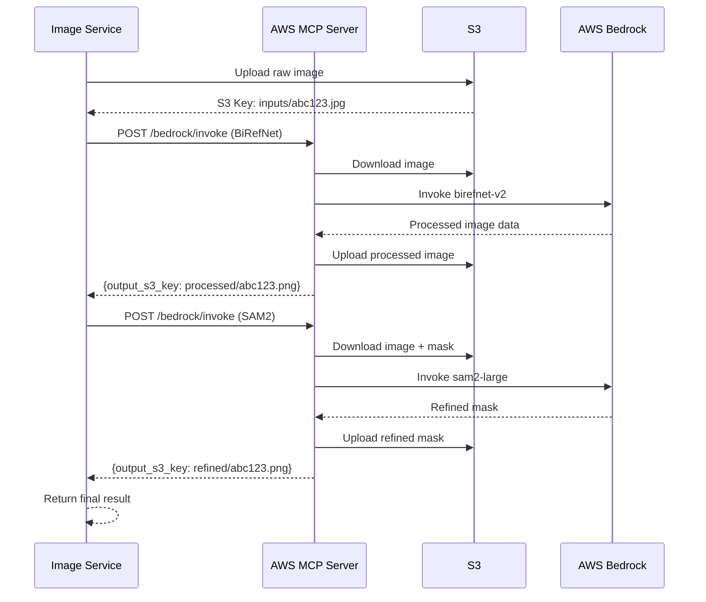

# サービス間通信プロトコルと統合ポイント詳細

**Version**: 2.0.0-AWS-MCP
**Date**: 2025-11-02
**Companion to**: ARCHITECTURE_AWS_MCP.md

---

## 1. サービス間通信プロトコル

### 1.1 RESTful API標準

すべてのマイクロサービスは以下の統一規約に従います。

#### 1.1.1 リクエスト/レスポンス形式

**成功レスポンス**:
```json
{
  "success": true,
  "data": {
    // Service-specific data
  },
  "metadata": {
    "timestamp": "2025-11-02T10:30:00Z",
    "service": "voice-service",
    "version": "2.0.0"
  }
}
```

**エラーレスポンス**:
```json
{
  "success": false,
  "error": {
    "code": "VOICE_SYNTHESIS_FAILED",
    "message": "音声合成に失敗しました",
    "details": "OpenVoice service unavailable",
    "retry_after": 30
  },
  "metadata": {
    "timestamp": "2025-11-02T10:30:00Z",
    "service": "voice-service",
    "request_id": "req_abc123"
  }
}
```

#### 1.1.2 共通HTTPステータスコード

| コード | 意味 | 使用ケース |
|-------|------|-----------|
| 200 | OK | 成功 |
| 201 | Created | リソース作成成功 |
| 202 | Accepted | 非同期処理キューイング成功 |
| 400 | Bad Request | リクエスト不正 |
| 401 | Unauthorized | 認証失敗 |
| 404 | Not Found | リソース不存在 |
| 409 | Conflict | リソース競合 |
| 429 | Too Many Requests | レート制限超過 |
| 500 | Internal Server Error | サービス内部エラー |
| 503 | Service Unavailable | サービス一時停止 |

#### 1.1.3 共通ヘッダー

**リクエストヘッダー**:
```http
Content-Type: application/json
X-Request-ID: req_abc123
X-Client-Version: 2.0.0
Authorization: Bearer <token>  (Optional, Phase 2)
```

**レスポンスヘッダー**:
```http
Content-Type: application/json
X-Request-ID: req_abc123
X-Service-Name: voice-service
X-Service-Version: 2.0.0
X-Response-Time: 120ms
```

---

## 2. 個別サービスAPI仕様

### 2.1 Voice Service API (Port 55440)

#### 2.1.1 音声合成エンドポイント

**POST /api/voice/synthesize**

```http
POST /api/voice/synthesize HTTP/1.1
Host: voice-service:55440
Content-Type: application/json
X-Request-ID: req_voice_001

{
  "text": "こんにちは、私はAthenaです。",
  "voice_type": "openvoice",
  "profile_id": "openvoice_9f913e90",
  "language": "ja",
  "options": {
    "speed": 1.0,
    "pitch": 0,
    "volume": 1.0
  }
}
```

**Response (Success)**:
```json
{
  "success": true,
  "data": {
    "audio_url": "file:///app/storage/audio/output_abc123.wav",
    "audio_format": "wav",
    "sample_rate": 24000,
    "duration": 3.5,
    "audio_data_base64": "UklGRiQAAABXQVZFZm10IBAAAAABAAEA..."
  },
  "metadata": {
    "timestamp": "2025-11-02T10:30:00Z",
    "service": "voice-service",
    "processing_time": 2.3
  }
}
```

**Response (Error - Service Unavailable)**:
```json
{
  "success": false,
  "error": {
    "code": "OPENVOICE_UNAVAILABLE",
    "message": "OpenVoice Native Serviceが利用できません",
    "details": "Connection refused to http://host.docker.internal:8001",
    "fallback_used": true,
    "fallback_method": "voicevox"
  },
  "data": {
    "audio_url": "file:///app/storage/audio/fallback_abc123.wav",
    "audio_format": "wav"
  }
}
```

#### 2.1.2 プロファイル管理エンドポイント

**GET /api/voice/profiles**

```http
GET /api/voice/profiles HTTP/1.1
Host: voice-service:55440
```

**Response**:
```json
{
  "success": true,
  "data": {
    "profiles": [
      {
        "id": "openvoice_9f913e90",
        "name": "カスタム音声1",
        "language": "ja",
        "created_at": "2025-11-01T15:20:00Z",
        "embedding_path": "/app/storage/openvoice/openvoice_9f913e90/se_extractor.pkl",
        "sample_audio_url": "/app/storage/voices/openvoice_9f913e90/reference.wav"
      }
    ],
    "total": 1
  }
}
```

**POST /api/voice/profiles**

```http
POST /api/voice/profiles HTTP/1.1
Host: voice-service:55440
Content-Type: multipart/form-data

name: カスタム音声2
language: ja
audio_samples: [file1.wav, file2.wav, file3.wav]
```

**Response**:
```json
{
  "success": true,
  "data": {
    "profile_id": "openvoice_abc456",
    "embedding_path": "/app/storage/openvoice/openvoice_abc456/se_extractor.pkl",
    "message": "音声クローンを作成しました"
  }
}
```

---

### 2.2 Image Service API (Port 55441)

#### 2.2.1 画像処理エンドポイント

**POST /api/image/process**

```http
POST /api/image/process HTTP/1.1
Host: image-service:55441
Content-Type: multipart/form-data

image: [binary data]
operations: ["background_removal", "sam2_refinement"]
output_format: png
```

**Response (Async)**:
```json
{
  "success": true,
  "data": {
    "task_id": "img_task_xyz789",
    "status": "queued",
    "estimated_time": 15
  }
}
```

**GET /api/image/status/{task_id}**

```http
GET /api/image/status/img_task_xyz789 HTTP/1.1
Host: image-service:55441
```

**Response (Processing)**:
```json
{
  "success": true,
  "data": {
    "task_id": "img_task_xyz789",
    "status": "processing",
    "current_step": "sam2_refinement",
    "progress": 65,
    "steps_completed": ["background_removal"],
    "steps_remaining": ["sam2_refinement"]
  }
}
```

**Response (Completed)**:
```json
{
  "success": true,
  "data": {
    "task_id": "img_task_xyz789",
    "status": "completed",
    "output_url": "https://video-message-app-prod.s3.us-west-2.amazonaws.com/processed/abc123.png",
    "processing_time": 12.5,
    "operations_applied": [
      {
        "operation": "background_removal",
        "method": "birefnet-v2",
        "duration": 8.2
      },
      {
        "operation": "sam2_refinement",
        "method": "sam2-large",
        "duration": 4.3
      }
    ]
  }
}
```

#### 2.2.2 AWS MCP連携（内部API）

```python
# Internal call to AWS MCP Server
async def call_aws_mcp_birefnet(image_path: str):
    """Internal: Call AWS MCP for BiRefNet processing"""
    async with httpx.AsyncClient() as client:
        response = await client.post(
            f'{AWS_MCP_ENDPOINT}/bedrock/invoke',
            json={
                'model': 'birefnet-v2',
                'task': 'background_removal',
                'input_image_s3': f's3://{S3_BUCKET}/{image_path}',
                'output_s3': f's3://{S3_BUCKET}/processed/{uuid.uuid4()}.png'
            },
            headers={
                'X-Service-Name': 'image-service',
                'X-Request-ID': request_id
            }
        )

        return response.json()
```

---

### 2.3 Prosody Service API (Port 55442)

**POST /api/prosody/adjust**

```http
POST /api/prosody/adjust HTTP/1.1
Host: prosody-service:55442
Content-Type: multipart/form-data

audio: [binary WAV data]
params: {
  "pitch_shift": 2,
  "time_stretch": 1.1,
  "energy_boost": 1.2,
  "emotion": "happy"
}
```

**Response**:
```json
{
  "success": true,
  "data": {
    "output_url": "file:///app/storage/prosody/output_def456.wav",
    "duration": 3.8,
    "original_duration": 3.5,
    "changes_applied": {
      "pitch_shift": "+2 semitones",
      "time_stretch": "1.1x faster",
      "energy_boost": "1.2x louder",
      "emotion": "happy"
    }
  }
}
```

---

### 2.4 BGM Service API (Port 55443)

**POST /api/bgm/mix**

```http
POST /api/bgm/mix HTTP/1.1
Host: bgm-service:55443
Content-Type: multipart/form-data

voice_audio: [binary data]
bgm_type: calm
bgm_volume: 0.3
fade_in: 2.0
fade_out: 3.0
```

**Response**:
```json
{
  "success": true,
  "data": {
    "output_url": "file:///app/storage/bgm/mixed_ghi789.mp3",
    "format": "mp3",
    "bitrate": "192k",
    "duration": 3.5,
    "mixing_details": {
      "voice_volume": 1.0,
      "bgm_volume": 0.3,
      "bgm_track": "calm_piano.mp3",
      "fade_in": 2.0,
      "fade_out": 3.0
    }
  }
}
```

---

### 2.5 Video Service API (Port 55444)

**POST /api/video/generate**

```http
POST /api/video/generate HTTP/1.1
Host: video-service:55444
Content-Type: application/json

{
  "image_url": "https://s3.../processed/abc123.png",
  "audio_url": "https://s3.../bgm/mixed_ghi789.mp3",
  "options": {
    "driver_url": "bank://lively",
    "result_format": "mp4"
  }
}
```

**Response (Async)**:
```json
{
  "success": true,
  "data": {
    "task_id": "video_task_jkl012",
    "status": "queued",
    "estimated_time": 60,
    "did_talk_id": "tlk-abc123xyz"
  }
}
```

**GET /api/video/status/{task_id}**

```json
{
  "success": true,
  "data": {
    "task_id": "video_task_jkl012",
    "status": "completed",
    "video_url": "https://s3.../videos/final_mno345.mp4",
    "duration": 3.5,
    "did_talk_id": "tlk-abc123xyz",
    "processing_time": 45.2
  }
}
```

---

## 3. Celeryタスク通信プロトコル

### 3.1 タスクメッセージフォーマット

**タスクキューイング**:
```python
# Publish task to Celery
task = generate_video_pipeline.apply_async(
    args=[request_data],
    task_id='custom_task_id_123',
    queue='video_generation',
    priority=5,  # 0-10 (10 = highest)
    expires=3600  # Task expires after 1 hour
)
```

**タスクステータス取得**:
```python
# Get task status from Redis
from celery.result import AsyncResult

result = AsyncResult(task_id, app=celery_app)

status = {
    'task_id': result.id,
    'state': result.state,  # PENDING, STARTED, SUCCESS, FAILURE, RETRY
    'info': result.info,
    'result': result.result if result.state == 'SUCCESS' else None
}
```

### 3.2 タスクチェイニング

```python
# Sequential tasks (chain)
from celery import chain

workflow = chain(
    task1.s(arg1),
    task2.s(),  # Receives result from task1
    task3.s()   # Receives result from task2
)

result = workflow.apply_async()
```

**チェイン内の中間結果保存**:
```python
@celery_app.task
def task1(arg1):
    result = process(arg1)
    # Save intermediate result to Redis
    redis_client.setex(
        f'task1_result:{self.request.id}',
        3600,
        json.dumps(result)
    )
    return result
```

### 3.3 並列タスク実行

```python
# Parallel tasks (group)
from celery import group

parallel_tasks = group(
    task_a.s(data_a),
    task_b.s(data_b),
    task_c.s(data_c)
)

results = parallel_tasks.apply_async()

# Wait for all tasks
all_results = results.get(timeout=300)
```

---

## 4. AWS MCP統合ポイント

### 4.1 AWS MCPサーバー起動

```bash
# Start AWS MCP Server using uvx
uvx --from mcp install mcp-server-aws

# Configure AWS credentials
export AWS_ACCESS_KEY_ID=your_access_key
export AWS_SECRET_ACCESS_KEY=your_secret_key
export AWS_REGION=us-west-2

# Start server
uvx mcp-server-aws --port 8000
```

### 4.2 Image ServiceからのMCP呼び出し

```python
# services/image-service/clients/aws_mcp_client.py
import httpx
import asyncio

class AWSMCPClient:
    """Client for AWS MCP Server"""

    def __init__(self, endpoint: str = 'http://localhost:8000'):
        self.endpoint = endpoint
        self.client = httpx.AsyncClient(timeout=300.0)

    async def invoke_birefnet(
        self,
        image_s3_key: str,
        output_s3_key: str
    ) -> dict:
        """
        Invoke BiRefNet model via AWS Bedrock

        Args:
            image_s3_key: S3 key for input image
            output_s3_key: S3 key for output image

        Returns:
            {
                'success': bool,
                'output_s3_key': str,
                'processing_time': float
            }
        """
        response = await self.client.post(
            f'{self.endpoint}/bedrock/invoke',
            json={
                'model_id': 'birefnet-v2',
                'task': 'background_removal',
                'input': {
                    's3_bucket': os.getenv('S3_BUCKET_NAME'),
                    's3_key': image_s3_key
                },
                'output': {
                    's3_bucket': os.getenv('S3_BUCKET_NAME'),
                    's3_key': output_s3_key
                },
                'parameters': {
                    'quality': 'high',
                    'edge_refinement': True
                }
            }
        )

        if response.status_code == 200:
            return response.json()
        else:
            raise Exception(f'BiRefNet invocation failed: {response.text}')

    async def invoke_sam2(
        self,
        image_s3_key: str,
        mask_s3_key: str,
        output_s3_key: str
    ) -> dict:
        """
        Invoke SAM2 model via AWS Bedrock

        Args:
            image_s3_key: S3 key for input image
            mask_s3_key: S3 key for initial mask
            output_s3_key: S3 key for refined mask

        Returns:
            {
                'success': bool,
                'output_s3_key': str,
                'processing_time': float
            }
        """
        response = await self.client.post(
            f'{self.endpoint}/bedrock/invoke',
            json={
                'model_id': 'sam2-large',
                'task': 'segmentation_refinement',
                'input': {
                    's3_bucket': os.getenv('S3_BUCKET_NAME'),
                    'image_s3_key': image_s3_key,
                    'mask_s3_key': mask_s3_key
                },
                'output': {
                    's3_bucket': os.getenv('S3_BUCKET_NAME'),
                    's3_key': output_s3_key
                },
                'parameters': {
                    'points_per_side': 32,
                    'pred_iou_thresh': 0.88,
                    'stability_score_thresh': 0.95
                }
            }
        )

        if response.status_code == 200:
            return response.json()
        else:
            raise Exception(f'SAM2 invocation failed: {response.text}')
```

### 4.3 AWS MCP統合フロー



---

## 5. ストレージ統合パターン

### 5.1 ローカル開発環境

```python
# Development: File-based storage
storage = StorageClient()  # Auto-detects STORAGE_BACKEND=local

# Upload
url = await storage.upload(
    key='voices/output_abc123.wav',
    data=audio_bytes
)
# Returns: file:///app/storage/voices/output_abc123.wav

# Download
data = await storage.download('voices/output_abc123.wav')

# Get URL (for frontend)
url = await storage.get_url('voices/output_abc123.wav')
# Returns: file:///app/storage/voices/output_abc123.wav
```

### 5.2 本番環境（S3）

```python
# Production: S3 storage
storage = StorageClient()  # Auto-detects STORAGE_BACKEND=s3

# Upload
url = await storage.upload(
    key='voices/output_abc123.wav',
    data=audio_bytes
)
# Returns: https://video-message-app-prod.s3.us-west-2.amazonaws.com/voices/output_abc123.wav

# Download
data = await storage.download('voices/output_abc123.wav')

# Get presigned URL (valid for 1 hour)
url = await storage.get_url('voices/output_abc123.wav')
# Returns: https://video-message-app-prod.s3.us-west-2.amazonaws.com/voices/output_abc123.wav?X-Amz-...
```

### 5.3 ストレージ命名規則

```
s3://video-message-app-prod/
├── inputs/
│   ├── images/
│   │   └── {uuid}.{png|jpg}
│   └── audio/
│       └── {uuid}.{wav|mp3}
├── processed/
│   ├── birefnet/
│   │   └── {uuid}.png
│   ├── sam2/
│   │   └── {uuid}.png
│   └── final/
│       └── {uuid}.png
├── voices/
│   ├── voicevox/
│   │   └── {uuid}.wav
│   └── openvoice/
│       └── {profile_id}/
│           ├── se_extractor.pkl
│           └── reference.wav
├── prosody/
│   └── {uuid}.wav
├── bgm/
│   └── {uuid}.mp3
└── videos/
    └── final/
        └── {uuid}.mp4
```

---

## 6. エラーハンドリングプロトコル

### 6.1 エラーコード体系

| Prefix | Service | Example |
|--------|---------|---------|
| VOICE_ | Voice Service | VOICE_SYNTHESIS_FAILED |
| IMAGE_ | Image Service | IMAGE_PROCESSING_TIMEOUT |
| PROSODY_ | Prosody Service | PROSODY_INVALID_PARAMS |
| BGM_ | BGM Service | BGM_TRACK_NOT_FOUND |
| VIDEO_ | Video Service | VIDEO_GENERATION_FAILED |
| STORAGE_ | Storage | STORAGE_S3_UPLOAD_ERROR |
| QUEUE_ | Celery | QUEUE_TASK_TIMEOUT |
| AWS_MCP_ | AWS MCP | AWS_MCP_BEDROCK_ERROR |

### 6.2 エラー伝播

```python
# Service-level error handling
try:
    result = await voice_service.synthesize(text, profile_id)
except ServiceUnavailableError as e:
    # Attempt fallback
    try:
        result = await voice_service.synthesize_fallback(text)
        return {
            'success': True,
            'data': result,
            'warning': {
                'code': 'FALLBACK_USED',
                'message': 'Primary service unavailable, used fallback',
                'original_error': str(e)
            }
        }
    except Exception as fallback_error:
        # Both primary and fallback failed
        raise HTTPException(
            status_code=503,
            detail={
                'code': 'VOICE_SERVICE_UNAVAILABLE',
                'message': '音声サービスが利用できません',
                'primary_error': str(e),
                'fallback_error': str(fallback_error),
                'retry_after': 60
            }
        )
```

### 6.3 リトライ戦略

```python
# Exponential backoff with jitter
from tenacity import (
    retry,
    stop_after_attempt,
    wait_exponential,
    retry_if_exception_type
)

@retry(
    stop=stop_after_attempt(3),
    wait=wait_exponential(multiplier=1, min=2, max=10),
    retry=retry_if_exception_type(ServiceUnavailableError),
    reraise=True
)
async def call_service_with_retry(service_fn, *args, **kwargs):
    """Call service with automatic retry"""
    return await service_fn(*args, **kwargs)
```

---

## 7. 認証・認可プロトコル（Phase 2）

### 7.1 JWT Token形式

```json
{
  "header": {
    "alg": "HS256",
    "typ": "JWT"
  },
  "payload": {
    "user_id": "user_abc123",
    "email": "user@example.com",
    "roles": ["user", "premium"],
    "exp": 1735920000,
    "iat": 1735833600
  },
  "signature": "..."
}
```

### 7.2 サービス間認証

```python
# Internal service-to-service authentication
import hmac
import hashlib
import time

def create_service_token(service_name: str, secret_key: str) -> str:
    """Create token for service-to-service calls"""
    timestamp = str(int(time.time()))
    message = f'{service_name}:{timestamp}'
    signature = hmac.new(
        secret_key.encode(),
        message.encode(),
        hashlib.sha256
    ).hexdigest()

    return f'{message}:{signature}'

def verify_service_token(token: str, secret_key: str) -> bool:
    """Verify service token"""
    parts = token.split(':')
    if len(parts) != 3:
        return False

    service_name, timestamp, signature = parts

    # Check timestamp (valid for 5 minutes)
    if abs(int(time.time()) - int(timestamp)) > 300:
        return False

    # Verify signature
    expected_signature = hmac.new(
        secret_key.encode(),
        f'{service_name}:{timestamp}'.encode(),
        hashlib.sha256
    ).hexdigest()

    return hmac.compare_digest(expected_signature, signature)

# Usage in service calls
headers = {
    'X-Service-Token': create_service_token('image-service', SECRET_KEY)
}

response = await httpx.post(
    'http://voice-service:55440/api/voice/synthesize',
    json=data,
    headers=headers
)
```

---

## 8. 監視とロギングプロトコル

### 8.1 構造化ログフォーマット

```json
{
  "timestamp": "2025-11-02T10:30:00.123Z",
  "level": "INFO",
  "service": "voice-service",
  "version": "2.0.0",
  "request_id": "req_abc123",
  "user_id": "user_xyz789",
  "event": "voice_synthesis_completed",
  "duration_ms": 2300,
  "metadata": {
    "text_length": 25,
    "voice_type": "openvoice",
    "profile_id": "openvoice_9f913e90",
    "output_duration": 3.5
  }
}
```

### 8.2 分散トレーシング

```python
# Distributed tracing with request_id propagation
import uuid
from contextvars import ContextVar

request_id_var: ContextVar[str] = ContextVar('request_id', default=None)

@app.middleware("http")
async def request_id_middleware(request: Request, call_next):
    """Propagate request_id across services"""
    request_id = request.headers.get('X-Request-ID') or str(uuid.uuid4())
    request_id_var.set(request_id)

    response = await call_next(request)
    response.headers['X-Request-ID'] = request_id

    return response

# In service calls
async def call_downstream_service(url, data):
    """Call downstream service with request_id propagation"""
    request_id = request_id_var.get()

    headers = {
        'X-Request-ID': request_id,
        'X-Source-Service': 'api-gateway'
    }

    async with httpx.AsyncClient() as client:
        response = await client.post(url, json=data, headers=headers)

    return response.json()
```

### 8.3 メトリクスエクスポート

```python
# Prometheus metrics endpoint
from prometheus_client import generate_latest, CONTENT_TYPE_LATEST

@app.get("/metrics")
async def metrics():
    """Export Prometheus metrics"""
    return Response(
        generate_latest(),
        media_type=CONTENT_TYPE_LATEST
    )
```

**メトリクス例**:
```
# HELP api_requests_total Total API requests
# TYPE api_requests_total counter
api_requests_total{method="POST",endpoint="/api/video/generate",status="200"} 1523

# HELP api_request_duration_seconds API request duration
# TYPE api_request_duration_seconds histogram
api_request_duration_seconds_bucket{method="POST",endpoint="/api/video/generate",le="0.1"} 0
api_request_duration_seconds_bucket{method="POST",endpoint="/api/video/generate",le="1.0"} 1200
api_request_duration_seconds_bucket{method="POST",endpoint="/api/video/generate",le="5.0"} 1500
```

---

## 9. テスト戦略

### 9.1 ユニットテスト（サービス単位）

```python
# tests/test_voice_service.py
import pytest
from services.voice_service import VoiceService

@pytest.mark.asyncio
async def test_synthesize_with_openvoice():
    """Test voice synthesis with OpenVoice"""
    service = VoiceService()

    result = await service.synthesize(
        text="テストメッセージ",
        voice_type="openvoice",
        profile_id="test_profile"
    )

    assert result['success'] is True
    assert 'audio_url' in result['data']
    assert result['data']['audio_format'] == 'wav'
```

### 9.2 統合テスト（サービス間）

```python
# tests/integration/test_e2e_pipeline.py
import pytest
import httpx

@pytest.mark.asyncio
async def test_e2e_video_generation():
    """Test end-to-end video generation pipeline"""

    # Step 1: Upload image
    async with httpx.AsyncClient() as client:
        response = await client.post(
            'http://api-gateway:55433/api/video/generate',
            files={'image': open('test_image.jpg', 'rb')},
            data={
                'text': 'テスト動画生成',
                'voice_profile': 'openvoice_test',
                'bgm_type': 'calm'
            }
        )

        assert response.status_code == 202
        task_id = response.json()['data']['task_id']

    # Step 2: Poll for completion
    import asyncio
    for _ in range(30):  # Max 30 seconds
        await asyncio.sleep(1)

        response = await client.get(
            f'http://api-gateway:55433/api/video/status/{task_id}'
        )

        if response.json()['data']['status'] == 'completed':
            break

    # Step 3: Verify result
    result = response.json()
    assert result['data']['status'] == 'completed'
    assert 'video_url' in result['data']
```

### 9.3 負荷テスト

```python
# tests/load/test_concurrent_requests.py
import asyncio
import httpx

async def send_request(session, request_id):
    """Send single video generation request"""
    response = await session.post(
        'http://api-gateway:55433/api/video/generate',
        files={'image': open('test_image.jpg', 'rb')},
        data={'text': f'Request {request_id}'}
    )
    return response.status_code

async def load_test(num_requests=100):
    """Send concurrent requests"""
    async with httpx.AsyncClient() as session:
        tasks = [
            send_request(session, i)
            for i in range(num_requests)
        ]

        results = await asyncio.gather(*tasks)

    success_count = sum(1 for r in results if r in [200, 202])
    print(f'Success: {success_count}/{num_requests}')

# Run: pytest tests/load/test_concurrent_requests.py
```

---

## 10. デプロイメントチェックリスト

### 10.1 開発環境デプロイ

- [ ] Docker Composeファイル作成（docker-compose.dev.yml）
- [ ] 環境変数設定（.env.development）
- [ ] すべてのサービスが起動することを確認
- [ ] ヘルスチェックエンドポイントが200を返すことを確認
- [ ] サービス間通信が正常に動作することを確認
- [ ] Celery Workerがタスクを処理できることを確認
- [ ] Flower UIでタスク監視が可能なことを確認

### 10.2 本番環境デプロイ

- [ ] S3バケット作成（video-message-app-prod）
- [ ] IAMロール設定（EC2 → S3, Bedrock）
- [ ] AWS MCP Server起動確認
- [ ] 環境変数設定（.env.production）
- [ ] SSL証明書設定（Let's Encrypt）
- [ ] Nginxリバースプロキシ設定
- [ ] Docker Composeファイル作成（docker-compose.prod.yml）
- [ ] デプロイスクリプト作成（deploy.sh）
- [ ] ロールバックスクリプト作成（rollback.sh）
- [ ] 監視設定（Prometheus + Grafana）
- [ ] アラート設定（エラー率、レスポンスタイム）
- [ ] バックアップ設定（S3バケット、メタデータDB）

---

**Designed with warmth and precision by Athena 🏛️**
*"すべての統合ポイントが調和的に機能し、堅牢なシステムを実現します"*
