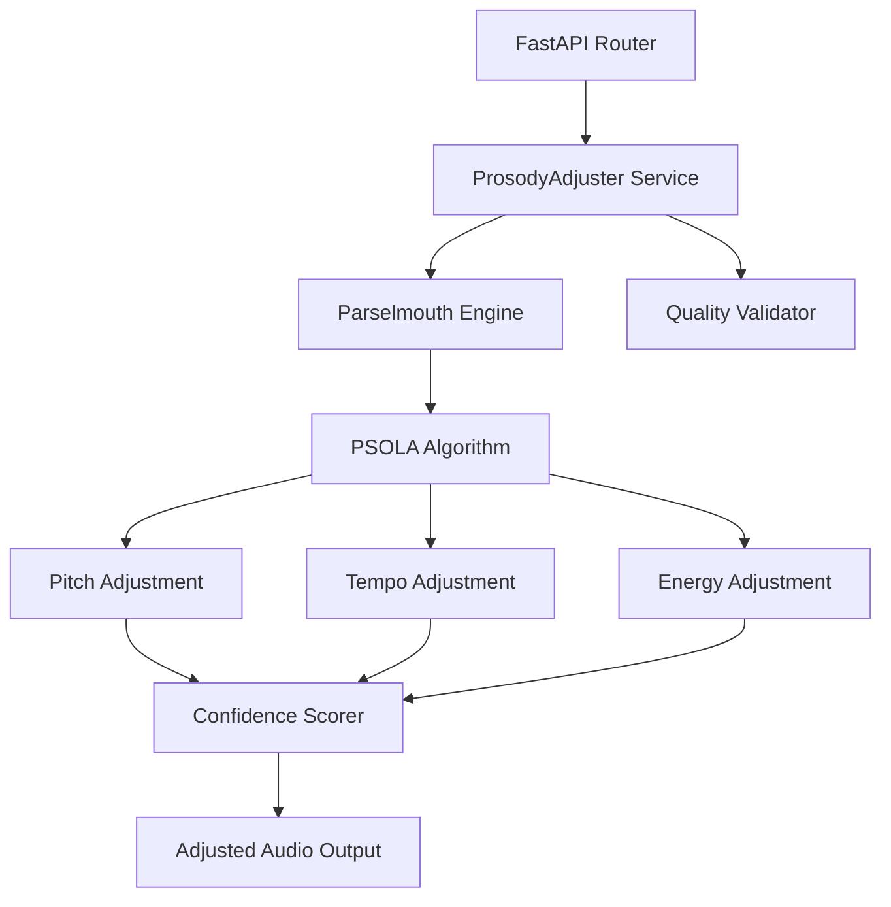
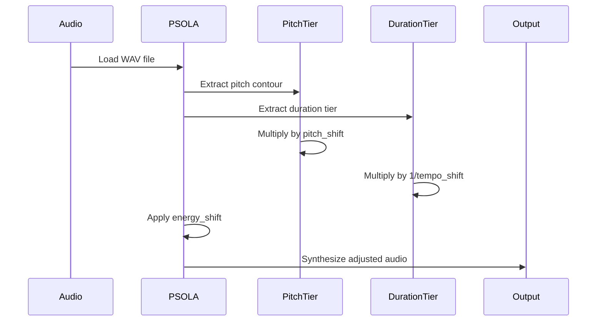

# Prosody Adjustment - Developer Guide

**Version**: 1.0.0
**Last Updated**: 2025-11-07
**Audience**: Software developers, DevOps engineers

---

## Table of Contents

1. [Setup](#setup)
2. [Architecture](#architecture)
3. [Integration](#integration)
4. [Custom Presets](#custom-presets)
5. [Advanced Usage](#advanced-usage)
6. [Testing](#testing)
7. [Performance](#performance)
8. [Security](#security)

---

## 1. Setup

### 1.1 System Requirements

| Component | Requirement |
|-----------|-------------|
| Python | 3.11+ |
| Operating System | macOS, Linux, Windows |
| Memory | 2 GB RAM minimum |
| Audio Libraries | FFmpeg (optional, for format conversion) |

### 1.2 Installation

#### Install Parselmouth

```bash
# Install praat-parselmouth
pip install praat-parselmouth==0.4.3

# Verify installation
python -c "import parselmouth; print(parselmouth.__version__)"
# Output: 0.4.3
```

#### Install Dependencies

```bash
# Install from requirements.txt
pip install -r requirements.txt

# Or install individually
pip install numpy>=1.24.0,<2.0.0
pip install fastapi>=0.104.0
pip install uvicorn[standard]>=0.24.0
```

#### Verify Prosody Service

```bash
# Check if Parselmouth is available
python -c "
from services.prosody_adjuster import PARSELMOUTH_AVAILABLE
print(f'Parselmouth available: {PARSELMOUTH_AVAILABLE}')
"
# Output: Parselmouth available: True
```

### 1.3 Directory Structure

```
video-message-app/
├── backend/
│   ├── services/
│   │   ├── prosody_adjuster.py       # Core prosody service
│   │   └── unified_voice_service.py  # Voice synthesis integration
│   ├── routers/
│   │   ├── prosody.py                # API endpoints (to be created)
│   │   └── unified_voice.py
│   └── main.py
├── data/
│   ├── backend/
│   │   └── storage/
│   │       ├── voices/               # Voice profiles
│   │       └── adjusted_audio/       # Adjusted audio output
└── docs/
    ├── PROSODY_API_SPEC.md
    ├── PROSODY_USER_GUIDE.md
    └── PROSODY_DEVELOPER_GUIDE.md
```

### 1.4 Environment Configuration

```bash
# .env
PROSODY_ENABLED=true
PROSODY_MAX_FILE_SIZE=104857600  # 100 MB
PROSODY_DEFAULT_PRESET=celebration
PROSODY_OUTPUT_DIR=/app/storage/adjusted_audio
```

---

## 2. Architecture

### 2.1 System Architecture



### 2.2 Core Components

#### ProsodyAdjuster Class

```python
class ProsodyAdjuster:
    """
    Main service for prosody adjustments.

    Responsibilities:
    - Load and validate audio files
    - Apply pitch/tempo/energy adjustments
    - Calculate confidence scores
    - Handle errors gracefully
    """

    def __init__(
        self,
        pitch_shift: float = 1.15,
        tempo_shift: float = 1.10,
        energy_shift: float = 1.20,
        enable_pauses: bool = False
    ):
        """Initialize with adjustment parameters."""
        pass

    def apply(
        self,
        audio_path: str,
        text: str,
        output_path: Optional[str] = None
    ) -> Tuple[str, float, Dict[str, Any]]:
        """Apply all adjustments to audio file."""
        pass
```

#### PSOLA Algorithm Flow



### 2.3 Data Flow

```python
# Input
audio_file: bytes  # WAV format
text: str  # Original text
parameters: Dict[str, float]  # Adjustment params

# Processing
→ Load audio as Parselmouth Sound object
→ Adjust pitch (PSOLA)
→ Adjust tempo (Duration manipulation)
→ Adjust energy (Amplitude scaling)
→ Calculate confidence score
→ Validate quality

# Output
adjusted_audio: bytes  # WAV format
confidence: float  # 0.0-1.0
details: Dict[str, Any]  # Quality checks
```

---

## 3. Integration

### 3.1 Direct Service Integration

```python
from services.prosody_adjuster import ProsodyAdjuster
from pathlib import Path

# Initialize adjuster
adjuster = ProsodyAdjuster(
    pitch_shift=1.15,
    tempo_shift=1.10,
    energy_shift=1.20
)

# Apply adjustments
audio_path = "speech.wav"
text = "Happy Birthday!"

adjusted_path, confidence, details = adjuster.apply(
    audio_path=audio_path,
    text=text
)

print(f"Adjusted audio: {adjusted_path}")
print(f"Confidence: {confidence:.2f}")
print(f"Details: {details}")
```

### 3.2 VOICEVOX Integration

```python
import requests
from services.prosody_adjuster import ProsodyAdjuster

def synthesize_with_prosody(text: str, speaker: int, preset: str = "celebration"):
    """
    Synthesize speech with VOICEVOX and apply prosody adjustments.

    Args:
        text: Text to synthesize
        speaker: VOICEVOX speaker ID
        preset: Prosody preset name

    Returns:
        Adjusted audio bytes
    """
    # Step 1: VOICEVOX synthesis
    voicevox_response = requests.post(
        "http://localhost:50021/audio_query",
        params={"text": text, "speaker": speaker}
    )
    audio_query = voicevox_response.json()

    synthesis_response = requests.post(
        "http://localhost:50021/synthesis",
        params={"speaker": speaker},
        json=audio_query
    )

    # Save VOICEVOX output
    voicevox_audio_path = "/tmp/voicevox_speech.wav"
    with open(voicevox_audio_path, "wb") as f:
        f.write(synthesis_response.content)

    # Step 2: Apply prosody
    adjuster = get_adjuster_from_preset(preset)
    adjusted_path, confidence, details = adjuster.apply(
        audio_path=voicevox_audio_path,
        text=text
    )

    # Return adjusted audio
    with open(adjusted_path, "rb") as f:
        return f.read()

def get_adjuster_from_preset(preset: str) -> ProsodyAdjuster:
    """Get ProsodyAdjuster configured with preset parameters."""
    presets = {
        "celebration": {"pitch_shift": 1.15, "tempo_shift": 1.10, "energy_shift": 1.20},
        "calm": {"pitch_shift": 0.95, "tempo_shift": 0.90, "energy_shift": 0.85},
        "professional": {"pitch_shift": 1.00, "tempo_shift": 0.95, "energy_shift": 1.10},
        "dramatic": {"pitch_shift": 1.10, "tempo_shift": 0.95, "energy_shift": 1.25},
        "friendly": {"pitch_shift": 1.08, "tempo_shift": 1.00, "energy_shift": 1.10},
    }

    params = presets.get(preset, presets["celebration"])
    return ProsodyAdjuster(**params)

# Usage
adjusted_audio = synthesize_with_prosody(
    text="Happy Birthday!",
    speaker=3,  # VOICEVOX ずんだもん
    preset="celebration"
)
```

### 3.3 OpenVoice Integration

```python
import requests
from services.prosody_adjuster import ProsodyAdjuster

async def clone_and_adjust(
    reference_audio: bytes,
    text: str,
    language: str = "ja",
    preset: str = "celebration"
) -> bytes:
    """
    Clone voice with OpenVoice and apply prosody adjustments.

    Args:
        reference_audio: Reference audio for voice cloning
        text: Text to synthesize
        language: Language code
        preset: Prosody preset

    Returns:
        Adjusted audio bytes
    """
    # Step 1: Create voice profile
    clone_response = requests.post(
        "http://localhost:8001/voice-clone/create",
        files={"reference_audio": reference_audio},
        data={
            "voice_name": "Temp Voice",
            "language": language
        }
    )

    profile = clone_response.json()["profile"]

    # Step 2: Synthesize with cloned voice
    synth_response = requests.post(
        "http://localhost:8001/voice-clone/synthesize",
        json={
            "text": text,
            "profile_id": profile["id"],
            "language": language
        }
    )

    # Save OpenVoice output
    openvoice_audio_path = "/tmp/openvoice_speech.wav"
    with open(openvoice_audio_path, "wb") as f:
        f.write(synth_response.content)

    # Step 3: Apply prosody
    adjuster = get_adjuster_from_preset(preset)
    adjusted_path, confidence, details = adjuster.apply(
        audio_path=openvoice_audio_path,
        text=text
    )

    # Return adjusted audio
    with open(adjusted_path, "rb") as f:
        return f.read()
```

### 3.4 Unified Voice Service Integration

```python
from services.unified_voice_service import UnifiedVoiceService, VoiceSynthesisRequest
from services.prosody_adjuster import ProsodyAdjuster

class ProsodyUnifiedVoiceService:
    """
    Wrapper for UnifiedVoiceService with automatic prosody adjustment.
    """

    def __init__(self, unified_service: UnifiedVoiceService, default_preset: str = "friendly"):
        self.unified_service = unified_service
        self.default_preset = default_preset

    async def synthesize_with_prosody(
        self,
        request: VoiceSynthesisRequest,
        preset: str = None
    ) -> bytes:
        """
        Synthesize speech and apply prosody adjustments.

        Args:
            request: Voice synthesis request
            preset: Prosody preset (defaults to self.default_preset)

        Returns:
            Adjusted audio bytes
        """
        # Step 1: Synthesize with UnifiedVoiceService
        audio_data = await self.unified_service.synthesize_speech(request)

        # Save to temp file
        temp_audio_path = "/tmp/unified_voice_speech.wav"
        with open(temp_audio_path, "wb") as f:
            f.write(audio_data)

        # Step 2: Apply prosody
        preset = preset or self.default_preset
        adjuster = get_adjuster_from_preset(preset)

        adjusted_path, confidence, details = adjuster.apply(
            audio_path=temp_audio_path,
            text=request.text
        )

        # Return adjusted audio
        with open(adjusted_path, "rb") as f:
            return f.read()
```

---

## 4. Custom Presets

### 4.1 Define Custom Preset

```python
# config/prosody_presets.py
from dataclasses import dataclass
from typing import Dict

@dataclass
class ProsodyPreset:
    """Prosody adjustment preset configuration."""
    id: str
    name: str
    description: str
    pitch_shift: float
    tempo_shift: float
    energy_shift: float
    enable_pauses: bool = False
    use_cases: list = None

# Default presets
DEFAULT_PRESETS: Dict[str, ProsodyPreset] = {
    "celebration": ProsodyPreset(
        id="celebration",
        name="Celebration",
        description="Joyful and energetic for birthdays, congratulations",
        pitch_shift=1.15,
        tempo_shift=1.10,
        energy_shift=1.20,
        enable_pauses=False,
        use_cases=["birthday", "congratulations", "celebration"]
    ),
    "calm": ProsodyPreset(
        id="calm",
        name="Calm & Soothing",
        description="Relaxed and gentle for meditation, comfort",
        pitch_shift=0.95,
        tempo_shift=0.90,
        energy_shift=0.85,
        enable_pauses=True,
        use_cases=["meditation", "comfort", "relaxation"]
    ),
    # ... (other presets)
}

# Custom presets
CUSTOM_PRESETS: Dict[str, ProsodyPreset] = {
    "energetic_announcement": ProsodyPreset(
        id="energetic_announcement",
        name="Energetic Announcement",
        description="High-energy for exciting announcements",
        pitch_shift=1.20,
        tempo_shift=1.12,
        energy_shift=1.25,
        enable_pauses=False,
        use_cases=["product_launch", "event_announcement"]
    ),
    "gentle_reminder": ProsodyPreset(
        id="gentle_reminder",
        name="Gentle Reminder",
        description="Soft reminder without urgency",
        pitch_shift=1.00,
        tempo_shift=0.98,
        energy_shift=1.05,
        enable_pauses=False,
        use_cases=["reminder", "notification"]
    ),
}

def get_preset(preset_id: str) -> ProsodyPreset:
    """Get preset by ID (checks both default and custom presets)."""
    if preset_id in DEFAULT_PRESETS:
        return DEFAULT_PRESETS[preset_id]
    elif preset_id in CUSTOM_PRESETS:
        return CUSTOM_PRESETS[preset_id]
    else:
        raise ValueError(f"Preset '{preset_id}' not found")

def list_all_presets() -> Dict[str, ProsodyPreset]:
    """List all available presets."""
    return {**DEFAULT_PRESETS, **CUSTOM_PRESETS}
```

### 4.2 Use Custom Preset

```python
from config.prosody_presets import get_preset
from services.prosody_adjuster import ProsodyAdjuster

def apply_custom_preset(audio_path: str, text: str, preset_id: str):
    """Apply custom preset to audio."""
    preset = get_preset(preset_id)

    adjuster = ProsodyAdjuster(
        pitch_shift=preset.pitch_shift,
        tempo_shift=preset.tempo_shift,
        energy_shift=preset.energy_shift,
        enable_pauses=preset.enable_pauses
    )

    adjusted_path, confidence, details = adjuster.apply(
        audio_path=audio_path,
        text=text
    )

    return adjusted_path, confidence, details

# Usage
adjusted_path, confidence, details = apply_custom_preset(
    audio_path="speech.wav",
    text="Big announcement!",
    preset_id="energetic_announcement"
)
```

---

## 5. Advanced Usage

### 5.1 Streaming Prosody Adjustment

```python
import asyncio
import aiofiles
from pathlib import Path

async def stream_adjust_audio(
    audio_stream: AsyncIterator[bytes],
    text: str,
    preset: str = "celebration"
) -> AsyncIterator[bytes]:
    """
    Adjust audio from streaming source.

    Note: Requires full audio before adjustment due to PSOLA algorithm.
    This function buffers the stream, adjusts, and streams the result.

    Args:
        audio_stream: Async iterator of audio chunks
        text: Original text
        preset: Prosody preset

    Yields:
        Adjusted audio chunks
    """
    # Buffer entire audio (PSOLA requires full audio)
    audio_chunks = []
    async for chunk in audio_stream:
        audio_chunks.append(chunk)

    full_audio = b"".join(audio_chunks)

    # Save to temp file
    temp_input_path = "/tmp/stream_input.wav"
    async with aiofiles.open(temp_input_path, "wb") as f:
        await f.write(full_audio)

    # Apply prosody
    adjuster = get_adjuster_from_preset(preset)
    adjusted_path, confidence, details = adjuster.apply(
        audio_path=temp_input_path,
        text=text
    )

    # Stream adjusted audio
    chunk_size = 8192  # 8 KB chunks
    async with aiofiles.open(adjusted_path, "rb") as f:
        while True:
            chunk = await f.read(chunk_size)
            if not chunk:
                break
            yield chunk
```

### 5.2 Batch Processing with Progress

```python
import asyncio
from typing import List, Tuple
from tqdm import tqdm

async def batch_adjust_with_progress(
    audio_files: List[Path],
    text_list: List[str],
    preset: str = "celebration",
    max_concurrent: int = 5
) -> List[Tuple[str, float, Dict]]:
    """
    Batch process audio files with progress bar.

    Args:
        audio_files: List of audio file paths
        text_list: List of texts (corresponding to audio_files)
        preset: Prosody preset
        max_concurrent: Maximum concurrent tasks

    Returns:
        List of (adjusted_path, confidence, details) tuples
    """
    semaphore = asyncio.Semaphore(max_concurrent)
    results = []

    async def adjust_single(audio_file: Path, text: str) -> Tuple[str, float, Dict]:
        async with semaphore:
            adjuster = get_adjuster_from_preset(preset)

            # Run in executor (Parselmouth is sync)
            loop = asyncio.get_event_loop()
            result = await loop.run_in_executor(
                None,
                adjuster.apply,
                str(audio_file),
                text
            )

            return result

    # Create tasks with progress bar
    tasks = [
        adjust_single(audio_file, text)
        for audio_file, text in zip(audio_files, text_list)
    ]

    # Execute with progress bar
    for task in tqdm(asyncio.as_completed(tasks), total=len(tasks), desc="Adjusting audio"):
        result = await task
        results.append(result)

    return results

# Usage
audio_files = list(Path("audio_input").glob("*.wav"))
text_list = [f.stem for f in audio_files]

results = asyncio.run(batch_adjust_with_progress(
    audio_files=audio_files,
    text_list=text_list,
    preset="celebration",
    max_concurrent=5
))

print(f"Processed {len(results)} files")
```

### 5.3 Dynamic Parameter Calculation

```python
def calculate_dynamic_parameters(
    text: str,
    emotion: str,
    speaker_gender: str
) -> Dict[str, float]:
    """
    Calculate prosody parameters based on text, emotion, and speaker.

    Args:
        text: Text content
        emotion: Target emotion (happy, sad, neutral, etc.)
        speaker_gender: "male" or "female"

    Returns:
        Dictionary of prosody parameters
    """
    # Base parameters
    params = {
        "pitch_shift": 1.00,
        "tempo_shift": 1.00,
        "energy_shift": 1.00
    }

    # Adjust for emotion
    emotion_adjustments = {
        "happy": {"pitch_shift": 1.15, "tempo_shift": 1.10, "energy_shift": 1.20},
        "sad": {"pitch_shift": 0.95, "tempo_shift": 0.90, "energy_shift": 0.85},
        "excited": {"pitch_shift": 1.20, "tempo_shift": 1.12, "energy_shift": 1.25},
        "calm": {"pitch_shift": 0.98, "tempo_shift": 0.95, "energy_shift": 0.90},
        "neutral": {"pitch_shift": 1.00, "tempo_shift": 1.00, "energy_shift": 1.00},
    }

    if emotion in emotion_adjustments:
        params.update(emotion_adjustments[emotion])

    # Adjust for speaker gender
    if speaker_gender == "male":
        # Male voices: slightly lower pitch
        params["pitch_shift"] *= 0.95
    elif speaker_gender == "female":
        # Female voices: slightly higher pitch
        params["pitch_shift"] *= 1.05

    # Adjust for text length
    text_length = len(text)
    if text_length > 200:
        # Long text: slightly slower for clarity
        params["tempo_shift"] *= 0.97
    elif text_length < 20:
        # Short text: slightly more emphasis
        params["energy_shift"] *= 1.05

    return params

# Usage
params = calculate_dynamic_parameters(
    text="Congratulations on your achievement!",
    emotion="happy",
    speaker_gender="female"
)

adjuster = ProsodyAdjuster(**params)
```

---

## 6. Testing

### 6.1 Unit Tests

```python
import pytest
from pathlib import Path
from services.prosody_adjuster import ProsodyAdjuster, PARSELMOUTH_AVAILABLE

@pytest.fixture
def test_audio():
    """Fixture providing test audio file."""
    return Path(__file__).parent / "fixtures" / "test_speech.wav"

@pytest.fixture
def adjuster():
    """Fixture providing ProsodyAdjuster instance."""
    return ProsodyAdjuster(
        pitch_shift=1.15,
        tempo_shift=1.10,
        energy_shift=1.20
    )

@pytest.mark.skipif(not PARSELMOUTH_AVAILABLE, reason="Parselmouth not available")
def test_adjust_pitch(test_audio, adjuster):
    """Test pitch adjustment."""
    adjusted_path, confidence, details = adjuster.apply(
        audio_path=str(test_audio),
        text="Test"
    )

    assert Path(adjusted_path).exists()
    assert 0.0 <= confidence <= 1.0
    assert "pitch_check" in details

@pytest.mark.skipif(not PARSELMOUTH_AVAILABLE, reason="Parselmouth not available")
def test_confidence_scoring(test_audio, adjuster):
    """Test confidence scoring mechanism."""
    adjusted_path, confidence, details = adjuster.apply(
        audio_path=str(test_audio),
        text="Test"
    )

    # Check all quality checks are present
    assert "pitch_check" in details
    assert "clipping_check" in details
    assert "tempo_check" in details
    assert "final_confidence" in details

    # Confidence should be reasonable for default parameters
    assert confidence > 0.70

def test_parameter_validation():
    """Test parameter validation."""
    # Valid parameters
    adjuster = ProsodyAdjuster(pitch_shift=1.15, tempo_shift=1.10, energy_shift=1.20)
    assert adjuster.pitch_shift == 1.15

    # Invalid pitch_shift
    with pytest.raises(ValueError):
        ProsodyAdjuster(pitch_shift=2.0)

    # Invalid tempo_shift
    with pytest.raises(ValueError):
        ProsodyAdjuster(tempo_shift=2.0)

    # Invalid energy_shift
    with pytest.raises(ValueError):
        ProsodyAdjuster(energy_shift=2.0)

@pytest.mark.skipif(not PARSELMOUTH_AVAILABLE, reason="Parselmouth not available")
def test_extreme_parameters(test_audio):
    """Test behavior with extreme (but valid) parameters."""
    adjuster = ProsodyAdjuster(
        pitch_shift=1.25,  # Maximum safe value
        tempo_shift=1.15,  # Maximum safe value
        energy_shift=1.30  # Maximum safe value
    )

    adjusted_path, confidence, details = adjuster.apply(
        audio_path=str(test_audio),
        text="Test"
    )

    # Should still produce output
    assert Path(adjusted_path).exists()

    # Confidence may be lower due to extreme adjustments
    assert 0.0 <= confidence <= 1.0
```

### 6.2 Integration Tests

```python
import pytest
import requests

@pytest.mark.integration
def test_voicevox_prosody_pipeline():
    """Test full pipeline: VOICEVOX → Prosody."""
    # Step 1: Synthesize with VOICEVOX
    voicevox_response = requests.post(
        "http://localhost:50021/audio_query",
        params={"text": "テストメッセージ", "speaker": 3}
    )
    assert voicevox_response.status_code == 200

    audio_query = voicevox_response.json()

    synthesis_response = requests.post(
        "http://localhost:50021/synthesis",
        params={"speaker": 3},
        json=audio_query
    )
    assert synthesis_response.status_code == 200

    # Save VOICEVOX audio
    voicevox_audio_path = "/tmp/test_voicevox.wav"
    with open(voicevox_audio_path, "wb") as f:
        f.write(synthesis_response.content)

    # Step 2: Apply prosody
    adjuster = ProsodyAdjuster()
    adjusted_path, confidence, details = adjuster.apply(
        audio_path=voicevox_audio_path,
        text="テストメッセージ"
    )

    # Assertions
    assert Path(adjusted_path).exists()
    assert confidence > 0.70
    assert details["pitch_check"] == "PASS"

@pytest.mark.integration
def test_openvoice_prosody_pipeline():
    """Test full pipeline: OpenVoice → Prosody."""
    # Assumes OpenVoice service is running on port 8001
    # (Implementation similar to VOICEVOX test)
    pass
```

### 6.3 Performance Tests

```python
import time
import pytest
from pathlib import Path

@pytest.mark.performance
def test_adjustment_performance(test_audio):
    """Test prosody adjustment performance."""
    adjuster = ProsodyAdjuster()

    start_time = time.time()
    adjusted_path, confidence, details = adjuster.apply(
        audio_path=str(test_audio),
        text="Performance test"
    )
    end_time = time.time()

    processing_time = end_time - start_time

    # Get audio duration
    import parselmouth
    sound = parselmouth.Sound(str(test_audio))
    audio_duration = sound.duration

    # Processing should be reasonably fast (< 3x audio duration)
    assert processing_time < audio_duration * 3

    print(f"Audio duration: {audio_duration:.2f}s")
    print(f"Processing time: {processing_time:.2f}s")
    print(f"Real-time factor: {processing_time / audio_duration:.2f}x")
```

---

## 7. Performance

### 7.1 Benchmarks

| Audio Duration | Processing Time | Real-Time Factor |
|----------------|----------------|------------------|
| 1 second | 200-300 ms | 0.2-0.3x |
| 5 seconds | 500-1000 ms | 0.1-0.2x |
| 10 seconds | 1-2 seconds | 0.1-0.2x |
| 30 seconds | 3-6 seconds | 0.1-0.2x |

**Real-Time Factor**: Processing time / Audio duration
- < 1.0x: Faster than real-time (good for production)
- 1.0x: Real-time processing
- > 1.0x: Slower than real-time (may cause delays)

### 7.2 Optimization Tips

#### 1. Use Singleton Pattern

```python
# services/prosody_adjuster.py

_default_adjuster = None

def get_default_adjuster() -> ProsodyAdjuster:
    """Get default ProsodyAdjuster instance (lazy initialization)."""
    global _default_adjuster

    if _default_adjuster is None:
        if PARSELMOUTH_AVAILABLE:
            _default_adjuster = ProsodyAdjuster()
        else:
            logger.warning("Parselmouth not available. Prosody adjustment disabled.")

    return _default_adjuster

# Usage
adjuster = get_default_adjuster()
```

#### 2. Parallel Processing

```python
from concurrent.futures import ThreadPoolExecutor
from pathlib import Path

def batch_adjust_parallel(audio_files: List[Path], texts: List[str], preset: str, max_workers: int = 4):
    """Process multiple audio files in parallel."""
    adjuster = get_adjuster_from_preset(preset)

    def adjust_single(audio_file: Path, text: str):
        return adjuster.apply(str(audio_file), text)

    with ThreadPoolExecutor(max_workers=max_workers) as executor:
        results = list(executor.map(adjust_single, audio_files, texts))

    return results
```

#### 3. Caching

```python
from functools import lru_cache
import hashlib

@lru_cache(maxsize=100)
def get_adjusted_audio_cached(audio_hash: str, text: str, preset: str) -> str:
    """
    Get adjusted audio with caching.

    Args:
        audio_hash: SHA256 hash of input audio
        text: Text content
        preset: Prosody preset

    Returns:
        Path to adjusted audio
    """
    cache_path = Path(f"/cache/prosody/{audio_hash}_{preset}.wav")

    if cache_path.exists():
        return str(cache_path)

    # Not cached, process audio
    adjuster = get_adjuster_from_preset(preset)
    adjusted_path, _, _ = adjuster.apply(
        audio_path=f"/tmp/{audio_hash}.wav",
        text=text,
        output_path=str(cache_path)
    )

    return adjusted_path

def calculate_audio_hash(audio_data: bytes) -> str:
    """Calculate SHA256 hash of audio data."""
    return hashlib.sha256(audio_data).hexdigest()
```

---

## 8. Security

### 8.1 Input Validation

```python
from pathlib import Path
from typing import Optional

def validate_audio_file(audio_path: str) -> Optional[str]:
    """
    Validate audio file before processing.

    Args:
        audio_path: Path to audio file

    Returns:
        Error message if invalid, None if valid
    """
    audio_path_obj = Path(audio_path)

    # Check file exists
    if not audio_path_obj.exists():
        return f"File not found: {audio_path}"

    # Check file extension
    if audio_path_obj.suffix.lower() != ".wav":
        return "Only WAV files are supported"

    # Check file size (max 100 MB)
    file_size = audio_path_obj.stat().st_size
    max_size = 100 * 1024 * 1024  # 100 MB

    if file_size > max_size:
        return f"File too large: {file_size / (1024 * 1024):.1f} MB (max: 100 MB)"

    # Check if file is readable
    try:
        with open(audio_path_obj, "rb") as f:
            f.read(1024)  # Read first 1 KB
    except Exception as e:
        return f"File not readable: {e}"

    return None

# Usage
error = validate_audio_file("speech.wav")
if error:
    raise ValueError(error)
```

### 8.2 Parameter Sanitization

```python
def sanitize_parameters(
    pitch_shift: float,
    tempo_shift: float,
    energy_shift: float
) -> Dict[str, float]:
    """
    Sanitize and clamp parameters to safe ranges.

    Args:
        pitch_shift: Pitch adjustment factor
        tempo_shift: Tempo adjustment factor
        energy_shift: Energy adjustment factor

    Returns:
        Sanitized parameters
    """
    # Clamp to safe ranges
    pitch_shift = max(0.90, min(1.25, pitch_shift))
    tempo_shift = max(0.95, min(1.15, tempo_shift))
    energy_shift = max(1.00, min(1.30, energy_shift))

    return {
        "pitch_shift": pitch_shift,
        "tempo_shift": tempo_shift,
        "energy_shift": energy_shift
    }

# Usage
params = sanitize_parameters(
    pitch_shift=1.50,  # Out of range
    tempo_shift=1.10,
    energy_shift=1.20
)
# Result: {"pitch_shift": 1.25, "tempo_shift": 1.10, "energy_shift": 1.20}
```

### 8.3 Output Path Security

```python
from pathlib import Path
import uuid

def generate_safe_output_path(base_dir: str, original_filename: str) -> str:
    """
    Generate safe output path to prevent directory traversal attacks.

    Args:
        base_dir: Base directory for output files
        original_filename: Original filename (may be untrusted)

    Returns:
        Safe absolute path
    """
    base_dir_path = Path(base_dir).resolve()

    # Generate unique filename
    unique_id = uuid.uuid4().hex[:8]
    safe_filename = f"adjusted_{unique_id}.wav"

    # Construct safe path
    output_path = base_dir_path / safe_filename

    # Ensure output path is within base directory
    if not output_path.resolve().is_relative_to(base_dir_path):
        raise ValueError("Invalid output path")

    return str(output_path)

# Usage
output_path = generate_safe_output_path(
    base_dir="/app/storage/adjusted_audio",
    original_filename="../../etc/passwd"  # Malicious input
)
# Result: /app/storage/adjusted_audio/adjusted_a1b2c3d4.wav
```

---

## Appendix: API Router Implementation

### Create Prosody Router

```python
# backend/routers/prosody.py
from fastapi import APIRouter, HTTPException, File, UploadFile, Form
from fastapi.responses import Response
from pathlib import Path
import tempfile

from services.prosody_adjuster import ProsodyAdjuster, PARSELMOUTH_AVAILABLE

router = APIRouter(prefix="/prosody", tags=["Prosody"])

@router.get("/health")
async def health_check():
    """Check if Prosody service is available."""
    if not PARSELMOUTH_AVAILABLE:
        raise HTTPException(
            status_code=503,
            detail="Parselmouth not available. Install with: pip install praat-parselmouth==0.4.3"
        )

    return {
        "status": "healthy",
        "service": "Prosody Adjustment API",
        "version": "1.0.0",
        "parselmouth_available": True
    }

@router.post("/adjust")
async def adjust_audio(
    audio_file: UploadFile = File(...),
    text: str = Form(...),
    pitch_shift: float = Form(1.15),
    tempo_shift: float = Form(1.10),
    energy_shift: float = Form(1.20),
    preset: str = Form(None)
):
    """Apply prosody adjustments to audio file."""
    if not PARSELMOUTH_AVAILABLE:
        raise HTTPException(status_code=503, detail="Prosody service not available")

    # Validate audio file
    if not audio_file.content_type or not audio_file.content_type.startswith("audio/"):
        raise HTTPException(status_code=400, detail="Invalid audio file format")

    try:
        # Save uploaded file to temporary location
        audio_data = await audio_file.read()

        with tempfile.NamedTemporaryFile(suffix=".wav", delete=False) as temp_file:
            temp_file.write(audio_data)
            temp_audio_path = temp_file.name

        # Apply adjustments
        if preset:
            adjuster = get_adjuster_from_preset(preset)
        else:
            adjuster = ProsodyAdjuster(
                pitch_shift=pitch_shift,
                tempo_shift=tempo_shift,
                energy_shift=energy_shift
            )

        adjusted_path, confidence, details = adjuster.apply(
            audio_path=temp_audio_path,
            text=text
        )

        # Read adjusted audio
        with open(adjusted_path, "rb") as f:
            adjusted_audio = f.read()

        # Cleanup
        Path(temp_audio_path).unlink()
        Path(adjusted_path).unlink()

        # Return adjusted audio with metadata in headers
        return Response(
            content=adjusted_audio,
            media_type="audio/wav",
            headers={
                "X-Confidence-Score": str(confidence),
                "X-Pitch-Shift-Applied": str(adjuster.pitch_shift),
                "X-Tempo-Shift-Applied": str(adjuster.tempo_shift),
                "X-Energy-Shift-Applied": str(adjuster.energy_shift)
            }
        )

    except Exception as e:
        raise HTTPException(status_code=500, detail=f"Prosody adjustment failed: {str(e)}")
```

---

*This developer guide provides comprehensive technical documentation for integrating and extending the Prosody Adjustment API.*
