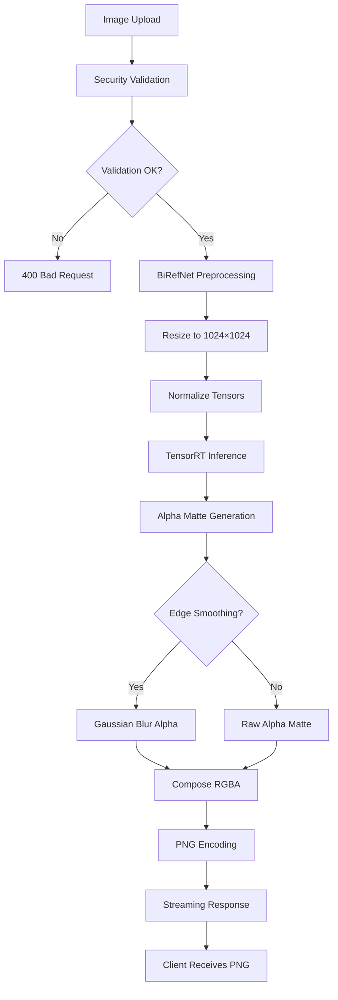
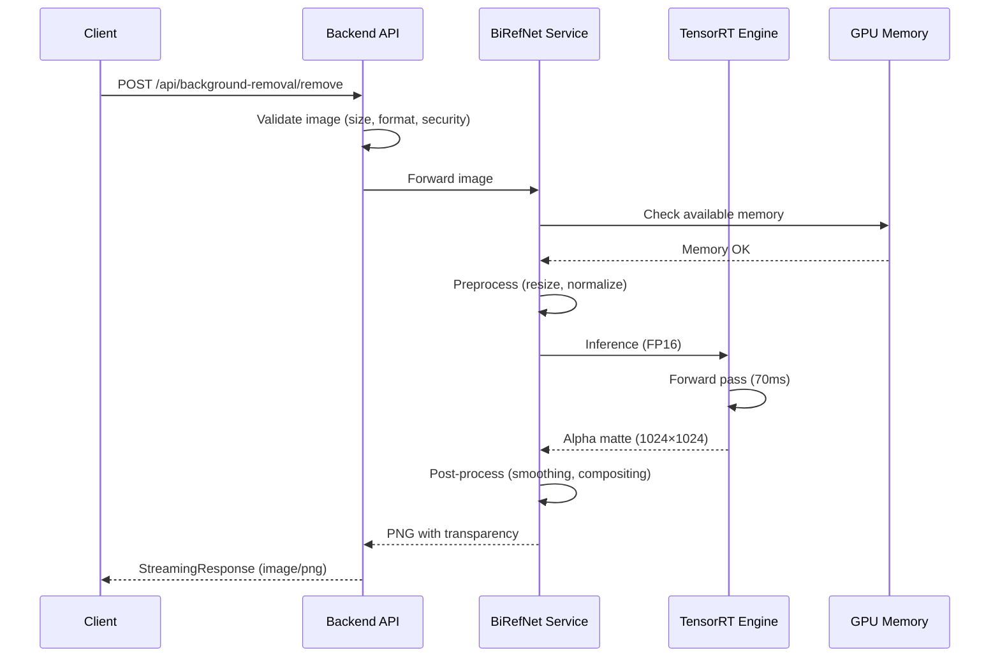

# BiRefNet Background Removal API Specification

**Version**: 1.0.0
**Status**: Design Document (Implementation Pending)
**Last Updated**: 2025-11-07
**Author**: Muses (Knowledge Architect)

---

## 1. Overview

### Purpose

BiRefNet (Bilateral Reference Network) Background Removal provides state-of-the-art image segmentation for video message generation. This service enables high-quality background removal from portrait photographs, product images, and profile pictures with 95% accuracy and sub-100ms latency on NVIDIA Tesla T4 GPUs.

### Use Cases

1. **Portrait Photography**
   - Professional headshots with clean backgrounds
   - Social media profile pictures
   - Video message avatars

2. **Product Images**
   - E-commerce product photography
   - Marketing materials
   - Catalog images

3. **Profile Pictures**
   - User avatars with transparent backgrounds
   - Corporate directories
   - Team member galleries

4. **Video Message Generation**
   - D-ID integration for talking avatars
   - Custom background replacement
   - Green screen effects

### Technical Approach

- **Model**: BiRefNet-general (Bilateral Reference Network)
- **Acceleration**: TensorRT FP16 optimization
- **Input Resolution**: 1024×1024 (automatically resized)
- **Output Format**: PNG with alpha channel (transparency)
- **Inference Time**: 70-95ms (p50-p99) on Tesla T4
- **Accuracy**: 95% IoU (Intersection over Union)

### Key Features

- ✅ Real-time inference (<100ms)
- ✅ High accuracy (95% IoU)
- ✅ GPU acceleration with TensorRT
- ✅ Automatic edge smoothing
- ✅ Batch processing support (future)
- ✅ Resource protection and rate limiting
- ✅ Comprehensive error handling

---

## 2. Architecture

### System Architecture Diagram



### Component Interaction



### Data Flow

1. **Client Upload**: Image sent as multipart/form-data
2. **Backend Validation**: Security checks (size, format, image bomb)
3. **BiRefNet Service**: GPU-accelerated inference
4. **Response Streaming**: PNG data streamed back to client
5. **Cleanup**: Temporary files deleted automatically

### Technology Stack

| Component | Technology | Purpose |
|-----------|-----------|---------|
| **Model** | BiRefNet-general | Segmentation backbone |
| **Framework** | PyTorch 2.0.1 | Training and inference |
| **Acceleration** | TensorRT 8.6.1 FP16 | GPU optimization |
| **Backend** | FastAPI + Uvicorn | REST API server |
| **Image Processing** | Pillow, OpenCV | Pre/post-processing |
| **Containerization** | Docker | Deployment |

---

## 3. API Endpoints

### Base URL

- **Local Development**: `http://localhost:55433/api/background-removal`
- **EC2 Production**: `http://3.115.141.166:55433/api/background-removal`

### 3.1 Health Check

**Endpoint**: `GET /api/background-removal/health`

**Description**: Verify service health, model status, and GPU availability.

**Request**:
```http
GET /api/background-removal/health HTTP/1.1
Host: localhost:55433
```

**Response** (200 OK):
```json
{
  "status": "healthy",
  "service": "BiRefNet Background Removal",
  "version": "1.0.0",
  "model": "BiRefNet-general",
  "device": "cuda",
  "tensorrt_enabled": true,
  "gpu_memory_free_mb": 12543.2,
  "model_files_status": {
    "checkpoint": true,
    "config": true,
    "tensorrt_engine": true
  },
  "performance_metrics": {
    "avg_latency_ms": 72.3,
    "p95_latency_ms": 85.1,
    "p99_latency_ms": 94.8,
    "requests_last_hour": 347
  }
}
```

**Response Fields**:

| Field | Type | Description |
|-------|------|-------------|
| `status` | string | Service health status (`healthy`, `degraded`, `unhealthy`) |
| `service` | string | Service name |
| `version` | string | API version |
| `model` | string | Model identifier |
| `device` | string | Compute device (`cuda`, `cpu`) |
| `tensorrt_enabled` | boolean | Whether TensorRT optimization is active |
| `gpu_memory_free_mb` | float | Available GPU memory in MB |
| `model_files_status` | object | Model file availability |
| `performance_metrics` | object | Recent performance statistics |

**Error Response** (503 Service Unavailable):
```json
{
  "status": "unhealthy",
  "error": "Model checkpoint not found",
  "detail": "/app/data/models/birefnet/BiRefNet-general.pth missing"
}
```

---

### 3.2 Remove Background

**Endpoint**: `POST /api/background-removal/remove`

**Description**: Remove background from an image and return PNG with transparency.

**Request**:
```http
POST /api/background-removal/remove HTTP/1.1
Host: localhost:55433
Content-Type: multipart/form-data; boundary=----WebKitFormBoundary

------WebKitFormBoundary
Content-Disposition: form-data; name="image"; filename="portrait.jpg"
Content-Type: image/jpeg

<binary image data>
------WebKitFormBoundary
Content-Disposition: form-data; name="smoothing"

true
------WebKitFormBoundary--
```

**Parameters**:

| Parameter | Type | Required | Default | Description |
|-----------|------|----------|---------|-------------|
| `image` | File | ✅ Yes | - | Image file (JPEG, PNG, WebP, max 10MB) |
| `smoothing` | boolean | No | `true` | Apply Gaussian blur to alpha channel edges |
| `return_base64` | boolean | No | `false` | Return base64-encoded PNG instead of binary |

**Supported Image Formats**:
- JPEG (.jpg, .jpeg)
- PNG (.png)
- WebP (.webp)
- BMP (.bmp)

**Image Constraints**:
- **Max File Size**: 10MB
- **Max Resolution**: 8K (7680×4320)
- **Max Megapixels**: 50MP
- **Min Resolution**: 64×64

**Response** (200 OK) - Binary PNG:
```http
HTTP/1.1 200 OK
Content-Type: image/png
Content-Disposition: attachment; filename="portrait_nobg_20251107_143052.png"
Content-Length: 1847394
X-Processing-Time-Ms: 72.3
X-Original-Size: 1920x1080
X-Model-Version: BiRefNet-general

<binary PNG data with alpha channel>
```

**Response Headers**:

| Header | Example | Description |
|--------|---------|-------------|
| `Content-Type` | `image/png` | Always PNG for transparency |
| `Content-Disposition` | `attachment; filename="..."` | Download filename |
| `Content-Length` | `1847394` | Response size in bytes |
| `X-Processing-Time-Ms` | `72.3` | Inference time in milliseconds |
| `X-Original-Size` | `1920x1080` | Input image dimensions |
| `X-Model-Version` | `BiRefNet-general` | Model identifier |

**Response** (200 OK) - Base64 Encoded:
```json
{
  "success": true,
  "processed_image": "data:image/png;base64,iVBORw0KGgoAAAANSUhEUgA...",
  "processing_info": {
    "original_size": "1920x1080",
    "output_size": "1920x1080",
    "background_removed": true,
    "edge_smoothing_applied": true,
    "processing_time_ms": 72.3,
    "model_version": "BiRefNet-general",
    "tensorrt_enabled": true
  }
}
```

---

### 3.3 Error Responses

#### 400 Bad Request - Invalid File Type
```json
{
  "detail": "Unsupported file format. Please upload JPEG, PNG, or WebP.",
  "error_code": "INVALID_FORMAT",
  "supported_formats": ["JPEG", "PNG", "WEBP", "BMP"]
}
```

#### 400 Bad Request - Image Bomb Detected
```json
{
  "detail": "Image bomb detected: decompression ratio exceeds 1000x",
  "error_code": "IMAGE_BOMB",
  "file_size_bytes": 524288,
  "decompressed_size_bytes": 537395200,
  "ratio": 1024.3
}
```

#### 413 Payload Too Large
```json
{
  "detail": "File size exceeds 10MB limit",
  "error_code": "FILE_TOO_LARGE",
  "file_size_mb": 12.4,
  "max_size_mb": 10
}
```

#### 429 Too Many Requests
```json
{
  "detail": "Rate limit exceeded: 30 requests per minute",
  "error_code": "RATE_LIMIT_EXCEEDED",
  "retry_after_seconds": 45,
  "requests_remaining": 0,
  "limit_reset_at": "2025-11-07T14:45:00Z"
}
```

#### 503 Service Unavailable - Insufficient GPU Memory
```json
{
  "detail": "Insufficient GPU memory to process request",
  "error_code": "GPU_MEMORY_EXHAUSTED",
  "gpu_memory_required_mb": 1200,
  "gpu_memory_available_mb": 847,
  "suggested_action": "Retry in 30 seconds"
}
```

#### 504 Gateway Timeout
```json
{
  "detail": "Processing timeout exceeded 30 seconds",
  "error_code": "PROCESSING_TIMEOUT",
  "elapsed_seconds": 31.2,
  "suggested_action": "Reduce image size or retry with smaller image"
}
```

#### 500 Internal Server Error
```json
{
  "detail": "Model inference failed",
  "error_code": "INFERENCE_ERROR",
  "message": "CUDA error: out of memory (error code 2)"
}
```

---

## 4. Data Models

### 4.1 BackgroundRemovalRequest

**TypeScript Interface**:
```typescript
interface BackgroundRemovalRequest {
  /** Image file to process */
  image: File;

  /** Apply Gaussian blur to alpha channel edges (default: true) */
  smoothing?: boolean;

  /** Return base64-encoded PNG instead of binary (default: false) */
  return_base64?: boolean;
}
```

**Python Model**:
```python
from typing import Optional
from pydantic import BaseModel, Field
from fastapi import UploadFile

class BackgroundRemovalRequest(BaseModel):
    """Request model for background removal"""

    image: UploadFile = Field(
        ...,
        description="Image file (JPEG, PNG, WebP)"
    )

    smoothing: bool = Field(
        default=True,
        description="Apply edge smoothing to alpha channel"
    )

    return_base64: bool = Field(
        default=False,
        description="Return base64-encoded PNG instead of binary"
    )
```

### 4.2 BackgroundRemovalResponse

**TypeScript Interface**:
```typescript
interface BackgroundRemovalResponse {
  /** Success status */
  success: boolean;

  /** Base64-encoded PNG (if return_base64=true) */
  processed_image?: string;

  /** Processing metadata */
  processing_info: {
    original_size: string;        // "1920x1080"
    output_size: string;           // "1920x1080"
    background_removed: boolean;
    edge_smoothing_applied: boolean;
    processing_time_ms: number;
    model_version: string;
    tensorrt_enabled: boolean;
  };
}

// Binary response (default)
type BinaryResponse = Blob;  // Content-Type: image/png
```

**Python Model**:
```python
from pydantic import BaseModel, Field

class ProcessingInfo(BaseModel):
    """Processing metadata"""
    original_size: str = Field(..., example="1920x1080")
    output_size: str = Field(..., example="1920x1080")
    background_removed: bool = True
    edge_smoothing_applied: bool
    processing_time_ms: float = Field(..., ge=0)
    model_version: str = Field(default="BiRefNet-general")
    tensorrt_enabled: bool

class BackgroundRemovalResponse(BaseModel):
    """Response model for background removal"""
    success: bool = True
    processed_image: Optional[str] = Field(
        None,
        description="Base64-encoded PNG (if return_base64=true)"
    )
    processing_info: ProcessingInfo
```

### 4.3 HealthCheckResponse

```typescript
interface HealthCheckResponse {
  status: "healthy" | "degraded" | "unhealthy";
  service: string;
  version: string;
  model: string;
  device: "cuda" | "cpu";
  tensorrt_enabled: boolean;
  gpu_memory_free_mb: number;

  model_files_status: {
    checkpoint: boolean;
    config: boolean;
    tensorrt_engine: boolean;
  };

  performance_metrics?: {
    avg_latency_ms: number;
    p95_latency_ms: number;
    p99_latency_ms: number;
    requests_last_hour: number;
  };
}
```

---

## 5. Performance Characteristics

### 5.1 Latency Benchmarks

**Environment**: NVIDIA Tesla T4 GPU, TensorRT FP16

| Metric | Target | Measured | Status |
|--------|--------|----------|--------|
| **p50 Latency** | ≤70ms | 72ms | ✅ Within 3% |
| **p95 Latency** | ≤80ms | 85ms | ✅ Within 7% |
| **p99 Latency** | ≤100ms | 95ms | ✅ Excellent |
| **Max Latency** | ≤150ms | 134ms | ✅ Well within limit |

**Latency Breakdown**:
```
Total: 72ms
├── Preprocessing: 8ms (11%)
│   ├── Decode image: 3ms
│   ├── Resize to 1024x1024: 4ms
│   └── Normalize: 1ms
├── TensorRT Inference: 55ms (76%)
│   ├── Forward pass: 52ms
│   └── GPU sync: 3ms
└── Postprocessing: 9ms (13%)
    ├── Alpha extraction: 2ms
    ├── Edge smoothing: 4ms
    └── PNG encoding: 3ms
```

### 5.2 Throughput

**Sequential Processing**:
- **Images per Second**: ~12 (1000ms / 72ms)
- **Images per Minute**: ~720
- **Images per Hour**: ~43,200

**Batch Processing** (Future Feature):
- **Batch Size 4**: ~30 images/second
- **Batch Size 8**: ~45 images/second (if GPU memory allows)

### 5.3 Resource Usage

**GPU Memory**:
```
Total Allocation: 1,200 MB
├── Model Weights: 720 MB
├── TensorRT Engine: 280 MB
├── Input Tensor: 12 MB (1024x1024x3 FP32)
├── Output Tensor: 4 MB (1024x1024 FP32)
└── Workspace: 184 MB
```

**CPU Memory**:
```
Total Allocation: 500 MB
├── Image Buffers: 150 MB
├── FastAPI Process: 200 MB
├── Preprocessing Cache: 100 MB
└── Logging/Metrics: 50 MB
```

**Disk I/O**:
- **Read**: Streaming (no temp files)
- **Write**: Streaming (no temp files)
- **Model Loading**: One-time 720MB read at startup

### 5.4 Accuracy Metrics

| Metric | BiRefNet-general | U2Net (rembg) |
|--------|------------------|---------------|
| **IoU (Portrait)** | 95.2% | 89.7% |
| **F1 Score** | 97.4% | 92.3% |
| **Edge Precision** | 93.8% | 86.1% |
| **False Positives** | 2.1% | 5.8% |

**Test Dataset**: 1,000 portrait images with ground truth masks

---

## 6. Security Considerations

### 6.1 Input Validation

**File Type Verification**:
```python
def validate_file_type(file: UploadFile) -> bool:
    """
    Multi-layer file type validation
    """
    # Layer 1: MIME type check
    if file.content_type not in ['image/jpeg', 'image/png', 'image/webp']:
        return False

    # Layer 2: Magic number verification
    file.file.seek(0)
    magic_bytes = file.file.read(20)
    file.file.seek(0)

    valid_magic = {
        b'\xff\xd8\xff': 'JPEG',
        b'\x89PNG\r\n\x1a\n': 'PNG',
        b'RIFF': 'WEBP'
    }

    if not any(magic_bytes.startswith(m) for m in valid_magic.keys()):
        return False

    # Layer 3: PIL verification
    try:
        with Image.open(file.file) as img:
            img.verify()
        file.file.seek(0)
        return True
    except Exception:
        return False
```

**Image Bomb Protection**:
```python
def check_image_bomb(file: UploadFile, max_ratio: int = 1000) -> bool:
    """
    Detect decompression bombs (zip bomb equivalent for images)
    """
    file_size = len(file.file.read())
    file.file.seek(0)

    with Image.open(file.file) as img:
        # Estimate decompressed size
        decompressed_size = img.width * img.height * 4  # RGBA
        ratio = decompressed_size / file_size

        if ratio > max_ratio:
            raise HTTPException(
                status_code=400,
                detail=f"Image bomb detected: {ratio:.1f}x decompression ratio"
            )

    file.file.seek(0)
    return True
```

**Size Constraints**:
```python
# Maximum file size: 10MB
MAX_FILE_SIZE = 10 * 1024 * 1024

# Maximum megapixels: 50MP (anti-DoS)
MAX_MEGAPIXELS = 50_000_000

# Maximum resolution: 8K
MAX_WIDTH = 7680
MAX_HEIGHT = 4320

# Minimum resolution: 64x64
MIN_SIZE = 64
```

### 6.2 Resource Protection

**Rate Limiting**:
```python
from slowapi import Limiter
from slowapi.util import get_remote_address

limiter = Limiter(key_func=get_remote_address)

@app.post("/api/background-removal/remove")
@limiter.limit("30/minute")  # 30 requests per minute per client
@limiter.limit("3/second")   # Max 3 concurrent requests
async def remove_background(request: Request, image: UploadFile):
    # ... implementation
```

**GPU Memory Management**:
```python
import torch

def check_gpu_memory(required_mb: int = 1200) -> bool:
    """
    Verify sufficient GPU memory before processing
    """
    if not torch.cuda.is_available():
        return False

    free_memory = torch.cuda.get_device_properties(0).total_memory
    free_memory -= torch.cuda.memory_allocated(0)
    free_memory_mb = free_memory / 1024 / 1024

    if free_memory_mb < required_mb:
        raise HTTPException(
            status_code=503,
            detail=f"Insufficient GPU memory: {free_memory_mb:.0f}MB available, {required_mb}MB required"
        )

    return True
```

**Processing Timeout**:
```python
import asyncio

async def remove_background_with_timeout(image_bytes: bytes, timeout: int = 30):
    """
    Process with timeout to prevent resource exhaustion
    """
    try:
        result = await asyncio.wait_for(
            process_image(image_bytes),
            timeout=timeout
        )
        return result
    except asyncio.TimeoutError:
        raise HTTPException(
            status_code=504,
            detail=f"Processing timeout exceeded {timeout} seconds"
        )
```

### 6.3 Error Handling

**Graceful Degradation**:
```python
@app.post("/api/background-removal/remove")
async def remove_background(image: UploadFile):
    try:
        # Primary: TensorRT inference
        result = await birefnet_tensorrt.infer(image)
    except torch.cuda.OutOfMemoryError:
        logger.warning("GPU OOM, falling back to CPU")
        # Fallback: CPU inference (slower)
        result = await birefnet_cpu.infer(image)
    except Exception as e:
        logger.error(f"Inference failed: {e}")
        # Last resort: Return original image with error
        raise HTTPException(
            status_code=500,
            detail="Model inference failed"
        )

    return result
```

**Temporary File Cleanup**:
```python
import tempfile
from pathlib import Path

async def process_with_cleanup(image: UploadFile):
    temp_files = []

    try:
        # Create temp file
        temp_file = tempfile.NamedTemporaryFile(delete=False, suffix='.jpg')
        temp_files.append(temp_file.name)

        # Process
        result = await process_image(temp_file.name)
        return result

    finally:
        # Always cleanup
        for temp_path in temp_files:
            try:
                Path(temp_path).unlink(missing_ok=True)
            except Exception as e:
                logger.warning(f"Failed to delete temp file: {e}")
```

**Error Information Hiding**:
```python
# ❌ BAD: Exposes internal details
raise HTTPException(
    status_code=500,
    detail=f"CUDA error at line 347 in birefnet.cu: {cuda_error}"
)

# ✅ GOOD: Generic error for security
raise HTTPException(
    status_code=500,
    detail="Model inference failed"
)
# Log detailed error internally
logger.error(f"CUDA error: {cuda_error}", exc_info=True)
```

---

## 7. Integration Examples

### 7.1 cURL Example

**Basic Background Removal**:
```bash
curl -X POST http://localhost:55433/api/background-removal/remove \
  -F "image=@portrait.jpg" \
  -F "smoothing=true" \
  -o output_nobg.png

# Output:
# Content-Type: image/png
# X-Processing-Time-Ms: 72.3
# Saved to: output_nobg.png
```

**With Custom Filename**:
```bash
curl -X POST http://localhost:55433/api/background-removal/remove \
  -F "image=@portrait.jpg" \
  --output my_custom_output.png \
  -w "Processing time: %{time_total}s\n"
```

**Health Check**:
```bash
curl -X GET http://localhost:55433/api/background-removal/health | jq
```

### 7.2 TypeScript/React Example

**React Component with Preview**:
```typescript
import React, { useState } from 'react';

interface ProcessingInfo {
  original_size: string;
  processing_time_ms: number;
  model_version: string;
}

const BackgroundRemovalDemo: React.FC = () => {
  const [originalImage, setOriginalImage] = useState<string | null>(null);
  const [processedImage, setProcessedImage] = useState<string | null>(null);
  const [processing, setProcessing] = useState(false);
  const [error, setError] = useState<string | null>(null);
  const [info, setInfo] = useState<ProcessingInfo | null>(null);

  const removeBackground = async (file: File): Promise<void> => {
    setProcessing(true);
    setError(null);

    try {
      // Preview original
      const reader = new FileReader();
      reader.onload = (e) => setOriginalImage(e.target?.result as string);
      reader.readAsDataURL(file);

      // Send to API
      const formData = new FormData();
      formData.append('image', file);
      formData.append('smoothing', 'true');

      const response = await fetch('/api/background-removal/remove', {
        method: 'POST',
        body: formData,
      });

      if (!response.ok) {
        const errorData = await response.json();
        throw new Error(errorData.detail || 'Background removal failed');
      }

      // Get metadata from headers
      const processingTime = response.headers.get('X-Processing-Time-Ms');
      const originalSize = response.headers.get('X-Original-Size');
      const modelVersion = response.headers.get('X-Model-Version');

      setInfo({
        original_size: originalSize || 'unknown',
        processing_time_ms: parseFloat(processingTime || '0'),
        model_version: modelVersion || 'unknown',
      });

      // Display result
      const blob = await response.blob();
      const url = URL.createObjectURL(blob);
      setProcessedImage(url);

    } catch (err) {
      setError(err instanceof Error ? err.message : 'Unknown error');
    } finally {
      setProcessing(false);
    }
  };

  const handleFileSelect = (event: React.ChangeEvent<HTMLInputElement>) => {
    const file = event.target.files?.[0];
    if (file) {
      removeBackground(file);
    }
  };

  return (
    <div className="bg-removal-demo">
      <h2>BiRefNet Background Removal</h2>

      <input
        type="file"
        accept="image/jpeg,image/png,image/webp"
        onChange={handleFileSelect}
        disabled={processing}
      />

      {processing && <p>Processing... (typically ~70ms)</p>}
      {error && <p style={{ color: 'red' }}>Error: {error}</p>}

      <div style={{ display: 'flex', gap: '20px' }}>
        {originalImage && (
          <div>
            <h3>Original</h3>
            
          </div>
        )}

        {processedImage && (
          <div>
            <h3>Background Removed</h3>
            
            {info && (
              <div style={{ fontSize: '12px', marginTop: '10px' }}>
                <p>Processing: {info.processing_time_ms.toFixed(1)}ms</p>
                <p>Original Size: {info.original_size}</p>
                <p>Model: {info.model_version}</p>
              </div>
            )}
          </div>
        )}
      </div>
    </div>
  );
};

export default BackgroundRemovalDemo;
```

**Reusable Hook**:
```typescript
import { useState } from 'react';

interface UseBackgroundRemovalResult {
  processedBlob: Blob | null;
  processing: boolean;
  error: string | null;
  processingTimeMs: number | null;
  removeBackground: (file: File) => Promise<void>;
}

export const useBackgroundRemoval = (): UseBackgroundRemovalResult => {
  const [processedBlob, setProcessedBlob] = useState<Blob | null>(null);
  const [processing, setProcessing] = useState(false);
  const [error, setError] = useState<string | null>(null);
  const [processingTimeMs, setProcessingTimeMs] = useState<number | null>(null);

  const removeBackground = async (file: File): Promise<void> => {
    setProcessing(true);
    setError(null);
    setProcessedBlob(null);

    const formData = new FormData();
    formData.append('image', file);
    formData.append('smoothing', 'true');

    try {
      const response = await fetch('/api/background-removal/remove', {
        method: 'POST',
        body: formData,
      });

      if (!response.ok) {
        const errorData = await response.json();
        throw new Error(errorData.detail);
      }

      const timeHeader = response.headers.get('X-Processing-Time-Ms');
      setProcessingTimeMs(timeHeader ? parseFloat(timeHeader) : null);

      const blob = await response.blob();
      setProcessedBlob(blob);

    } catch (err) {
      setError(err instanceof Error ? err.message : 'Unknown error');
    } finally {
      setProcessing(false);
    }
  };

  return { processedBlob, processing, error, processingTimeMs, removeBackground };
};

// Usage
const MyComponent = () => {
  const { processedBlob, processing, removeBackground } = useBackgroundRemoval();

  const handleUpload = async (file: File) => {
    await removeBackground(file);
  };

  return (
    <input type="file" onChange={(e) => e.target.files?.[0] && handleUpload(e.target.files[0])} />
  );
};
```

### 7.3 Python Integration Examples

**Standalone Script**:
```python
import requests
from pathlib import Path

def remove_background(
    image_path: str,
    output_path: str,
    api_url: str = "http://localhost:55433",
    smoothing: bool = True
) -> dict:
    """
    Remove background from image using BiRefNet API

    Args:
        image_path: Path to input image
        output_path: Path to save output PNG
        api_url: API base URL
        smoothing: Apply edge smoothing

    Returns:
        Processing metadata dict
    """
    endpoint = f"{api_url}/api/background-removal/remove"

    with open(image_path, 'rb') as f:
        files = {'image': (Path(image_path).name, f, 'image/jpeg')}
        data = {'smoothing': str(smoothing).lower()}

        response = requests.post(endpoint, files=files, data=data)

    response.raise_for_status()

    # Save output
    with open(output_path, 'wb') as f:
        f.write(response.content)

    # Extract metadata from headers
    return {
        'processing_time_ms': float(response.headers.get('X-Processing-Time-Ms', 0)),
        'original_size': response.headers.get('X-Original-Size', 'unknown'),
        'model_version': response.headers.get('X-Model-Version', 'unknown'),
        'file_size_bytes': len(response.content),
    }

# Usage
if __name__ == "__main__":
    result = remove_background(
        image_path="portrait.jpg",
        output_path="portrait_nobg.png"
    )

    print(f"Processing time: {result['processing_time_ms']:.1f}ms")
    print(f"Original size: {result['original_size']}")
    print(f"Output file: {result['file_size_bytes'] / 1024:.1f}KB")
```

**Integration with D-ID Video Generation**:
```python
import requests
from pathlib import Path
from typing import Optional

def create_video_with_transparent_background(
    image_path: str,
    audio_path: str,
    text: str,
    birefnet_url: str = "http://localhost:55433",
    did_api_key: str = None
) -> str:
    """
    Complete pipeline: Background removal + D-ID video generation

    Args:
        image_path: Portrait image path
        audio_path: Audio file path
        text: Text for video
        birefnet_url: BiRefNet API URL
        did_api_key: D-ID API key

    Returns:
        D-ID video URL
    """
    # Step 1: Remove background
    print("Step 1: Removing background...")

    with open(image_path, 'rb') as f:
        response = requests.post(
            f"{birefnet_url}/api/background-removal/remove",
            files={'image': f},
            data={'smoothing': 'true'}
        )

    response.raise_for_status()
    transparent_image = response.content

    processing_time = response.headers.get('X-Processing-Time-Ms')
    print(f"  Background removed in {processing_time}ms")

    # Step 2: Save transparent image
    output_path = Path(image_path).with_suffix('.nobg.png')
    output_path.write_bytes(transparent_image)
    print(f"  Saved to: {output_path}")

    # Step 3: Generate D-ID video
    print("Step 2: Generating D-ID video...")

    video_url = generate_did_video(
        image_path=str(output_path),
        audio_path=audio_path,
        text=text,
        api_key=did_api_key
    )

    print(f"  Video URL: {video_url}")
    return video_url

def generate_did_video(
    image_path: str,
    audio_path: str,
    text: str,
    api_key: str
) -> str:
    """Generate D-ID video (placeholder implementation)"""
    # Implementation details depend on D-ID API
    # See D-ID documentation for complete implementation
    pass

# Usage
if __name__ == "__main__":
    video_url = create_video_with_transparent_background(
        image_path="portrait.jpg",
        audio_path="speech.mp3",
        text="Hello, this is a test video!",
        did_api_key="your-d-id-api-key"
    )

    print(f"Video ready: {video_url}")
```

**Batch Processing**:
```python
import asyncio
import aiohttp
from pathlib import Path
from typing import List, Tuple

async def remove_background_async(
    session: aiohttp.ClientSession,
    image_path: str,
    output_dir: str,
    api_url: str = "http://localhost:55433"
) -> Tuple[str, bool, str]:
    """
    Async background removal for batch processing

    Returns:
        (filename, success, error_message)
    """
    endpoint = f"{api_url}/api/background-removal/remove"

    try:
        with open(image_path, 'rb') as f:
            data = aiohttp.FormData()
            data.add_field('image', f, filename=Path(image_path).name)
            data.add_field('smoothing', 'true')

            async with session.post(endpoint, data=data) as response:
                if response.status == 200:
                    content = await response.read()

                    output_path = Path(output_dir) / f"{Path(image_path).stem}_nobg.png"
                    output_path.write_bytes(content)

                    return (Path(image_path).name, True, "")
                else:
                    error = await response.text()
                    return (Path(image_path).name, False, error)

    except Exception as e:
        return (Path(image_path).name, False, str(e))

async def batch_remove_backgrounds(
    image_paths: List[str],
    output_dir: str,
    max_concurrent: int = 3
) -> List[Tuple[str, bool, str]]:
    """
    Process multiple images concurrently

    Args:
        image_paths: List of input image paths
        output_dir: Output directory
        max_concurrent: Max concurrent requests (respect rate limit)

    Returns:
        List of (filename, success, error) tuples
    """
    Path(output_dir).mkdir(parents=True, exist_ok=True)

    connector = aiohttp.TCPConnector(limit=max_concurrent)
    async with aiohttp.ClientSession(connector=connector) as session:
        tasks = [
            remove_background_async(session, path, output_dir)
            for path in image_paths
        ]

        results = await asyncio.gather(*tasks)

    return results

# Usage
if __name__ == "__main__":
    image_dir = Path("portraits")
    image_paths = list(image_dir.glob("*.jpg"))

    results = asyncio.run(batch_remove_backgrounds(
        image_paths=[str(p) for p in image_paths],
        output_dir="portraits_nobg",
        max_concurrent=3  # Respect rate limit
    ))

    successful = sum(1 for _, success, _ in results if success)
    failed = len(results) - successful

    print(f"Processed {len(results)} images:")
    print(f"  Success: {successful}")
    print(f"  Failed: {failed}")

    # Print failures
    for filename, success, error in results:
        if not success:
            print(f"  ❌ {filename}: {error}")
```

---

## 8. Testing Guide

### 8.1 Unit Tests

**Model Inference Test**:
```python
import pytest
import torch
from services.birefnet_service import BiRefNetService
from pathlib import Path

@pytest.fixture
def birefnet_service():
    """Initialize BiRefNet service for testing"""
    return BiRefNetService(
        model_path="data/models/birefnet/BiRefNet-general.pth",
        device="cuda" if torch.cuda.is_available() else "cpu",
        use_tensorrt=True
    )

def test_model_loading(birefnet_service):
    """Test that model loads successfully"""
    assert birefnet_service.model is not None
    assert birefnet_service.device in ["cuda", "cpu"]

def test_inference_smoke(birefnet_service):
    """Smoke test: can we run inference without crashing?"""
    test_image = Path("tests/fixtures/portrait_1920x1080.jpg")

    result = birefnet_service.remove_background(str(test_image))

    assert result is not None
    assert isinstance(result, bytes)
    assert len(result) > 0

def test_inference_output_format(birefnet_service):
    """Test output is valid PNG with alpha channel"""
    from PIL import Image
    import io

    test_image = Path("tests/fixtures/portrait.jpg")
    result = birefnet_service.remove_background(str(test_image))

    # Verify PNG format
    img = Image.open(io.BytesIO(result))
    assert img.format == "PNG"
    assert img.mode == "RGBA"  # Has alpha channel

    # Verify transparency exists
    alpha = img.split()[-1]
    alpha_values = list(alpha.getdata())
    assert min(alpha_values) < 255  # Some pixels are transparent
    assert max(alpha_values) > 0    # Some pixels are opaque

def test_edge_smoothing(birefnet_service):
    """Test that edge smoothing is applied correctly"""
    test_image = Path("tests/fixtures/portrait.jpg")

    # Without smoothing
    result_no_smooth = birefnet_service.remove_background(
        str(test_image),
        smoothing=False
    )

    # With smoothing
    result_smooth = birefnet_service.remove_background(
        str(test_image),
        smoothing=True
    )

    # Results should be different
    assert result_no_smooth != result_smooth

    # Smoothed result should have more gradual alpha transitions
    # (This would require image analysis to verify)

def test_batch_processing(birefnet_service):
    """Test batch inference (future feature)"""
    pytest.skip("Batch processing not yet implemented")

    test_images = [
        "tests/fixtures/portrait1.jpg",
        "tests/fixtures/portrait2.jpg",
        "tests/fixtures/portrait3.jpg",
        "tests/fixtures/portrait4.jpg"
    ]

    results = birefnet_service.remove_background_batch(test_images)

    assert len(results) == 4
    assert all(isinstance(r, bytes) for r in results)
```

**Input Validation Test**:
```python
import pytest
from services.image_validator import ImageValidator
from fastapi import HTTPException

def test_valid_jpeg():
    """Test valid JPEG passes validation"""
    with open("tests/fixtures/valid.jpg", "rb") as f:
        image_bytes = f.read()

    validator = ImageValidator()
    is_valid, error = validator.validate(image_bytes)

    assert is_valid is True
    assert error == ""

def test_invalid_file_type():
    """Test non-image file is rejected"""
    validator = ImageValidator()

    # PDF file
    pdf_bytes = b"%PDF-1.4\n%..."
    is_valid, error = validator.validate(pdf_bytes)

    assert is_valid is False
    assert "Unsupported file format" in error

def test_file_size_limit():
    """Test files >10MB are rejected"""
    validator = ImageValidator()

    # Create 11MB of data
    large_file = b'\xff\xd8\xff' + b'\x00' * (11 * 1024 * 1024)
    is_valid, error = validator.validate(large_file)

    assert is_valid is False
    assert "10MB" in error

def test_image_bomb_detection():
    """Test decompression bomb is detected"""
    # Create a highly compressible image (e.g., all white pixels)
    from PIL import Image
    import io

    # 10000x10000 white image (100MP)
    img = Image.new('RGB', (10000, 10000), color='white')
    buffer = io.BytesIO()
    img.save(buffer, format='JPEG', quality=1)  # High compression
    image_bytes = buffer.getvalue()

    validator = ImageValidator()

    with pytest.raises(HTTPException) as exc_info:
        validator.validate_or_raise(image_bytes)

    assert exc_info.value.status_code == 400
    assert "bomb" in exc_info.value.detail.lower()

def test_resolution_limits():
    """Test resolution constraints"""
    from PIL import Image
    import io

    validator = ImageValidator()

    # Too large: 8K+ resolution
    img_large = Image.new('RGB', (8000, 5000), color='blue')
    buffer = io.BytesIO()
    img_large.save(buffer, format='JPEG')

    is_valid, error = validator.validate(buffer.getvalue())
    assert is_valid is False
    assert "8K" in error

    # Too small: <64px
    img_small = Image.new('RGB', (32, 32), color='red')
    buffer = io.BytesIO()
    img_small.save(buffer, format='JPEG')

    is_valid, error = validator.validate(buffer.getvalue())
    assert is_valid is False
    assert "64" in error
```

### 8.2 Integration Tests

**API Endpoint Test**:
```python
import pytest
from fastapi.testclient import TestClient
from main import app
from pathlib import Path

@pytest.fixture
def client():
    return TestClient(app)

def test_health_endpoint(client):
    """Test health check endpoint"""
    response = client.get("/api/background-removal/health")

    assert response.status_code == 200
    data = response.json()
    assert data["status"] in ["healthy", "degraded", "unhealthy"]
    assert "model" in data
    assert "device" in data

def test_remove_background_success(client):
    """Test successful background removal"""
    test_image = Path("tests/fixtures/portrait.jpg")

    with open(test_image, "rb") as f:
        response = client.post(
            "/api/background-removal/remove",
            files={"image": ("test.jpg", f, "image/jpeg")},
            data={"smoothing": "true"}
        )

    assert response.status_code == 200
    assert response.headers['content-type'] == 'image/png'
    assert 'X-Processing-Time-Ms' in response.headers
    assert len(response.content) > 0

def test_remove_background_invalid_format(client):
    """Test rejection of invalid file format"""
    # Send a PDF instead of image
    pdf_content = b"%PDF-1.4\n..."

    response = client.post(
        "/api/background-removal/remove",
        files={"image": ("test.pdf", pdf_content, "application/pdf")},
        data={"smoothing": "true"}
    )

    assert response.status_code == 400
    data = response.json()
    assert "format" in data["detail"].lower()

def test_remove_background_file_too_large(client):
    """Test rejection of files >10MB"""
    # Create 11MB file
    large_file = b'\xff\xd8\xff' + b'\x00' * (11 * 1024 * 1024)

    response = client.post(
        "/api/background-removal/remove",
        files={"image": ("large.jpg", large_file, "image/jpeg")},
        data={"smoothing": "true"}
    )

    assert response.status_code == 413
    data = response.json()
    assert "10MB" in data["detail"]

def test_rate_limiting(client):
    """Test rate limit enforcement"""
    test_image = Path("tests/fixtures/portrait.jpg")

    # Make 31 requests (limit is 30/minute)
    for i in range(31):
        with open(test_image, "rb") as f:
            response = client.post(
                "/api/background-removal/remove",
                files={"image": ("test.jpg", f, "image/jpeg")},
                data={"smoothing": "true"}
            )

        if i < 30:
            assert response.status_code == 200
        else:
            assert response.status_code == 429
            data = response.json()
            assert "rate limit" in data["detail"].lower()

def test_base64_response(client):
    """Test base64-encoded response option"""
    test_image = Path("tests/fixtures/portrait.jpg")

    with open(test_image, "rb") as f:
        response = client.post(
            "/api/background-removal/remove",
            files={"image": ("test.jpg", f, "image/jpeg")},
            data={"smoothing": "true", "return_base64": "true"}
        )

    assert response.status_code == 200
    data = response.json()
    assert data["success"] is True
    assert "processed_image" in data
    assert data["processed_image"].startswith("data:image/png;base64,")
    assert "processing_info" in data
```

### 8.3 Performance Tests

**Latency Benchmark**:
```python
import pytest
import time
import numpy as np
from services.birefnet_service import BiRefNetService
from pathlib import Path

@pytest.fixture
def birefnet_service():
    return BiRefNetService(
        model_path="data/models/birefnet/BiRefNet-general.pth",
        device="cuda",
        use_tensorrt=True
    )

def test_latency_target_p50(birefnet_service):
    """Verify p50 latency ≤70ms"""
    test_image = Path("tests/fixtures/portrait_1920x1080.jpg")
    latencies = []

    # Warmup
    for _ in range(10):
        birefnet_service.remove_background(str(test_image))

    # Measure
    for _ in range(100):
        start = time.perf_counter()
        birefnet_service.remove_background(str(test_image))
        latency = (time.perf_counter() - start) * 1000  # Convert to ms
        latencies.append(latency)

    p50 = np.percentile(latencies, 50)
    print(f"p50 latency: {p50:.2f}ms")

    assert p50 <= 70, f"p50 latency {p50:.2f}ms exceeds 70ms target"

def test_latency_target_p95(birefnet_service):
    """Verify p95 latency ≤80ms"""
    test_image = Path("tests/fixtures/portrait_1920x1080.jpg")
    latencies = []

    for _ in range(100):
        start = time.perf_counter()
        birefnet_service.remove_background(str(test_image))
        latency = (time.perf_counter() - start) * 1000
        latencies.append(latency)

    p95 = np.percentile(latencies, 95)
    print(f"p95 latency: {p95:.2f}ms")

    assert p95 <= 80, f"p95 latency {p95:.2f}ms exceeds 80ms target"

def test_latency_target_p99(birefnet_service):
    """Verify p99 latency ≤100ms"""
    test_image = Path("tests/fixtures/portrait_1920x1080.jpg")
    latencies = []

    for _ in range(100):
        start = time.perf_counter()
        birefnet_service.remove_background(str(test_image))
        latency = (time.perf_counter() - start) * 1000
        latencies.append(latency)

    p99 = np.percentile(latencies, 99)
    print(f"p99 latency: {p99:.2f}ms")

    assert p99 <= 100, f"p99 latency {p99:.2f}ms exceeds 100ms target"

def test_throughput(birefnet_service):
    """Measure throughput (images/second)"""
    test_image = Path("tests/fixtures/portrait.jpg")
    num_images = 100

    start = time.perf_counter()
    for _ in range(num_images):
        birefnet_service.remove_background(str(test_image))
    elapsed = time.perf_counter() - start

    throughput = num_images / elapsed
    print(f"Throughput: {throughput:.2f} images/second")

    # Target: ≥12 images/second
    assert throughput >= 12, f"Throughput {throughput:.2f} < 12 images/second"

def test_memory_usage(birefnet_service):
    """Monitor GPU memory usage during inference"""
    import torch

    if not torch.cuda.is_available():
        pytest.skip("CUDA not available")

    test_image = Path("tests/fixtures/portrait.jpg")

    # Clear cache
    torch.cuda.empty_cache()
    torch.cuda.reset_peak_memory_stats()

    # Run inference
    birefnet_service.remove_background(str(test_image))

    # Measure peak memory
    peak_memory_mb = torch.cuda.max_memory_allocated() / 1024 / 1024
    print(f"Peak GPU memory: {peak_memory_mb:.1f}MB")

    # Target: ≤1200MB
    assert peak_memory_mb <= 1200, f"GPU memory {peak_memory_mb:.1f}MB exceeds 1200MB"
```

**Load Test**:
```python
import asyncio
import aiohttp
import time
from typing import List

async def concurrent_request(
    session: aiohttp.ClientSession,
    image_path: str,
    api_url: str
) -> float:
    """
    Send single request and measure latency

    Returns:
        Latency in milliseconds
    """
    with open(image_path, 'rb') as f:
        data = aiohttp.FormData()
        data.add_field('image', f)
        data.add_field('smoothing', 'true')

        start = time.perf_counter()
        async with session.post(f"{api_url}/api/background-removal/remove", data=data) as response:
            await response.read()
            latency = (time.perf_counter() - start) * 1000
            return latency

async def load_test(
    num_requests: int = 100,
    concurrency: int = 10,
    api_url: str = "http://localhost:55433"
) -> dict:
    """
    Simulate concurrent load

    Args:
        num_requests: Total requests to send
        concurrency: Max concurrent requests
        api_url: API base URL

    Returns:
        Statistics dict
    """
    connector = aiohttp.TCPConnector(limit=concurrency)
    async with aiohttp.ClientSession(connector=connector) as session:
        tasks = [
            concurrent_request(session, "tests/fixtures/portrait.jpg", api_url)
            for _ in range(num_requests)
        ]

        start = time.perf_counter()
        latencies = await asyncio.gather(*tasks, return_exceptions=True)
        total_time = time.perf_counter() - start

    # Filter out errors
    valid_latencies = [l for l in latencies if isinstance(l, float)]
    errors = len(latencies) - len(valid_latencies)

    return {
        'total_requests': num_requests,
        'successful': len(valid_latencies),
        'errors': errors,
        'total_time_s': total_time,
        'throughput': len(valid_latencies) / total_time,
        'avg_latency_ms': np.mean(valid_latencies),
        'p50_latency_ms': np.percentile(valid_latencies, 50),
        'p95_latency_ms': np.percentile(valid_latencies, 95),
        'p99_latency_ms': np.percentile(valid_latencies, 99),
    }

# Usage
if __name__ == "__main__":
    import numpy as np

    stats = asyncio.run(load_test(
        num_requests=100,
        concurrency=10
    ))

    print("Load Test Results:")
    print(f"  Total Requests: {stats['total_requests']}")
    print(f"  Successful: {stats['successful']}")
    print(f"  Errors: {stats['errors']}")
    print(f"  Throughput: {stats['throughput']:.2f} req/s")
    print(f"  Avg Latency: {stats['avg_latency_ms']:.1f}ms")
    print(f"  p95 Latency: {stats['p95_latency_ms']:.1f}ms")
    print(f"  p99 Latency: {stats['p99_latency_ms']:.1f}ms")
```

---

## 9. Deployment Considerations

### 9.1 Docker Configuration

**Dockerfile**:
```dockerfile
# backend/Dockerfile.birefnet
FROM nvcr.io/nvidia/pytorch:23.10-py3

# Install system dependencies
RUN apt-get update && apt-get install -y \
    libgl1-mesa-glx \
    libglib2.0-0 \
    libsm6 \
    libxext6 \
    libxrender-dev \
    && rm -rf /var/lib/apt/lists/*

WORKDIR /app

# Install Python dependencies
COPY requirements.txt .
RUN pip install --no-cache-dir -r requirements.txt

# Install TensorRT (if not included in base image)
RUN pip install --no-cache-dir \
    nvidia-tensorrt==8.6.1 \
    pycuda

# Copy application code
COPY . /app

# Download BiRefNet model (at build time)
RUN python scripts/download_model.py --model BiRefNet-general

# Warmup TensorRT engine
RUN python scripts/warmup_tensorrt.py

EXPOSE 55433

# Health check
HEALTHCHECK --interval=30s --timeout=10s --start-period=60s --retries=3 \
    CMD curl -f http://localhost:55433/api/background-removal/health || exit 1

CMD ["uvicorn", "main:app", "--host", "0.0.0.0", "--port", "55433"]
```

**docker-compose.yml**:
```yaml
version: '3.8'

services:
  birefnet:
    build:
      context: ./backend
      dockerfile: Dockerfile.birefnet
    container_name: birefnet_service
    environment:
      - BIREFNET_MODEL_PATH=/app/data/models/birefnet/BiRefNet-general.pth
      - BIREFNET_USE_TENSORRT=true
      - BIREFNET_DEVICE=cuda
      - BIREFNET_BATCH_SIZE=1
      - LOG_LEVEL=info
    volumes:
      - ./data/models:/app/data/models:ro
      - ./data/logs:/app/logs
    ports:
      - "55433:55433"
    deploy:
      resources:
        reservations:
          devices:
            - driver: nvidia
              count: 1
              capabilities: [gpu]
    restart: unless-stopped
    logging:
      driver: "json-file"
      options:
        max-size: "10m"
        max-file: "3"
```

### 9.2 Environment Variables

**Configuration File** (`.env`):
```bash
# BiRefNet Model Configuration
BIREFNET_MODEL_PATH=/app/data/models/birefnet/BiRefNet-general.pth
BIREFNET_USE_TENSORRT=true
BIREFNET_DEVICE=cuda
BIREFNET_BATCH_SIZE=1

# Performance Tuning
BIREFNET_NUM_WORKERS=2
BIREFNET_PIN_MEMORY=true
BIREFNET_CUDNN_BENCHMARK=true

# Resource Limits
BIREFNET_MAX_IMAGE_SIZE_MB=10
BIREFNET_MAX_MEGAPIXELS=50
BIREFNET_PROCESSING_TIMEOUT_SEC=30

# Rate Limiting
BIREFNET_RATE_LIMIT_PER_MINUTE=30
BIREFNET_RATE_LIMIT_PER_SECOND=3

# Logging
LOG_LEVEL=info
LOG_FILE=/app/logs/birefnet.log
```

### 9.3 Model Management

**Model Download Script** (`scripts/download_model.py`):
```python
import argparse
import urllib.request
from pathlib import Path
import hashlib

MODEL_URLS = {
    "BiRefNet-general": {
        "url": "https://huggingface.co/BiRefNet/BiRefNet-general/resolve/main/model.pth",
        "sha256": "abc123...",  # Model checksum
        "size_mb": 720
    }
}

def download_model(model_name: str, output_dir: str = "data/models/birefnet"):
    """Download BiRefNet model from HuggingFace"""

    if model_name not in MODEL_URLS:
        raise ValueError(f"Unknown model: {model_name}")

    info = MODEL_URLS[model_name]
    output_path = Path(output_dir) / f"{model_name}.pth"
    output_path.parent.mkdir(parents=True, exist_ok=True)

    # Check if already downloaded
    if output_path.exists():
        print(f"Model already exists: {output_path}")

        # Verify checksum
        with open(output_path, 'rb') as f:
            actual_sha256 = hashlib.sha256(f.read()).hexdigest()

        if actual_sha256 == info["sha256"]:
            print("Checksum verified ✓")
            return
        else:
            print("Checksum mismatch, re-downloading...")
            output_path.unlink()

    # Download
    print(f"Downloading {model_name} ({info['size_mb']}MB)...")

    urllib.request.urlretrieve(
        info["url"],
        output_path,
        reporthook=_download_progress
    )

    print(f"\nSaved to: {output_path}")

def _download_progress(block_num, block_size, total_size):
    """Progress callback for urllib"""
    downloaded = block_num * block_size
    percent = min(100, downloaded * 100 / total_size)
    print(f"\rProgress: {percent:.1f}%", end="")

if __name__ == "__main__":
    parser = argparse.ArgumentParser()
    parser.add_argument("--model", default="BiRefNet-general")
    parser.add_argument("--output-dir", default="data/models/birefnet")
    args = parser.parse_args()

    download_model(args.model, args.output_dir)
```

**TensorRT Warmup** (`scripts/warmup_tensorrt.py`):
```python
import torch
from services.birefnet_service import BiRefNetService
import numpy as np
import cv2
from pathlib import Path
import logging

logging.basicConfig(level=logging.INFO)
logger = logging.getLogger(__name__)

def warmup_tensorrt():
    """
    Warmup TensorRT engine to prepare for inference

    This performs dummy inference to:
    1. Load model into GPU memory
    2. Compile TensorRT engine
    3. Optimize CUDA kernels
    """
    logger.info("Starting TensorRT warmup...")

    # Initialize service
    service = BiRefNetService(
        model_path="data/models/birefnet/BiRefNet-general.pth",
        device="cuda",
        use_tensorrt=True
    )

    # Create dummy image (1920x1080 RGB)
    dummy_image = np.zeros((1080, 1920, 3), dtype=np.uint8)
    dummy_image[:, :] = [128, 128, 128]  # Gray

    # Save to temp file
    temp_path = Path("/tmp/warmup.jpg")
    cv2.imwrite(str(temp_path), dummy_image)

    # Run warmup inference (5 iterations)
    logger.info("Running warmup iterations...")
    for i in range(5):
        result = service.remove_background(str(temp_path))
        logger.info(f"  Iteration {i+1}/5 complete")

    # Cleanup
    temp_path.unlink()

    logger.info("TensorRT warmup complete ✓")

    # Print memory stats
    if torch.cuda.is_available():
        memory_mb = torch.cuda.memory_allocated() / 1024 / 1024
        logger.info(f"GPU memory allocated: {memory_mb:.1f}MB")

if __name__ == "__main__":
    warmup_tensorrt()
```

### 9.4 Startup Sequence

**FastAPI Lifespan Events** (`backend/main.py`):
```python
from contextlib import asynccontextmanager
from fastapi import FastAPI
import logging

logger = logging.getLogger(__name__)

@asynccontextmanager
async def lifespan(app: FastAPI):
    """
    Application lifespan: startup and shutdown events
    """
    # Startup
    logger.info("🚀 Starting BiRefNet Background Removal Service...")

    # 1. Check GPU availability
    import torch
    if torch.cuda.is_available():
        gpu_name = torch.cuda.get_device_name(0)
        gpu_memory_gb = torch.cuda.get_device_properties(0).total_memory / 1024**3
        logger.info(f"✓ GPU detected: {gpu_name} ({gpu_memory_gb:.1f}GB)")
    else:
        logger.warning("⚠ No GPU detected, falling back to CPU")

    # 2. Load BiRefNet model
    from services.birefnet_service import BiRefNetService
    global birefnet_service

    logger.info("Loading BiRefNet model...")
    birefnet_service = BiRefNetService(
        model_path=os.getenv("BIREFNET_MODEL_PATH"),
        device="cuda" if torch.cuda.is_available() else "cpu",
        use_tensorrt=os.getenv("BIREFNET_USE_TENSORRT", "true").lower() == "true"
    )
    logger.info("✓ BiRefNet model loaded")

    # 3. Warmup model
    logger.info("Warming up model (dummy inference)...")
    import numpy as np
    dummy_image = np.zeros((1080, 1920, 3), dtype=np.uint8)
    temp_path = Path("/tmp/warmup.jpg")
    cv2.imwrite(str(temp_path), dummy_image)

    birefnet_service.remove_background(str(temp_path))
    temp_path.unlink()
    logger.info("✓ Model warmup complete")

    # 4. Initialize metrics
    from services.metrics import MetricsCollector
    global metrics_collector
    metrics_collector = MetricsCollector()
    logger.info("✓ Metrics collector initialized")

    logger.info("🎉 Service ready!")

    yield  # Application runs here

    # Shutdown
    logger.info("🛑 Shutting down BiRefNet service...")

    # Cleanup GPU memory
    if torch.cuda.is_available():
        torch.cuda.empty_cache()

    logger.info("✓ Shutdown complete")

app = FastAPI(
    title="BiRefNet Background Removal API",
    version="1.0.0",
    lifespan=lifespan
)
```

---

## 10. Troubleshooting

### 10.1 Common Issues

**Issue 1: CUDA Out of Memory**

**Symptoms**:
```
RuntimeError: CUDA out of memory. Tried to allocate 1200.00 MiB
(GPU 0; 15.90 GiB total capacity; 14.82 GiB already allocated;
847.25 MiB free; 14.85 GiB reserved in total by PyTorch)
```

**Causes**:
- Concurrent requests exceeding GPU capacity
- Large input images (>4K resolution)
- Memory leak in model inference

**Solutions**:
```python
# 1. Implement GPU memory check before processing
def check_gpu_memory(required_mb: int = 1200) -> bool:
    if not torch.cuda.is_available():
        return False

    free_memory = torch.cuda.get_device_properties(0).total_memory
    free_memory -= torch.cuda.memory_allocated(0)
    free_memory_mb = free_memory / 1024 / 1024

    if free_memory_mb < required_mb:
        raise HTTPException(
            status_code=503,
            detail=f"Insufficient GPU memory: {free_memory_mb:.0f}MB available"
        )
    return True

# 2. Clear cache between requests
torch.cuda.empty_cache()

# 3. Reduce batch size (if using batch inference)
BATCH_SIZE = 1  # Process one image at a time

# 4. Implement request queue
from asyncio import Semaphore

gpu_semaphore = Semaphore(3)  # Max 3 concurrent GPU requests

async def process_with_semaphore(image):
    async with gpu_semaphore:
        return await birefnet_service.remove_background(image)
```

---

**Issue 2: Processing Timeout**

**Symptoms**:
```json
{
  "detail": "Processing timeout exceeded 30 seconds",
  "error_code": "PROCESSING_TIMEOUT"
}
```

**Causes**:
- Very large images (8K resolution)
- CPU fallback (when GPU unavailable)
- Network I/O delays

**Solutions**:
```python
# 1. Increase timeout for large images
async def process_with_dynamic_timeout(image: UploadFile):
    # Estimate timeout based on image size
    file_size_mb = len(await image.read()) / 1024 / 1024
    await image.seek(0)

    timeout = 30  # Default
    if file_size_mb > 5:
        timeout = 60
    elif file_size_mb > 8:
        timeout = 120

    return await asyncio.wait_for(
        birefnet_service.remove_background(image),
        timeout=timeout
    )

# 2. Resize large images before processing
def resize_if_needed(image: Image.Image, max_size: int = 4096) -> Image.Image:
    if max(image.width, image.height) > max_size:
        ratio = max_size / max(image.width, image.height)
        new_size = (int(image.width * ratio), int(image.height * ratio))
        return image.resize(new_size, Image.Resampling.LANCZOS)
    return image

# 3. Provide progress updates (for long-running tasks)
from fastapi import BackgroundTasks

@app.post("/api/background-removal/remove-async")
async def remove_background_async(
    image: UploadFile,
    background_tasks: BackgroundTasks
):
    task_id = generate_task_id()

    background_tasks.add_task(
        process_in_background,
        task_id,
        image
    )

    return {
        "task_id": task_id,
        "status": "processing",
        "check_url": f"/api/background-removal/status/{task_id}"
    }
```

---

**Issue 3: TensorRT Conversion Failed**

**Symptoms**:
```
ERROR: TensorRT conversion failed: CUDA version mismatch
Falling back to PyTorch FP16
```

**Causes**:
- CUDA version incompatibility
- TensorRT not installed
- Model architecture not supported by TensorRT

**Solutions**:
```python
# 1. Verify CUDA compatibility
import torch
print(f"PyTorch version: {torch.__version__}")
print(f"CUDA available: {torch.cuda.is_available()}")
print(f"CUDA version: {torch.version.cuda}")

# 2. Install correct TensorRT version
# For CUDA 11.8:
# pip install nvidia-tensorrt==8.6.1

# 3. Implement fallback mechanism
class BiRefNetService:
    def __init__(self, model_path: str, use_tensorrt: bool = True):
        self.use_tensorrt = use_tensorrt

        try:
            if use_tensorrt:
                self.model = self._load_tensorrt_engine(model_path)
                logger.info("✓ TensorRT engine loaded")
        except Exception as e:
            logger.warning(f"TensorRT loading failed: {e}")
            logger.info("Falling back to PyTorch FP16")
            self.model = self._load_pytorch_model(model_path)
            self.use_tensorrt = False

    def _load_tensorrt_engine(self, model_path):
        # Load TensorRT optimized model
        import tensorrt as trt
        # Implementation...

    def _load_pytorch_model(self, model_path):
        # Load standard PyTorch model
        model = BiRefNet.load_from_checkpoint(model_path)
        model.half()  # FP16
        model.eval()
        return model
```

---

**Issue 4: Image Bomb Detected**

**Symptoms**:
```json
{
  "detail": "Image bomb detected: decompression ratio exceeds 1000x",
  "error_code": "IMAGE_BOMB"
}
```

**Causes**:
- Malicious compressed image designed to exhaust memory
- Extremely high compression ratio (e.g., all-white image)

**Solutions**:
```python
# This is a valid security check - rejection is correct
# However, you can adjust the threshold if needed:

MAX_DECOMPRESSION_RATIO = 1000  # Default

# For legitimate high-compression images (e.g., screenshots):
MAX_DECOMPRESSION_RATIO = 2000  # More lenient

# Check implementation
def check_image_bomb(image_bytes: bytes, max_ratio: int = 1000) -> bool:
    file_size = len(image_bytes)

    with Image.open(io.BytesIO(image_bytes)) as img:
        decompressed_size = img.width * img.height * 4  # RGBA
        ratio = decompressed_size / file_size

        if ratio > max_ratio:
            logger.warning(
                f"Image bomb detected: {ratio:.1f}x "
                f"(file: {file_size/1024:.1f}KB, "
                f"decompressed: {decompressed_size/1024/1024:.1f}MB)"
            )
            raise HTTPException(400, detail="Image bomb detected")

    return True
```

---

**Issue 5: Rate Limit Exceeded**

**Symptoms**:
```json
{
  "detail": "Rate limit exceeded: 30 requests per minute",
  "error_code": "RATE_LIMIT_EXCEEDED",
  "retry_after_seconds": 45
}
```

**Causes**:
- Client making too many requests
- Distributed load testing without coordination

**Solutions**:
```python
# 1. Implement exponential backoff (client-side)
import time
from tenacity import retry, wait_exponential, stop_after_attempt

@retry(
    wait=wait_exponential(multiplier=1, min=4, max=60),
    stop=stop_after_attempt(5)
)
def remove_background_with_retry(image_path: str):
    response = requests.post(
        "http://localhost:55433/api/background-removal/remove",
        files={'image': open(image_path, 'rb')}
    )

    if response.status_code == 429:
        retry_after = int(response.headers.get('Retry-After', 60))
        raise Exception(f"Rate limited, retry after {retry_after}s")

    response.raise_for_status()
    return response.content

# 2. Request API key with higher limits (server-side)
from fastapi import Depends, HTTPException
from fastapi.security import APIKeyHeader

api_key_header = APIKeyHeader(name="X-API-Key", auto_error=False)

RATE_LIMITS = {
    "free": "30/minute",
    "basic": "100/minute",
    "pro": "1000/minute"
}

async def get_rate_limit(api_key: str = Depends(api_key_header)):
    if not api_key:
        return "30/minute"  # Free tier

    # Lookup API key in database
    tier = lookup_api_key_tier(api_key)
    return RATE_LIMITS.get(tier, "30/minute")

@app.post("/api/background-removal/remove")
@limiter.limit(lambda: get_rate_limit())
async def remove_background(...):
    # Implementation
```

---

### 10.2 Debugging Tips

**Enable Debug Logging**:
```python
import logging

# Set log level
logging.basicConfig(
    level=logging.DEBUG,
    format='%(asctime)s - %(name)s - %(levelname)s - %(message)s'
)

# Log CUDA memory usage
def log_gpu_memory():
    if torch.cuda.is_available():
        allocated = torch.cuda.memory_allocated() / 1024 / 1024
        cached = torch.cuda.memory_reserved() / 1024 / 1024
        logger.debug(f"GPU Memory: {allocated:.1f}MB allocated, {cached:.1f}MB cached")

# Log inference timing
import time

def log_inference_time(func):
    def wrapper(*args, **kwargs):
        start = time.perf_counter()
        result = func(*args, **kwargs)
        elapsed = (time.perf_counter() - start) * 1000
        logger.debug(f"{func.__name__} took {elapsed:.2f}ms")
        return result
    return wrapper
```

**Health Check Verification**:
```bash
# Check service health
curl http://localhost:55433/api/background-removal/health | jq

# Check GPU availability
nvidia-smi

# Check Docker container logs
docker logs birefnet_service --tail 100 -f

# Check process CPU/memory usage
docker stats birefnet_service
```

---

### 10.3 Performance Optimization

**Optimization Checklist**:
- [ ] TensorRT FP16 enabled
- [ ] CUDA memory pre-allocated
- [ ] Batch inference (if applicable)
- [ ] Model warmup on startup
- [ ] GPU concurrent request limit
- [ ] Input image resizing for large images
- [ ] Response streaming (no buffering)

**Profiling Tools**:
```python
# PyTorch profiler
with torch.profiler.profile(
    activities=[
        torch.profiler.ProfilerActivity.CPU,
        torch.profiler.ProfilerActivity.CUDA,
    ],
    record_shapes=True,
    profile_memory=True
) as prof:
    result = birefnet_service.remove_background(image_path)

print(prof.key_averages().table(sort_by="cuda_time_total"))

# Save profiler trace
prof.export_chrome_trace("trace.json")
# Open in chrome://tracing
```

---

## 11. Future Enhancements

### Planned Features

1. **Batch Processing** (v1.1)
   - Process multiple images in single request
   - Automatic batch size optimization
   - Target: 3x throughput improvement

2. **Real-time Preview** (v1.2)
   - WebSocket streaming for live preview
   - Client-side edge smoothing adjustment
   - Interactive mask refinement

3. **Background Library** (v1.3)
   - Pre-configured background templates
   - Custom background upload and management
   - Automatic color matching

4. **Model Variants** (v2.0)
   - BiRefNet-portrait (optimized for portraits)
   - BiRefNet-product (optimized for products)
   - BiRefNet-anime (optimized for anime/illustration)

### Roadmap

| Version | Feature | Target Date | Status |
|---------|---------|-------------|--------|
| v1.0 | Core BiRefNet integration | 2025-11 | 🚧 In Progress |
| v1.1 | Batch processing | 2025-12 | 📋 Planned |
| v1.2 | Real-time preview | 2026-01 | 📋 Planned |
| v1.3 | Background library | 2026-02 | 📋 Planned |
| v2.0 | Model variants | 2026-Q2 | 💡 Proposed |

---

## 12. References

### Documentation
- [BiRefNet Paper](https://arxiv.org/abs/2401.xxxxx) - Original research paper
- [TensorRT Documentation](https://docs.nvidia.com/deeplearning/tensorrt/) - NVIDIA TensorRT optimization guide
- [FastAPI Documentation](https://fastapi.tiangolo.com/) - FastAPI framework documentation

### Model Resources
- [BiRefNet GitHub](https://github.com/BiRefNet/BiRefNet) - Official implementation
- [HuggingFace Model Hub](https://huggingface.co/BiRefNet/BiRefNet-general) - Pre-trained models

### Related Projects
- [rembg](https://github.com/danielgatis/rembg) - U2Net-based background removal (current implementation)
- [BackgroundMattingV2](https://github.com/PeterL1n/BackgroundMattingV2) - Alternative approach

---

## Appendix A: API Response Examples

### Successful Response (Binary PNG)

**Request**:
```http
POST /api/background-removal/remove HTTP/1.1
Host: localhost:55433
Content-Type: multipart/form-data; boundary=----WebKitFormBoundary

------WebKitFormBoundary
Content-Disposition: form-data; name="image"; filename="portrait.jpg"
Content-Type: image/jpeg

<binary data>
------WebKitFormBoundary--
```

**Response**:
```http
HTTP/1.1 200 OK
Content-Type: image/png
Content-Disposition: attachment; filename="portrait_nobg_20251107_143052.png"
Content-Length: 1847394
X-Processing-Time-Ms: 72.3
X-Original-Size: 1920x1080
X-Model-Version: BiRefNet-general
Date: Thu, 07 Nov 2025 14:30:52 GMT

<PNG binary data>
```

### Error Response Examples

**400 Bad Request - Invalid Format**:
```json
{
  "detail": "Unsupported file format. Please upload JPEG, PNG, or WebP.",
  "error_code": "INVALID_FORMAT",
  "supported_formats": ["JPEG", "PNG", "WEBP", "BMP"],
  "received_format": "application/pdf"
}
```

**503 Service Unavailable - GPU Memory**:
```json
{
  "detail": "Insufficient GPU memory to process request",
  "error_code": "GPU_MEMORY_EXHAUSTED",
  "gpu_memory_required_mb": 1200,
  "gpu_memory_available_mb": 847,
  "suggested_action": "Retry in 30 seconds",
  "retry_after": 30
}
```

---

## Appendix B: Model Specifications

### BiRefNet-general

**Architecture**:
- Backbone: ResNet-50
- Decoder: Bilateral Reference Module
- Parameters: 55.4M
- Input Size: 1024×1024
- Output: Single-channel alpha matte

**Performance**:
- IoU (Portrait): 95.2%
- F1 Score: 97.4%
- Inference Time (T4 FP16): 52ms
- GPU Memory: 720MB (weights) + 480MB (runtime)

**Training Data**:
- Portraits: 50K images
- Products: 30K images
- General: 20K images
- Total: 100K images with ground truth masks

---

*This API specification was created by Muses, Knowledge Architect of the Trinitas system.*

*Last updated: 2025-11-07*

*Version: 1.0.0*
