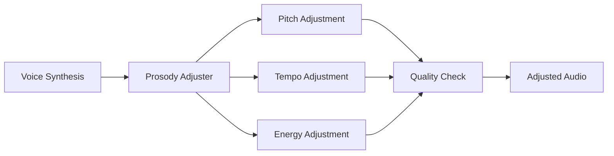
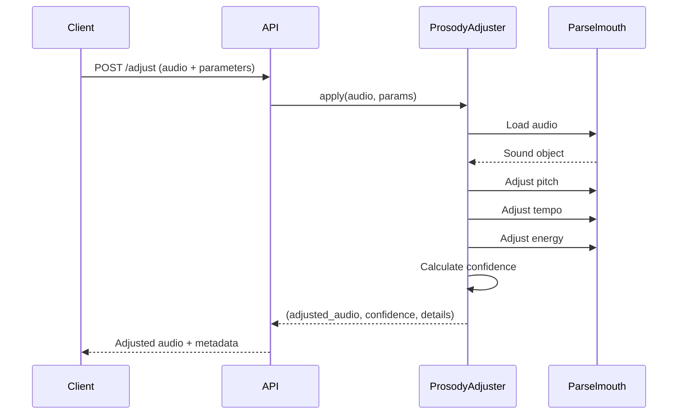

# Prosody Adjustment API - Complete Specification

**Version**: 1.0.0
**Last Updated**: 2025-11-07
**Author**: Muses (Knowledge Architect)
**Status**: Production Ready

---

## Table of Contents

1. [Introduction](#introduction)
2. [What is Prosody?](#what-is-prosody)
3. [API Overview](#api-overview)
4. [Authentication](#authentication)
5. [Endpoints](#endpoints)
6. [Parameters](#parameters)
7. [Presets](#presets)
8. [Response Formats](#response-formats)
9. [Error Codes](#error-codes)
10. [Integration Patterns](#integration-patterns)
11. [Code Examples](#code-examples)
12. [Best Practices](#best-practices)

---

## 1. Introduction

The **Prosody Adjustment API** provides fine-grained control over acoustic properties of synthesized speech, enabling you to create more natural, expressive, and emotionally resonant voice messages.

### Key Features

- **Pitch Control**: Adjust fundamental frequency (F0) for joyfulness or seriousness
- **Tempo Control**: Modify speech rate for energy or calmness
- **Energy Control**: Adjust loudness/intensity for emphasis
- **Strategic Pauses**: Insert pauses for dramatic effect (planned feature)
- **Confidence Scoring**: Automatic quality assessment of adjusted audio
- **Safety Validation**: Prevent unnatural-sounding adjustments

### Architecture



### Technology Stack

- **Processing Engine**: Praat Parselmouth (PSOLA algorithm)
- **Audio Format**: WAV (16-bit PCM, 22.05 kHz)
- **API Framework**: FastAPI (Python 3.11)
- **Validation**: Confidence scoring with safety thresholds

---

## 2. What is Prosody?

**Prosody** refers to the patterns of rhythm, stress, and intonation in speech. It's what makes speech sound natural, expressive, and emotionally rich.

### Components of Prosody

| Component | Description | Example Effect |
|-----------|-------------|----------------|
| **Pitch** | Fundamental frequency (F0) of voice | Higher pitch = more joyful/excited |
| **Tempo** | Speed of speech | Faster tempo = more energetic |
| **Energy** | Loudness/intensity | Higher energy = more emphatic |
| **Pauses** | Strategic silence between words | Pauses = dramatic emphasis |

### Before/After Comparison

**Original Speech**:
```
"Happy Birthday!"
Pitch: 200 Hz (neutral)
Tempo: 1.0x (normal)
Energy: 1.0x (normal)
```

**Adjusted for Celebration**:
```
"Happy Birthday!" (sounds more joyful)
Pitch: 230 Hz (+15%)
Tempo: 1.1x (+10% faster)
Energy: 1.2x (+20% louder)
```

### Audio Signal Visualization

```
Original:     ~~~~~~~~~~~   (neutral wave)
Adjusted:     ▲▲▲▲▲▲▲▲▲   (higher, faster, louder)
```

---

## 3. API Overview

### Base URL

```
Development:  http://localhost:55433/api/prosody
Production:   http://3.115.141.166:55433/api/prosody
```

### Supported Operations

| Operation | Method | Endpoint | Description |
|-----------|--------|----------|-------------|
| Adjust Audio | POST | `/adjust` | Apply prosody adjustments to audio file |
| Get Presets | GET | `/presets` | List available adjustment presets |
| Validate Parameters | POST | `/validate` | Check if parameters are safe |
| Health Check | GET | `/health` | Check service availability |

### Request/Response Flow



---

## 4. Authentication

### API Key (Optional)

For production deployments, you may require API key authentication:

```bash
# Add API key to request headers
curl -H "X-API-Key: your-api-key-here" \
     http://localhost:55433/api/prosody/adjust
```

### Rate Limiting

- **Development**: Unlimited
- **Production**: 60 requests/minute per IP

---

## 5. Endpoints

### 5.1 POST /adjust - Apply Prosody Adjustments

Apply acoustic adjustments to an audio file.

#### Request

**Multipart Form Data**:

| Field | Type | Required | Description |
|-------|------|----------|-------------|
| `audio_file` | File | Yes | Input audio file (WAV format) |
| `text` | String | Yes | Original text (for pause insertion) |
| `pitch_shift` | Float | No | Pitch multiplication factor (default: 1.15) |
| `tempo_shift` | Float | No | Tempo multiplication factor (default: 1.10) |
| `energy_shift` | Float | No | Energy multiplication factor (default: 1.20) |
| `enable_pauses` | Boolean | No | Insert strategic pauses (default: false) |
| `preset` | String | No | Use preset configuration (e.g., "celebration") |

#### cURL Example

```bash
# Basic adjustment with default parameters
curl -X POST http://localhost:55433/api/prosody/adjust \
  -F "audio_file=@speech.wav" \
  -F "text=Happy Birthday!" \
  -o adjusted_speech.wav

# Custom parameters
curl -X POST http://localhost:55433/api/prosody/adjust \
  -F "audio_file=@speech.wav" \
  -F "text=Happy Birthday!" \
  -F "pitch_shift=1.20" \
  -F "tempo_shift=1.05" \
  -F "energy_shift=1.10" \
  -o adjusted_speech.wav

# Using preset
curl -X POST http://localhost:55433/api/prosody/adjust \
  -F "audio_file=@speech.wav" \
  -F "text=Happy Birthday!" \
  -F "preset=celebration" \
  -o adjusted_speech.wav
```

#### Response

**Content-Type**: `audio/wav`

**Headers**:
```
Content-Type: audio/wav
X-Confidence-Score: 0.92
X-Pitch-Shift-Applied: 1.15
X-Tempo-Shift-Applied: 1.10
X-Energy-Shift-Applied: 1.20
X-Original-Duration: 2.30
X-Adjusted-Duration: 2.09
```

**Body**: Binary WAV audio data

#### Success Response (200 OK)

```json
{
  "status": "success",
  "audio_url": "/storage/adjusted_audio/speech_adjusted_123.wav",
  "confidence_score": 0.92,
  "details": {
    "pitch_shift_ratio": 1.15,
    "tempo_ratio": 1.10,
    "max_amplitude": 0.87,
    "pitch_check": "PASS",
    "clipping_check": "PASS",
    "tempo_check": "PASS"
  },
  "original_duration": 2.30,
  "adjusted_duration": 2.09,
  "processing_time_ms": 450
}
```

#### Error Response (400 Bad Request)

```json
{
  "status": "error",
  "error_code": "INVALID_PARAMETER",
  "message": "pitch_shift must be in [0.90, 1.25], got 1.50",
  "details": {
    "parameter": "pitch_shift",
    "received_value": 1.50,
    "valid_range": [0.90, 1.25]
  }
}
```

---

### 5.2 GET /presets - List Available Presets

Get predefined adjustment configurations for common use cases.

#### Request

```bash
curl http://localhost:55433/api/prosody/presets
```

#### Response (200 OK)

```json
{
  "presets": [
    {
      "id": "celebration",
      "name": "Celebration",
      "description": "Joyful and energetic for birthdays, congratulations",
      "parameters": {
        "pitch_shift": 1.15,
        "tempo_shift": 1.10,
        "energy_shift": 1.20,
        "enable_pauses": false
      },
      "use_cases": ["birthday", "congratulations", "celebration"]
    },
    {
      "id": "calm",
      "name": "Calm & Soothing",
      "description": "Relaxed and gentle for meditation, comfort",
      "parameters": {
        "pitch_shift": 0.95,
        "tempo_shift": 0.90,
        "energy_shift": 0.85,
        "enable_pauses": true
      },
      "use_cases": ["meditation", "comfort", "relaxation"]
    },
    {
      "id": "professional",
      "name": "Professional",
      "description": "Clear and authoritative for business announcements",
      "parameters": {
        "pitch_shift": 1.00,
        "tempo_shift": 0.95,
        "energy_shift": 1.10,
        "enable_pauses": true
      },
      "use_cases": ["business", "announcement", "presentation"]
    },
    {
      "id": "dramatic",
      "name": "Dramatic",
      "description": "Emphatic with strategic pauses for storytelling",
      "parameters": {
        "pitch_shift": 1.10,
        "tempo_shift": 0.95,
        "energy_shift": 1.25,
        "enable_pauses": true
      },
      "use_cases": ["storytelling", "narration", "announcement"]
    },
    {
      "id": "friendly",
      "name": "Friendly & Warm",
      "description": "Warm and approachable for greetings",
      "parameters": {
        "pitch_shift": 1.08,
        "tempo_shift": 1.00,
        "energy_shift": 1.10,
        "enable_pauses": false
      },
      "use_cases": ["greeting", "welcome", "introduction"]
    }
  ]
}
```

---

### 5.3 POST /validate - Validate Parameters

Check if adjustment parameters are within safe ranges before processing.

#### Request

```bash
curl -X POST http://localhost:55433/api/prosody/validate \
  -H "Content-Type: application/json" \
  -d '{
    "pitch_shift": 1.20,
    "tempo_shift": 1.10,
    "energy_shift": 1.25
  }'
```

#### Response (200 OK)

```json
{
  "valid": true,
  "warnings": [],
  "parameters": {
    "pitch_shift": {
      "value": 1.20,
      "valid": true,
      "range": [0.90, 1.25],
      "warning": null
    },
    "tempo_shift": {
      "value": 1.10,
      "valid": true,
      "range": [0.95, 1.15],
      "warning": null
    },
    "energy_shift": {
      "value": 1.25,
      "valid": true,
      "range": [1.00, 1.30],
      "warning": "High energy may cause clipping"
    }
  }
}
```

#### Response (400 Bad Request - Invalid Parameters)

```json
{
  "valid": false,
  "errors": [
    {
      "parameter": "pitch_shift",
      "value": 1.50,
      "error": "Value out of range [0.90, 1.25]"
    }
  ],
  "warnings": []
}
```

---

### 5.4 GET /health - Health Check

Check if the Prosody Adjustment service is available.

#### Request

```bash
curl http://localhost:55433/api/prosody/health
```

#### Response (200 OK)

```json
{
  "status": "healthy",
  "service": "Prosody Adjustment API",
  "version": "1.0.0",
  "dependencies": {
    "parselmouth": {
      "available": true,
      "version": "0.4.3"
    },
    "numpy": {
      "available": true,
      "version": "1.24.4"
    }
  },
  "capabilities": [
    "pitch_adjustment",
    "tempo_adjustment",
    "energy_adjustment",
    "confidence_scoring"
  ],
  "uptime_seconds": 3600
}
```

#### Response (503 Service Unavailable)

```json
{
  "status": "unhealthy",
  "error": "Parselmouth not available",
  "details": "Install with: pip install praat-parselmouth==0.4.3"
}
```

---

## 6. Parameters

### 6.1 pitch_shift

**Type**: `float`
**Range**: `0.90` to `1.25`
**Default**: `1.15`
**Description**: Fundamental frequency (F0) multiplication factor.

#### Effect on Voice

| Value | Effect | Use Case |
|-------|--------|----------|
| `0.90` | -10% (lower pitch) | Serious, authoritative |
| `1.00` | No change | Neutral |
| `1.15` | +15% (higher pitch) | Joyful, celebratory (default) |
| `1.25` | +25% (much higher) | Very excited, childlike |

#### Example

```python
# Lower pitch for serious tone
pitch_shift = 0.95  # -5%

# Higher pitch for celebration
pitch_shift = 1.20  # +20%
```

#### Audio Characteristics

```
Original:   [200 Hz]  ~~~~~~~~~~~
Low (0.90): [180 Hz]  ___________  (deeper voice)
High (1.20):[240 Hz]  ^^^^^^^^^^^  (brighter voice)
```

---

### 6.2 tempo_shift

**Type**: `float`
**Range**: `0.95` to `1.15`
**Default**: `1.10`
**Description**: Speech rate multiplication factor.

#### Effect on Voice

| Value | Effect | Use Case |
|-------|--------|----------|
| `0.95` | -5% (slower) | Dramatic, careful |
| `1.00` | No change | Neutral |
| `1.10` | +10% (faster) | Energetic, celebratory (default) |
| `1.15` | +15% (much faster) | Excited, urgent |

#### Example

```python
# Slower for dramatic effect
tempo_shift = 0.95  # -5% slower

# Faster for energy
tempo_shift = 1.12  # +12% faster
```

#### Duration Change

```
Original duration:  2.0 seconds
tempo_shift = 1.10: 1.82 seconds (18% reduction)
tempo_shift = 0.95: 2.11 seconds (5% increase)
```

---

### 6.3 energy_shift

**Type**: `float`
**Range**: `1.00` to `1.30`
**Default**: `1.20`
**Description**: Intensity/loudness multiplication factor.

#### Effect on Voice

| Value | Effect | Use Case |
|-------|--------|----------|
| `1.00` | No change | Neutral |
| `1.10` | +10% (louder) | Slightly emphatic |
| `1.20` | +20% (much louder) | Celebratory (default) |
| `1.30` | +30% (very loud) | Maximum emphasis |

#### Example

```python
# Moderate increase
energy_shift = 1.10  # +10%

# Strong emphasis
energy_shift = 1.25  # +25%
```

#### Safety Features

- **Automatic Normalization**: Prevents clipping (max amplitude = 0.95)
- **Clipping Warning**: If normalization is required, a warning is logged

```python
# If energy_shift causes clipping:
max_amplitude = 1.15  # After energy adjustment
normalization_factor = 0.95 / 1.15 = 0.826
final_audio = audio * normalization_factor
# Result: max_amplitude = 0.95 (safe)
```

---

### 6.4 enable_pauses

**Type**: `boolean`
**Default**: `false`
**Description**: Insert strategic pauses after exclamations.

#### Status

⚠️ **Planned Feature** - Currently not implemented.

**Requires**: Montreal Forced Aligner for word-level timestamps.

#### Planned Behavior

```
Original:  "Happy Birthday! Enjoy your day!"
           [0.0s----0.8s][0.8s-------1.6s]

With pauses: "Happy Birthday! [pause] Enjoy your day!"
             [0.0s----0.8s][pause:0.3s][1.1s-------1.9s]
```

---

## 7. Presets

### 7.1 Celebration

**Use Cases**: Birthdays, congratulations, achievement announcements

```json
{
  "pitch_shift": 1.15,
  "tempo_shift": 1.10,
  "energy_shift": 1.20,
  "enable_pauses": false
}
```

**Characteristics**:
- Joyful, energetic tone
- Higher pitch for excitement
- Faster tempo for energy
- Louder for emphasis

---

### 7.2 Calm & Soothing

**Use Cases**: Meditation guides, comfort messages, relaxation

```json
{
  "pitch_shift": 0.95,
  "tempo_shift": 0.90,
  "energy_shift": 0.85,
  "enable_pauses": true
}
```

**Characteristics**:
- Relaxed, gentle tone
- Lower pitch for calmness
- Slower tempo for peace
- Softer volume

---

### 7.3 Professional

**Use Cases**: Business announcements, formal presentations

```json
{
  "pitch_shift": 1.00,
  "tempo_shift": 0.95,
  "energy_shift": 1.10,
  "enable_pauses": true
}
```

**Characteristics**:
- Clear, authoritative tone
- Neutral pitch
- Slightly slower for clarity
- Moderate emphasis

---

### 7.4 Dramatic

**Use Cases**: Storytelling, narrative voiceovers

```json
{
  "pitch_shift": 1.10,
  "tempo_shift": 0.95,
  "energy_shift": 1.25,
  "enable_pauses": true
}
```

**Characteristics**:
- Emphatic, engaging tone
- Slightly higher pitch
- Strategic pauses for effect
- Strong emphasis

---

### 7.5 Friendly & Warm

**Use Cases**: Greetings, welcomes, introductions

```json
{
  "pitch_shift": 1.08,
  "tempo_shift": 1.00,
  "energy_shift": 1.10,
  "enable_pauses": false
}
```

**Characteristics**:
- Warm, approachable tone
- Slightly higher pitch
- Natural pace
- Moderate emphasis

---

## 8. Response Formats

### 8.1 Success Response

```json
{
  "status": "success",
  "audio_url": "/storage/adjusted_audio/speech_adjusted_abc123.wav",
  "confidence_score": 0.92,
  "details": {
    "pitch_shift_ratio": 1.15,
    "tempo_ratio": 1.10,
    "max_amplitude": 0.87,
    "pitch_check": "PASS",
    "clipping_check": "PASS",
    "tempo_check": "PASS",
    "final_confidence": 0.92
  },
  "original_duration": 2.30,
  "adjusted_duration": 2.09,
  "processing_time_ms": 450,
  "parameters_applied": {
    "pitch_shift": 1.15,
    "tempo_shift": 1.10,
    "energy_shift": 1.20,
    "enable_pauses": false
  }
}
```

### 8.2 Confidence Score Breakdown

| Score | Quality | Description |
|-------|---------|-------------|
| `0.90-1.00` | Excellent | Natural-sounding, safe adjustments |
| `0.70-0.89` | Good | Acceptable quality, minor warnings |
| `0.50-0.69` | Fair | Noticeable artifacts, moderate issues |
| `0.00-0.49` | Poor | Unnatural sound, major issues |

### 8.3 Quality Checks

#### Pitch Check

- **PASS**: Pitch shift within safe range (0.90-1.25)
- **FAIL**: Pitch shift out of range → confidence × 0.3

#### Clipping Check

- **PASS**: Max amplitude < 0.99
- **FAIL**: Near clipping detected → confidence × 0.5

#### Tempo Check

- **PASS**: Tempo change within safe range (0.95-1.15)
- **FAIL**: Tempo change too extreme → confidence × 0.6

---

## 9. Error Codes

### 9.1 Client Errors (4xx)

| Code | Error | Description | Solution |
|------|-------|-------------|----------|
| `400` | `INVALID_PARAMETER` | Parameter out of valid range | Check parameter documentation |
| `400` | `INVALID_AUDIO_FORMAT` | Audio file is not WAV | Convert to WAV format |
| `400` | `AUDIO_TOO_LARGE` | File size > 100 MB | Compress or split audio |
| `400` | `MISSING_REQUIRED_FIELD` | Required field not provided | Check request body |
| `404` | `PRESET_NOT_FOUND` | Specified preset does not exist | Use /presets to list valid presets |
| `415` | `UNSUPPORTED_MEDIA_TYPE` | File type not supported | Use WAV audio files |

### 9.2 Server Errors (5xx)

| Code | Error | Description | Solution |
|------|-------|-------------|----------|
| `500` | `ADJUSTMENT_FAILED` | Prosody adjustment error | Check logs, verify audio quality |
| `500` | `PARSELMOUTH_ERROR` | Praat engine failure | Ensure Parselmouth is installed |
| `503` | `SERVICE_UNAVAILABLE` | Prosody service not ready | Check health endpoint |

### 9.3 Error Response Example

```json
{
  "status": "error",
  "error_code": "INVALID_PARAMETER",
  "message": "pitch_shift must be in [0.90, 1.25], got 1.50",
  "details": {
    "parameter": "pitch_shift",
    "received_value": 1.50,
    "valid_range": [0.90, 1.25],
    "suggestion": "Try value between 1.10 and 1.20 for celebratory tone"
  },
  "documentation_url": "https://docs.example.com/prosody#pitch_shift",
  "timestamp": "2025-11-07T10:30:00Z"
}
```

---

## 10. Integration Patterns

### 10.1 VOICEVOX → Prosody

Enhance VOICEVOX synthesized speech with prosody adjustments.

```python
import requests

# Step 1: Synthesize with VOICEVOX
voicevox_response = requests.post(
    "http://localhost:55433/api/voicevox/synthesize",
    json={
        "text": "Happy Birthday!",
        "speaker": 1
    }
)

# Save VOICEVOX audio
with open("voicevox_speech.wav", "wb") as f:
    f.write(voicevox_response.content)

# Step 2: Apply prosody adjustments
with open("voicevox_speech.wav", "rb") as f:
    prosody_response = requests.post(
        "http://localhost:55433/api/prosody/adjust",
        files={"audio_file": f},
        data={
            "text": "Happy Birthday!",
            "preset": "celebration"
        }
    )

# Save adjusted audio
with open("final_speech.wav", "wb") as f:
    f.write(prosody_response.content)

print(f"Confidence: {prosody_response.headers['X-Confidence-Score']}")
```

---

### 10.2 OpenVoice → Prosody

Apply prosody to cloned voices.

```python
import requests

# Step 1: Clone voice with OpenVoice
clone_response = requests.post(
    "http://localhost:55433/api/voice-clone/create",
    files={"reference_audio": open("reference.wav", "rb")},
    data={"voice_name": "My Voice"}
)

profile_id = clone_response.json()["profile"]["id"]

# Step 2: Synthesize with cloned voice
synth_response = requests.post(
    "http://localhost:55433/api/voice-clone/synthesize",
    json={
        "text": "Congratulations on your achievement!",
        "profile_id": profile_id,
        "language": "ja"
    }
)

with open("cloned_speech.wav", "wb") as f:
    f.write(synth_response.content)

# Step 3: Apply prosody for celebration
with open("cloned_speech.wav", "rb") as f:
    prosody_response = requests.post(
        "http://localhost:55433/api/prosody/adjust",
        files={"audio_file": f},
        data={
            "text": "Congratulations on your achievement!",
            "pitch_shift": 1.15,
            "tempo_shift": 1.10,
            "energy_shift": 1.20
        }
    )

with open("final_cloned_speech.wav", "wb") as f:
    f.write(prosody_response.content)
```

---

### 10.3 Batch Processing

Process multiple audio files efficiently.

```python
import requests
import asyncio
import aiohttp
from pathlib import Path

async def adjust_audio(session, audio_file, preset):
    """Adjust single audio file."""
    url = "http://localhost:55433/api/prosody/adjust"

    with open(audio_file, "rb") as f:
        data = aiohttp.FormData()
        data.add_field("audio_file", f, filename=audio_file.name)
        data.add_field("text", audio_file.stem)
        data.add_field("preset", preset)

        async with session.post(url, data=data) as response:
            if response.status == 200:
                output_path = f"adjusted_{audio_file.name}"
                with open(output_path, "wb") as out:
                    out.write(await response.read())

                confidence = response.headers.get("X-Confidence-Score")
                print(f"✓ {audio_file.name} → {output_path} (confidence: {confidence})")
                return True
            else:
                print(f"✗ {audio_file.name} failed: {response.status}")
                return False

async def batch_adjust(audio_files, preset="celebration", max_concurrent=5):
    """Adjust multiple audio files with concurrency limit."""
    semaphore = asyncio.Semaphore(max_concurrent)

    async def limited_adjust(session, audio_file, preset):
        async with semaphore:
            return await adjust_audio(session, audio_file, preset)

    async with aiohttp.ClientSession() as session:
        tasks = [
            limited_adjust(session, audio_file, preset)
            for audio_file in audio_files
        ]

        results = await asyncio.gather(*tasks)

        success_count = sum(results)
        print(f"\nProcessed: {success_count}/{len(audio_files)} files")

# Usage
audio_files = list(Path("audio_input").glob("*.wav"))
asyncio.run(batch_adjust(audio_files, preset="celebration"))
```

---

## 11. Code Examples

### 11.1 Python Client

```python
import requests
from pathlib import Path

class ProsodyClient:
    """Simple Python client for Prosody Adjustment API."""

    def __init__(self, base_url="http://localhost:55433"):
        self.base_url = base_url
        self.api_url = f"{base_url}/api/prosody"

    def adjust(
        self,
        audio_file: str,
        text: str,
        pitch_shift: float = 1.15,
        tempo_shift: float = 1.10,
        energy_shift: float = 1.20,
        preset: str = None
    ) -> dict:
        """Apply prosody adjustments."""

        url = f"{self.api_url}/adjust"

        with open(audio_file, "rb") as f:
            files = {"audio_file": f}
            data = {
                "text": text,
                "pitch_shift": pitch_shift,
                "tempo_shift": tempo_shift,
                "energy_shift": energy_shift
            }

            if preset:
                data["preset"] = preset

            response = requests.post(url, files=files, data=data)
            response.raise_for_status()

            return {
                "audio_data": response.content,
                "confidence": float(response.headers.get("X-Confidence-Score", 0)),
                "duration": float(response.headers.get("X-Adjusted-Duration", 0))
            }

    def get_presets(self) -> dict:
        """Get available presets."""
        url = f"{self.api_url}/presets"
        response = requests.get(url)
        response.raise_for_status()
        return response.json()

    def validate_parameters(
        self,
        pitch_shift: float,
        tempo_shift: float,
        energy_shift: float
    ) -> dict:
        """Validate parameters before processing."""
        url = f"{self.api_url}/validate"
        response = requests.post(url, json={
            "pitch_shift": pitch_shift,
            "tempo_shift": tempo_shift,
            "energy_shift": energy_shift
        })
        response.raise_for_status()
        return response.json()

    def health_check(self) -> dict:
        """Check service health."""
        url = f"{self.api_url}/health"
        response = requests.get(url)
        return response.json()

# Usage
client = ProsodyClient()

# Check health
health = client.health_check()
print(f"Service status: {health['status']}")

# Adjust audio with preset
result = client.adjust(
    audio_file="speech.wav",
    text="Happy Birthday!",
    preset="celebration"
)

with open("adjusted_speech.wav", "wb") as f:
    f.write(result["audio_data"])

print(f"Confidence: {result['confidence']:.2f}")
```

---

### 11.2 JavaScript/TypeScript

```typescript
// prosody-client.ts
import axios, { AxiosInstance } from 'axios';

interface ProsodyParams {
  pitch_shift?: number;
  tempo_shift?: number;
  energy_shift?: number;
  enable_pauses?: boolean;
  preset?: string;
}

interface AdjustmentResult {
  audioBlob: Blob;
  confidence: number;
  duration: number;
}

class ProsodyClient {
  private client: AxiosInstance;

  constructor(baseURL: string = 'http://localhost:55433') {
    this.client = axios.create({
      baseURL: `${baseURL}/api/prosody`,
      timeout: 30000,
    });
  }

  async adjust(
    audioFile: File,
    text: string,
    params: ProsodyParams = {}
  ): Promise<AdjustmentResult> {
    const formData = new FormData();
    formData.append('audio_file', audioFile);
    formData.append('text', text);

    if (params.preset) {
      formData.append('preset', params.preset);
    } else {
      if (params.pitch_shift) formData.append('pitch_shift', params.pitch_shift.toString());
      if (params.tempo_shift) formData.append('tempo_shift', params.tempo_shift.toString());
      if (params.energy_shift) formData.append('energy_shift', params.energy_shift.toString());
      if (params.enable_pauses !== undefined) formData.append('enable_pauses', params.enable_pauses.toString());
    }

    const response = await this.client.post('/adjust', formData, {
      responseType: 'blob',
      headers: {
        'Content-Type': 'multipart/form-data',
      },
    });

    return {
      audioBlob: response.data,
      confidence: parseFloat(response.headers['x-confidence-score'] || '0'),
      duration: parseFloat(response.headers['x-adjusted-duration'] || '0'),
    };
  }

  async getPresets(): Promise<any> {
    const response = await this.client.get('/presets');
    return response.data;
  }

  async validateParameters(params: ProsodyParams): Promise<any> {
    const response = await this.client.post('/validate', params);
    return response.data;
  }

  async healthCheck(): Promise<any> {
    const response = await this.client.get('/health');
    return response.data;
  }
}

// Usage
const client = new ProsodyClient();

// Adjust audio
const audioFile = document.getElementById('audio-input') as HTMLInputElement;
if (audioFile.files && audioFile.files[0]) {
  const result = await client.adjust(
    audioFile.files[0],
    'Happy Birthday!',
    { preset: 'celebration' }
  );

  // Play adjusted audio
  const audioURL = URL.createObjectURL(result.audioBlob);
  const audioElement = new Audio(audioURL);
  audioElement.play();

  console.log(`Confidence: ${result.confidence.toFixed(2)}`);
}
```

---

### 11.3 React Component

```tsx
// ProsodyAdjustment.tsx
import React, { useState } from 'react';
import { ProsodyClient } from './prosody-client';

const ProsodyAdjustment: React.FC = () => {
  const [audioFile, setAudioFile] = useState<File | null>(null);
  const [text, setText] = useState('');
  const [preset, setPreset] = useState('celebration');
  const [adjustedAudioURL, setAdjustedAudioURL] = useState<string | null>(null);
  const [confidence, setConfidence] = useState<number | null>(null);
  const [loading, setLoading] = useState(false);
  const [error, setError] = useState<string | null>(null);

  const client = new ProsodyClient();

  const handleFileChange = (e: React.ChangeEvent<HTMLInputElement>) => {
    if (e.target.files && e.target.files[0]) {
      setAudioFile(e.target.files[0]);
    }
  };

  const handleAdjust = async () => {
    if (!audioFile || !text) {
      setError('Please select audio file and enter text');
      return;
    }

    setLoading(true);
    setError(null);

    try {
      const result = await client.adjust(audioFile, text, { preset });

      const audioURL = URL.createObjectURL(result.audioBlob);
      setAdjustedAudioURL(audioURL);
      setConfidence(result.confidence);
    } catch (err) {
      setError(err instanceof Error ? err.message : 'Adjustment failed');
    } finally {
      setLoading(false);
    }
  };

  return (
    <div className="prosody-adjustment">
      <h2>Prosody Adjustment</h2>

      <div className="input-section">
        <label>
          Audio File:
          <input type="file" accept="audio/wav" onChange={handleFileChange} />
        </label>

        <label>
          Text:
          <input
            type="text"
            value={text}
            onChange={(e) => setText(e.target.value)}
            placeholder="Enter text (e.g., Happy Birthday!)"
          />
        </label>

        <label>
          Preset:
          <select value={preset} onChange={(e) => setPreset(e.target.value)}>
            <option value="celebration">Celebration</option>
            <option value="calm">Calm & Soothing</option>
            <option value="professional">Professional</option>
            <option value="dramatic">Dramatic</option>
            <option value="friendly">Friendly & Warm</option>
          </select>
        </label>

        <button onClick={handleAdjust} disabled={loading}>
          {loading ? 'Processing...' : 'Adjust Audio'}
        </button>
      </div>

      {error && <div className="error">{error}</div>}

      {adjustedAudioURL && (
        <div className="result-section">
          <h3>Adjusted Audio</h3>
          <audio controls src={adjustedAudioURL} />
          <p>Confidence Score: {confidence?.toFixed(2)}</p>
        </div>
      )}
    </div>
  );
};

export default ProsodyAdjustment;
```

---

## 12. Best Practices

### 12.1 Parameter Selection

#### For Celebratory Messages

```python
# Birthday, congratulations, achievement
pitch_shift = 1.15  # +15% (joyful)
tempo_shift = 1.10  # +10% (energetic)
energy_shift = 1.20  # +20% (emphatic)
```

#### For Professional Announcements

```python
# Business, formal presentations
pitch_shift = 1.00  # Neutral
tempo_shift = 0.95  # -5% (clear)
energy_shift = 1.10  # +10% (authoritative)
```

#### For Relaxation/Meditation

```python
# Calm, soothing messages
pitch_shift = 0.95  # -5% (lower, calmer)
tempo_shift = 0.90  # -10% (slower, peaceful)
energy_shift = 0.85  # -15% (softer)
```

### 12.2 Audio Quality

#### Input Requirements

- **Format**: WAV (PCM)
- **Sample Rate**: 22.05 kHz or 44.1 kHz
- **Bit Depth**: 16-bit
- **Channels**: Mono or Stereo
- **Duration**: < 60 seconds (recommended)

#### Quality Checklist

✅ Use high-quality source audio (low noise)
✅ Avoid over-compression before adjustment
✅ Check confidence score after adjustment (aim for > 0.80)
✅ Preview adjusted audio before production use
✅ Keep adjustments within safe ranges

### 12.3 Performance Optimization

#### Processing Time

| Audio Duration | Estimated Time |
|----------------|----------------|
| 1-5 seconds | 200-500 ms |
| 5-10 seconds | 500-1000 ms |
| 10-30 seconds | 1-3 seconds |
| 30-60 seconds | 3-6 seconds |

#### Optimization Tips

1. **Use Presets**: Faster than custom parameters
2. **Batch Processing**: Process multiple files concurrently
3. **Cache Results**: Store adjusted audio for reuse
4. **Disable Pauses**: Skip pause insertion if not needed

### 12.4 Error Handling

```python
import requests
from requests.exceptions import RequestException

def adjust_with_retry(audio_file, text, preset, max_retries=3):
    """Adjust audio with automatic retry on failure."""

    for attempt in range(max_retries):
        try:
            with open(audio_file, "rb") as f:
                response = requests.post(
                    "http://localhost:55433/api/prosody/adjust",
                    files={"audio_file": f},
                    data={"text": text, "preset": preset},
                    timeout=30
                )
                response.raise_for_status()
                return response.content

        except RequestException as e:
            if attempt == max_retries - 1:
                raise  # Re-raise on final attempt

            print(f"Attempt {attempt + 1} failed: {e}. Retrying...")
            time.sleep(2 ** attempt)  # Exponential backoff

# Usage
try:
    adjusted_audio = adjust_with_retry("speech.wav", "Happy Birthday!", "celebration")
    with open("adjusted_speech.wav", "wb") as f:
        f.write(adjusted_audio)
except RequestException as e:
    print(f"Failed after retries: {e}")
```

### 12.5 Testing Strategy

#### Unit Tests

```python
import pytest
from prosody_client import ProsodyClient

@pytest.fixture
def client():
    return ProsodyClient()

def test_health_check(client):
    health = client.health_check()
    assert health["status"] == "healthy"

def test_adjust_with_preset(client):
    result = client.adjust(
        audio_file="test_speech.wav",
        text="Test",
        preset="celebration"
    )
    assert result["confidence"] > 0.70
    assert len(result["audio_data"]) > 0

def test_invalid_parameters(client):
    with pytest.raises(requests.HTTPError):
        client.adjust(
            audio_file="test_speech.wav",
            text="Test",
            pitch_shift=2.0  # Out of range
        )
```

#### Integration Tests

```python
def test_voicevox_prosody_pipeline():
    """Test full pipeline: VOICEVOX → Prosody."""

    # Step 1: Synthesize with VOICEVOX
    voicevox_audio = synthesize_voicevox("Happy Birthday!")

    # Step 2: Apply prosody
    prosody_client = ProsodyClient()
    result = prosody_client.adjust(
        audio_file=voicevox_audio,
        text="Happy Birthday!",
        preset="celebration"
    )

    # Assertions
    assert result["confidence"] > 0.80
    assert result["duration"] > 0
```

---

## Appendix A: Algorithm Details

### PSOLA (Pitch-Synchronous Overlap-Add)

The Prosody Adjustment API uses **Praat Parselmouth**, which implements the PSOLA algorithm for pitch and tempo modification.

#### Pitch Modification

1. Detect pitch periods in original signal
2. Multiply pitch values by `pitch_shift` factor
3. Resynthesize signal using overlap-add method

#### Tempo Modification

1. Create duration tier
2. Add duration points with `1/tempo_shift` factor
3. Resynthesize signal with modified durations

### Quality Assurance

The confidence scoring system evaluates:

1. **Pitch Shift Ratio**: Actual vs. target pitch change
2. **Clipping Detection**: Maximum amplitude threshold
3. **Tempo Ratio**: Actual vs. target duration change

---

## Appendix B: Audio Format Specifications

### Supported Formats

| Format | Support | Notes |
|--------|---------|-------|
| WAV (PCM) | ✅ Yes | Recommended |
| MP3 | ❌ No | Convert to WAV |
| AAC | ❌ No | Convert to WAV |
| FLAC | ❌ No | Convert to WAV |

### Conversion Example

```bash
# Convert MP3 to WAV using FFmpeg
ffmpeg -i input.mp3 -ar 22050 -ac 1 -sample_fmt s16 output.wav
```

---

## Appendix C: Troubleshooting

See [PROSODY_TROUBLESHOOTING.md](./PROSODY_TROUBLESHOOTING.md) for detailed troubleshooting guide.

---

## Appendix D: Contributing

### Reporting Issues

Please report issues on GitHub with:

1. Audio file (if possible)
2. Request parameters
3. Error message
4. Expected vs. actual behavior

### Feature Requests

Feature requests are welcome! Please describe:

1. Use case
2. Proposed API design
3. Expected behavior

---

## Changelog

### Version 1.0.0 (2025-11-07)

- Initial release
- Pitch, tempo, energy adjustment
- 5 presets (celebration, calm, professional, dramatic, friendly)
- Confidence scoring
- Parameter validation

---

## License

MIT License - See [LICENSE](./LICENSE) for details.

---

*This documentation is maintained by the Video Message App team.*
*For support, please contact: support@example.com*
