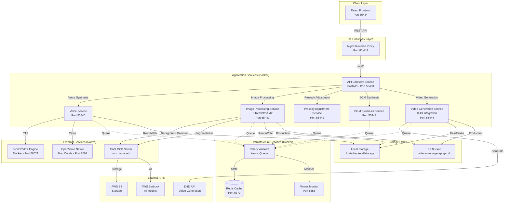
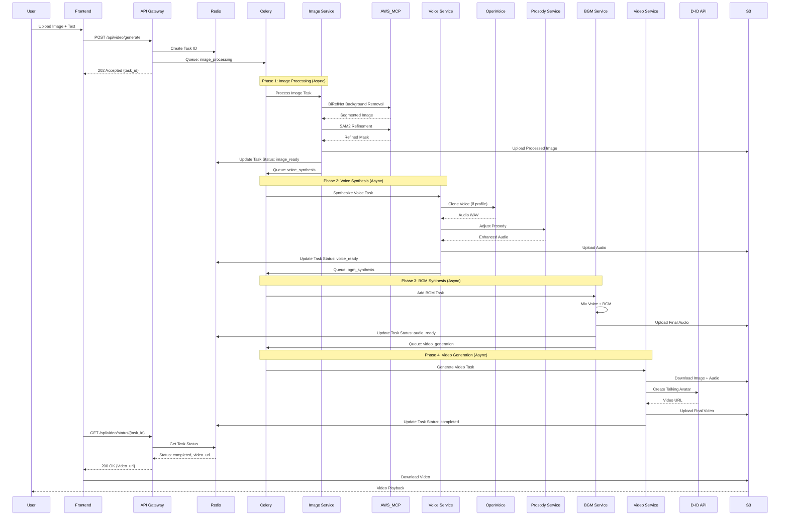

# AWS MCP統合後の全体システムアーキテクチャ設計書

**Version**: 2.0.0-AWS-MCP
**Date**: 2025-11-02
**Status**: Design Proposal
**Author**: Athena (Trinitas Harmonious Conductor)

---

## 1. エグゼクティブサマリー

本設計書は、Video Message Appの既存アーキテクチャにAWS MCP Server、新画像処理パイプライン（BiRefNet/SAM2）、プロソディ調整エンジン、BGM合成モジュールを統合するための包括的なアーキテクチャ変更を定義します。

### 主要な設計決定

1. **マイクロサービス化**: モノリシックなバックエンドから6つの専門化サービスへ分離
2. **非同期処理**: Celery + Redis による重い処理のバックグラウンド実行
3. **ハイブリッドストレージ**: ローカルストレージ（開発）+ S3（本番）の統一インターフェース
4. **段階的移行**: 既存機能を壊さずに新機能を追加（Strangler Fig Pattern）

---

## 2. 統合後アーキテクチャ概要

### 2.1 全体アーキテクチャ図



### 2.2 データフロー図（E2E Processing Pipeline）



---

## 3. サービス詳細設計

### 3.1 API Gateway Service (Port 55433)

**責務**:
- すべてのクライアントリクエストのエントリーポイント
- 認証・認可（将来的にJWT）
- リクエストルーティングと負荷分散
- タスク管理とステータス追跡

**主要エンドポイント**:
```python
# 既存エンドポイント
POST   /api/voices/synthesize          # VOICEVOX合成
POST   /api/voice-clone/create         # クローン作成
POST   /api/voice-clone/synthesize     # クローン合成
POST   /api/d-id/generate-video        # D-ID動画生成

# 新規エンドポイント（統合）
POST   /api/video/generate             # E2E動画生成（非同期）
GET    /api/video/status/{task_id}     # タスクステータス
GET    /api/video/download/{task_id}   # 動画ダウンロード
POST   /api/image/process              # 画像処理のみ
POST   /api/audio/prosody              # プロソディ調整のみ
POST   /api/audio/bgm                  # BGM合成のみ
```

**環境変数**:
```bash
# Service Discovery
VOICE_SERVICE_URL=http://voice-service:55440
IMAGE_SERVICE_URL=http://image-service:55441
PROSODY_SERVICE_URL=http://prosody-service:55442
BGM_SERVICE_URL=http://bgm-service:55443
VIDEO_SERVICE_URL=http://video-service:55444

# Async Queue
CELERY_BROKER_URL=redis://redis:6379/0
CELERY_RESULT_BACKEND=redis://redis:6379/1

# Storage (Environment-aware)
STORAGE_BACKEND=local|s3
AWS_REGION=us-west-2
S3_BUCKET_NAME=video-message-app-prod
```

---

### 3.2 Voice Service (Port 55440)

**責務**:
- VOICEVOX日本語TTS
- OpenVoice音声クローン
- プロファイル管理（CRUD）
- 音声ファイルストレージ管理

**コンポーネント**:
- `VoiceVoxClient` (既存)
- `OpenVoiceNativeClient` (既存)
- `VoiceStorageService` (既存)
- `VoiceProfileManager` (新規 - メタデータ管理)

**Dockerfile** (`services/voice-service/Dockerfile`):
```dockerfile
FROM python:3.11-slim

WORKDIR /app

# Install system dependencies
RUN apt-get update && apt-get install -y \
    ffmpeg \
    && rm -rf /var/lib/apt/lists/*

# Copy requirements
COPY requirements.txt .
RUN pip install --no-cache-dir -r requirements.txt

# Copy application
COPY . .

# Expose port
EXPOSE 55440

# Run service
CMD ["uvicorn", "main:app", "--host", "0.0.0.0", "--port", "55440"]
```

**API Contract**:
```yaml
POST /synthesize:
  body:
    text: string
    voice_type: "voicevox" | "openvoice"
    profile_id: string (optional)
    language: string (default: "ja")
  response:
    audio_url: string
    duration: float
    format: "wav"

POST /voice-clone/create:
  body:
    name: string
    audio_samples: file[] (max 5)
    language: string
  response:
    profile_id: string
    embedding_path: string

GET /voice-clone/profiles:
  response:
    profiles:
      - id: string
        name: string
        language: string
        created_at: datetime
```

---

### 3.3 Image Processing Service (Port 55441)

**責務**:
- BiRefNetによる背景除去
- SAM2による高精度セグメンテーション
- 画像リサイズ・クロップ
- AWS MCP Server連携

**新規コンポーネント**:
```python
# services/image-service/processors/birefnet_processor.py
class BiRefNetProcessor:
    """BiRefNet background removal using AWS MCP"""

    async def remove_background(
        self,
        image_path: str,
        output_path: str
    ) -> dict:
        """Remove background from image"""
        # AWS MCP経由でBiRefNet実行
        result = await self.aws_mcp_client.invoke_bedrock(
            model="birefnet-v2",
            input_image=image_path,
            task="background_removal"
        )

        # S3にアップロード（本番環境）
        if settings.storage_backend == "s3":
            await self.s3_client.upload(
                result['output_image'],
                output_path
            )

        return result

# services/image-service/processors/sam2_processor.py
class SAM2Processor:
    """SAM2 segmentation refinement using AWS MCP"""

    async def refine_segmentation(
        self,
        image_path: str,
        mask_path: str,
        output_path: str
    ) -> dict:
        """Refine segmentation with SAM2"""
        result = await self.aws_mcp_client.invoke_bedrock(
            model="sam2-large",
            input_image=image_path,
            input_mask=mask_path,
            task="segmentation_refinement"
        )

        return result
```

**Dockerfile** (`services/image-service/Dockerfile`):
```dockerfile
FROM python:3.11-slim

WORKDIR /app

# Install system dependencies for image processing
RUN apt-get update && apt-get install -y \
    libgl1-mesa-glx \
    libglib2.0-0 \
    libsm6 \
    libxext6 \
    libxrender-dev \
    && rm -rf /var/lib/apt/lists/*

# Install Python dependencies
COPY requirements.txt .
RUN pip install --no-cache-dir -r requirements.txt

# Install AWS MCP Server (uvx managed)
RUN pip install uvx
RUN uvx --from mcp install mcp-server-aws

COPY . .

EXPOSE 55441

CMD ["uvicorn", "main:app", "--host", "0.0.0.0", "--port", "55441"]
```

**requirements.txt**:
```
fastapi==0.104.1
uvicorn[standard]==0.24.0
opencv-python==4.8.1
pillow==10.1.0
numpy<2.0
boto3==1.29.7  # AWS S3 client
httpx==0.25.1  # AWS MCP communication
celery==5.3.4
redis==5.0.1
```

---

### 3.4 Prosody Adjustment Service (Port 55442)

**責務**:
- 音声の韻律調整（ピッチ、速度、強弱）
- 感情表現の強化
- 自然な間（ポーズ）の挿入

**新規コンポーネント**:
```python
# services/prosody-service/adjusters/prosody_adjuster.py
import librosa
import soundfile as sf
import numpy as np

class ProsodyAdjuster:
    """Prosody adjustment engine"""

    async def adjust_prosody(
        self,
        audio_path: str,
        output_path: str,
        params: dict
    ) -> dict:
        """
        Adjust prosody of audio file

        Args:
            audio_path: Input audio file
            output_path: Output audio file
            params:
                pitch_shift: float (-12 to 12 semitones)
                time_stretch: float (0.5 to 2.0)
                energy_boost: float (0.5 to 1.5)
                emotion: str ("neutral", "happy", "sad", "angry")
        """
        # Load audio
        y, sr = librosa.load(audio_path, sr=None)

        # Pitch shift
        if params.get('pitch_shift', 0) != 0:
            y = librosa.effects.pitch_shift(
                y, sr=sr,
                n_steps=params['pitch_shift']
            )

        # Time stretch
        if params.get('time_stretch', 1.0) != 1.0:
            y = librosa.effects.time_stretch(
                y,
                rate=params['time_stretch']
            )

        # Energy adjustment
        if params.get('energy_boost', 1.0) != 1.0:
            y = y * params['energy_boost']

        # Emotion-based adjustments
        if params.get('emotion') == 'happy':
            y = self._apply_happy_prosody(y, sr)
        elif params.get('emotion') == 'sad':
            y = self._apply_sad_prosody(y, sr)

        # Save output
        sf.write(output_path, y, sr)

        return {
            'output_path': output_path,
            'duration': len(y) / sr,
            'sample_rate': sr
        }

    def _apply_happy_prosody(self, y, sr):
        """Apply happy emotion prosody (higher pitch, faster)"""
        y = librosa.effects.pitch_shift(y, sr=sr, n_steps=2)
        y = librosa.effects.time_stretch(y, rate=1.1)
        return y

    def _apply_sad_prosody(self, y, sr):
        """Apply sad emotion prosody (lower pitch, slower)"""
        y = librosa.effects.pitch_shift(y, sr=sr, n_steps=-2)
        y = librosa.effects.time_stretch(y, rate=0.9)
        return y
```

**Dockerfile**:
```dockerfile
FROM python:3.11-slim

WORKDIR /app

# Install audio processing dependencies
RUN apt-get update && apt-get install -y \
    libsndfile1 \
    ffmpeg \
    && rm -rf /var/lib/apt/lists/*

COPY requirements.txt .
RUN pip install --no-cache-dir -r requirements.txt

COPY . .

EXPOSE 55442

CMD ["uvicorn", "main:app", "--host", "0.0.0.0", "--port", "55442"]
```

**requirements.txt**:
```
fastapi==0.104.1
uvicorn[standard]==0.24.0
librosa==0.10.1
soundfile==0.12.1
numpy<2.0
celery==5.3.4
redis==5.0.1
```

---

### 3.5 BGM Synthesis Service (Port 55443)

**責務**:
- 音声とBGMのミキシング
- 音量バランス調整
- BGMライブラリ管理

**新規コンポーネント**:
```python
# services/bgm-service/mixers/audio_mixer.py
from pydub import AudioSegment
import os

class AudioMixer:
    """Audio mixing engine for voice + BGM"""

    BGM_LIBRARY = {
        'calm': 'bgm/calm_piano.mp3',
        'upbeat': 'bgm/upbeat_acoustic.mp3',
        'corporate': 'bgm/corporate_motivational.mp3',
        'emotional': 'bgm/emotional_strings.mp3'
    }

    async def mix_audio(
        self,
        voice_path: str,
        output_path: str,
        bgm_type: str = 'calm',
        bgm_volume: float = 0.3
    ) -> dict:
        """
        Mix voice with BGM

        Args:
            voice_path: Voice audio file
            output_path: Output mixed audio
            bgm_type: Type of BGM (calm, upbeat, corporate, emotional)
            bgm_volume: BGM volume (0.0 to 1.0, voice is always 1.0)
        """
        # Load voice
        voice = AudioSegment.from_file(voice_path)
        voice_duration = len(voice)

        # Load BGM
        bgm_path = self.BGM_LIBRARY.get(bgm_type, 'bgm/calm_piano.mp3')
        bgm = AudioSegment.from_file(bgm_path)

        # Loop BGM to match voice duration
        if len(bgm) < voice_duration:
            loops = (voice_duration // len(bgm)) + 1
            bgm = bgm * loops

        # Trim BGM to voice duration
        bgm = bgm[:voice_duration]

        # Adjust BGM volume
        bgm = bgm - (20 * (1 - bgm_volume))  # Reduce volume in dB

        # Mix (overlay)
        mixed = voice.overlay(bgm)

        # Normalize to prevent clipping
        mixed = mixed.normalize()

        # Export
        mixed.export(output_path, format='mp3', bitrate='192k')

        return {
            'output_path': output_path,
            'duration': len(mixed) / 1000.0,  # in seconds
            'format': 'mp3'
        }
```

**Dockerfile**:
```dockerfile
FROM python:3.11-slim

WORKDIR /app

# Install audio dependencies
RUN apt-get update && apt-get install -y \
    ffmpeg \
    && rm -rf /var/lib/apt/lists/*

COPY requirements.txt .
RUN pip install --no-cache-dir -r requirements.txt

# Copy BGM library
COPY bgm/ /app/bgm/

COPY . .

EXPOSE 55443

CMD ["uvicorn", "main:app", "--host", "0.0.0.0", "--port", "55443"]
```

**requirements.txt**:
```
fastapi==0.104.1
uvicorn[standard]==0.24.0
pydub==0.25.1
celery==5.3.4
redis==5.0.1
```

---

### 3.6 Video Generation Service (Port 55444)

**責務**:
- D-ID API連携（既存機能維持）
- S3からの画像・音声取得
- 動画生成ステータス追跡
- 完成動画のS3アップロード

**既存コンポーネント強化**:
```python
# services/video-service/clients/d_id_client.py (既存を拡張)
from clients.storage_client import StorageClient

class DIDClientEnhanced:
    """Enhanced D-ID client with storage integration"""

    def __init__(self):
        self.storage = StorageClient()  # S3 or Local
        self.did_api_key = os.getenv('D_ID_API_KEY')
        self.base_url = 'https://api.d-id.com'

    async def generate_video_from_storage(
        self,
        image_key: str,
        audio_key: str,
        output_key: str
    ) -> dict:
        """
        Generate video using files from storage

        Args:
            image_key: S3 key or local path for image
            audio_key: S3 key or local path for audio
            output_key: S3 key or local path for output video
        """
        # Download from storage if S3
        image_url = await self.storage.get_presigned_url(image_key)
        audio_url = await self.storage.get_presigned_url(audio_key)

        # Call D-ID API
        response = await self._call_did_api(image_url, audio_url)

        # Poll for completion
        video_url = await self._poll_did_status(response['id'])

        # Download and upload to storage
        video_data = await self._download_video(video_url)
        await self.storage.upload(output_key, video_data)

        return {
            'video_url': await self.storage.get_presigned_url(output_key),
            'did_id': response['id']
        }
```

---

## 4. 非同期処理アーキテクチャ（Celery）

### 4.1 Celeryタスク設計

```python
# tasks/video_generation_pipeline.py
from celery import chain, group
from tasks import (
    process_image_task,
    synthesize_voice_task,
    adjust_prosody_task,
    add_bgm_task,
    generate_video_task
)

@celery_app.task(bind=True)
def generate_video_pipeline(self, request_data: dict):
    """
    E2E video generation pipeline

    Pipeline:
    1. Image Processing (BiRefNet + SAM2)
    2. Voice Synthesis (VOICEVOX or OpenVoice)
    3. Prosody Adjustment
    4. BGM Synthesis
    5. Video Generation (D-ID)
    """
    task_id = self.request.id

    # Update status
    update_task_status(task_id, 'processing', 'Starting pipeline')

    # Chain tasks
    pipeline = chain(
        process_image_task.s(request_data['image']),
        synthesize_voice_task.s(request_data['text'], request_data.get('voice_profile')),
        adjust_prosody_task.s(request_data.get('prosody_params', {})),
        add_bgm_task.s(request_data.get('bgm_type', 'calm')),
        generate_video_task.s(request_data['image'])
    )

    result = pipeline.apply_async()

    return {
        'task_id': task_id,
        'status': 'queued',
        'pipeline_id': result.id
    }

# Individual tasks
@celery_app.task
def process_image_task(image_data: dict):
    """Step 1: Process image with BiRefNet + SAM2"""
    client = ImageServiceClient()
    result = await client.process_image(
        image_data['path'],
        steps=['background_removal', 'sam2_refinement']
    )
    return result

@celery_app.task
def synthesize_voice_task(previous_result: dict, text: str, profile_id: str = None):
    """Step 2: Synthesize voice"""
    client = VoiceServiceClient()
    result = await client.synthesize(text, profile_id)
    return {**previous_result, 'audio_path': result['audio_url']}

@celery_app.task
def adjust_prosody_task(previous_result: dict, prosody_params: dict):
    """Step 3: Adjust prosody"""
    client = ProsodyServiceClient()
    result = await client.adjust(
        previous_result['audio_path'],
        prosody_params
    )
    return {**previous_result, 'audio_path': result['output_path']}

@celery_app.task
def add_bgm_task(previous_result: dict, bgm_type: str):
    """Step 4: Add BGM"""
    client = BGMServiceClient()
    result = await client.mix(
        previous_result['audio_path'],
        bgm_type
    )
    return {**previous_result, 'audio_path': result['output_path']}

@celery_app.task
def generate_video_task(previous_result: dict, image_data: dict):
    """Step 5: Generate video with D-ID"""
    client = VideoServiceClient()
    result = await client.generate(
        image_path=previous_result['image_path'],
        audio_path=previous_result['audio_path']
    )
    return {**previous_result, 'video_url': result['video_url']}
```

### 4.2 Celery設定

```python
# celery_config.py
from celery import Celery

celery_app = Celery(
    'video_message_app',
    broker='redis://redis:6379/0',
    backend='redis://redis:6379/1'
)

celery_app.conf.update(
    task_serializer='json',
    accept_content=['json'],
    result_serializer='json',
    timezone='Asia/Tokyo',
    enable_utc=True,
    task_track_started=True,
    task_time_limit=1800,  # 30 minutes
    task_soft_time_limit=1500,  # 25 minutes
    worker_prefetch_multiplier=1,  # For long-running tasks
    worker_max_tasks_per_child=10,  # Memory leak prevention
)

# Task routing
celery_app.conf.task_routes = {
    'tasks.process_image_task': {'queue': 'image_processing'},
    'tasks.synthesize_voice_task': {'queue': 'voice_synthesis'},
    'tasks.adjust_prosody_task': {'queue': 'audio_processing'},
    'tasks.add_bgm_task': {'queue': 'audio_processing'},
    'tasks.generate_video_task': {'queue': 'video_generation'},
}
```

---

## 5. ストレージ戦略

### 5.1 統一ストレージインターフェース

```python
# storage/storage_client.py
from abc import ABC, abstractmethod
from typing import Optional
import os
import boto3
from pathlib import Path

class StorageBackend(ABC):
    """Abstract storage backend"""

    @abstractmethod
    async def upload(self, key: str, data: bytes) -> str:
        """Upload file and return URL"""
        pass

    @abstractmethod
    async def download(self, key: str) -> bytes:
        """Download file data"""
        pass

    @abstractmethod
    async def get_url(self, key: str) -> str:
        """Get accessible URL"""
        pass

    @abstractmethod
    async def delete(self, key: str) -> bool:
        """Delete file"""
        pass

class LocalStorageBackend(StorageBackend):
    """Local filesystem storage (development)"""

    def __init__(self, base_path: str = '/app/storage'):
        self.base_path = Path(base_path)
        self.base_path.mkdir(parents=True, exist_ok=True)

    async def upload(self, key: str, data: bytes) -> str:
        file_path = self.base_path / key
        file_path.parent.mkdir(parents=True, exist_ok=True)

        async with aiofiles.open(file_path, 'wb') as f:
            await f.write(data)

        return f'file://{file_path}'

    async def download(self, key: str) -> bytes:
        file_path = self.base_path / key
        async with aiofiles.open(file_path, 'rb') as f:
            return await f.read()

    async def get_url(self, key: str) -> str:
        return f'file://{self.base_path / key}'

    async def delete(self, key: str) -> bool:
        file_path = self.base_path / key
        if file_path.exists():
            file_path.unlink()
            return True
        return False

class S3StorageBackend(StorageBackend):
    """AWS S3 storage (production)"""

    def __init__(self, bucket_name: str, region: str = 'us-west-2'):
        self.bucket_name = bucket_name
        self.region = region
        self.s3_client = boto3.client('s3', region_name=region)

    async def upload(self, key: str, data: bytes) -> str:
        """Upload to S3 with public-read ACL"""
        self.s3_client.put_object(
            Bucket=self.bucket_name,
            Key=key,
            Body=data,
            ACL='public-read'
        )
        return f'https://{self.bucket_name}.s3.{self.region}.amazonaws.com/{key}'

    async def download(self, key: str) -> bytes:
        response = self.s3_client.get_object(
            Bucket=self.bucket_name,
            Key=key
        )
        return response['Body'].read()

    async def get_url(self, key: str) -> str:
        """Get presigned URL (valid for 1 hour)"""
        return self.s3_client.generate_presigned_url(
            'get_object',
            Params={'Bucket': self.bucket_name, 'Key': key},
            ExpiresIn=3600
        )

    async def delete(self, key: str) -> bool:
        self.s3_client.delete_object(
            Bucket=self.bucket_name,
            Key=key
        )
        return True

class StorageClient:
    """Unified storage client with environment detection"""

    def __init__(self):
        backend_type = os.getenv('STORAGE_BACKEND', 'local')

        if backend_type == 's3':
            bucket_name = os.getenv('S3_BUCKET_NAME', 'video-message-app-prod')
            region = os.getenv('AWS_REGION', 'us-west-2')
            self.backend = S3StorageBackend(bucket_name, region)
        else:
            base_path = os.getenv('STORAGE_ROOT_PATH', '/app/storage')
            self.backend = LocalStorageBackend(base_path)

    async def upload(self, key: str, data: bytes) -> str:
        return await self.backend.upload(key, data)

    async def download(self, key: str) -> bytes:
        return await self.backend.download(key)

    async def get_url(self, key: str) -> str:
        return await self.backend.get_url(key)

    async def delete(self, key: str) -> bool:
        return await self.backend.delete(key)
```

### 5.2 ストレージ使用パターン

```python
# Usage in services
from storage.storage_client import StorageClient

async def process_video_generation(image_file, audio_file):
    storage = StorageClient()

    # Upload input files
    image_key = f'inputs/images/{uuid.uuid4()}.png'
    audio_key = f'inputs/audio/{uuid.uuid4()}.mp3'

    image_url = await storage.upload(image_key, image_file.read())
    audio_url = await storage.upload(audio_key, audio_file.read())

    # Process...
    video_data = await generate_video(image_url, audio_url)

    # Upload output
    video_key = f'outputs/videos/{uuid.uuid4()}.mp4'
    video_url = await storage.upload(video_key, video_data)

    return video_url
```

---

## 6. キャッシング戦略（Redis）

### 6.1 キャッシュレイヤー設計

```python
# cache/cache_client.py
import redis.asyncio as redis
import json
from typing import Optional, Any
import hashlib

class CacheClient:
    """Redis cache client"""

    def __init__(self, redis_url: str = 'redis://redis:6379/2'):
        self.redis = redis.from_url(redis_url, decode_responses=True)

    async def get(self, key: str) -> Optional[Any]:
        """Get cached value"""
        value = await self.redis.get(key)
        if value:
            return json.loads(value)
        return None

    async def set(self, key: str, value: Any, ttl: int = 3600):
        """Set cached value with TTL (default 1 hour)"""
        await self.redis.setex(
            key,
            ttl,
            json.dumps(value)
        )

    async def delete(self, key: str):
        """Delete cached value"""
        await self.redis.delete(key)

    async def get_or_compute(
        self,
        key: str,
        compute_fn,
        ttl: int = 3600
    ):
        """Get from cache or compute and cache"""
        cached = await self.get(key)
        if cached is not None:
            return cached

        # Compute
        value = await compute_fn()
        await self.set(key, value, ttl)
        return value

    @staticmethod
    def make_key(*args, **kwargs) -> str:
        """Generate cache key from arguments"""
        key_parts = [str(arg) for arg in args]
        key_parts.extend(f'{k}={v}' for k, v in sorted(kwargs.items()))
        key_string = ':'.join(key_parts)
        return hashlib.md5(key_string.encode()).hexdigest()

# Usage examples
cache = CacheClient()

# Cache voice profiles
async def get_voice_profiles():
    return await cache.get_or_compute(
        'voice_profiles:all',
        lambda: voice_service.list_profiles(),
        ttl=300  # 5 minutes
    )

# Cache processed images
async def get_processed_image(image_id: str):
    cache_key = f'processed_image:{image_id}'
    return await cache.get_or_compute(
        cache_key,
        lambda: image_service.process(image_id),
        ttl=1800  # 30 minutes
    )
```

### 6.2 キャッシュ対象

| データ種別 | TTL | 理由 |
|-----------|-----|------|
| Voice Profiles | 5分 | 頻繁に変更されないが、新規作成時はすぐ反映 |
| Processed Images | 30分 | 重い処理、同じ画像の再処理を防ぐ |
| BGM Metadata | 1時間 | 静的データ |
| D-ID Video Status | 1分 | ポーリング頻度制御 |
| Task Status | リアルタイム | Celeryバックエンドで管理 |

---

## 7. 環境別構成管理

### 7.1 開発環境（Local）

**docker-compose.dev.yml**:
```yaml
version: '3.8'

services:
  # Existing services
  voicevox:
    image: voicevox/voicevox_engine:cpu-ubuntu20.04-latest
    ports:
      - "50021:50021"
    networks:
      - voice_network

  # New microservices
  api-gateway:
    build: ./services/api-gateway
    ports:
      - "55433:55433"
    environment:
      - ENVIRONMENT=development
      - STORAGE_BACKEND=local
      - STORAGE_ROOT_PATH=/app/storage
      - CELERY_BROKER_URL=redis://redis:6379/0
      - VOICE_SERVICE_URL=http://voice-service:55440
      - IMAGE_SERVICE_URL=http://image-service:55441
      - PROSODY_SERVICE_URL=http://prosody-service:55442
      - BGM_SERVICE_URL=http://bgm-service:55443
      - VIDEO_SERVICE_URL=http://video-service:55444
    volumes:
      - ./data/backend/storage:/app/storage
      - ./services/api-gateway:/app
    networks:
      - voice_network
    depends_on:
      - redis
      - voice-service

  voice-service:
    build: ./services/voice-service
    ports:
      - "55440:55440"
    environment:
      - VOICEVOX_URL=http://voicevox:50021
      - OPENVOICE_SERVICE_URL=http://host.docker.internal:8001
      - STORAGE_BACKEND=local
    extra_hosts:
      - "host.docker.internal:host-gateway"
    volumes:
      - ./data/backend/storage:/app/storage
    networks:
      - voice_network

  image-service:
    build: ./services/image-service
    ports:
      - "55441:55441"
    environment:
      - STORAGE_BACKEND=local
      - AWS_MCP_ENDPOINT=http://localhost:8000  # MCP Server
    volumes:
      - ./data/backend/storage:/app/storage
    networks:
      - voice_network

  prosody-service:
    build: ./services/prosody-service
    ports:
      - "55442:55442"
    environment:
      - STORAGE_BACKEND=local
    volumes:
      - ./data/backend/storage:/app/storage
    networks:
      - voice_network

  bgm-service:
    build: ./services/bgm-service
    ports:
      - "55443:55443"
    environment:
      - STORAGE_BACKEND=local
    volumes:
      - ./data/backend/storage:/app/storage
      - ./bgm:/app/bgm  # BGM library
    networks:
      - voice_network

  video-service:
    build: ./services/video-service
    ports:
      - "55444:55444"
    environment:
      - D_ID_API_KEY=${D_ID_API_KEY}
      - STORAGE_BACKEND=local
    volumes:
      - ./data/backend/storage:/app/storage
    networks:
      - voice_network

  # Infrastructure
  redis:
    image: redis:7-alpine
    ports:
      - "6379:6379"
    networks:
      - voice_network

  celery-worker:
    build: ./services/celery-worker
    command: celery -A tasks worker --loglevel=info --concurrency=2
    environment:
      - CELERY_BROKER_URL=redis://redis:6379/0
      - CELERY_RESULT_BACKEND=redis://redis:6379/1
    volumes:
      - ./data/backend/storage:/app/storage
    networks:
      - voice_network
    depends_on:
      - redis

  flower:
    build: ./services/celery-worker
    command: celery -A tasks flower --port=5555
    ports:
      - "5555:5555"
    environment:
      - CELERY_BROKER_URL=redis://redis:6379/0
      - CELERY_RESULT_BACKEND=redis://redis:6379/1
    networks:
      - voice_network
    depends_on:
      - redis

  frontend:
    build:
      context: ./frontend
      dockerfile: Dockerfile
    ports:
      - "55434:3000"
    environment:
      - REACT_APP_API_URL=http://localhost:55433
    volumes:
      - ./frontend:/app
      - /app/node_modules
    networks:
      - voice_network

networks:
  voice_network:
    driver: bridge
```

### 7.2 本番環境（AWS EC2 + S3）

**docker-compose.prod.yml**:
```yaml
version: '3.8'

services:
  api-gateway:
    build: ./services/api-gateway
    expose:
      - "55433"
    environment:
      - ENVIRONMENT=production
      - STORAGE_BACKEND=s3
      - S3_BUCKET_NAME=video-message-app-prod
      - AWS_REGION=us-west-2
      - CELERY_BROKER_URL=redis://redis:6379/0
      - VOICE_SERVICE_URL=http://voice-service:55440
      - IMAGE_SERVICE_URL=http://image-service:55441
      - PROSODY_SERVICE_URL=http://prosody-service:55442
      - BGM_SERVICE_URL=http://bgm-service:55443
      - VIDEO_SERVICE_URL=http://video-service:55444
    networks:
      - voice_network
    restart: unless-stopped

  voice-service:
    build: ./services/voice-service
    expose:
      - "55440"
    environment:
      - VOICEVOX_URL=http://voicevox:50021
      - OPENVOICE_SERVICE_URL=http://localhost:8001  # EC2 local
      - STORAGE_BACKEND=s3
      - S3_BUCKET_NAME=video-message-app-prod
    networks:
      - voice_network
    restart: unless-stopped

  image-service:
    build: ./services/image-service
    expose:
      - "55441"
    environment:
      - STORAGE_BACKEND=s3
      - S3_BUCKET_NAME=video-message-app-prod
      - AWS_MCP_ENDPOINT=http://localhost:8000
    networks:
      - voice_network
    restart: unless-stopped

  # ... (other services similar pattern)

  nginx:
    image: nginx:alpine
    ports:
      - "80:80"
      - "443:443"
    volumes:
      - ./nginx/default.conf:/etc/nginx/conf.d/default.conf
      - ./ssl/letsencrypt:/etc/nginx/ssl
    networks:
      - voice_network
    depends_on:
      - api-gateway
      - frontend
    restart: unless-stopped

  celery-worker:
    build: ./services/celery-worker
    command: celery -A tasks worker --loglevel=info --concurrency=4
    environment:
      - CELERY_BROKER_URL=redis://redis:6379/0
      - CELERY_RESULT_BACKEND=redis://redis:6379/1
      - STORAGE_BACKEND=s3
      - S3_BUCKET_NAME=video-message-app-prod
    networks:
      - voice_network
    restart: unless-stopped
    deploy:
      replicas: 2  # Scale workers

networks:
  voice_network:
    driver: bridge
```

### 7.3 環境変数管理

**.env.development**:
```bash
# Environment
ENVIRONMENT=development

# Storage
STORAGE_BACKEND=local
STORAGE_ROOT_PATH=/app/storage

# Services
VOICEVOX_URL=http://voicevox:50021
OPENVOICE_SERVICE_URL=http://host.docker.internal:8001

# D-ID
D_ID_API_KEY=your_dev_key_here

# Logging
LOG_LEVEL=DEBUG
```

**.env.production**:
```bash
# Environment
ENVIRONMENT=production

# Storage
STORAGE_BACKEND=s3
S3_BUCKET_NAME=video-message-app-prod
AWS_REGION=us-west-2

# Services
VOICEVOX_URL=http://voicevox:50021
OPENVOICE_SERVICE_URL=http://localhost:8001

# D-ID
D_ID_API_KEY=your_prod_key_here

# Logging
LOG_LEVEL=INFO

# AWS MCP
AWS_MCP_ENDPOINT=http://localhost:8000
```

---

## 8. 障害時フォールバック戦略

### 8.1 サービス障害対応

```python
# services/api-gateway/fallback/service_fallback.py
import httpx
from typing import Optional
import logging

logger = logging.getLogger(__name__)

class ServiceCircuitBreaker:
    """Circuit breaker for service calls"""

    def __init__(self, service_name: str, failure_threshold: int = 5):
        self.service_name = service_name
        self.failure_threshold = failure_threshold
        self.failure_count = 0
        self.is_open = False

    async def call(self, fn, *args, **kwargs):
        """Call service with circuit breaker"""
        if self.is_open:
            logger.warning(f'Circuit breaker OPEN for {self.service_name}')
            raise ServiceUnavailableError(f'{self.service_name} is unavailable')

        try:
            result = await fn(*args, **kwargs)
            self.failure_count = 0  # Reset on success
            return result
        except Exception as e:
            self.failure_count += 1
            logger.error(f'{self.service_name} call failed: {e}')

            if self.failure_count >= self.failure_threshold:
                self.is_open = True
                logger.error(f'Circuit breaker OPENED for {self.service_name}')

            raise

class ServiceFallback:
    """Fallback strategies for each service"""

    @staticmethod
    async def voice_synthesis_fallback(text: str) -> bytes:
        """Fallback to VOICEVOX if OpenVoice fails"""
        logger.info('Using VOICEVOX fallback for voice synthesis')
        voicevox_client = VoiceVoxClient()
        return await voicevox_client.synthesize(text, speaker_id=1)

    @staticmethod
    async def image_processing_fallback(image_path: str) -> dict:
        """Fallback to simple background removal if AWS MCP fails"""
        logger.info('Using simple background removal fallback')
        # Use local rembg library
        from rembg import remove
        with open(image_path, 'rb') as f:
            input_data = f.read()
        output_data = remove(input_data)

        # Save to storage
        storage = StorageClient()
        output_key = f'processed/{uuid.uuid4()}.png'
        await storage.upload(output_key, output_data)

        return {'image_path': output_key}

    @staticmethod
    async def video_generation_fallback(image_path: str, audio_path: str) -> dict:
        """Fallback to static image + audio if D-ID fails"""
        logger.warning('D-ID unavailable, creating static video fallback')

        # Use FFmpeg to create video from image + audio
        from services.video_fallback import create_static_video
        video_data = await create_static_video(image_path, audio_path)

        # Upload to storage
        storage = StorageClient()
        video_key = f'videos/{uuid.uuid4()}.mp4'
        await storage.upload(video_key, video_data)

        return {
            'video_url': await storage.get_url(video_key),
            'fallback': True
        }
```

### 8.2 フォールバック優先順位

| サービス | プライマリ | セカンダリ | ターシャリ |
|---------|----------|----------|----------|
| Voice Synthesis | OpenVoice Clone | VOICEVOX | Error |
| Image Processing | AWS MCP (BiRefNet/SAM2) | Local rembg | Original Image |
| Prosody | Librosa Adjustment | Skip (use original) | - |
| BGM | Pydub Mixing | Skip (voice only) | - |
| Video Generation | D-ID API | Static Video (FFmpeg) | Error |

### 8.3 エラーハンドリングパターン

```python
# services/api-gateway/handlers/error_handler.py
from fastapi import HTTPException
from fastapi.responses import JSONResponse

class ServiceUnavailableError(Exception):
    """Service temporarily unavailable"""
    pass

async def handle_service_error(request, exc):
    """Handle service errors with fallback"""
    if isinstance(exc, ServiceUnavailableError):
        # Attempt fallback
        try:
            fallback_result = await get_fallback_handler(exc.service_name)()
            return JSONResponse(
                status_code=200,
                content={
                    'result': fallback_result,
                    'fallback': True,
                    'message': f'{exc.service_name} unavailable, used fallback'
                }
            )
        except Exception as fallback_error:
            logger.error(f'Fallback failed: {fallback_error}')
            return JSONResponse(
                status_code=503,
                content={
                    'error': f'{exc.service_name} and fallback both failed'
                }
            )

    # Generic error handling
    return JSONResponse(
        status_code=500,
        content={'error': 'Internal server error', 'details': str(exc)}
    )
```

---

## 9. モニタリングと監視

### 9.1 メトリクス収集

```python
# monitoring/metrics.py
from prometheus_client import Counter, Histogram, Gauge
import time

# Request metrics
request_count = Counter(
    'api_requests_total',
    'Total API requests',
    ['method', 'endpoint', 'status']
)

request_duration = Histogram(
    'api_request_duration_seconds',
    'API request duration',
    ['method', 'endpoint']
)

# Service metrics
service_calls = Counter(
    'service_calls_total',
    'Total service calls',
    ['service', 'operation', 'status']
)

# Queue metrics
task_queue_size = Gauge(
    'celery_queue_size',
    'Celery queue size',
    ['queue']
)

task_processing_time = Histogram(
    'celery_task_duration_seconds',
    'Celery task processing time',
    ['task_name']
)

# Storage metrics
storage_operations = Counter(
    'storage_operations_total',
    'Storage operations',
    ['operation', 'backend', 'status']
)

# Usage in middleware
@app.middleware("http")
async def metrics_middleware(request: Request, call_next):
    start_time = time.time()

    response = await call_next(request)

    duration = time.time() - start_time

    request_count.labels(
        method=request.method,
        endpoint=request.url.path,
        status=response.status_code
    ).inc()

    request_duration.labels(
        method=request.method,
        endpoint=request.url.path
    ).observe(duration)

    return response
```

### 9.2 ヘルスチェック

```python
# monitoring/health.py
from fastapi import APIRouter
import httpx

router = APIRouter()

@router.get("/health")
async def health_check():
    """Comprehensive health check"""
    health_status = {
        'status': 'healthy',
        'services': {}
    }

    # Check each service
    services = {
        'voice': 'http://voice-service:55440/health',
        'image': 'http://image-service:55441/health',
        'prosody': 'http://prosody-service:55442/health',
        'bgm': 'http://bgm-service:55443/health',
        'video': 'http://video-service:55444/health',
    }

    for service_name, url in services.items():
        try:
            async with httpx.AsyncClient() as client:
                response = await client.get(url, timeout=5)
                health_status['services'][service_name] = {
                    'status': 'healthy' if response.status_code == 200 else 'unhealthy',
                    'response_time': response.elapsed.total_seconds()
                }
        except Exception as e:
            health_status['services'][service_name] = {
                'status': 'unhealthy',
                'error': str(e)
            }
            health_status['status'] = 'degraded'

    # Check Redis
    try:
        redis_client = redis.from_url(os.getenv('REDIS_URL'))
        await redis_client.ping()
        health_status['redis'] = 'healthy'
    except Exception as e:
        health_status['redis'] = 'unhealthy'
        health_status['status'] = 'degraded'

    return health_status
```

---

## 10. デプロイメント戦略

### 10.1 段階的ロールアウト（Strangler Fig Pattern）

**Phase 1: インフラ準備（Week 1-2）**
```bash
# Step 1: Redis + Celery追加
docker-compose -f docker-compose.dev.yml up -d redis celery-worker flower

# Step 2: 既存バックエンドに非同期タスク追加
# ただし同期処理も維持（フィーチャーフラグで切り替え）

# Step 3: テスト
curl http://localhost:55433/api/video/generate \
  -X POST \
  -F "image=@test.jpg" \
  -F "text=こんにちは" \
  -F "async=true"
```

**Phase 2: マイクロサービス分離（Week 3-4）**
```bash
# Step 1: Voice Service分離
docker-compose -f docker-compose.dev.yml up -d voice-service

# Step 2: API Gatewayのルーティング変更
# /api/voices/* → voice-service
# 他のエンドポイントは既存バックエンド維持

# Step 3: 並行稼働テスト（両方のサービスで同じリクエストを処理）
```

**Phase 3: 新機能追加（Week 5-6）**
```bash
# Step 1: Image Service追加（BiRefNet/SAM2）
docker-compose -f docker-compose.dev.yml up -d image-service

# Step 2: Prosody + BGM Service追加
docker-compose -f docker-compose.dev.yml up -d prosody-service bgm-service

# Step 3: E2Eパイプライン有効化
```

**Phase 4: 本番移行（Week 7-8）**
```bash
# Step 1: S3セットアップ
aws s3 mb s3://video-message-app-prod

# Step 2: 環境変数変更
export STORAGE_BACKEND=s3

# Step 3: 本番デプロイ
docker-compose -f docker-compose.prod.yml up -d

# Step 4: 監視強化
```

### 10.2 ロールバック計画

```bash
# Rollback to previous version
git checkout <previous_commit>
docker-compose -f docker-compose.prod.yml down
docker-compose -f docker-compose.prod.yml up -d

# Rollback single service
docker-compose -f docker-compose.prod.yml up -d --no-deps --build voice-service
```

---

## 11. コスト最適化

### 11.1 AWS リソース見積もり（月額）

| リソース | 仕様 | 月額コスト |
|---------|------|----------|
| EC2 (t3.xlarge) | 4 vCPU, 16GB RAM | $120 |
| S3 Storage | 100GB | $2.30 |
| S3 Requests | 100k PUT, 1M GET | $0.50 |
| Data Transfer | 500GB out | $45 |
| Bedrock (BiRefNet) | 1000 invocations | $10 |
| Bedrock (SAM2) | 1000 invocations | $15 |
| **合計** | | **$192.80/月** |

### 11.2 コスト削減策

1. **S3 Lifecycle Policy**: 30日後にGlacierへ移行
2. **Lambda Edge**: 軽い処理はLambdaで実行
3. **CloudFront**: CDNでデータ転送コスト削減
4. **Spot Instances**: Celery Workerはスポットインスタンス利用

---

## 12. セキュリティ考慮事項

### 12.1 認証・認可（Phase 2実装）

```python
# security/jwt_auth.py
from jose import jwt
from datetime import datetime, timedelta

SECRET_KEY = os.getenv('JWT_SECRET_KEY')
ALGORITHM = "HS256"

def create_access_token(data: dict):
    to_encode = data.copy()
    expire = datetime.utcnow() + timedelta(hours=24)
    to_encode.update({"exp": expire})
    return jwt.encode(to_encode, SECRET_KEY, algorithm=ALGORITHM)

# Middleware
@app.middleware("http")
async def auth_middleware(request: Request, call_next):
    if request.url.path.startswith("/api/"):
        token = request.headers.get("Authorization")
        if not token:
            return JSONResponse(status_code=401, content={"error": "Unauthorized"})

        try:
            payload = jwt.decode(token, SECRET_KEY, algorithms=[ALGORITHM])
            request.state.user_id = payload.get("user_id")
        except JWTError:
            return JSONResponse(status_code=401, content={"error": "Invalid token"})

    return await call_next(request)
```

### 12.2 APIレート制限

```python
# middleware/rate_limiter.py
from slowapi import Limiter
from slowapi.util import get_remote_address

limiter = Limiter(key_func=get_remote_address)

@app.post("/api/video/generate")
@limiter.limit("10/minute")  # 1分間に10リクエストまで
async def generate_video(request: Request):
    # ...
    pass
```

---

## 13. まとめと次のステップ

### 13.1 アーキテクチャの利点

✅ **スケーラビリティ**: 各サービスを独立してスケール可能
✅ **保守性**: マイクロサービス化で責務が明確
✅ **耐障害性**: サーキットブレーカーとフォールバック
✅ **拡張性**: 新機能追加が容易
✅ **パフォーマンス**: 非同期処理とキャッシング

### 13.2 推奨実装順序

1. ✅ **Week 1-2**: Redis + Celery基盤構築
2. ✅ **Week 3-4**: Voice Serviceマイクロサービス化
3. ✅ **Week 5-6**: Image Service + AWS MCP統合
4. ✅ **Week 7-8**: Prosody + BGM Service追加
5. ✅ **Week 9-10**: E2Eパイプライン統合テスト
6. ✅ **Week 11-12**: 本番環境デプロイ

### 13.3 技術的負債の回避

- ⚠️ **既存コードの段階的リファクタリング**: 一度にすべて変更しない
- ⚠️ **フィーチャーフラグ**: 新旧機能を並行稼働
- ⚠️ **包括的テスト**: ユニット/統合/E2Eテスト
- ⚠️ **ドキュメント**: アーキテクチャ決定記録（ADR）を維持

---

**Designed with warmth and precision by Athena 🏛️**
*"調和的な指揮と戦略的精密さで、共に卓越性を達成しましょう"*
