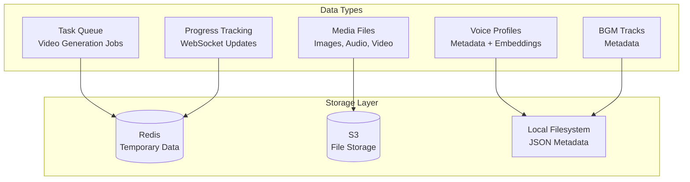
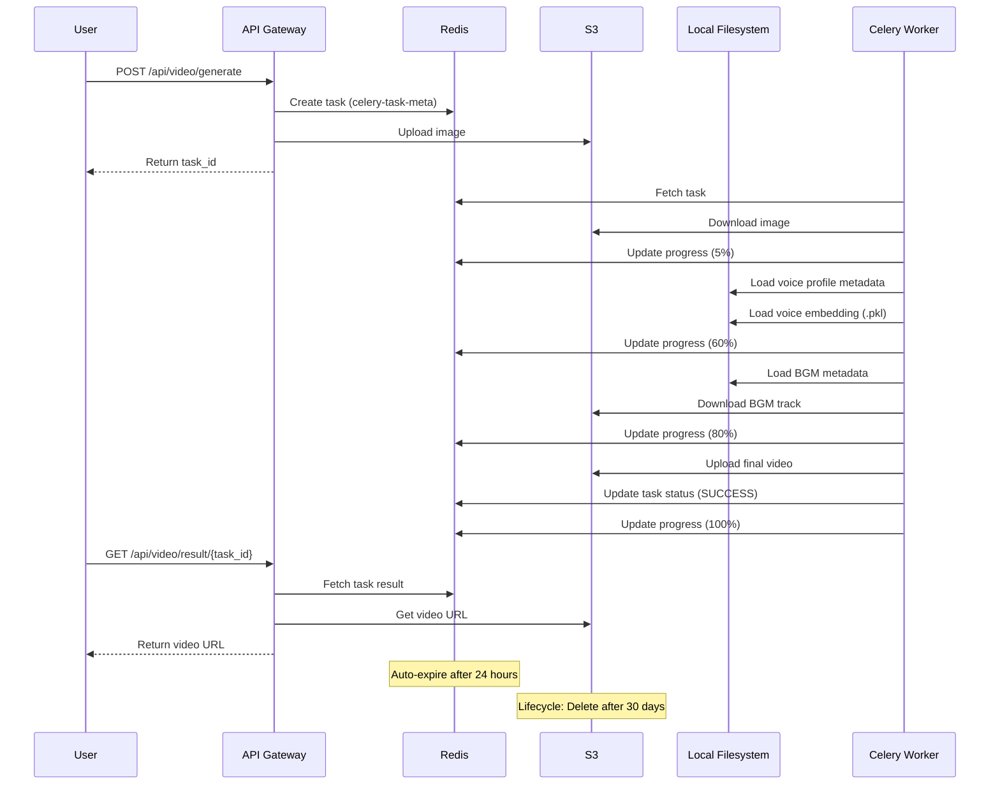

# DATABASE_SCHEMA.md
# Video Message App - Data Storage Strategy

**Version**: 1.0
**Date**: 2025-01-02
**Architecture Decision**: No traditional database required for MVP

---

## Executive Summary

The Video Message App MVP does **not require a traditional relational database** (PostgreSQL/MySQL). Instead, we use a hybrid storage strategy optimized for temporary processing tasks and simple metadata management.

**Rationale**:
1. **No User Accounts**: No need for user authentication or persistent user data
2. **Temporary Workflows**: Video generation is stateless (no caching per Q14-C)
3. **Simple Metadata**: Voice profiles and BGM metadata are simple JSON structures
4. **Cost Optimization**: Avoid database hosting costs (~$15-30/month)
5. **Reduced Complexity**: Fewer moving parts, easier deployment

---

## Data Storage Architecture



---

## Redis (Temporary Data Store)

### Purpose
- Task queue management (Celery)
- Real-time progress tracking
- Session data (WebSocket connections)
- Rate limiting (if implemented)

### Schema

#### 1. Task Queue (Celery)
```redis
# Celery task metadata
celery-task-meta-{task_id}
{
  "status": "PENDING|STARTED|SUCCESS|FAILURE",
  "result": {...},
  "traceback": null,
  "children": [],
  "date_done": "2025-01-02T10:30:00Z"
}
TTL: 24 hours
```

#### 2. Progress Tracking
```redis
# Progress updates for video generation
progress:{task_id}
{
  "task_id": "abc123",
  "percentage": 35,
  "message": "背景を削除中...",
  "current_step": "background_removal",
  "total_steps": 8,
  "timestamp": "2025-01-02T10:30:45Z"
}
TTL: 5 minutes (auto-expire after completion)
```

#### 3. WebSocket Session Management
```redis
# Active WebSocket connections
ws:session:{session_id}
{
  "session_id": "xyz789",
  "task_id": "abc123",
  "connected_at": "2025-01-02T10:30:00Z",
  "last_ping": "2025-01-02T10:32:00Z"
}
TTL: 10 minutes (auto-disconnect inactive sessions)
```

#### 4. Rate Limiting (Optional)
```redis
# Rate limit per IP (if implemented)
ratelimit:{ip_address}
{
  "count": 5,
  "window_start": "2025-01-02T10:00:00Z"
}
TTL: 1 hour
```

### Configuration
```python
# backend/.env.docker
REDIS_URL=redis://redis:6379/0
REDIS_MAX_CONNECTIONS=50
REDIS_SOCKET_TIMEOUT=5
REDIS_SOCKET_CONNECT_TIMEOUT=5

# Celery configuration
CELERY_BROKER_URL=redis://redis:6379/0
CELERY_RESULT_BACKEND=redis://redis:6379/1  # Separate DB for results
CELERY_TASK_SERIALIZER=json
CELERY_RESULT_SERIALIZER=json
CELERY_ACCEPT_CONTENT=['json']
CELERY_TIMEZONE='Asia/Tokyo'
CELERY_TASK_TRACK_STARTED=True
CELERY_TASK_TIME_LIMIT=300  # 5 minutes max per task
```

---

## Local Filesystem (JSON Metadata)

### Purpose
- Voice profile metadata storage
- BGM track metadata storage
- Simple, file-based persistence (no database overhead)
- Easy backup/restore (copy files)

### Schema

#### 1. Voice Profiles Metadata
**File**: `data/backend/storage/voices/voices_metadata.json`

```json
{
  "profiles": [
    {
      "id": "openvoice_9f913e90",
      "name": "Default Female",
      "type": "system",
      "language": "ja",
      "gender": "female",
      "embedding_path": "/app/storage/openvoice/openvoice_9f913e90.pkl",
      "reference_audio_path": "/app/storage/voices/openvoice_9f913e90.wav",
      "preview_url": "/api/voice-clone/profiles/openvoice_9f913e90/preview",
      "created_at": "2025-01-01T12:00:00Z",
      "metadata": {
        "description": "Default Japanese female voice",
        "sample_rate": 24000,
        "duration_seconds": 5.2
      }
    },
    {
      "id": "openvoice_custom_user123",
      "name": "My Custom Voice",
      "type": "custom",
      "language": "ja",
      "gender": "male",
      "embedding_path": "/app/storage/openvoice/openvoice_custom_user123.pkl",
      "reference_audio_path": "/app/storage/voices/openvoice_custom_user123.wav",
      "preview_url": "/api/voice-clone/profiles/openvoice_custom_user123/preview",
      "created_at": "2025-01-02T08:30:00Z",
      "metadata": {
        "description": "User-uploaded reference audio",
        "sample_rate": 24000,
        "duration_seconds": 8.7
      }
    }
  ],
  "last_updated": "2025-01-02T08:30:15Z",
  "version": "1.0"
}
```

**CRUD Operations**:

```python
# backend/services/voice_service/storage.py
import json
import os
from datetime import datetime

class VoiceStorageService:
    METADATA_FILE = "data/backend/storage/voices/voices_metadata.json"

    def __init__(self):
        self._ensure_metadata_file()

    def _ensure_metadata_file(self):
        """Create metadata file if not exists"""
        if not os.path.exists(self.METADATA_FILE):
            os.makedirs(os.path.dirname(self.METADATA_FILE), exist_ok=True)
            self._save_metadata({"profiles": [], "last_updated": datetime.utcnow().isoformat(), "version": "1.0"})

    def _load_metadata(self) -> dict:
        """Load metadata from JSON file"""
        with open(self.METADATA_FILE, 'r', encoding='utf-8') as f:
            return json.load(f)

    def _save_metadata(self, data: dict):
        """Save metadata to JSON file"""
        data['last_updated'] = datetime.utcnow().isoformat()
        with open(self.METADATA_FILE, 'w', encoding='utf-8') as f:
            json.dump(data, f, ensure_ascii=False, indent=2)

    def create_profile(self, profile: dict) -> dict:
        """Create new voice profile"""
        metadata = self._load_metadata()
        profile['created_at'] = datetime.utcnow().isoformat()
        metadata['profiles'].append(profile)
        self._save_metadata(metadata)
        return profile

    def get_profile(self, profile_id: str) -> dict:
        """Get voice profile by ID"""
        metadata = self._load_metadata()
        for profile in metadata['profiles']:
            if profile['id'] == profile_id:
                return profile
        raise ValueError(f"Profile not found: {profile_id}")

    def list_profiles(self, profile_type: str = None) -> list[dict]:
        """List all voice profiles (optionally filter by type)"""
        metadata = self._load_metadata()
        profiles = metadata['profiles']
        if profile_type:
            profiles = [p for p in profiles if p['type'] == profile_type]
        return profiles

    def delete_profile(self, profile_id: str):
        """Delete voice profile"""
        metadata = self._load_metadata()
        profile = self.get_profile(profile_id)

        # Delete files
        if os.path.exists(profile['embedding_path']):
            os.remove(profile['embedding_path'])
        if os.path.exists(profile['reference_audio_path']):
            os.remove(profile['reference_audio_path'])

        # Remove from metadata
        metadata['profiles'] = [p for p in metadata['profiles'] if p['id'] != profile_id]
        self._save_metadata(metadata)
```

---

#### 2. BGM Tracks Metadata
**File**: `data/backend/storage/bgm/bgm_metadata.json`

```json
{
  "tracks": [
    {
      "id": "celebration_upbeat",
      "name": "Celebration Upbeat",
      "type": "system",
      "file_path": "/app/storage/bgm/system/celebration_upbeat.mp3",
      "preview_url": "/api/bgm/tracks/celebration_upbeat/preview",
      "duration_seconds": 180.5,
      "bpm": 120,
      "mood": "cheerful",
      "volume_db": -14,
      "created_at": "2025-01-01T12:00:00Z",
      "metadata": {
        "description": "Fast tempo, joyful celebration music",
        "genre": "pop",
        "seamless_loop": true
      }
    },
    {
      "id": "celebration_gentle",
      "name": "Celebration Gentle",
      "type": "system",
      "file_path": "/app/storage/bgm/system/celebration_gentle.mp3",
      "preview_url": "/api/bgm/tracks/celebration_gentle/preview",
      "duration_seconds": 200.3,
      "bpm": 90,
      "mood": "warm",
      "volume_db": -14,
      "created_at": "2025-01-01T12:00:00Z",
      "metadata": {
        "description": "Soft, warm celebration music",
        "genre": "acoustic",
        "seamless_loop": true
      }
    },
    {
      "id": "user_custom_abc123",
      "name": "My Wedding Song",
      "type": "user",
      "file_path": "/app/storage/bgm/user/user_custom_abc123.mp3",
      "preview_url": "/api/bgm/tracks/user_custom_abc123/preview",
      "duration_seconds": 240.0,
      "bpm": 110,
      "mood": "romantic",
      "volume_db": -14,
      "created_at": "2025-01-02T09:15:00Z",
      "metadata": {
        "description": "User-uploaded custom BGM",
        "original_filename": "wedding_song.mp3",
        "uploaded_by": "user123"
      }
    }
  ],
  "last_updated": "2025-01-02T09:15:30Z",
  "version": "1.0"
}
```

**CRUD Operations**: Similar to Voice Profiles (replace `VoiceStorageService` with `BGMStorageService`)

---

## S3 (File Storage)

### Purpose
- Permanent storage for media files
- Scalable, cost-effective ($0.023/GB/month)
- Direct upload/download via pre-signed URLs
- Lifecycle policies for automatic cleanup

### Bucket Structure
```
s3://video-message-app-storage/
├── images/
│   ├── uploads/
│   │   ├── {task_id}/
│   │   │   ├── original.jpg
│   │   │   ├── person_0_crop.jpg
│   │   │   ├── person_0_bg_removed.png
│   │   │   └── optimized_512x910.png
│   ├── previews/
│   │   └── {task_id}/
│   │       ├── person_0_preview.jpg
│   │       └── person_1_preview.jpg
├── voices/
│   ├── system/
│   │   ├── default_female.wav
│   │   └── default_male.wav
│   ├── custom/
│   │   └── {profile_id}.wav
│   └── generated/
│       └── {task_id}/
│           ├── base_voice.wav
│           ├── prosody_adjusted.wav
│           └── final_mixed.mp3
├── bgm/
│   ├── system/
│   │   ├── celebration_upbeat.mp3
│   │   ├── celebration_gentle.mp3
│   │   ├── celebration_energetic.mp3
│   │   ├── celebration_emotional.mp3
│   │   └── celebration_elegant.mp3
│   └── user/
│       └── {user_id}_{bgm_id}.mp3
└── videos/
    └── {task_id}/
        ├── final_video.mp4
        └── thumbnail.jpg
```

### Lifecycle Policies
```json
{
  "Rules": [
    {
      "Id": "DeleteTempFilesAfter7Days",
      "Status": "Enabled",
      "Prefix": "images/uploads/",
      "Expiration": {
        "Days": 7
      }
    },
    {
      "Id": "DeleteGeneratedVoicesAfter7Days",
      "Status": "Enabled",
      "Prefix": "voices/generated/",
      "Expiration": {
        "Days": 7
      }
    },
    {
      "Id": "DeleteVideosAfter30Days",
      "Status": "Enabled",
      "Prefix": "videos/",
      "Expiration": {
        "Days": 30
      }
    },
    {
      "Id": "TransitionToColdStorageAfter90Days",
      "Status": "Enabled",
      "Prefix": "voices/custom/",
      "Transitions": [
        {
          "Days": 90,
          "StorageClass": "GLACIER"
        }
      ]
    }
  ]
}
```

### Access Patterns

#### Upload with Pre-Signed URL
```python
# backend/services/storage/s3_service.py
import boto3
from botocore.exceptions import ClientError

class S3StorageService:
    def __init__(self, bucket_name: str, region: str = 'ap-northeast-1'):
        self.bucket_name = bucket_name
        self.s3_client = boto3.client('s3', region_name=region)

    def generate_presigned_upload_url(
        self,
        object_key: str,
        expiration: int = 3600,
        content_type: str = 'image/jpeg'
    ) -> dict:
        """
        Generate pre-signed URL for client-side upload

        Args:
            object_key: S3 object key (e.g., "images/uploads/{task_id}/original.jpg")
            expiration: URL expiration in seconds (default 1 hour)
            content_type: MIME type for upload

        Returns:
            dict: {
                "url": "https://...",
                "fields": {...}  # Form fields for POST upload
            }
        """
        try:
            response = self.s3_client.generate_presigned_post(
                Bucket=self.bucket_name,
                Key=object_key,
                Fields={"Content-Type": content_type},
                Conditions=[
                    {"Content-Type": content_type},
                    ["content-length-range", 0, 10485760]  # Max 10MB
                ],
                ExpiresIn=expiration
            )
            return response
        except ClientError as e:
            raise Exception(f"Failed to generate pre-signed URL: {e}")

    def upload_file(self, local_path: str, object_key: str) -> str:
        """
        Upload file directly from server

        Args:
            local_path: Local file path
            object_key: S3 object key

        Returns:
            str: Public URL of uploaded file
        """
        try:
            self.s3_client.upload_file(
                local_path,
                self.bucket_name,
                object_key,
                ExtraArgs={'ACL': 'public-read'}  # Make publicly accessible
            )
            return f"https://{self.bucket_name}.s3.ap-northeast-1.amazonaws.com/{object_key}"
        except ClientError as e:
            raise Exception(f"Failed to upload file: {e}")

    def download_file(self, object_key: str, local_path: str):
        """Download file from S3 to local filesystem"""
        try:
            self.s3_client.download_file(self.bucket_name, object_key, local_path)
        except ClientError as e:
            raise Exception(f"Failed to download file: {e}")

    def delete_file(self, object_key: str):
        """Delete file from S3"""
        try:
            self.s3_client.delete_object(Bucket=self.bucket_name, Key=object_key)
        except ClientError as e:
            raise Exception(f"Failed to delete file: {e}")

    def list_files(self, prefix: str = '', max_keys: int = 1000) -> list[str]:
        """List files in S3 bucket with optional prefix filter"""
        try:
            response = self.s3_client.list_objects_v2(
                Bucket=self.bucket_name,
                Prefix=prefix,
                MaxKeys=max_keys
            )
            return [obj['Key'] for obj in response.get('Contents', [])]
        except ClientError as e:
            raise Exception(f"Failed to list files: {e}")
```

---

## Data Flow Example: Video Generation



---

## No Database Trade-offs

### Advantages ✅
1. **Cost Savings**: ~$15-30/month (RDS/managed database)
2. **Reduced Complexity**: Fewer services to manage
3. **Faster Deployment**: No schema migrations
4. **Easier Backup**: Just copy JSON files
5. **No Scaling Issues**: Redis + S3 scale effortlessly

### Disadvantages ❌
1. **No Complex Queries**: Can't join or aggregate data easily
2. **No Transactions**: No ACID guarantees across metadata updates
3. **Limited Concurrency**: File-based locking for JSON writes
4. **No Built-in Validation**: Must validate in application code

### When to Add a Database

Consider adding PostgreSQL/MySQL if:
- [ ] User accounts and authentication required
- [ ] Video generation history tracking needed
- [ ] Analytics and reporting features added
- [ ] Multi-tenant architecture implemented
- [ ] Complex querying required (e.g., search by date, filters)
- [ ] >10,000 voice profiles or BGM tracks

**Migration Path**:
```sql
-- Example: Future database schema
CREATE TABLE voice_profiles (
    id UUID PRIMARY KEY DEFAULT gen_random_uuid(),
    name VARCHAR(255) NOT NULL,
    type VARCHAR(50) NOT NULL CHECK (type IN ('system', 'custom')),
    language VARCHAR(10) NOT NULL,
    gender VARCHAR(20),
    embedding_path TEXT NOT NULL,
    reference_audio_path TEXT NOT NULL,
    preview_url TEXT,
    created_at TIMESTAMP DEFAULT CURRENT_TIMESTAMP,
    updated_at TIMESTAMP DEFAULT CURRENT_TIMESTAMP,
    metadata JSONB
);

CREATE INDEX idx_voice_profiles_type ON voice_profiles(type);
CREATE INDEX idx_voice_profiles_language ON voice_profiles(language);
```

---

## Backup and Disaster Recovery

### Redis Backup
```bash
# Redis persistence configuration
# /etc/redis/redis.conf
save 900 1      # Save after 900 seconds (15 min) if at least 1 key changed
save 300 10     # Save after 300 seconds (5 min) if at least 10 keys changed
save 60 10000   # Save after 60 seconds if at least 10000 keys changed

# Enable RDB snapshots
dbfilename dump.rdb
dir /var/lib/redis

# Enable AOF (Append-Only File) for durability
appendonly yes
appendfilename "appendonly.aof"
```

### JSON Metadata Backup
```bash
# Daily backup script
#!/bin/bash
# /usr/local/bin/backup_metadata.sh

DATE=$(date +%Y%m%d)
BACKUP_DIR="/backups/metadata"

# Create backup directory
mkdir -p $BACKUP_DIR

# Backup voice profiles metadata
cp /app/data/backend/storage/voices/voices_metadata.json \
   $BACKUP_DIR/voices_metadata_$DATE.json

# Backup BGM metadata
cp /app/data/backend/storage/bgm/bgm_metadata.json \
   $BACKUP_DIR/bgm_metadata_$DATE.json

# Upload to S3
aws s3 cp $BACKUP_DIR s3://video-message-app-backups/metadata/$DATE/ --recursive

# Delete local backups older than 7 days
find $BACKUP_DIR -type f -mtime +7 -delete

echo "Metadata backup completed: $DATE"
```

### S3 Versioning
```bash
# Enable versioning on S3 bucket
aws s3api put-bucket-versioning \
  --bucket video-message-app-storage \
  --versioning-configuration Status=Enabled

# Configure lifecycle for old versions
aws s3api put-bucket-lifecycle-configuration \
  --bucket video-message-app-storage \
  --lifecycle-configuration file://lifecycle.json
```

---

## Monitoring and Observability

### Redis Metrics
```bash
# Monitor Redis health
redis-cli INFO memory
redis-cli INFO stats
redis-cli INFO persistence

# Key metrics to watch:
# - used_memory_human: Current memory usage
# - instantaneous_ops_per_sec: Operations per second
# - keyspace_hits / keyspace_misses: Cache hit ratio
# - rdb_last_save_time: Last successful save
```

### S3 Metrics (CloudWatch)
- **BucketSizeBytes**: Total bucket size
- **NumberOfObjects**: Total object count
- **AllRequests**: Total requests per period
- **GetRequests**: Download requests
- **PutRequests**: Upload requests
- **4xxErrors / 5xxErrors**: Error rates

### JSON Metadata Health
```python
# backend/services/monitoring/health_check.py
def check_metadata_health() -> dict:
    """Check JSON metadata file health"""
    checks = {}

    # Voice profiles metadata
    try:
        with open('data/backend/storage/voices/voices_metadata.json', 'r') as f:
            data = json.load(f)
            checks['voice_profiles'] = {
                "status": "healthy",
                "profile_count": len(data['profiles']),
                "last_updated": data['last_updated']
            }
    except Exception as e:
        checks['voice_profiles'] = {"status": "unhealthy", "error": str(e)}

    # BGM metadata
    try:
        with open('data/backend/storage/bgm/bgm_metadata.json', 'r') as f:
            data = json.load(f)
            checks['bgm_tracks'] = {
                "status": "healthy",
                "track_count": len(data['tracks']),
                "last_updated": data['last_updated']
            }
    except Exception as e:
        checks['bgm_tracks'] = {"status": "unhealthy", "error": str(e)}

    return checks
```

---

## Conclusion

The Video Message App MVP uses a **database-free architecture** that is:
- **Cost-effective**: Saves ~$15-30/month
- **Simple**: Fewer moving parts to manage
- **Scalable**: Redis + S3 handle growth effortlessly
- **Sufficient**: Meets all MVP requirements without a database

This architecture is optimal for the current scope. If the application grows to require complex queries, user accounts, or analytics, a traditional database can be added in a future iteration with minimal refactoring.

---

**Key Takeaways**:
1. ✅ Redis for temporary task tracking and progress
2. ✅ JSON files for simple metadata (voice profiles, BGM tracks)
3. ✅ S3 for scalable file storage
4. ✅ No database required for MVP
5. ✅ Clear migration path to PostgreSQL if needed

---

*"Simplicity is the ultimate sophistication. Choose the right tool for the job, not the fanciest one."*

*シンプルさは究極の洗練である。最も派手なツールではなく、仕事に適したツールを選ぶ。*

**Document Version**: 1.0
**Last Updated**: 2025-01-02
**Author**: Muses (Knowledge Architect)
**Reviewed By**: Artemis (Technical Perfectionist), Hera (Strategic Commander)
