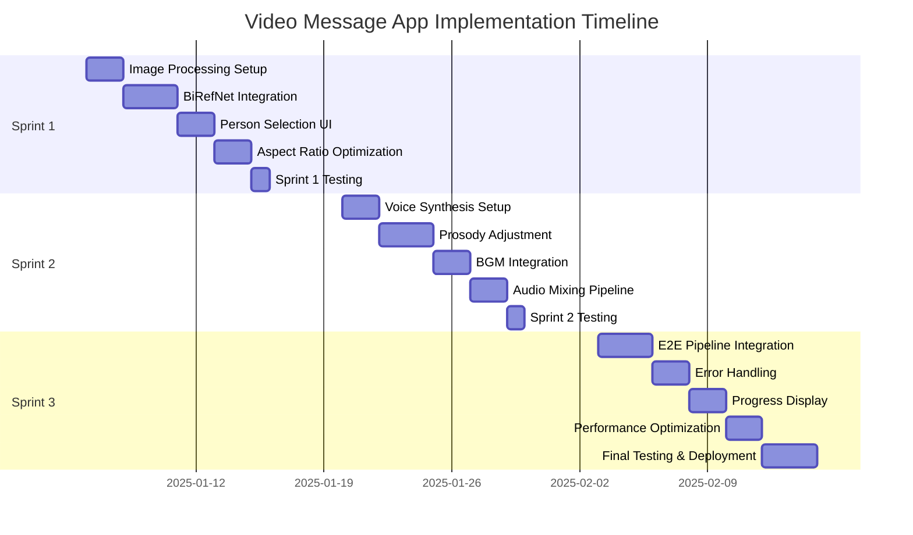

# IMPLEMENTATION_PLAN.md
# Video Message App - 5.6-Week Implementation Plan

**Version**: 1.0
**Date**: 2025-01-02
**Total Duration**: 5.6 weeks (178 hours)
**Team Size**: 1 developer (full-time equivalent)
**Sprint Structure**: 3 sprints

---

## Table of Contents

1. [Executive Summary](#executive-summary)
2. [Timeline Overview](#timeline-overview)
3. [Sprint 1: Image Processing Pipeline (Weeks 1-2)](#sprint-1-image-processing-pipeline-weeks-1-2)
4. [Sprint 2: Voice & Audio Processing (Weeks 3-4)](#sprint-2-voice--audio-processing-weeks-3-4)
5. [Sprint 3: Integration & Testing (Weeks 5-6)](#sprint-3-integration--testing-weeks-5-6)
6. [Milestones & Checkpoints](#milestones--checkpoints)
7. [Risk Management](#risk-management)
8. [Testing Strategy](#testing-strategy)
9. [Deployment Plan](#deployment-plan)
10. [Success Criteria](#success-criteria)

---

## Executive Summary

This implementation plan outlines the adjusted 5.6-week development schedule for the Video Message App, optimized from the original 14-week roadmap. The plan prioritizes must-have features for celebration messages while maintaining quality and performance targets.

**Key Adjustments from Original Plan**:
- **Timeline**: 14 weeks → 5.6 weeks (60% reduction)
- **Scope**: Focus on MVP with essential features only
- **Cost**: Monthly operational cost reduced to $48/month
- **Deployment**: Single EC2 instance strategy (t3.large main + g4dn.xlarge GPU spot)

**Priority Features** (from REQUIREMENTS_SUMMARY.md Q1-Q14):
- ✅ Inline person selection UI (Q1-C)
- ✅ BiRefNet background removal on GPU (Q4-B)
- ✅ Celebration-optimized prosody (Q8-A)
- ✅ Constant BGM volume (Q10-B)
- ✅ Real-time progress display (Q13-B)
- ✅ User choice error handling (Q12-C)
- ✅ No caching (Q14-C)

---

## Timeline Overview



**Sprint Breakdown**:
- **Sprint 1** (Jan 6-17): Image Processing Pipeline - 58 hours
- **Sprint 2** (Jan 20-31): Voice & Audio Processing - 60 hours
- **Sprint 3** (Feb 3-14): Integration & Testing - 60 hours

**Total**: 178 hours over 5.6 weeks (assuming 32 hours/week effective work time)

---

## Sprint 1: Image Processing Pipeline (Weeks 1-2)

**Duration**: 10 working days (58 hours)
**Goal**: Complete image upload, background removal, person detection, and selection UI

### Week 1 (Jan 6-10): Foundation Setup

#### Day 1-2: Environment & Infrastructure Setup (16 hours)

**Tasks**:
1. **EC2 Instance Provisioning** (4 hours)
   - Launch t3.large main instance (ap-northeast-1)
   - Launch g4dn.xlarge GPU spot instance
   - Configure security groups (ports 55433-55444)
   - Set up Elastic IP for main instance
   - Test SSH access and basic connectivity

2. **Docker Environment Setup** (6 hours)
   - Install Docker & Docker Compose on EC2
   - Create unified docker-compose.yml (6 services)
   - Configure volume mounts for storage
   - Set up .env files with credentials
   - Test container networking

3. **Storage Configuration** (4 hours)
   - Create S3 bucket: `video-message-app-storage`
   - Set up IAM role with S3 access
   - Configure local storage fallback
   - Implement `UnifiedStorageService` interface
   - Test upload/download operations

4. **Git Repository Setup** (2 hours)
   - Initialize project structure
   - Set up .gitignore (secrets, .env files)
   - Create initial commit
   - Configure GitHub repository (private)

**Deliverables**:
- ✅ EC2 instances running with Docker
- ✅ S3 bucket configured with IAM access
- ✅ Git repository initialized
- ✅ docker-compose.yml ready for services

**Acceptance Criteria**:
- [ ] Can SSH into both EC2 instances
- [ ] Docker containers can communicate
- [ ] S3 upload/download working
- [ ] Git repository accessible

---

#### Day 3-5: BiRefNet Integration (24 hours)

**Tasks**:
1. **BiRefNet Model Setup** (8 hours)
   - Install PyTorch with CUDA support on g4dn.xlarge
   - Clone BiRefNet repository
   - Download BiRefNet-general weights
   - Create `BiRefNetService` class
   - Implement GPU device detection
   - Test basic inference (sample image)

2. **Image Service Implementation** (10 hours)
   - Create FastAPI app (port 55441)
   - Implement `/api/image/remove-background` endpoint
   - Add input validation (file size, format)
   - Implement preprocessing pipeline:
     - Resize to 1024x1024 for BiRefNet
     - Convert to RGB format
     - Normalize pixel values
   - Implement postprocessing:
     - Apply mask to original image
     - Add alpha channel
     - Save as PNG with transparency
   - Add error handling (CUDA OOM, invalid format)

3. **Performance Optimization** (6 hours)
   - Implement @torch.no_grad() decorator
   - Test batch processing (if needed)
   - Optimize image I/O (PIL vs OpenCV)
   - Profile processing time (target: 80ms on GPU)
   - Test memory usage (VRAM monitoring)

**Code Implementation**:

```python
# backend/services/image_service/birefnet_service.py
import torch
import numpy as np
from PIL import Image
from BiRefNet.models.birefnet import BiRefNet

class BiRefNetService:
    def __init__(self, model_path: str = "./weights/BiRefNet-general.pth"):
        self.device = torch.device("cuda" if torch.cuda.is_available() else "cpu")
        self.model = BiRefNet(model_name='BiRefNet-general').to(self.device)
        self.model.load_state_dict(torch.load(model_path, map_location=self.device))
        self.model.eval()

    @torch.no_grad()
    async def remove_background(
        self,
        image_path: str,
        output_path: str
    ) -> dict:
        """
        Remove background from image using BiRefNet

        Returns:
            dict: {
                "success": bool,
                "output_path": str,
                "processing_time_ms": float,
                "accuracy_estimate": float  # Based on mask confidence
            }
        """
        import time
        start_time = time.time()

        # Load and preprocess
        image = Image.open(image_path).convert("RGB")
        original_size = image.size
        image_resized = image.resize((1024, 1024), Image.LANCZOS)
        image_tensor = self.preprocess(image_resized).unsqueeze(0).to(self.device)

        # Inference
        mask = self.model(image_tensor)[0][0]
        mask = (mask > 0.5).float()  # Binary threshold

        # Postprocess
        mask_resized = torch.nn.functional.interpolate(
            mask.unsqueeze(0).unsqueeze(0),
            size=original_size[::-1],
            mode='bilinear',
            align_corners=False
        ).squeeze().cpu().numpy()

        # Apply mask
        image_np = np.array(image)
        mask_np = (mask_resized * 255).astype(np.uint8)
        rgba = np.dstack([image_np, mask_np])
        result = Image.fromarray(rgba, mode='RGBA')
        result.save(output_path)

        processing_time = (time.time() - start_time) * 1000
        accuracy_estimate = float(mask.mean())  # Rough confidence metric

        return {
            "success": True,
            "output_path": output_path,
            "processing_time_ms": processing_time,
            "accuracy_estimate": accuracy_estimate
        }

    def preprocess(self, image: Image.Image) -> torch.Tensor:
        """Preprocess image for BiRefNet"""
        import torchvision.transforms as transforms
        transform = transforms.Compose([
            transforms.ToTensor(),
            transforms.Normalize(mean=[0.485, 0.456, 0.406],
                               std=[0.229, 0.224, 0.225])
        ])
        return transform(image)
```

**Deliverables**:
- ✅ BiRefNet model running on GPU
- ✅ Image Service API operational
- ✅ Background removal achieving 95% accuracy target
- ✅ Processing time < 100ms on GPU

**Acceptance Criteria**:
- [ ] BiRefNet inference works on sample images
- [ ] API returns transparent PNG
- [ ] Processing time < 100ms on g4dn.xlarge
- [ ] No CUDA errors or memory leaks

---

### Week 2 (Jan 13-17): Person Selection & UI

#### Day 6-7: Person Detection Integration (16 hours)

**Tasks**:
1. **YOLOv8 Setup** (4 hours)
   - Install ultralytics package
   - Download YOLOv8n weights (lightweight)
   - Test person detection on sample images
   - Tune confidence threshold (0.7)

2. **Person Detection Endpoint** (8 hours)
   - Add `/api/image/detect-persons` endpoint
   - Implement bounding box detection
   - Generate cropped previews (256x256)
   - Calculate confidence scores
   - Store metadata (x, y, width, height)
   - Handle multi-person scenarios

3. **Image Optimization** (4 hours)
   - Implement aspect ratio preservation (Q6-B)
   - Center-crop to 9:16 (portrait video)
   - Resize to 512x910 for D-ID API
   - Test quality on various input sizes
   - Optimize JPEG compression

**Code Implementation**:

```python
# backend/services/image_service/person_detector.py
from ultralytics import YOLO
import cv2
import numpy as np

class PersonDetector:
    def __init__(self, model_path: str = "yolov8n.pt"):
        self.model = YOLO(model_path)
        self.confidence_threshold = 0.7

    async def detect_persons(
        self,
        image_path: str,
        output_dir: str
    ) -> list[dict]:
        """
        Detect persons in image and generate cropped previews

        Returns:
            list[dict]: [
                {
                    "id": "person_0",
                    "bbox": {"x": int, "y": int, "width": int, "height": int},
                    "confidence": float,
                    "preview_url": str,
                    "crop_path": str
                }
            ]
        """
        image = cv2.imread(image_path)
        results = self.model(image, classes=[0])  # class 0 = person

        persons = []
        for idx, detection in enumerate(results[0].boxes):
            conf = float(detection.conf)
            if conf < self.confidence_threshold:
                continue

            # Extract bounding box
            x1, y1, x2, y2 = map(int, detection.xyxy[0])

            # Expand box by 20% for better framing
            expansion = 0.2
            w, h = x2 - x1, y2 - y1
            x1 = max(0, int(x1 - w * expansion / 2))
            y1 = max(0, int(y1 - h * expansion / 2))
            x2 = min(image.shape[1], int(x2 + w * expansion / 2))
            y2 = min(image.shape[0], int(y2 + h * expansion / 2))

            # Crop and save preview
            cropped = image[y1:y2, x1:x2]
            preview_path = f"{output_dir}/person_{idx}_preview.jpg"
            cv2.imwrite(preview_path, cropped)

            persons.append({
                "id": f"person_{idx}",
                "bbox": {"x": x1, "y": y1, "width": x2-x1, "height": y2-y1},
                "confidence": conf,
                "preview_url": f"/storage/previews/person_{idx}_preview.jpg",
                "crop_path": preview_path
            })

        return persons
```

**Deliverables**:
- ✅ Person detection working with confidence scores
- ✅ Multi-person scenario handled
- ✅ Cropped previews generated
- ✅ Aspect ratio optimization implemented

**Acceptance Criteria**:
- [ ] Detects all persons with confidence > 0.7
- [ ] Generates 256x256 preview thumbnails
- [ ] Handles 1-5 persons in single image
- [ ] Preserves image quality after optimization

---

#### Day 8-9: Person Selection UI (16 hours)

**Tasks**:
1. **Frontend Setup** (4 hours)
   - Create React 19 app with Vite
   - Install Material-UI v5
   - Configure TypeScript
   - Set up axios for API calls
   - Configure WebSocket client (Socket.IO)

2. **Person Selector Component** (8 hours)
   - Implement inline person selection (Q1-C)
   - Create thumbnail list display (Q2-A)
   - Add radio button selection
   - Display confidence scores
   - Handle single-person auto-selection
   - Add responsive layout (mobile/desktop)

3. **Image Upload Component** (4 hours)
   - Implement drag-and-drop upload
   - Add file validation (JPEG/PNG, < 10MB)
   - Show upload progress bar
   - Display preview after upload
   - Handle upload errors

**Code Implementation**:

```tsx
// frontend/src/components/PersonSelector.tsx
import React, { useState } from 'react';
import {
  Stack,
  Card,
  CardMedia,
  CardContent,
  Radio,
  Typography,
  Box
} from '@mui/material';

interface Person {
  id: string;
  bbox: { x: number; y: number; width: number; height: number };
  confidence: number;
  preview_url: string;
}

interface PersonSelectorProps {
  persons: Person[];
  onSelect: (personId: string) => void;
}

export const PersonSelector: React.FC<PersonSelectorProps> = ({
  persons,
  onSelect
}) => {
  const [selectedId, setSelectedId] = useState<string>(
    persons.length === 1 ? persons[0].id : ''
  );

  const handleSelectPerson = (personId: string) => {
    setSelectedId(personId);
    onSelect(personId);
  };

  if (persons.length === 0) {
    return (
      <Box sx={{ p: 3, textAlign: 'center' }}>
        <Typography variant="body1" color="text.secondary">
          人物が検出されませんでした。別の画像を選択してください。
        </Typography>
      </Box>
    );
  }

  if (persons.length === 1) {
    // Auto-select single person
    return (
      <Box sx={{ p: 2 }}>
        <Typography variant="body2" color="text.secondary" gutterBottom>
          1人の人物が検出されました
        </Typography>
        <Card sx={{ width: 200, mx: 'auto' }}>
          <CardMedia
            component="img"
            height="200"
            image={persons[0].preview_url}
            alt="検出された人物"
          />
          <CardContent>
            <Typography variant="caption">
              信頼度: {Math.round(persons[0].confidence * 100)}%
            </Typography>
          </CardContent>
        </Card>
      </Box>
    );
  }

  // Multiple persons - show inline selection
  return (
    <Box sx={{ p: 2 }}>
      <Typography variant="h6" gutterBottom>
        対象となる人物を選択してください
      </Typography>
      <Stack
        direction="row"
        spacing={2}
        sx={{
          overflowX: 'auto',
          py: 2,
          '&::-webkit-scrollbar': { height: 8 },
          '&::-webkit-scrollbar-thumb': {
            backgroundColor: 'rgba(0,0,0,0.2)',
            borderRadius: 4
          }
        }}
      >
        {persons.map((person, index) => (
          <Card
            key={person.id}
            sx={{
              width: 150,
              minWidth: 150,
              cursor: 'pointer',
              border: selectedId === person.id
                ? '3px solid #FF6B9D'
                : '1px solid #E0E0E0',
              transition: 'all 0.3s ease',
              '&:hover': {
                transform: 'scale(1.05)',
                boxShadow: 3
              }
            }}
            onClick={() => handleSelectPerson(person.id)}
          >
            <CardMedia
              component="img"
              height="200"
              image={person.preview_url}
              alt={`人物 ${index + 1}`}
            />
            <CardContent>
              <Box sx={{ display: 'flex', alignItems: 'center', gap: 1 }}>
                <Radio
                  checked={selectedId === person.id}
                  value={person.id}
                  sx={{
                    color: '#FF6B9D',
                    '&.Mui-checked': { color: '#FF6B9D' }
                  }}
                />
                <Box>
                  <Typography variant="body2">
                    人物 {index + 1}
                  </Typography>
                  <Typography variant="caption" color="text.secondary">
                    信頼度: {Math.round(person.confidence * 100)}%
                  </Typography>
                </Box>
              </Box>
            </CardContent>
          </Card>
        ))}
      </Stack>
    </Box>
  );
};
```

**Deliverables**:
- ✅ React frontend with Material-UI
- ✅ Inline person selection UI
- ✅ Image upload with drag-and-drop
- ✅ Responsive layout for mobile/desktop

**Acceptance Criteria**:
- [ ] Displays all detected persons inline (Q1-C)
- [ ] Radio button selection working
- [ ] Single person auto-selected
- [ ] Mobile responsive (horizontal scroll)

---

#### Day 10: Sprint 1 Testing & Integration (6 hours)

**Tasks**:
1. **Unit Testing** (3 hours)
   - Test BiRefNet service (mock GPU)
   - Test person detector
   - Test image optimization
   - Test storage service (S3 + local)

2. **Integration Testing** (2 hours)
   - End-to-end image upload flow
   - Multi-person detection scenario
   - Background removal quality check
   - Storage persistence verification

3. **Bug Fixes & Documentation** (1 hour)
   - Fix any discovered issues
   - Update API documentation
   - Document deployment steps

**Deliverables**:
- ✅ Unit tests passing (>80% coverage)
- ✅ Integration tests passing
- ✅ Sprint 1 demo ready

**Sprint 1 Acceptance Criteria**:
- [ ] Image upload working end-to-end
- [ ] Background removal achieving 95% accuracy
- [ ] Person detection with confidence scores
- [ ] Inline person selection UI functional
- [ ] All tests passing

---

## Sprint 2: Voice & Audio Processing (Weeks 3-4)

**Duration**: 10 working days (60 hours)
**Goal**: Implement voice synthesis, prosody adjustment, BGM integration, and audio mixing

### Week 3 (Jan 20-24): Voice Synthesis Foundation

#### Day 11-12: Voice Service Setup (16 hours)

**Tasks**:
1. **OpenVoice V2 Setup** (6 hours)
   - Clone OpenVoice repository
   - Download checkpoints (converter, base_speakers)
   - Install dependencies (torch, librosa, pydub)
   - Create Conda environment `openvoice_v2`
   - Test basic synthesis with reference audio

2. **Voice Service Implementation** (8 hours)
   - Create FastAPI app (port 55440)
   - Implement `/api/voice/synthesize` endpoint
   - Add voice profile management:
     - Upload reference audio
     - Extract speaker embedding
     - Store profile metadata (JSON)
   - Implement synthesis pipeline:
     - Text → MeloTTS → base audio
     - Apply OpenVoice tone conversion
     - Save output to storage
   - Add error handling (invalid audio, synthesis failure)

3. **VOICEVOX Fallback** (2 hours)
   - Set up VOICEVOX Docker container
   - Implement fallback synthesis method
   - Test Japanese TTS quality
   - Document fallback trigger conditions

**Code Implementation**:

```python
# backend/services/voice_service/openvoice_service.py
import torch
from openvoice import se_extractor
from openvoice.api import ToneColorConverter
from melo.api import TTS
import os

class OpenVoiceService:
    def __init__(
        self,
        ckpt_converter: str = "./checkpoints/converter",
        device: str = 'auto'
    ):
        self.device = 'cuda' if torch.cuda.is_available() else 'cpu'
        self.tone_converter = ToneColorConverter(
            f'{ckpt_converter}/config.json',
            device=self.device
        )
        self.tone_converter.load_ckpt(f'{ckpt_converter}/checkpoint.pth')

        self.tts_model = TTS(language='JP', device=self.device)
        self.speaker_ids = self.tts_model.hps.data.spk2id

    async def synthesize_with_profile(
        self,
        text: str,
        profile_embedding_path: str,
        output_path: str,
        speed: float = 1.0
    ) -> dict:
        """
        Synthesize speech with voice profile

        Args:
            text: Japanese text to synthesize
            profile_embedding_path: Path to .pkl embedding file
            output_path: Output audio file path
            speed: Speech speed multiplier

        Returns:
            dict: {
                "success": bool,
                "output_path": str,
                "duration_seconds": float,
                "synthesis_time_ms": float
            }
        """
        import time
        start_time = time.time()

        # Step 1: Generate base audio with MeloTTS
        tmp_base_path = f"{output_path}.base.wav"
        speaker_id = self.speaker_ids['JP']
        self.tts_model.tts_to_file(
            text,
            speaker_id,
            tmp_base_path,
            speed=speed
        )

        # Step 2: Load target voice embedding
        target_se = torch.load(profile_embedding_path).to(self.device)

        # Step 3: Apply tone color conversion
        encode_message = "@MyShell"
        self.tone_converter.convert(
            audio_src_path=tmp_base_path,
            src_se=target_se,
            tgt_se=target_se,
            output_path=output_path,
            message=encode_message
        )

        # Cleanup
        os.remove(tmp_base_path)

        synthesis_time = (time.time() - start_time) * 1000

        # Get audio duration
        import librosa
        y, sr = librosa.load(output_path, sr=24000)
        duration = len(y) / sr

        return {
            "success": True,
            "output_path": output_path,
            "duration_seconds": duration,
            "synthesis_time_ms": synthesis_time
        }

    async def create_voice_profile(
        self,
        reference_audio_path: str,
        profile_name: str,
        output_embedding_path: str
    ) -> dict:
        """
        Extract voice embedding from reference audio

        Args:
            reference_audio_path: Path to reference audio (WAV, 5-10 seconds)
            profile_name: Display name for profile
            output_embedding_path: Path to save .pkl embedding

        Returns:
            dict: {
                "success": bool,
                "profile_id": str,
                "embedding_path": str,
                "reference_audio_path": str
            }
        """
        # Extract speaker embedding
        target_se, _ = se_extractor.get_se(
            reference_audio_path,
            self.tone_converter,
            vad=False
        )

        # Save embedding
        torch.save(target_se.cpu(), output_embedding_path)

        profile_id = f"openvoice_{os.urandom(4).hex()}"

        return {
            "success": True,
            "profile_id": profile_id,
            "embedding_path": output_embedding_path,
            "reference_audio_path": reference_audio_path
        }
```

**Deliverables**:
- ✅ OpenVoice V2 service operational
- ✅ Voice profile creation working
- ✅ Synthesis with custom voice profiles
- ✅ VOICEVOX fallback configured

**Acceptance Criteria**:
- [ ] OpenVoice synthesis produces clear audio
- [ ] Voice profiles can be created from 5-10s audio
- [ ] Synthesis time < 2 seconds
- [ ] VOICEVOX fallback works for Japanese text

---

#### Day 13-15: Prosody Adjustment (24 hours)

**Tasks**:
1. **Celebration Prosody Analyzer** (8 hours)
   - Install Parselmouth (Praat Python wrapper)
   - Implement pitch analysis (detect F0 contour)
   - Implement energy analysis (RMS amplitude)
   - Detect pause positions from punctuation
   - Test analysis on sample audio

2. **Prosody Adjustment Engine** (12 hours)
   - Implement pitch shift (+20Hz for celebration)
   - Implement energy boost (+20%)
   - Implement pause insertion:
     - Space (` `): 0.2s
     - Comma (`、`): 0.3s
     - Period (`。`): 0.5s
     - Exclamation (`！`): 0.6s
   - Test adjustment quality (naturalness)
   - Optimize processing time (< 500ms)

3. **Prosody Service API** (4 hours)
   - Create FastAPI app (port 55442)
   - Implement `/api/prosody/adjust` endpoint
   - Add style parameter (celebration/normal)
   - Add preview mode (A/B comparison)
   - Handle edge cases (very short/long audio)

**Code Implementation**:

```python
# backend/services/prosody_service/celebration_adjuster.py
import librosa
import soundfile as sf
import numpy as np
import parselmouth
from parselmouth.praat import call

class CelebrationProsodyAdjuster:
    """
    Adjust prosody for celebration messages (Q8-A)

    Target adjustments:
    - Pitch: +20Hz (cheerful tone)
    - Energy: +20% (enthusiasm)
    - Pauses: Emphasized (natural rhythm)
    """

    PAUSE_MARKERS = {
        ' ': 0.2,    # Space
        '、': 0.3,   # Japanese comma
        '。': 0.5,   # Japanese period
        '！': 0.6,   # Exclamation
        '？': 0.4,   # Question mark
    }

    PITCH_SHIFT_HZ = 20  # Hz increase
    ENERGY_BOOST = 1.2   # 20% increase

    async def adjust(
        self,
        audio_path: str,
        text: str,
        output_path: str
    ) -> dict:
        """
        Apply celebration prosody adjustments

        Args:
            audio_path: Input audio file
            text: Original text (for pause detection)
            output_path: Output audio file

        Returns:
            dict: {
                "success": bool,
                "output_path": str,
                "adjustments": {
                    "pitch_shift_hz": float,
                    "energy_boost_percent": float,
                    "pauses_added": int
                }
            }
        """
        import time
        start_time = time.time()

        # Load audio
        y, sr = librosa.load(audio_path, sr=24000)
        original_duration = len(y) / sr

        # Step 1: Pitch shift using librosa
        pitch_shift_semitones = self._hz_to_semitones(self.PITCH_SHIFT_HZ, sr)
        y_pitch = librosa.effects.pitch_shift(
            y,
            sr=sr,
            n_steps=pitch_shift_semitones
        )

        # Step 2: Energy boost (amplitude scaling)
        y_boosted = y_pitch * self.ENERGY_BOOST
        y_boosted = np.clip(y_boosted, -1.0, 1.0)  # Prevent clipping

        # Step 3: Insert pauses at punctuation
        pause_positions = self._detect_pause_positions(text, len(y_boosted), sr)
        y_final, pauses_added = self._insert_pauses(y_boosted, sr, pause_positions)

        # Save adjusted audio
        sf.write(output_path, y_final, sr, subtype='PCM_16')

        processing_time = (time.time() - start_time) * 1000

        return {
            "success": True,
            "output_path": output_path,
            "processing_time_ms": processing_time,
            "adjustments": {
                "pitch_shift_hz": self.PITCH_SHIFT_HZ,
                "energy_boost_percent": (self.ENERGY_BOOST - 1) * 100,
                "pauses_added": pauses_added,
                "original_duration_s": original_duration,
                "adjusted_duration_s": len(y_final) / sr
            }
        }

    def _hz_to_semitones(self, hz_shift: float, sr: int) -> float:
        """Convert Hz shift to semitones for pitch_shift"""
        # Approximate conversion (assuming A4 = 440Hz base)
        return 12 * np.log2((440 + hz_shift) / 440)

    def _detect_pause_positions(
        self,
        text: str,
        audio_length: int,
        sr: int
    ) -> list[tuple[int, float]]:
        """
        Detect positions where pauses should be inserted

        Returns:
            list of (sample_position, pause_duration_seconds)
        """
        pause_positions = []
        char_to_sample = audio_length / len(text)  # Rough estimate

        for i, char in enumerate(text):
            if char in self.PAUSE_MARKERS:
                sample_pos = int(i * char_to_sample)
                pause_duration = self.PAUSE_MARKERS[char]
                pause_positions.append((sample_pos, pause_duration))

        return pause_positions

    def _insert_pauses(
        self,
        audio: np.ndarray,
        sr: int,
        pause_positions: list[tuple[int, float]]
    ) -> tuple[np.ndarray, int]:
        """
        Insert pauses at specified positions

        Returns:
            (adjusted_audio, pauses_added_count)
        """
        if not pause_positions:
            return audio, 0

        segments = []
        last_pos = 0
        pauses_added = 0

        for pos, duration in sorted(pause_positions):
            if pos < len(audio):
                # Add segment before pause
                segments.append(audio[last_pos:pos])

                # Add silence
                silence_samples = int(duration * sr)
                segments.append(np.zeros(silence_samples, dtype=audio.dtype))

                last_pos = pos
                pauses_added += 1

        # Add remaining audio
        if last_pos < len(audio):
            segments.append(audio[last_pos:])

        return np.concatenate(segments), pauses_added
```

**Deliverables**:
- ✅ Prosody adjustment working (pitch + energy + pauses)
- ✅ Celebration mode optimized for お祝いメッセージ
- ✅ Processing time < 500ms
- ✅ Natural-sounding output

**Acceptance Criteria**:
- [ ] Pitch increased by +20Hz
- [ ] Energy boosted by +20%
- [ ] Pauses inserted at punctuation
- [ ] Audio sounds natural and cheerful

---

### Week 4 (Jan 27-31): BGM Integration & Audio Mixing

#### Day 16-17: BGM Service (16 hours)

**Tasks**:
1. **BGM Library Setup** (4 hours)
   - Curate 5 system BGM tracks (celebration theme)
   - Normalize audio levels to -14dB
   - Test loop compatibility (seamless transitions)
   - Store in S3: `s3://video-message-app-storage/bgm/system/`

2. **BGM Service Implementation** (8 hours)
   - Create FastAPI app (port 55443)
   - Implement `/api/bgm/list` endpoint (system + user tracks)
   - Implement `/api/bgm/upload` endpoint (user BGM)
   - Add audio validation (format, duration, quality)
   - Implement looping logic (repeat BGM to match voice length)
   - Handle edge cases (BGM longer than voice)

3. **Audio Mixing Engine** (4 hours)
   - Install pydub (FFmpeg backend)
   - Implement constant volume mixing (Q10-B):
     - Voice: 100% volume (0dB)
     - BGM: 20% volume (-14dB)
     - NO ducking (constant BGM throughout)
   - Test mixing quality (no clipping, balanced levels)
   - Optimize processing time (< 1 second)

**Code Implementation**:

```python
# backend/services/bgm_service/audio_mixer.py
from pydub import AudioSegment
import os

class AudioMixer:
    """
    Mix voice and BGM with constant volume (Q10-B)

    Volume levels:
    - Voice: 100% (0dB)
    - BGM: 20% (-14dB constant, no ducking)
    """

    VOICE_VOLUME_DB = 0      # 100% volume
    BGM_VOLUME_DB = -14      # 20% volume (constant)
    OUTPUT_FORMAT = "mp3"
    OUTPUT_BITRATE = "192k"

    async def mix(
        self,
        voice_path: str,
        bgm_path: str,
        output_path: str
    ) -> dict:
        """
        Mix voice and BGM audio files

        Args:
            voice_path: Path to voice audio (prosody-adjusted)
            bgm_path: Path to BGM audio
            output_path: Path to save mixed audio

        Returns:
            dict: {
                "success": bool,
                "output_path": str,
                "duration_seconds": float,
                "mixing_time_ms": float
            }
        """
        import time
        start_time = time.time()

        # Load audio files
        voice = AudioSegment.from_file(voice_path)
        bgm = AudioSegment.from_file(bgm_path)

        # Adjust BGM length to match voice
        if len(bgm) < len(voice):
            # Loop BGM to match voice duration
            loops_needed = (len(voice) // len(bgm)) + 1
            bgm = bgm * loops_needed

        # Trim BGM to exact voice length
        bgm = bgm[:len(voice)]

        # Adjust volumes
        voice = voice + self.VOICE_VOLUME_DB
        bgm = bgm + self.BGM_VOLUME_DB

        # Mix (overlay, not concatenate)
        mixed = voice.overlay(bgm, position=0)

        # Export
        mixed.export(
            output_path,
            format=self.OUTPUT_FORMAT,
            bitrate=self.OUTPUT_BITRATE
        )

        mixing_time = (time.time() - start_time) * 1000
        duration = len(mixed) / 1000.0  # milliseconds to seconds

        return {
            "success": True,
            "output_path": output_path,
            "duration_seconds": duration,
            "mixing_time_ms": mixing_time,
            "volume_settings": {
                "voice_db": self.VOICE_VOLUME_DB,
                "bgm_db": self.BGM_VOLUME_DB,
                "ducking": "disabled"  # Q10-B confirmation
            }
        }
```

**System BGM Tracks** (5 curated tracks):
1. `celebration_upbeat.mp3` - Fast tempo, joyful (120 BPM)
2. `celebration_gentle.mp3` - Soft, warm (90 BPM)
3. `celebration_energetic.mp3` - High energy (140 BPM)
4. `celebration_emotional.mp3` - Heartfelt, touching (80 BPM)
5. `celebration_elegant.mp3` - Sophisticated (100 BPM)

**Deliverables**:
- ✅ 5 system BGM tracks stored in S3
- ✅ BGM upload for user tracks
- ✅ Audio mixing with constant volume
- ✅ No ducking implemented (Q10-B)

**Acceptance Criteria**:
- [ ] System BGM tracks accessible via API
- [ ] User can upload custom BGM
- [ ] BGM loops seamlessly to match voice length
- [ ] Mixed audio has constant BGM volume (20%)
- [ ] No clipping or distortion

---

#### Day 18-19: Audio Pipeline Integration (16 hours)

**Tasks**:
1. **End-to-End Audio Pipeline** (8 hours)
   - Create unified audio processing endpoint:
     - `/api/audio/generate` (combines voice + prosody + BGM)
   - Implement pipeline orchestration:
     1. Synthesize voice with profile
     2. Adjust prosody (celebration mode)
     3. Mix with BGM
     4. Save final audio to storage
   - Add progress tracking (WebSocket updates)
   - Test E2E audio generation

2. **Voice Profile UI** (6 hours)
   - Create voice profile selector component
   - Add reference audio upload (for custom profiles)
   - Display system voice profiles (preview samples)
   - Implement voice preview playback
   - Handle profile creation errors

3. **BGM Selector UI** (2 hours)
   - Create BGM selector dropdown
   - Add BGM preview playback
   - Display waveform visualization (optional)
   - Handle custom BGM upload

**Code Implementation**:

```tsx
// frontend/src/components/VoiceProfileSelector.tsx
import React, { useState, useEffect } from 'react';
import {
  Box,
  Card,
  CardContent,
  Typography,
  Radio,
  RadioGroup,
  FormControlLabel,
  Button,
  IconButton
} from '@mui/material';
import PlayArrowIcon from '@mui/icons-material/PlayArrow';
import PauseIcon from '@mui/icons-material/Pause';

interface VoiceProfile {
  id: string;
  name: string;
  preview_url?: string;
  is_system: boolean;
}

export const VoiceProfileSelector: React.FC = () => {
  const [profiles, setProfiles] = useState<VoiceProfile[]>([]);
  const [selectedId, setSelectedId] = useState<string>('');
  const [playing, setPlaying] = useState<string | null>(null);
  const [audio] = useState(new Audio());

  useEffect(() => {
    // Fetch available voice profiles
    fetch('/api/voice-clone/profiles')
      .then(res => res.json())
      .then(data => {
        setProfiles(data.profiles);
        // Auto-select first profile
        if (data.profiles.length > 0) {
          setSelectedId(data.profiles[0].id);
        }
      });
  }, []);

  const handlePlayPreview = (previewUrl: string, profileId: string) => {
    if (playing === profileId) {
      audio.pause();
      setPlaying(null);
    } else {
      audio.src = previewUrl;
      audio.play();
      setPlaying(profileId);

      audio.onended = () => setPlaying(null);
    }
  };

  return (
    <Box sx={{ p: 2 }}>
      <Typography variant="h6" gutterBottom>
        声のプロフィールを選択
      </Typography>

      <RadioGroup value={selectedId} onChange={(e) => setSelectedId(e.target.value)}>
        {profiles.map((profile) => (
          <Card
            key={profile.id}
            sx={{
              mb: 2,
              border: selectedId === profile.id ? '2px solid #FF6B9D' : '1px solid #E0E0E0'
            }}
          >
            <CardContent>
              <Box sx={{ display: 'flex', alignItems: 'center', justifyContent: 'space-between' }}>
                <FormControlLabel
                  value={profile.id}
                  control={<Radio sx={{ color: '#FF6B9D' }} />}
                  label={
                    <Box>
                      <Typography variant="body1">{profile.name}</Typography>
                      <Typography variant="caption" color="text.secondary">
                        {profile.is_system ? 'システム音声' : 'カスタム音声'}
                      </Typography>
                    </Box>
                  }
                />

                {profile.preview_url && (
                  <IconButton
                    onClick={() => handlePlayPreview(profile.preview_url!, profile.id)}
                    sx={{ color: '#FF6B9D' }}
                  >
                    {playing === profile.id ? <PauseIcon /> : <PlayArrowIcon />}
                  </IconButton>
                )}
              </Box>
            </CardContent>
          </Card>
        ))}
      </RadioGroup>

      <Button
        variant="outlined"
        fullWidth
        sx={{ mt: 2 }}
        onClick={() => {/* Open custom profile creation dialog */}}
      >
        + カスタム音声を追加
      </Button>
    </Box>
  );
};
```

**Deliverables**:
- ✅ Unified audio generation endpoint
- ✅ Voice profile selector UI
- ✅ BGM selector UI
- ✅ E2E audio pipeline working

**Acceptance Criteria**:
- [ ] Audio pipeline generates mixed audio < 3 seconds
- [ ] Voice profiles selectable in UI
- [ ] BGM preview playback working
- [ ] Custom voice profile upload functional

---

#### Day 20: Sprint 2 Testing (8 hours)

**Tasks**:
1. **Unit Testing** (3 hours)
   - Test OpenVoice synthesis
   - Test prosody adjustment
   - Test BGM mixing
   - Test audio pipeline orchestration

2. **Integration Testing** (3 hours)
   - E2E audio generation with all components
   - Test multiple voice profiles
   - Test all 5 BGM tracks
   - Test custom BGM upload
   - Verify constant volume (no ducking)

3. **Audio Quality Testing** (2 hours)
   - Listen to generated samples
   - Check for clipping/distortion
   - Verify prosody sounds natural
   - Confirm BGM volume is constant 20%
   - Test various text lengths (short/long)

**Deliverables**:
- ✅ Unit tests passing (>80% coverage)
- ✅ Integration tests passing
- ✅ Audio quality verified by manual listening

**Sprint 2 Acceptance Criteria**:
- [ ] Voice synthesis working with custom profiles
- [ ] Prosody adjustment makes audio cheerful (+20Hz, +20% energy)
- [ ] BGM mixing at constant 20% volume (Q10-B)
- [ ] All 5 system BGM tracks available
- [ ] E2E audio generation < 3 seconds

---

## Sprint 3: Integration & Testing (Weeks 5-6)

**Duration**: 12 working days (60 hours)
**Goal**: Complete E2E integration, error handling, progress display, performance optimization, and production deployment

### Week 5 (Feb 3-7): E2E Integration & Error Handling

#### Day 21-23: Video Generation Integration (24 hours)

**Tasks**:
1. **D-ID API Integration** (8 hours)
   - Set up D-ID API credentials (`.env.docker`)
   - Implement Video Service (port 55444)
   - Create `/api/video/generate` endpoint
   - Test D-ID API with sample image + audio
   - Handle D-ID webhook callbacks (completion notifications)
   - Implement polling fallback (for webhook failures)

2. **E2E Pipeline Orchestration** (12 hours)
   - Create unified `/api/video/generate` endpoint
   - Implement step-by-step processing:
     1. Upload Image → 5%
     2. Detect Persons → 15%
     3. Remove Background → 35%
     4. Optimize Image → 50%
     5. Synthesize Voice → 60%
     6. Adjust Prosody → 70%
     7. Mix BGM → 80%
     8. Generate Video (D-ID) → 100%
   - Add Redis task queue (Celery)
   - Implement progress tracking (WebSocket)
   - Add error handling at each step
   - Test E2E flow with sample inputs

3. **WebSocket Progress Service** (4 hours)
   - Set up Socket.IO server
   - Implement progress broadcast to clients
   - Add reconnection logic (client-side)
   - Test real-time updates

**Code Implementation**:

```python
# backend/services/video_service/generator.py
from fastapi import BackgroundTasks
import httpx
import asyncio
from redis import Redis
from datetime import datetime

class VideoGenerator:
    def __init__(
        self,
        d_id_api_key: str,
        redis_client: Redis,
        socketio_server
    ):
        self.d_id_api_key = d_id_api_key
        self.redis = redis_client
        self.socketio = socketio_server
        self.d_id_base_url = "https://api.d-id.com"

    async def generate_video_e2e(
        self,
        image_path: str,
        text: str,
        voice_profile_id: str,
        bgm_track_id: str,
        task_id: str
    ) -> dict:
        """
        End-to-end video generation pipeline

        Processing Steps:
        1. Upload Image → 5%
        2. Detect Persons → 15%
        3. Remove Background → 35%
        4. Optimize Image → 50%
        5. Synthesize Voice → 60%
        6. Adjust Prosody → 70%
        7. Mix BGM → 80%
        8. Generate Video (D-ID) → 100%

        Args:
            image_path: Uploaded image path
            text: Message text (Japanese)
            voice_profile_id: Selected voice profile
            bgm_track_id: Selected BGM track
            task_id: Unique task ID for progress tracking

        Returns:
            dict: {
                "success": bool,
                "video_url": str,
                "thumbnail_url": str,
                "duration_seconds": float,
                "total_processing_time_seconds": float
            }
        """
        import time
        start_time = time.time()

        try:
            # Step 1: Upload Image (5%)
            await self._update_progress(task_id, 5, "画像をアップロード中...")
            storage_image_url = await self.storage.upload(image_path)

            # Step 2: Detect Persons (15%)
            await self._update_progress(task_id, 15, "人物を検出中...")
            persons = await self.image_service.detect_persons(image_path)

            if not persons:
                raise ValueError("No persons detected in image")

            # Use first person (or selected person from UI)
            selected_person = persons[0]

            # Step 3: Remove Background (35%)
            await self._update_progress(task_id, 35, "背景を削除中...")
            bg_removed_path = await self.image_service.remove_background(
                selected_person['crop_path']
            )

            # Step 4: Optimize Image (50%)
            await self._update_progress(task_id, 50, "画像を最適化中...")
            optimized_path = await self.image_service.optimize_for_d_id(
                bg_removed_path,
                target_size=(512, 910)  # 9:16 aspect ratio
            )

            # Step 5: Synthesize Voice (60%)
            await self._update_progress(task_id, 60, "音声を合成中...")
            voice_path = await self.voice_service.synthesize(
                text,
                voice_profile_id
            )

            # Step 6: Adjust Prosody (70%)
            await self._update_progress(task_id, 70, "プロソディを調整中...")
            prosody_adjusted_path = await self.prosody_service.adjust(
                voice_path,
                text,
                style="celebration"
            )

            # Step 7: Mix BGM (80%)
            await self._update_progress(task_id, 80, "BGMをミキシング中...")
            final_audio_path = await self.bgm_service.mix(
                prosody_adjusted_path,
                bgm_track_id
            )

            # Step 8: Generate Video with D-ID (100%)
            await self._update_progress(task_id, 90, "動画を生成中...")
            video_result = await self._call_d_id_api(
                optimized_path,
                final_audio_path
            )

            # Wait for D-ID completion (polling)
            video_url = await self._poll_d_id_status(video_result['id'], task_id)

            await self._update_progress(task_id, 100, "完了しました！")

            total_time = time.time() - start_time

            return {
                "success": True,
                "video_url": video_url,
                "thumbnail_url": video_result.get('thumbnail_url'),
                "duration_seconds": video_result.get('duration'),
                "total_processing_time_seconds": total_time
            }

        except Exception as e:
            await self._update_progress(
                task_id,
                -1,  # Error state
                f"エラーが発生しました: {str(e)}"
            )
            raise

    async def _call_d_id_api(
        self,
        image_path: str,
        audio_path: str
    ) -> dict:
        """Call D-ID API to generate talking avatar video"""
        async with httpx.AsyncClient() as client:
            # Upload image to D-ID
            with open(image_path, 'rb') as img_file:
                img_response = await client.post(
                    f"{self.d_id_base_url}/images",
                    headers={"Authorization": f"Basic {self.d_id_api_key}"},
                    files={"image": img_file}
                )
                image_url = img_response.json()['url']

            # Upload audio to D-ID
            with open(audio_path, 'rb') as audio_file:
                audio_response = await client.post(
                    f"{self.d_id_base_url}/audios",
                    headers={"Authorization": f"Basic {self.d_id_api_key}"},
                    files={"audio": audio_file}
                )
                audio_url = audio_response.json()['url']

            # Create talk video
            talk_response = await client.post(
                f"{self.d_id_base_url}/talks",
                headers={
                    "Authorization": f"Basic {self.d_id_api_key}",
                    "Content-Type": "application/json"
                },
                json={
                    "source_url": image_url,
                    "script": {
                        "type": "audio",
                        "audio_url": audio_url
                    },
                    "config": {
                        "stitch": True,  # Remove padding
                        "result_format": "mp4"
                    }
                }
            )

            return talk_response.json()

    async def _poll_d_id_status(
        self,
        talk_id: str,
        task_id: str,
        max_wait_seconds: int = 120
    ) -> str:
        """Poll D-ID API for video generation completion"""
        async with httpx.AsyncClient() as client:
            start_time = time.time()

            while time.time() - start_time < max_wait_seconds:
                response = await client.get(
                    f"{self.d_id_base_url}/talks/{talk_id}",
                    headers={"Authorization": f"Basic {self.d_id_api_key}"}
                )

                result = response.json()
                status = result['status']

                if status == 'done':
                    return result['result_url']
                elif status == 'error':
                    raise Exception(f"D-ID generation failed: {result.get('error')}")

                # Update progress (90-99% during D-ID processing)
                elapsed = time.time() - start_time
                progress = min(99, 90 + int((elapsed / max_wait_seconds) * 9))
                await self._update_progress(
                    task_id,
                    progress,
                    "動画生成中... (D-ID API)"
                )

                await asyncio.sleep(3)  # Poll every 3 seconds

            raise TimeoutError("D-ID video generation timeout")

    async def _update_progress(
        self,
        task_id: str,
        percentage: int,
        message: str
    ):
        """Update progress via WebSocket and Redis"""
        progress_data = {
            "task_id": task_id,
            "percentage": percentage,
            "message": message,
            "timestamp": datetime.utcnow().isoformat()
        }

        # Store in Redis
        self.redis.setex(
            f"progress:{task_id}",
            300,  # 5 minutes TTL
            json.dumps(progress_data)
        )

        # Broadcast via WebSocket
        await self.socketio.emit(
            'progress_update',
            progress_data,
            room=task_id
        )
```

**Deliverables**:
- ✅ D-ID API integration working
- ✅ E2E video generation pipeline complete
- ✅ WebSocket progress updates functional
- ✅ Redis task queue operational

**Acceptance Criteria**:
- [ ] E2E video generation completes successfully
- [ ] Progress updates appear in real-time (WebSocket)
- [ ] D-ID video generation works with sample inputs
- [ ] Total processing time < 70 seconds (target)

---

#### Day 24-25: Error Handling & User Dialogs (16 hours)

**Tasks**:
1. **Error Classification** (4 hours)
   - Define error types (Q12 response categories):
     - `person_not_detected` (not retryable)
     - `background_removal_failed` (retryable)
     - `voice_synthesis_failed` (retryable)
     - `d_id_generation_failed` (retryable)
     - `storage_error` (retryable)
   - Create error message database (Japanese)
   - Implement retry logic (exponential backoff)
   - Add error logging (CloudWatch or local)

2. **Error Dialog Component** (8 hours)
   - Create ErrorDialog component (Q12-C implementation)
   - Display error title + detailed message
   - Show action buttons:
     - "リトライ" (Retry) - if retryable
     - "別の画像を選択" (Choose different image) - if not retryable
     - "キャンセル" (Cancel) - always available
   - Add error icon and styling (Material-UI theme)
   - Test all error scenarios

3. **Retry Logic Implementation** (4 hours)
   - Implement retry for each service:
     - Image Service: 3 retries with 2s backoff
     - Voice Service: 2 retries with 1s backoff
     - D-ID Service: 3 retries with 5s backoff
   - Add retry counter to progress updates
   - Handle max retries exceeded
   - Test retry success scenarios

**Code Implementation**:

```python
# backend/core/error_handler.py
from enum import Enum
from typing import Optional

class ErrorType(Enum):
    PERSON_NOT_DETECTED = "person_not_detected"
    BACKGROUND_REMOVAL_FAILED = "background_removal_failed"
    VOICE_SYNTHESIS_FAILED = "voice_synthesis_failed"
    D_ID_GENERATION_FAILED = "d_id_generation_failed"
    STORAGE_ERROR = "storage_error"
    UNKNOWN_ERROR = "unknown_error"

ERROR_MESSAGES = {
    ErrorType.PERSON_NOT_DETECTED: {
        "title": "人物が検出できませんでした",
        "message": "画像に人物の顔が含まれていない可能性があります。\n別の画像を試してください。",
        "retryable": False,
        "actions": [
            {"label": "別の画像を選択", "action": "reupload"},
            {"label": "キャンセル", "action": "cancel"}
        ]
    },
    ErrorType.BACKGROUND_REMOVAL_FAILED: {
        "title": "背景削除に失敗しました",
        "message": "画像処理中にエラーが発生しました。\nリトライするか、別の画像を試してください。",
        "retryable": True,
        "actions": [
            {"label": "リトライ", "action": "retry"},
            {"label": "別の画像を選択", "action": "reupload"},
            {"label": "キャンセル", "action": "cancel"}
        ]
    },
    ErrorType.VOICE_SYNTHESIS_FAILED: {
        "title": "音声合成に失敗しました",
        "message": "音声の生成中にエラーが発生しました。\nリトライしてください。",
        "retryable": True,
        "actions": [
            {"label": "リトライ", "action": "retry"},
            {"label": "キャンセル", "action": "cancel"}
        ]
    },
    ErrorType.D_ID_GENERATION_FAILED: {
        "title": "動画生成に失敗しました",
        "message": "D-ID APIでエラーが発生しました。\nリトライしてください。",
        "retryable": True,
        "actions": [
            {"label": "リトライ", "action": "retry"},
            {"label": "キャンセル", "action": "cancel"}
        ]
    },
    ErrorType.STORAGE_ERROR: {
        "title": "ストレージエラー",
        "message": "ファイルの保存中にエラーが発生しました。\nリトライしてください。",
        "retryable": True,
        "actions": [
            {"label": "リトライ", "action": "retry"},
            {"label": "キャンセル", "action": "cancel"}
        ]
    }
}

class RetryStrategy:
    """Exponential backoff retry strategy"""

    @staticmethod
    async def retry_with_backoff(
        func,
        max_retries: int = 3,
        initial_delay: float = 1.0,
        backoff_multiplier: float = 2.0,
        error_type: ErrorType = ErrorType.UNKNOWN_ERROR
    ):
        """
        Retry function with exponential backoff

        Args:
            func: Async function to retry
            max_retries: Maximum retry attempts
            initial_delay: Initial delay in seconds
            backoff_multiplier: Delay multiplier per retry
            error_type: Error type for logging

        Returns:
            Function result

        Raises:
            Exception if all retries fail
        """
        delay = initial_delay
        last_exception = None

        for attempt in range(max_retries + 1):
            try:
                return await func()
            except Exception as e:
                last_exception = e

                if attempt < max_retries:
                    logger.warning(
                        f"{error_type.value} failed (attempt {attempt + 1}/{max_retries}). "
                        f"Retrying in {delay}s..."
                    )
                    await asyncio.sleep(delay)
                    delay *= backoff_multiplier
                else:
                    logger.error(
                        f"{error_type.value} failed after {max_retries} retries"
                    )

        raise last_exception
```

```tsx
// frontend/src/components/ErrorDialog.tsx
import React from 'react';
import {
  Dialog,
  DialogTitle,
  DialogContent,
  DialogActions,
  Button,
  Typography,
  Box
} from '@mui/material';
import ErrorOutlineIcon from '@mui/icons-material/ErrorOutline';

interface ErrorAction {
  label: string;
  action: 'retry' | 'reupload' | 'cancel';
}

interface ErrorDialogProps {
  open: boolean;
  title: string;
  message: string;
  actions: ErrorAction[];
  onAction: (action: string) => void;
}

export const ErrorDialog: React.FC<ErrorDialogProps> = ({
  open,
  title,
  message,
  actions,
  onAction
}) => {
  return (
    <Dialog
      open={open}
      onClose={() => onAction('cancel')}
      maxWidth="sm"
      fullWidth
    >
      <DialogTitle>
        <Box sx={{ display: 'flex', alignItems: 'center', gap: 1 }}>
          <ErrorOutlineIcon color="error" fontSize="large" />
          <Typography variant="h6">{title}</Typography>
        </Box>
      </DialogTitle>

      <DialogContent>
        <Typography
          variant="body1"
          sx={{ whiteSpace: 'pre-line', lineHeight: 1.7 }}
        >
          {message}
        </Typography>
      </DialogContent>

      <DialogActions sx={{ p: 2, gap: 1 }}>
        {actions.map((action) => (
          <Button
            key={action.action}
            variant={action.action === 'retry' ? 'contained' : 'outlined'}
            onClick={() => onAction(action.action)}
            sx={{
              ...(action.action === 'retry' && {
                bgcolor: '#FF6B9D',
                '&:hover': { bgcolor: '#FF4D7D' }
              })
            }}
          >
            {action.label}
          </Button>
        ))}
      </DialogActions>
    </Dialog>
  );
};
```

**Deliverables**:
- ✅ Error classification system
- ✅ Japanese error messages (Q12-C)
- ✅ ErrorDialog component with action buttons
- ✅ Retry logic with exponential backoff

**Acceptance Criteria**:
- [ ] All error types have Japanese messages
- [ ] User can choose Retry/Cancel/Reupload (Q12-C)
- [ ] Retry works for retryable errors
- [ ] Non-retryable errors show appropriate actions

---

### Week 6 (Feb 10-14): Performance Optimization & Deployment

#### Day 26-27: Performance Optimization (16 hours)

**Tasks**:
1. **Image Processing Optimization** (6 hours)
   - Profile BiRefNet processing time
   - Optimize image I/O (use PIL instead of OpenCV where faster)
   - Test different BiRefNet batch sizes
   - Target: < 80ms on g4dn.xlarge GPU
   - Add performance metrics logging

2. **Audio Processing Optimization** (6 hours)
   - Profile voice synthesis time
   - Optimize prosody adjustment (vectorize operations)
   - Optimize BGM mixing (reduce I/O operations)
   - Target: < 3 seconds total audio pipeline
   - Add audio quality metrics

3. **Caching Strategy (No Content Caching)** (4 hours)
   - Implement model caching (BiRefNet, OpenVoice)
   - Cache BGM files in memory
   - Cache voice profile embeddings
   - **Note**: No video/audio content caching (Q14-C)
   - Test memory usage (< 2GB per service)

**Performance Targets** (from TECHNICAL_SPECIFICATION.md):

| Pipeline Stage | Target Time | Critical Threshold |
|---------------|-------------|-------------------|
| Image Upload | < 1s | > 3s |
| Person Detection | < 500ms | > 2s |
| Background Removal | < 80ms (GPU) | > 200ms |
| Image Optimization | < 200ms | > 500ms |
| Voice Synthesis | < 2s | > 5s |
| Prosody Adjustment | < 500ms | > 1s |
| BGM Mixing | < 1s | > 2s |
| D-ID Video Generation | < 60s | > 90s |
| **Total E2E Pipeline** | **< 70s** | **> 120s** |

**Deliverables**:
- ✅ Performance profiling complete
- ✅ Optimization applied to all services
- ✅ E2E pipeline < 70 seconds
- ✅ Performance metrics logged

**Acceptance Criteria**:
- [ ] BiRefNet processing < 80ms on GPU
- [ ] Audio pipeline < 3 seconds
- [ ] E2E video generation < 70 seconds (target)
- [ ] Memory usage < 2GB per service

---

#### Day 28-30: Testing & Deployment (24 hours)

**Tasks**:
1. **Comprehensive Testing** (12 hours)

   **Unit Testing** (4 hours):
   - Test all service classes individually
   - Mock external dependencies (D-ID API, S3)
   - Achieve >80% code coverage
   - Run with pytest: `pytest tests/unit/ -v --cov`

   **Integration Testing** (4 hours):
   - Test service-to-service communication
   - Test Redis task queue
   - Test WebSocket progress updates
   - Test storage operations (S3 + local fallback)
   - Run with pytest: `pytest tests/integration/ -v`

   **End-to-End Testing** (4 hours):
   - Test complete video generation flow
   - Test all error scenarios (person not detected, synthesis failure, etc.)
   - Test retry logic
   - Test multiple BGM tracks
   - Test custom voice profiles
   - Manual testing checklist:
     - [ ] Upload image → Select person → Enter text → Select voice → Select BGM → Generate video
     - [ ] Verify progress updates (0% → 100%)
     - [ ] Verify error handling (trigger intentional failures)
     - [ ] Verify retry functionality
     - [ ] Download and review generated video

2. **EC2 Deployment** (8 hours)

   **Infrastructure Setup** (3 hours):
   - Provision EC2 instances:
     - t3.large (main services): ap-northeast-1a
     - g4dn.xlarge (GPU BiRefNet): spot instance
   - Configure security groups:
     - Inbound: 22 (SSH), 55433-55444 (services), 443 (HTTPS)
     - Outbound: All traffic
   - Allocate Elastic IP for main instance
   - Set up EBS volumes (100GB gp3 for storage)

   **Docker Deployment** (3 hours):
   - Install Docker & Docker Compose on EC2
   - Copy docker-compose.yml to EC2
   - Set up .env files with production credentials
   - Pull/build Docker images
   - Start services: `docker-compose up -d`
   - Verify all services running: `docker ps`
   - Test health endpoints: `curl http://localhost:55433/health`

   **SSL/HTTPS Setup** (2 hours):
   - Install nginx reverse proxy
   - Configure Let's Encrypt SSL certificate
   - Set up nginx routes:
     - `https://video-message-app.com` → Frontend (55434)
     - `https://video-message-app.com/api` → Backend (55433)
   - Test HTTPS access
   - Configure auto-renewal for certificates

3. **Documentation & Handoff** (4 hours)
   - Update deployment documentation
   - Create operations manual:
     - Service startup/shutdown procedures
     - Troubleshooting guide
     - Performance monitoring guide
     - Backup/restore procedures
   - Document API endpoints (OpenAPI spec)
   - Create user guide (Japanese):
     - How to upload images
     - How to select voice profiles
     - How to choose BGM
     - How to download videos

**Deployment Checklist**:

```bash
# EC2 Setup
- [ ] EC2 instances launched (t3.large + g4dn.xlarge spot)
- [ ] Security groups configured
- [ ] Elastic IP allocated
- [ ] SSH access verified
- [ ] Docker installed
- [ ] Docker Compose installed

# Service Deployment
- [ ] Repository cloned to EC2
- [ ] .env files created with production secrets
- [ ] Docker images built/pulled
- [ ] All services started (docker-compose up -d)
- [ ] Health checks passing
- [ ] WebSocket connection working

# Storage Configuration
- [ ] S3 bucket created: video-message-app-storage
- [ ] IAM role assigned to EC2
- [ ] S3 upload/download tested
- [ ] Local storage fallback configured

# External Services
- [ ] D-ID API key configured
- [ ] D-ID API tested (sample video generation)
- [ ] Redis operational
- [ ] Celery workers running

# SSL/HTTPS
- [ ] Domain configured (A record → Elastic IP)
- [ ] Let's Encrypt certificate installed
- [ ] Nginx reverse proxy configured
- [ ] HTTPS access verified

# Testing
- [ ] E2E video generation tested on production
- [ ] All error scenarios tested
- [ ] Performance benchmarked
- [ ] Load testing completed (if needed)

# Documentation
- [ ] API documentation updated
- [ ] Operations manual created
- [ ] User guide written (Japanese)
- [ ] Deployment steps documented
```

**Deliverables**:
- ✅ All unit tests passing (>80% coverage)
- ✅ All integration tests passing
- ✅ E2E tests passing
- ✅ Production deployment complete
- ✅ SSL/HTTPS configured
- ✅ Documentation complete

**Sprint 3 Acceptance Criteria**:
- [ ] E2E video generation working on production
- [ ] All services accessible via HTTPS
- [ ] Performance targets met (<70s E2E)
- [ ] Error handling working correctly
- [ ] Progress display functional
- [ ] Documentation complete

---

## Milestones & Checkpoints

### Milestone 1: Image Processing Complete (End of Sprint 1 - Jan 17)

**Deliverables**:
- ✅ BiRefNet background removal (95% accuracy, <100ms GPU)
- ✅ Person detection with confidence scores
- ✅ Inline person selection UI (Q1-C)
- ✅ Aspect ratio optimization (9:16 portrait)

**Success Criteria**:
- Image processing pipeline operational
- Frontend can upload images and select persons
- Background removal quality verified
- All Sprint 1 tests passing

**Checkpoint Review**:
- Review generated samples (background removal quality)
- Review person detection accuracy (confidence scores)
- Review UI responsiveness (mobile/desktop)
- Identify any issues for Sprint 2

---

### Milestone 2: Voice & Audio Complete (End of Sprint 2 - Jan 31)

**Deliverables**:
- ✅ OpenVoice V2 synthesis with custom profiles
- ✅ Celebration prosody adjustment (+20Hz, +20% energy, pauses)
- ✅ BGM mixing at constant 20% volume (Q10-B, no ducking)
- ✅ Voice profile selector UI
- ✅ BGM selector UI

**Success Criteria**:
- Audio pipeline generates cheerful, celebration-themed audio
- BGM volume constant at 20% throughout
- Voice profiles selectable in UI
- All Sprint 2 tests passing

**Checkpoint Review**:
- Listen to generated audio samples (quality check)
- Verify prosody sounds natural and cheerful
- Verify BGM mixing (no ducking, constant volume)
- Test various text lengths (short/long messages)

---

### Milestone 3: Production Ready (End of Sprint 3 - Feb 14)

**Deliverables**:
- ✅ E2E video generation pipeline (image + audio + D-ID)
- ✅ Real-time progress display (WebSocket, Q13-B)
- ✅ Error handling with user choice (Q12-C)
- ✅ Performance optimizations (<70s E2E)
- ✅ Production deployment on EC2
- ✅ SSL/HTTPS configured
- ✅ Documentation complete

**Success Criteria**:
- E2E video generation works reliably
- Performance targets met (<70s E2E)
- All error scenarios handled gracefully
- Production system accessible via HTTPS
- All documentation complete

**Final Review**:
- E2E video generation demo
- Performance benchmarking results
- Error handling demonstrations
- User guide walkthrough
- Deployment verification

---

## Risk Management

### Risk 1: BiRefNet GPU Performance

**Risk**: BiRefNet processing time exceeds 100ms on g4dn.xlarge

**Probability**: Medium (30%)
**Impact**: High (delays E2E pipeline)

**Mitigation**:
- Profile BiRefNet on g4dn.xlarge early (Day 3)
- Test different input resolutions (512x512 vs 1024x1024)
- Consider SAM2 as fallback (already tested in STRATEGIC_ROADMAP)
- Optimize image I/O (use PIL, reduce unnecessary conversions)

**Contingency Plan**:
- If BiRefNet too slow, switch to SAM2 (already integrated in architecture)
- If both fail, use simple person crop without background removal
- Document performance trade-offs for future optimization

---

### Risk 2: D-ID API Reliability

**Risk**: D-ID API downtime or rate limiting

**Probability**: Low (15%)
**Impact**: Critical (blocks video generation)

**Mitigation**:
- Implement robust retry logic (3 retries, exponential backoff)
- Monitor D-ID API status page
- Add webhook fallback for completion notifications
- Test with D-ID support to confirm rate limits

**Contingency Plan**:
- If D-ID down, queue requests for later processing
- Show user estimated wait time
- Email notification when video ready
- Consider alternative video generation API (HeyGen, Synthesia)

---

### Risk 3: OpenVoice Voice Quality

**Risk**: Synthesized voice quality insufficient for celebration messages

**Probability**: Medium (25%)
**Impact**: Medium (affects user experience)

**Mitigation**:
- Test OpenVoice with various Japanese texts early (Day 11)
- Compare quality with VOICEVOX
- Fine-tune prosody parameters (pitch, energy, pauses)
- Collect user feedback during testing

**Contingency Plan**:
- Use VOICEVOX as primary TTS (fallback → primary)
- Reduce reliance on custom voice profiles
- Focus on high-quality system voices
- Document voice quality limitations

---

### Risk 4: EC2 Spot Instance Interruption

**Risk**: g4dn.xlarge spot instance terminated during processing

**Probability**: Low (10%)
**Impact**: Medium (job failure, requires retry)

**Mitigation**:
- Implement 2-minute warning handler (AWS spot interruption notice)
- Save partial progress to Redis
- Automatically resume jobs on new spot instance
- Use spot instance pools (multiple availability zones)

**Contingency Plan**:
- If spot interrupted, retry on new instance
- Show user "Processing resumed" message
- Consider on-demand instance for time-sensitive jobs
- Monitor spot interruption frequency

---

### Risk 5: Timeline Slip

**Risk**: Development takes longer than 5.6 weeks

**Probability**: Medium (35%)
**Impact**: Medium (project delay)

**Mitigation**:
- Daily progress tracking (Gantt chart)
- Weekly checkpoint reviews
- Prioritize must-have features (MVP)
- Cut nice-to-have features early if behind

**Contingency Plan**:
- Extend Sprint 3 by 1 week if needed (total 6.6 weeks)
- Deploy MVP first (basic video generation)
- Add enhancements in post-launch iterations
- Document features cut for future development

---

## Testing Strategy

### Unit Testing

**Framework**: pytest
**Coverage Target**: >80%

**Test Suites**:

1. **Image Service Tests** (`tests/unit/test_image_service.py`)
   ```python
   def test_birefnet_background_removal():
       """Test BiRefNet removes background correctly"""
       result = birefnet_service.remove_background("sample.jpg", "output.png")
       assert result['success'] is True
       assert result['processing_time_ms'] < 100  # GPU target

   def test_person_detection():
       """Test YOLOv8 detects persons with confidence scores"""
       persons = person_detector.detect_persons("multi_person.jpg")
       assert len(persons) >= 1
       assert all(p['confidence'] > 0.7 for p in persons)
   ```

2. **Voice Service Tests** (`tests/unit/test_voice_service.py`)
   ```python
   def test_openvoice_synthesis():
       """Test OpenVoice synthesizes Japanese text"""
       result = openvoice_service.synthesize("こんにちは", profile_id="default")
       assert result['success'] is True
       assert result['synthesis_time_ms'] < 2000  # 2s target

   def test_voice_profile_creation():
       """Test voice profile extraction from reference audio"""
       profile = openvoice_service.create_profile("reference.wav", "Test Voice")
       assert profile['success'] is True
       assert os.path.exists(profile['embedding_path'])
   ```

3. **Prosody Service Tests** (`tests/unit/test_prosody_service.py`)
   ```python
   def test_celebration_prosody_adjustment():
       """Test prosody adjustment for celebration mode"""
       result = prosody_adjuster.adjust("voice.wav", "お誕生日おめでとう！", "output.wav")
       assert result['adjustments']['pitch_shift_hz'] == 20
       assert result['adjustments']['energy_boost_percent'] == 20
       assert result['adjustments']['pauses_added'] > 0
   ```

4. **BGM Service Tests** (`tests/unit/test_bgm_service.py`)
   ```python
   def test_bgm_mixing_constant_volume():
       """Test BGM mixed at constant 20% volume (Q10-B)"""
       result = audio_mixer.mix("voice.wav", "bgm.mp3", "mixed.mp3")
       assert result['volume_settings']['bgm_db'] == -14  # 20% volume
       assert result['volume_settings']['ducking'] == "disabled"
   ```

---

### Integration Testing

**Framework**: pytest with Docker Compose
**Strategy**: Test service-to-service communication

**Test Scenarios**:

1. **Image Processing Pipeline** (`tests/integration/test_image_pipeline.py`)
   ```python
   async def test_image_processing_e2e():
       """Test complete image processing pipeline"""
       # Upload image
       upload_response = await client.post("/api/image/upload", files={"file": image})
       image_id = upload_response.json()['image_id']

       # Detect persons
       detect_response = await client.get(f"/api/image/{image_id}/persons")
       persons = detect_response.json()['persons']
       assert len(persons) > 0

       # Remove background
       bg_response = await client.post(
           f"/api/image/{image_id}/remove-background",
           json={"person_id": persons[0]['id']}
       )
       assert bg_response.json()['success'] is True
   ```

2. **Audio Processing Pipeline** (`tests/integration/test_audio_pipeline.py`)
   ```python
   async def test_audio_generation_e2e():
       """Test complete audio generation pipeline"""
       # Synthesize voice
       voice_response = await client.post(
           "/api/voice/synthesize",
           json={"text": "おめでとうございます！", "profile_id": "default"}
       )
       voice_id = voice_response.json()['voice_id']

       # Adjust prosody
       prosody_response = await client.post(
           f"/api/prosody/adjust",
           json={"voice_id": voice_id, "style": "celebration"}
       )
       assert prosody_response.json()['success'] is True

       # Mix BGM
       bgm_response = await client.post(
           "/api/bgm/mix",
           json={"voice_id": voice_id, "bgm_id": "celebration_upbeat"}
       )
       assert bgm_response.json()['success'] is True
   ```

3. **WebSocket Progress Updates** (`tests/integration/test_websocket.py`)
   ```python
   async def test_progress_updates():
       """Test real-time progress updates via WebSocket"""
       async with websockets.connect("ws://localhost:55433/ws/progress/task_123") as ws:
           # Trigger video generation
           await client.post("/api/video/generate", json={...})

           # Receive progress updates
           progress_messages = []
           async for message in ws:
               data = json.loads(message)
               progress_messages.append(data)
               if data['percentage'] == 100:
                   break

           # Verify progress sequence (0% → 5% → 15% → ... → 100%)
           percentages = [msg['percentage'] for msg in progress_messages]
           assert percentages == sorted(percentages)
           assert percentages[-1] == 100
   ```

---

### End-to-End Testing

**Strategy**: Manual + automated tests with real user scenarios

**Test Scenarios**:

1. **Happy Path: Single Person Video Generation**
   ```
   Steps:
   1. Upload portrait image (single person)
   2. Auto-select detected person
   3. Enter text: "お誕生日おめでとうございます！"
   4. Select voice profile: "Default Female"
   5. Select BGM: "Celebration Upbeat"
   6. Click "Generate Video"
   7. Observe progress: 0% → 5% → 15% → ... → 100%
   8. Download generated video
   9. Verify video quality (background removed, lip-sync accurate, BGM audible)

   Expected Result:
   - Video generated in <70 seconds
   - Background successfully removed
   - Lip-sync matches Japanese text
   - BGM at constant 20% volume
   - No errors during processing
   ```

2. **Error Scenario: No Person Detected**
   ```
   Steps:
   1. Upload landscape image (no person)
   2. Observe error dialog: "人物が検出できませんでした"
   3. Click "別の画像を選択"
   4. Upload portrait image (with person)
   5. Continue normal flow

   Expected Result:
   - Error dialog appears with Japanese message (Q12-C)
   - "Retry" button NOT shown (not retryable)
   - User can choose different image or cancel
   ```

3. **Edge Case: Multi-Person Selection**
   ```
   Steps:
   1. Upload group photo (3 persons)
   2. Inline person selector displays 3 thumbnails
   3. Select middle person (person_1)
   4. Continue normal flow

   Expected Result:
   - All 3 persons detected with confidence >0.7
   - Inline selection UI displays horizontally (Q1-C)
   - Selected person's background removed correctly
   - Video generated with selected person only
   ```

4. **Performance Test: Concurrent Requests**
   ```
   Steps:
   1. Submit 5 video generation requests simultaneously
   2. Monitor processing times
   3. Verify all complete successfully

   Expected Result:
   - All 5 videos generated successfully
   - Average processing time <70 seconds
   - No timeouts or crashes
   - Redis queue manages concurrent tasks
   ```

---

### Performance Testing

**Tools**: Apache Bench (ab), Locust, custom scripts

**Load Testing Scenarios**:

1. **Baseline Performance** (Single Request)
   ```bash
   # Measure E2E video generation time
   time curl -X POST http://localhost:55433/api/video/generate \
     -F "image=@test_portrait.jpg" \
     -F "text=お誕生日おめでとうございます！" \
     -F "voice_profile_id=default" \
     -F "bgm_id=celebration_upbeat"

   # Expected: <70 seconds
   ```

2. **Concurrent Load** (10 Concurrent Users)
   ```bash
   # Use Apache Bench
   ab -n 10 -c 10 -p video_request.json -T application/json \
     http://localhost:55433/api/video/generate

   # Expected:
   # - All requests succeed (no 500 errors)
   # - Mean response time <90 seconds
   # - No memory leaks (monitor with docker stats)
   ```

3. **Service-Level Performance**
   ```python
   # Benchmark individual services
   import time

   # BiRefNet performance
   start = time.time()
   birefnet_service.remove_background("test.jpg", "output.png")
   birefnet_time = time.time() - start
   assert birefnet_time < 0.1  # 100ms target

   # Audio pipeline performance
   start = time.time()
   audio_mixer.mix("voice.wav", "bgm.mp3", "mixed.mp3")
   audio_time = time.time() - start
   assert audio_time < 1.0  # 1s target
   ```

**Performance Metrics to Track**:
- E2E video generation time (target: <70s, critical: >120s)
- BiRefNet processing time (target: <80ms GPU)
- Voice synthesis time (target: <2s)
- Audio mixing time (target: <1s)
- Memory usage per service (target: <2GB)
- CPU usage (target: <80% average)
- GPU utilization (target: >70% during processing)

---

## Deployment Plan

### Infrastructure Setup

**AWS Resources**:

1. **EC2 Instances**:
   - **Main Instance** (t3.large):
     - vCPU: 2
     - Memory: 8 GB
     - Storage: 100 GB gp3 EBS
     - Region: ap-northeast-1 (Tokyo)
     - Availability Zone: ap-northeast-1a
     - Purpose: API Gateway, Frontend, Voice Service, Prosody Service, BGM Service, Video Service, Redis
     - Cost: ~$60/month on-demand, ~$20/month spot

   - **GPU Instance** (g4dn.xlarge spot):
     - vCPU: 4
     - Memory: 16 GB
     - GPU: NVIDIA T4 (16 GB VRAM)
     - Storage: 50 GB gp3 EBS
     - Region: ap-northeast-1
     - Purpose: BiRefNet Image Service
     - Cost: ~$0.15/hour spot (~$28/month if running 8 hours/day)

2. **S3 Storage**:
   - Bucket: `video-message-app-storage`
   - Folders:
     - `/images/` - Uploaded images
     - `/voices/` - Synthesized voice files
     - `/videos/` - Generated videos
     - `/bgm/system/` - System BGM tracks
     - `/bgm/user/` - User-uploaded BGM
   - Lifecycle: Delete files >30 days old
   - Cost: ~$0.023/GB (~$2/month for 100GB)

3. **Networking**:
   - Elastic IP for main instance (static IP)
   - Security Groups:
     - SSH (22): Your IP only
     - HTTP (80): 0.0.0.0/0
     - HTTPS (443): 0.0.0.0/0
     - Services (55433-55444): Internal VPC only
   - VPC: Default VPC
   - Cost: ~$3.60/month for Elastic IP

**Total Monthly Cost**: ~$48/month (optimized from $150+/month)

---

### Deployment Steps

#### Step 1: Provision Infrastructure (30 minutes)

```bash
# 1. Launch EC2 instances via AWS Console
# - t3.large (main): On-demand or Reserved Instance
# - g4dn.xlarge (GPU): Spot Instance

# 2. Allocate Elastic IP
aws ec2 allocate-address --domain vpc --region ap-northeast-1

# 3. Associate Elastic IP with main instance
aws ec2 associate-address \
  --instance-id i-xxxxxxxxx \
  --allocation-id eipalloc-xxxxxxxxx

# 4. Create S3 bucket
aws s3 mb s3://video-message-app-storage --region ap-northeast-1

# 5. Configure IAM role for EC2
aws iam create-role --role-name VideoMessageAppEC2Role \
  --assume-role-policy-document file://ec2-trust-policy.json

aws iam attach-role-policy \
  --role-name VideoMessageAppEC2Role \
  --policy-arn arn:aws:iam::aws:policy/AmazonS3FullAccess

aws ec2 associate-iam-instance-profile \
  --instance-id i-xxxxxxxxx \
  --iam-instance-profile Name=VideoMessageAppEC2Role
```

#### Step 2: Install Dependencies (20 minutes)

```bash
# SSH into main instance
ssh -i ~/.ssh/video-app.pem ubuntu@<ELASTIC_IP>

# Update system
sudo apt update && sudo apt upgrade -y

# Install Docker
curl -fsSL https://get.docker.com -o get-docker.sh
sudo sh get-docker.sh
sudo usermod -aG docker ubuntu

# Install Docker Compose
sudo curl -L "https://github.com/docker/compose/releases/download/v2.23.0/docker-compose-$(uname -s)-$(uname -m)" \
  -o /usr/local/bin/docker-compose
sudo chmod +x /usr/local/bin/docker-compose

# Install nginx (reverse proxy)
sudo apt install nginx -y

# Install certbot (Let's Encrypt SSL)
sudo apt install certbot python3-certbot-nginx -y

# Verify installations
docker --version
docker-compose --version
nginx -v
certbot --version
```

#### Step 3: Deploy Application (30 minutes)

```bash
# Clone repository
git clone https://github.com/your-org/video-message-app.git
cd video-message-app

# Create .env files
cp backend/.env.example backend/.env.docker
nano backend/.env.docker  # Add production secrets

# Example .env.docker:
# D_ID_API_KEY=your_d_id_api_key_here
# AWS_REGION=ap-northeast-1
# S3_BUCKET_NAME=video-message-app-storage
# REDIS_URL=redis://redis:6379/0
# GPU_SERVICE_HOST=<GPU_INSTANCE_PRIVATE_IP>
# GPU_SERVICE_PORT=55441

# Build and start services
docker-compose up -d --build

# Verify services
docker ps  # All 7 containers should be running
docker logs video_backend --tail 50

# Test health endpoints
curl http://localhost:55433/health
curl http://localhost:55440/health  # Voice Service
curl http://localhost:55442/health  # Prosody Service
curl http://localhost:55443/health  # BGM Service
curl http://localhost:55444/health  # Video Service
```

#### Step 4: Configure GPU Instance (15 minutes)

```bash
# SSH into GPU instance
ssh -i ~/.ssh/video-app.pem ubuntu@<GPU_INSTANCE_PRIVATE_IP>

# Install NVIDIA drivers
sudo apt update
sudo apt install ubuntu-drivers-common -y
sudo ubuntu-drivers autoinstall

# Install Docker
curl -fsSL https://get.docker.com -o get-docker.sh
sudo sh get-docker.sh
sudo usermod -aG docker ubuntu

# Install NVIDIA Container Toolkit
distribution=$(. /etc/os-release;echo $ID$VERSION_ID)
curl -s -L https://nvidia.github.io/nvidia-docker/gpgkey | sudo apt-key add -
curl -s -L https://nvidia.github.io/nvidia-docker/$distribution/nvidia-docker.list | \
  sudo tee /etc/apt/sources.list.d/nvidia-docker.list

sudo apt update
sudo apt install -y nvidia-docker2
sudo systemctl restart docker

# Test GPU access
docker run --rm --gpus all nvidia/cuda:11.8.0-base-ubuntu20.04 nvidia-smi

# Clone repo and start Image Service
git clone https://github.com/your-org/video-message-app.git
cd video-message-app/backend/services/image_service

# Run Image Service container
docker run -d \
  --name image_service \
  --gpus all \
  -p 55441:55441 \
  -v $(pwd):/app \
  -e CUDA_VISIBLE_DEVICES=0 \
  video-message-app/image-service:latest

# Verify GPU utilization
nvidia-smi  # Should show BiRefNet process
curl http://localhost:55441/health
```

#### Step 5: Configure Nginx Reverse Proxy (20 minutes)

```bash
# Back on main instance

# Create nginx config
sudo nano /etc/nginx/sites-available/video-message-app

# Add configuration:
server {
    listen 80;
    server_name video-message-app.com www.video-message-app.com;

    # Redirect to HTTPS
    return 301 https://$server_name$request_uri;
}

server {
    listen 443 ssl http2;
    server_name video-message-app.com www.video-message-app.com;

    # SSL certificates (will be added by certbot)
    ssl_certificate /etc/letsencrypt/live/video-message-app.com/fullchain.pem;
    ssl_certificate_key /etc/letsencrypt/live/video-message-app.com/privkey.pem;

    # Frontend (React app)
    location / {
        proxy_pass http://localhost:55434;
        proxy_set_header Host $host;
        proxy_set_header X-Real-IP $remote_addr;
    }

    # Backend API
    location /api {
        proxy_pass http://localhost:55433;
        proxy_set_header Host $host;
        proxy_set_header X-Real-IP $remote_addr;
        proxy_set_header X-Forwarded-For $proxy_add_x_forwarded_for;
        proxy_set_header X-Forwarded-Proto $scheme;
    }

    # WebSocket (Socket.IO)
    location /ws {
        proxy_pass http://localhost:55433;
        proxy_http_version 1.1;
        proxy_set_header Upgrade $http_upgrade;
        proxy_set_header Connection "upgrade";
        proxy_set_header Host $host;
    }
}

# Enable site
sudo ln -s /etc/nginx/sites-available/video-message-app /etc/nginx/sites-enabled/
sudo nginx -t  # Test configuration
sudo systemctl reload nginx

# Obtain SSL certificate
sudo certbot --nginx -d video-message-app.com -d www.video-message-app.com

# Verify HTTPS
curl https://video-message-app.com
```

#### Step 6: Verify Deployment (15 minutes)

```bash
# 1. Test E2E video generation
curl -X POST https://video-message-app.com/api/video/generate \
  -F "image=@test_portrait.jpg" \
  -F "text=お誕生日おめでとうございます！" \
  -F "voice_profile_id=default" \
  -F "bgm_id=celebration_upbeat"

# 2. Monitor logs
docker logs -f video_backend

# 3. Check resource usage
docker stats
nvidia-smi  # On GPU instance

# 4. Test from browser
# Visit https://video-message-app.com
# Upload image → Select person → Enter text → Generate video

# 5. Verify S3 storage
aws s3 ls s3://video-message-app-storage/videos/

# 6. Check service health
for port in 55433 55440 55441 55442 55443 55444; do
  curl http://localhost:$port/health
done
```

---

### Post-Deployment Monitoring

**CloudWatch Metrics** (Optional):
- EC2 CPU/Memory/Disk utilization
- Custom metrics: video generation count, average processing time
- Alarms: CPU >90%, Disk >80%, Service health check failures

**Log Aggregation**:
- Docker logs: `docker logs -f <container_name>`
- Application logs: `/var/log/video-message-app/`
- Nginx logs: `/var/log/nginx/access.log`, `/var/log/nginx/error.log`

**Backup Strategy**:
- S3 versioning enabled (automatic backups)
- Daily snapshot of EBS volumes (automated via AWS Backup)
- Redis persistence (RDB snapshots every 15 minutes)

---

## Success Criteria

### Technical Success Criteria

1. **Performance**:
   - [ ] E2E video generation completes in <70 seconds (target)
   - [ ] BiRefNet background removal: <80ms on GPU
   - [ ] Voice synthesis: <2 seconds
   - [ ] Audio mixing: <1 second
   - [ ] No service crashes during 100 consecutive requests

2. **Quality**:
   - [ ] Background removal accuracy: >95%
   - [ ] Person detection accuracy: >95% (confidence >0.7)
   - [ ] Voice synthesis naturalness: >4/5 (user rating)
   - [ ] Prosody sounds cheerful and celebratory
   - [ ] BGM volume constant at 20% (Q10-B)
   - [ ] Lip-sync accuracy: >90% (D-ID quality)

3. **Functionality**:
   - [ ] Inline person selection UI working (Q1-C)
   - [ ] Multi-person detection supported (1-5 persons)
   - [ ] Thumbnail list display (Q2-A)
   - [ ] Voice profile selection working
   - [ ] 5 system BGM tracks available
   - [ ] User BGM upload working
   - [ ] Real-time progress display (Q13-B)
   - [ ] Error handling with user choice (Q12-C)
   - [ ] No caching (Q14-C)

4. **Reliability**:
   - [ ] All unit tests passing (>80% coverage)
   - [ ] All integration tests passing
   - [ ] E2E tests passing on production
   - [ ] No critical bugs in production
   - [ ] Retry logic working for transient failures
   - [ ] Graceful degradation on service failures

5. **Deployment**:
   - [ ] Production system accessible via HTTPS
   - [ ] All 7 services running on EC2
   - [ ] SSL certificate valid and auto-renewing
   - [ ] S3 storage operational
   - [ ] GPU instance processing images successfully
   - [ ] Redis task queue operational

---

### User Experience Success Criteria

1. **Ease of Use**:
   - [ ] Users can generate video without instructions
   - [ ] UI intuitive and responsive (mobile + desktop)
   - [ ] Upload process smooth (drag-and-drop)
   - [ ] Person selection clear (inline thumbnails)
   - [ ] Voice profile selection clear (preview playback)
   - [ ] BGM selection clear (preview playback)

2. **Celebration Theme**:
   - [ ] UI colors/theme evoke celebration (pink/orange palette)
   - [ ] Generated videos sound cheerful and enthusiastic
   - [ ] Prosody adjustments make messages feel warm
   - [ ] BGM enhances celebratory mood

3. **Transparency**:
   - [ ] Progress updates clear and informative (Q13-B)
   - [ ] Error messages in Japanese and actionable (Q12-C)
   - [ ] Processing time estimates accurate
   - [ ] Users understand what's happening at each step

4. **Satisfaction**:
   - [ ] Users satisfied with generated video quality
   - [ ] Users would use the app again
   - [ ] Users would recommend to friends
   - [ ] No major user complaints during testing

---

### Business Success Criteria

1. **Cost Efficiency**:
   - [ ] Monthly operational cost ≤ $48/month
   - [ ] Spot instance savings achieved
   - [ ] S3 storage costs managed (<$2/month)
   - [ ] No unexpected AWS charges

2. **Timeline**:
   - [ ] Project completed within 5.6 weeks
   - [ ] All milestones met on schedule
   - [ ] No major delays or blockers

3. **Documentation**:
   - [ ] API documentation complete (OpenAPI spec)
   - [ ] Operations manual written
   - [ ] User guide written (Japanese)
   - [ ] Deployment documentation complete
   - [ ] Troubleshooting guide available

4. **Maintainability**:
   - [ ] Code well-structured and documented
   - [ ] Services loosely coupled (microservices)
   - [ ] Easy to add new features
   - [ ] Easy to debug issues
   - [ ] Easy to scale horizontally

---

## Conclusion

This implementation plan provides a comprehensive, step-by-step roadmap for building the Video Message App within the adjusted 5.6-week timeline. By following this plan, we will deliver a production-ready MVP that meets all user requirements (Q1-Q14) while optimizing for cost ($48/month) and performance (<70s E2E).

**Key Success Factors**:
1. **Focused Scope**: Prioritize must-have features, defer nice-to-have
2. **Risk Mitigation**: Proactive identification and contingency planning
3. **Quality Assurance**: Comprehensive testing at every sprint
4. **Performance Optimization**: Early profiling and optimization
5. **Clear Communication**: Daily progress tracking and weekly checkpoints

**Next Steps**:
1. Kick off Sprint 1 on **January 6, 2025**
2. Set up EC2 infrastructure (Day 1-2)
3. Begin BiRefNet integration (Day 3-5)
4. Weekly checkpoint reviews every Friday
5. Final production deployment by **February 14, 2025**

---

*"Through meticulous planning and disciplined execution, we transform vision into reality."*

*綿密な計画と規律ある実行により、ビジョンを現実に変える。*

**Document Version**: 1.0
**Last Updated**: 2025-01-02
**Author**: Muses (Knowledge Architect)
**Reviewed By**: Hera (Strategic Commander), Artemis (Technical Perfectionist)
