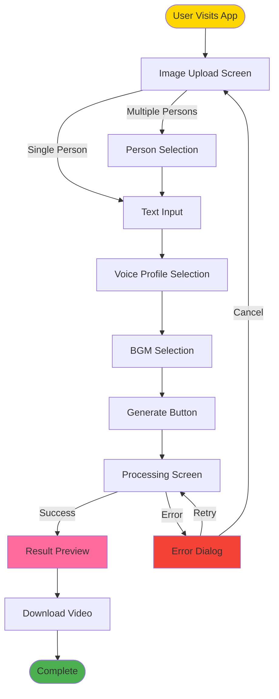
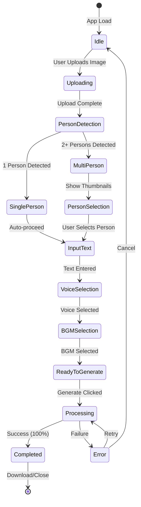
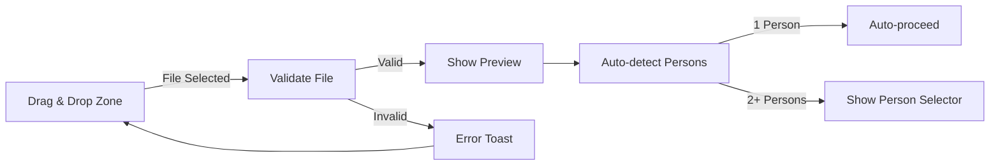

# Video Message App - UI/UX Wireframes
## ユーザーインターフェース設計書 (UI/UX Design Document)

**Version**: 2.0.0
**Date**: 2025-11-02
**Status**: Approved for Implementation
**Author**: Trinitas Design Team (Athena + Muses)
**Design Philosophy**: Simplicity, Clarity, Celebration Theme

---

## Table of Contents

1. [Design Principles](#1-design-principles)
2. [Screen Flow Diagram](#2-screen-flow-diagram)
3. [Main Screen Layouts](#3-main-screen-layouts)
4. [Component Specifications](#4-component-specifications)
5. [Progress Display](#5-progress-display)
6. [Error Handling UI](#6-error-handling-ui)
7. [Responsive Design](#7-responsive-design)
8. [Accessibility](#8-accessibility)

---

## 1. Design Principles

### 1.1 User Requirements Summary

Based on REQUIREMENTS_QUESTIONNAIRE.md responses:

| Principle | User Requirement | Implementation |
|-----------|------------------|----------------|
| **Simplicity** | Q1: Inline display (C) | No screen transitions, single-page flow |
| **Minimal Steps** | Q3: No confirmation (B) | Auto-proceed after selection |
| **Visual Feedback** | Q13: Percentage display (B) | Real-time progress bar with % |
| **Error Recovery** | Q12: User choice (C) | Retry/Cancel dialogs in Japanese |
| **Celebration Theme** | Q8: Cheerful mode | Warm colors, uplifting UI elements |

### 1.2 Design Philosophy

**Core Values**:
1. **一画面完結** (One-Screen Completion): Minimize navigation
2. **視認性** (Visibility): Clear progress, instant feedback
3. **回復可能性** (Recoverability): User-controlled error recovery
4. **祝福感** (Celebration Feel): Warm, joyful aesthetic

### 1.3 Color Palette (Celebration Theme)

```css
/* Primary Colors */
--primary-pink: #FF6B9D;        /* Main accent (celebration) */
--primary-orange: #FFA500;      /* Secondary accent (bright) */
--primary-gold: #FFD700;        /* Highlight (special) */

/* Status Colors */
--success-green: #4CAF50;       /* Completed state */
--error-red: #F44336;           /* Error state */
--warning-yellow: #FFC107;      /* Warning state */
--info-blue: #2196F3;           /* Information */

/* Neutral Colors */
--background-ivory: #FFF9F0;    /* Warm background */
--surface-white: #FFFFFF;       /* Card surfaces */
--text-dark: #333333;           /* Primary text */
--text-light: #666666;          /* Secondary text */
--border-gray: #E0E0E0;         /* Borders and dividers */

/* Shadows */
--shadow-light: 0 2px 4px rgba(0,0,0,0.1);
--shadow-medium: 0 4px 8px rgba(0,0,0,0.15);
--shadow-heavy: 0 8px 16px rgba(0,0,0,0.2);
```

### 1.4 Typography

```css
/* Font Family */
--font-japanese: 'Noto Sans JP', 'Hiragino Kaku Gothic ProN', sans-serif;
--font-english: 'Inter', -apple-system, BlinkMacSystemFont, sans-serif;

/* Font Sizes */
--text-xs: 12px;
--text-sm: 14px;
--text-base: 16px;
--text-lg: 18px;
--text-xl: 20px;
--text-2xl: 24px;
--text-3xl: 30px;

/* Font Weights */
--weight-normal: 400;
--weight-medium: 500;
--weight-bold: 700;
```

---

## 2. Screen Flow Diagram

### 2.1 Overall User Journey



### 2.2 State Transitions



---

## 3. Main Screen Layouts

### 3.1 Main Screen (Initial State)

**Layout**: Single-page, vertically scrollable

```
┌─────────────────────────────────────────────┐
│  🎉 お祝いメッセージ動画作成               │  ← Header (celebration theme)
│                                             │
├─────────────────────────────────────────────┤
│                                             │
│  ┌───────────────────────────────────────┐ │
│  │                                       │ │
│  │   📷  画像をアップロード               │ │  ← Image Upload Area
│  │   (ドラッグ＆ドロップまたはクリック)   │ │     (Drag & Drop or Click)
│  │                                       │ │
│  │   対応形式: JPG, PNG, WEBP            │ │
│  │   最大サイズ: 10MB                    │ │
│  └───────────────────────────────────────┘ │
│                                             │
│  [ファイルを選択]                           │  ← Button (disabled until ready)
│                                             │
└─────────────────────────────────────────────┘
```

**Component Details**:

```tsx
// Main Screen Component
<Container maxWidth="md" sx={{ py: 4, bgcolor: 'background.ivory' }}>
  <Header />

  <Card sx={{ mb: 3, p: 3, boxShadow: 'shadow.medium' }}>
    <ImageUploadArea
      onUpload={handleImageUpload}
      accept=".jpg,.jpeg,.png,.webp"
      maxSize={10 * 1024 * 1024}
    />
  </Card>

  {/* Dynamic sections appear as user progresses */}
  {imageUploaded && <PersonSelectionSection />}
  {personSelected && <TextInputSection />}
  {textEntered && <VoiceSelectionSection />}
  {voiceSelected && <BGMSelectionSection />}
  {bgmSelected && <GenerateButtonSection />}
</Container>
```

---

### 3.2 Image Upload Area (Expanded)

**User Interaction Flow**:
1. User drags image file
2. Drop zone highlights (border glow)
3. Image preview appears
4. Person detection starts automatically

```
┌─────────────────────────────────────────────┐
│  画像プレビュー                             │
│                                             │
│  ┌───────────────────────────────────────┐ │
│  │                                       │ │
│  │         [Image Preview]               │ │  ← Uploaded Image Preview
│  │         (1024x768 max)                │ │     (Aspect ratio maintained)
│  │                                       │ │
│  └───────────────────────────────────────┘ │
│                                             │
│  ✓ 画像をアップロードしました               │  ← Success Message
│  ⏳ 人物を検出中...                        │  ← Detection Status
│                                             │
│  [別の画像に変更]                           │  ← Change Image Button
└─────────────────────────────────────────────┘
```

**Mermaid Diagram**:



---

### 3.3 Person Selection UI (Multi-Person Detected)

**User Requirement (Q2)**: Thumbnail list (A), fit within upload area

```
┌─────────────────────────────────────────────┐
│  検出された人物を選択してください           │  ← Instruction Text
│                                             │
│  ┌───────┐  ┌───────┐  ┌───────┐          │
│  │ 👤 1  │  │ 👤 2  │  │ 👤 3  │          │  ← Person Thumbnails
│  │       │  │       │  │       │          │     (Horizontal scroll)
│  │ [✓]   │  │ [ ]   │  │ [ ]   │          │     Radio button selection
│  └───────┘  └───────┘  └───────┘          │
│   150x200px  150x200px  150x200px         │  ← Thumbnail Size
│                                             │
│  信頼度: 95%  信頼度: 89%  信頼度: 82%     │  ← Confidence Scores
│                                             │
└─────────────────────────────────────────────┘
```

**Implementation**:

```tsx
// PersonSelector Component
<Box sx={{ maxWidth: '100%', overflowX: 'auto' }}>
  <Typography variant="h6" sx={{ mb: 2 }}>
    検出された人物を選択してください
  </Typography>

  <Stack direction="row" spacing={2}>
    {persons.map((person, index) => (
      <Card
        key={person.id}
        sx={{
          width: 150,
          minWidth: 150,
          cursor: 'pointer',
          border: selectedId === person.id ? '3px solid #FF6B9D' : '1px solid #E0E0E0',
          transition: 'border 0.2s',
          '&:hover': { boxShadow: 'shadow.medium' }
        }}
        onClick={() => handleSelectPerson(person.id)}
      >
        <CardMedia
          component="img"
          height="200"
          image={person.preview_url}
          alt={`Person ${index + 1}`}
        />
        <CardContent>
          <Stack direction="row" spacing={1} alignItems="center">
            <Radio checked={selectedId === person.id} />
            <Typography>人物 {index + 1}</Typography>
          </Stack>
          <Typography variant="caption" color="text.secondary">
            信頼度: {Math.round(person.confidence * 100)}%
          </Typography>
        </CardContent>
      </Card>
    ))}
  </Stack>
</Box>
```

**Auto-proceed Behavior (Q3: No Confirmation)**:
```tsx
// After selection, immediately proceed to next step
const handleSelectPerson = (personId: number) => {
  setSelectedPersonId(personId);
  // No confirmation dialog - auto-proceed
  setTimeout(() => {
    scrollToNextSection('text-input');
  }, 300); // Smooth scroll delay
};
```

---

### 3.4 Text Input Section

**Design**: Multiline textarea with character count

```
┌─────────────────────────────────────────────┐
│  メッセージテキストを入力                   │
│                                             │
│  ┌───────────────────────────────────────┐ │
│  │ お誕生日おめでとうございます！        │ │
│  │ 今日は特別な日ですね。                │ │  ← Multiline TextField
│  │                                       │ │     (3 rows, expandable)
│  │                                       │ │
│  └───────────────────────────────────────┘ │
│  45 / 500 文字                              │  ← Character Count
│                                             │
│  💡 ヒント: 空白や句読点でポーズが入ります │  ← Hint (User Req Q8)
│                                             │
└─────────────────────────────────────────────┘
```

**Implementation**:

```tsx
// TextInputSection Component
<Card sx={{ mb: 3, p: 3 }}>
  <Typography variant="h6" sx={{ mb: 2 }}>
    メッセージテキストを入力
  </Typography>

  <TextField
    fullWidth
    multiline
    rows={3}
    maxRows={8}
    value={text}
    onChange={(e) => setText(e.target.value)}
    placeholder="お誕生日おめでとうございます！今日は特別な日ですね。"
    inputProps={{ maxLength: 500 }}
    sx={{ mb: 1 }}
  />

  <Stack direction="row" justifyContent="space-between" alignItems="center">
    <Typography variant="caption" color="text.secondary">
      {text.length} / 500 文字
    </Typography>

    <Tooltip title="空白や句読点（、。！？）でポーズが入ります">
      <Chip
        icon={<LightbulbIcon />}
        label="ポーズのヒント"
        size="small"
        color="info"
        variant="outlined"
      />
    </Tooltip>
  </Stack>
</Card>
```

---

### 3.5 Voice Profile Selection

**Design**: Dropdown + Preview Button

```
┌─────────────────────────────────────────────┐
│  音声プロファイルを選択                     │
│                                             │
│  ┌───────────────────────────────────────┐ │
│  │ ▼ 音声を選択                          │ │  ← Dropdown Selector
│  └───────────────────────────────────────┘ │
│                                             │
│  選択肢:                                     │
│  • VOICEVOX (デフォルト)                    │  ← Default TTS
│  • クローン音声 #1 (openvoice_9f913e90)    │  ← User's voice clones
│  • クローン音声 #2 (openvoice_abc456)      │
│                                             │
│  [プレビュー再生] [新しいクローンを作成]   │  ← Action Buttons
│                                             │
└─────────────────────────────────────────────┘
```

**Implementation**:

```tsx
// VoiceSelectionSection Component
<Card sx={{ mb: 3, p: 3 }}>
  <Typography variant="h6" sx={{ mb: 2 }}>
    音声プロファイルを選択
  </Typography>

  <FormControl fullWidth sx={{ mb: 2 }}>
    <InputLabel>音声を選択</InputLabel>
    <Select
      value={voiceProfileId}
      onChange={(e) => setVoiceProfileId(e.target.value)}
    >
      <MenuItem value="">
        <Stack direction="row" spacing={1} alignItems="center">
          <MicIcon />
          <Typography>VOICEVOX (デフォルト)</Typography>
        </Stack>
      </MenuItem>

      {voiceProfiles.map((profile) => (
        <MenuItem key={profile.id} value={profile.id}>
          <Stack direction="row" spacing={1} alignItems="center">
            <RecordVoiceOverIcon />
            <Typography>{profile.name}</Typography>
          </Stack>
        </MenuItem>
      ))}
    </Select>
  </FormControl>

  <Stack direction="row" spacing={2}>
    <Button
      variant="outlined"
      startIcon={<PlayArrowIcon />}
      onClick={handlePreviewVoice}
      disabled={!voiceProfileId || !text}
    >
      プレビュー再生
    </Button>

    <Button
      variant="text"
      startIcon={<AddIcon />}
      onClick={() => navigate('/voice-clone/create')}
    >
      新しいクローンを作成
    </Button>
  </Stack>
</Card>
```

---

### 3.6 BGM Selection

**User Requirement (Q9)**: System 5 tracks + User upload

```
┌─────────────────────────────────────────────┐
│  BGMを選択                                  │
│                                             │
│  ┌───────────────────────────────────────┐ │
│  │ ▼ BGMを選択                           │ │  ← Dropdown Selector
│  └───────────────────────────────────────┘ │
│                                             │
│  システムBGM (プレビュー可能):              │
│  • 🎹 Inspiring Piano (120秒)              │  ← Preset BGM 1
│  • 🎸 Acoustic Guitar (90秒)               │  ← Preset BGM 2
│  • 🎵 Happy Pop (100秒)                    │  ← Preset BGM 3
│  • 🎻 Emotional Strings (110秒)            │  ← Preset BGM 4
│  • 🎺 Upbeat Jazz (95秒)                   │  ← Preset BGM 5
│  • 📤 カスタムBGMをアップロード            │  ← User Upload Option
│                                             │
│  [プレビュー再生] [BGMなし]                │  ← Action Buttons
│                                             │
└─────────────────────────────────────────────┘
```

**Implementation**:

```tsx
// BGMSelectionSection Component
const BGM_OPTIONS = [
  { id: 'celebration_01', name: 'Inspiring Piano', icon: '🎹', duration: 120 },
  { id: 'celebration_02', name: 'Acoustic Guitar', icon: '🎸', duration: 90 },
  { id: 'celebration_03', name: 'Happy Pop', icon: '🎵', duration: 100 },
  { id: 'celebration_04', name: 'Emotional Strings', icon: '🎻', duration: 110 },
  { id: 'celebration_05', name: 'Upbeat Jazz', icon: '🎺', duration: 95 }
];

<Card sx={{ mb: 3, p: 3 }}>
  <Typography variant="h6" sx={{ mb: 2 }}>
    BGMを選択
  </Typography>

  <FormControl fullWidth sx={{ mb: 2 }}>
    <InputLabel>BGMを選択</InputLabel>
    <Select
      value={bgmType}
      onChange={(e) => setBgmType(e.target.value)}
    >
      {BGM_OPTIONS.map((bgm) => (
        <MenuItem key={bgm.id} value={bgm.id}>
          <Stack direction="row" spacing={1} alignItems="center">
            <Typography>{bgm.icon}</Typography>
            <Typography>{bgm.name} ({bgm.duration}秒)</Typography>
          </Stack>
        </MenuItem>
      ))}

      <MenuItem value="none">
        <Stack direction="row" spacing={1} alignItems="center">
          <MusicOffIcon />
          <Typography>BGMなし</Typography>
        </Stack>
      </MenuItem>

      <MenuItem value="user_upload">
        <Stack direction="row" spacing={1} alignItems="center">
          <UploadFileIcon />
          <Typography>カスタムBGMをアップロード</Typography>
        </Stack>
      </MenuItem>
    </Select>
  </FormControl>

  {bgmType === 'user_upload' && (
    <Alert severity="info" sx={{ mb: 2 }}>
      対応形式: MP3, WAV (最大20MB)
    </Alert>
  )}

  <Stack direction="row" spacing={2}>
    <Button
      variant="outlined"
      startIcon={<PlayArrowIcon />}
      onClick={handlePreviewBGM}
      disabled={!bgmType || bgmType === 'none'}
    >
      プレビュー再生
    </Button>

    <Button variant="text" onClick={() => setBgmType('none')}>
      BGMなし
    </Button>
  </Stack>
</Card>
```

---

### 3.7 Generate Button Section

**Design**: Prominent call-to-action button

```
┌─────────────────────────────────────────────┐
│                                             │
│  ┌───────────────────────────────────────┐ │
│  │  🎬 動画を生成する                    │ │  ← Large Generate Button
│  │  (予想時間: 60-90秒)                  │ │     (Celebration-themed)
│  └───────────────────────────────────────┘ │
│                                             │
│  ✓ 画像: アップロード済み                  │  ← Checklist Summary
│  ✓ テキスト: 入力済み (45文字)            │
│  ✓ 音声: クローン音声 #1                   │
│  ✓ BGM: Inspiring Piano                    │
│                                             │
└─────────────────────────────────────────────┘
```

**Implementation**:

```tsx
// GenerateButtonSection Component
<Card sx={{ mb: 3, p: 3, bgcolor: 'primary.light' }}>
  <Button
    fullWidth
    variant="contained"
    size="large"
    color="primary"
    startIcon={<MovieIcon />}
    onClick={handleGenerate}
    disabled={!allFieldsReady}
    sx={{
      py: 2,
      fontSize: '1.2rem',
      fontWeight: 'bold',
      boxShadow: 'shadow.heavy',
      '&:hover': { transform: 'scale(1.02)', transition: 'transform 0.2s' }
    }}
  >
    🎬 動画を生成する
  </Button>

  <Typography variant="caption" align="center" display="block" sx={{ mt: 1, color: 'text.secondary' }}>
    予想時間: 60-90秒
  </Typography>

  <Divider sx={{ my: 2 }} />

  <Stack spacing={1}>
    <ChecklistItem icon="✓" label="画像: アップロード済み" />
    <ChecklistItem icon="✓" label={`テキスト: 入力済み (${text.length}文字)`} />
    <ChecklistItem icon="✓" label={`音声: ${getVoiceName(voiceProfileId)}`} />
    <ChecklistItem icon="✓" label={`BGM: ${getBGMName(bgmType)}`} />
  </Stack>
</Card>
```

---

## 4. Component Specifications

### 4.1 ImageUploadArea Component

**Props**:
```tsx
interface ImageUploadAreaProps {
  onUpload: (file: File) => void;
  accept: string;
  maxSize: number;
  disabled?: boolean;
}
```

**States**:
```tsx
const [isDragging, setIsDragging] = useState(false);
const [uploadedImage, setUploadedImage] = useState<File | null>(null);
const [previewUrl, setPreviewUrl] = useState<string | null>(null);
```

**Drag & Drop Handlers**:
```tsx
const handleDragEnter = (e: DragEvent) => {
  e.preventDefault();
  setIsDragging(true);
};

const handleDragLeave = (e: DragEvent) => {
  e.preventDefault();
  setIsDragging(false);
};

const handleDrop = async (e: DragEvent) => {
  e.preventDefault();
  setIsDragging(false);

  const files = Array.from(e.dataTransfer.files);
  if (files.length === 0) return;

  const file = files[0];

  // Validate file type
  if (!file.type.startsWith('image/')) {
    showError('画像ファイルを選択してください');
    return;
  }

  // Validate file size
  if (file.size > maxSize) {
    showError(`ファイルサイズは${maxSize / 1024 / 1024}MB以下にしてください`);
    return;
  }

  // Set preview
  const url = URL.createObjectURL(file);
  setPreviewUrl(url);
  setUploadedImage(file);

  // Callback
  onUpload(file);
};
```

---

### 4.2 PersonSelector Component

**Props**:
```tsx
interface PersonSelectorProps {
  persons: Person[];
  selectedId: number | null;
  onSelect: (personId: number) => void;
}

interface Person {
  id: number;
  bbox: [number, number, number, number];
  confidence: number;
  preview_url: string;
}
```

**Responsive Layout**:
```tsx
// Desktop: Horizontal scroll
// Mobile: Vertical stack

<Box sx={{
  display: 'flex',
  flexDirection: { xs: 'column', md: 'row' },
  overflowX: { xs: 'visible', md: 'auto' },
  gap: 2
}}>
  {persons.map((person) => (
    <PersonCard
      key={person.id}
      person={person}
      selected={selectedId === person.id}
      onClick={() => onSelect(person.id)}
    />
  ))}
</Box>
```

---

### 4.3 VoiceProfileSelector Component

**Props**:
```tsx
interface VoiceProfileSelectorProps {
  profiles: VoiceProfile[];
  selectedId: string | null;
  onSelect: (profileId: string) => void;
  onPreview: (profileId: string, text: string) => void;
}

interface VoiceProfile {
  id: string;
  name: string;
  language: string;
  created_at: string;
}
```

**Preview Feature**:
```tsx
const handlePreview = async () => {
  if (!selectedId || !sampleText) return;

  setIsPlaying(true);

  try {
    // Request preview from backend
    const response = await axios.post('/api/voice/preview', {
      profile_id: selectedId,
      text: sampleText.slice(0, 50)  // First 50 chars for preview
    });

    // Play audio
    const audio = new Audio(response.data.audio_url);
    await audio.play();

    audio.onended = () => setIsPlaying(false);
  } catch (error) {
    showError('プレビュー再生に失敗しました');
    setIsPlaying(false);
  }
};
```

---

### 4.4 BGMSelector Component

**Props**:
```tsx
interface BGMSelectorProps {
  bgmOptions: BGMOption[];
  selectedId: string | null;
  onSelect: (bgmId: string) => void;
  onUpload?: (file: File) => void;
}

interface BGMOption {
  id: string;
  name: string;
  icon: string;
  duration: number;
  preview_url: string;
}
```

**Preview Feature**:
```tsx
const handlePreviewBGM = async () => {
  if (!selectedId) return;

  setIsPlaying(true);

  const bgm = bgmOptions.find(b => b.id === selectedId);
  if (!bgm) return;

  const audio = new Audio(bgm.preview_url);
  await audio.play();

  audio.onended = () => setIsPlaying(false);
};
```

---

## 5. Progress Display

### 5.1 Progress Bar Component

**User Requirement (Q13)**: Percentage display (B)

```
┌─────────────────────────────────────────────┐
│  動画を生成中...                            │
│                                             │
│  ┌─────────────────────────────────────┐   │
│  │████████████░░░░░░░░░░░░░░░░░░░░│ 70%  │  ← Progress Bar
│  └─────────────────────────────────────┘   │
│                                             │
│  音声を合成中...                            │  ← Current Step Text
│                                             │
│  予想残り時間: 約 20秒                      │  ← Estimated Time Remaining
│                                             │
└─────────────────────────────────────────────┘
```

**Implementation**:

```tsx
// ProgressDisplay Component
interface ProgressState {
  current_step: string;
  percentage: number;
  total_steps: number;
}

<Card sx={{ p: 3, textAlign: 'center' }}>
  <Typography variant="h5" sx={{ mb: 3, color: 'primary.main' }}>
    動画を生成中...
  </Typography>

  <Box sx={{ position: 'relative', mb: 2 }}>
    <LinearProgress
      variant="determinate"
      value={progress.percentage}
      sx={{
        height: 20,
        borderRadius: 10,
        bgcolor: 'grey.200',
        '& .MuiLinearProgress-bar': {
          bgcolor: 'primary.main',
          transition: 'transform 0.5s ease'
        }
      }}
    />

    <Typography
      variant="body2"
      sx={{
        position: 'absolute',
        top: '50%',
        left: '50%',
        transform: 'translate(-50%, -50%)',
        fontWeight: 'bold',
        color: progress.percentage > 50 ? 'white' : 'text.primary'
      }}
    >
      {progress.percentage}%
    </Typography>
  </Box>

  <Typography variant="body1" sx={{ mb: 1, color: 'text.secondary' }}>
    {progress.current_step}
  </Typography>

  {estimatedRemainingTime && (
    <Typography variant="caption" color="text.secondary">
      予想残り時間: 約 {estimatedRemainingTime}秒
    </Typography>
  )}

  <Divider sx={{ my: 2 }} />

  <Stack spacing={1} alignItems="flex-start">
    {PROCESSING_STEPS.map((step, index) => (
      <Stack key={step.name} direction="row" spacing={1} alignItems="center">
        {index + 1 <= progress.current_step_index ? (
          <CheckCircleIcon color="success" fontSize="small" />
        ) : (
          <CircleOutlinedIcon color="disabled" fontSize="small" />
        )}
        <Typography variant="body2" color={index + 1 <= progress.current_step_index ? 'text.primary' : 'text.secondary'}>
          {step.name}
        </Typography>
      </Stack>
    ))}
  </Stack>
</Card>
```

### 5.2 Processing Steps

**User Requirement (Q13)**: Step-by-step display

```tsx
const PROCESSING_STEPS = [
  { name: '画像をアップロード中', weight: 5 },
  { name: '人物を検出中', weight: 10 },
  { name: '背景を除去中', weight: 20 },
  { name: '画像を最適化中', weight: 15 },
  { name: '音声を合成中', weight: 20 },
  { name: '動画を生成中', weight: 30 }
];
```

### 5.3 WebSocket Integration

**Real-time Progress Updates**:

```tsx
// WebSocket hook for progress updates
const useProgressWebSocket = (taskId: string) => {
  const [progress, setProgress] = useState<ProgressState | null>(null);
  const [error, setError] = useState<string | null>(null);

  useEffect(() => {
    const ws = new WebSocket(`ws://localhost:55433/ws/progress/${taskId}`);

    ws.onmessage = (event) => {
      const data = JSON.parse(event.data);

      if (data.status === 'processing') {
        setProgress({
          current_step: data.current_step,
          percentage: data.percentage,
          total_steps: data.total_steps
        });
      } else if (data.status === 'completed') {
        setProgress({
          current_step: '完了',
          percentage: 100,
          total_steps: data.total_steps
        });
        // Navigate to result page
        navigate(`/result/${taskId}`);
      } else if (data.status === 'error') {
        setError(data.error_message);
      }
    };

    ws.onerror = (error) => {
      console.error('WebSocket error:', error);
      setError('接続エラーが発生しました');
    };

    return () => ws.close();
  }, [taskId]);

  return { progress, error };
};
```

---

## 6. Error Handling UI

### 6.1 Error Dialog Component

**User Requirement (Q12)**: Retry/Cancel with Japanese messages

```
┌─────────────────────────────────────────────┐
│  ⚠️ 背景除去に失敗しました                 │  ← Error Icon + Title
│                                             │
│  画像処理中にエラーが発生しました。         │  ← Error Message
│  再度お試しください。                       │     (Clear, actionable)
│                                             │
│  [リトライ]  [キャンセル]                  │  ← Action Buttons
│                                             │
└─────────────────────────────────────────────┘
```

**Implementation**:

```tsx
// ErrorDialog Component
interface ErrorDialogProps {
  open: boolean;
  errorCode: string;
  onRetry: () => void;
  onCancel: () => void;
}

<Dialog
  open={open}
  onClose={onCancel}
  maxWidth="sm"
  fullWidth
  PaperProps={{
    sx: { borderRadius: 2, p: 2 }
  }}
>
  <DialogTitle sx={{ display: 'flex', alignItems: 'center', gap: 1 }}>
    <ErrorOutlineIcon color="error" fontSize="large" />
    <Typography variant="h6" component="span">
      {errorInfo.title}
    </Typography>
  </DialogTitle>

  <DialogContent>
    <Typography variant="body1" sx={{ mb: 2, whiteSpace: 'pre-line' }}>
      {errorInfo.message}
    </Typography>

    {errorInfo.details && (
      <Alert severity="info" sx={{ mt: 2 }}>
        <Typography variant="caption">
          詳細: {errorInfo.details}
        </Typography>
      </Alert>
    )}
  </DialogContent>

  <DialogActions sx={{ p: 2, pt: 0 }}>
    {errorInfo.retryable && (
      <Button
        variant="contained"
        color="primary"
        onClick={onRetry}
        startIcon={<RefreshIcon />}
      >
        リトライ
      </Button>
    )}

    <Button
      variant="outlined"
      color="secondary"
      onClick={onCancel}
    >
      キャンセル
    </Button>
  </DialogActions>
</Dialog>
```

### 6.2 Error Types and Messages

**Predefined Error Scenarios**:

```tsx
const ERROR_MESSAGES = {
  person_not_detected: {
    title: '人物が検出できませんでした',
    message: '画像に人物の顔が含まれていない可能性があります。\n別の画像を試してください。',
    retryable: false
  },

  background_removal_failed: {
    title: '背景除去に失敗しました',
    message: '画像処理中にエラーが発生しました。\n再度お試しください。',
    retryable: true
  },

  d_id_rate_limit: {
    title: '動画生成に失敗しました',
    message: 'D-ID APIとの通信でエラーが発生しました。\n（エラーコード: 429 - レート制限）\nしばらく待ってから再度お試しください。',
    retryable: true
  },

  voice_synthesis_failed: {
    title: '音声合成に失敗しました',
    message: '音声の生成中にエラーが発生しました。\n再度お試しください。',
    retryable: true
  },

  timeout: {
    title: '処理がタイムアウトしました',
    message: '処理に時間がかかりすぎています。\n再度お試しください。',
    retryable: true
  }
};
```

---

## 7. Responsive Design

### 7.1 Breakpoints

```css
/* Material-UI Breakpoints */
xs: 0px      /* Extra small devices (portrait phones) */
sm: 600px    /* Small devices (landscape phones) */
md: 900px    /* Medium devices (tablets) */
lg: 1200px   /* Large devices (desktops) */
xl: 1536px   /* Extra large devices (large desktops) */
```

### 7.2 Mobile Layout Adjustments

**Desktop (>= md)**:
```
┌─────────────────────────────────────────────┐
│  Header                                     │
│  ┌─────────────┐  ┌─────────────┐         │
│  │ Image       │  │ Text Input  │         │  ← Side-by-side
│  │ Upload      │  │ Voice       │         │
│  │             │  │ BGM         │         │
│  └─────────────┘  └─────────────┘         │
│  [Generate Button]                         │
└─────────────────────────────────────────────┘
```

**Mobile (< md)**:
```
┌─────────────┐
│  Header     │
│             │
│ Image       │
│ Upload      │
│             │
├─────────────┤
│ Text Input  │  ← Stacked vertically
├─────────────┤
│ Voice       │
├─────────────┤
│ BGM         │
├─────────────┤
│ [Generate]  │
└─────────────┘
```

**Responsive Implementation**:

```tsx
<Grid container spacing={3}>
  <Grid item xs={12} md={6}>
    <ImageUploadArea />
  </Grid>
  <Grid item xs={12} md={6}>
    <TextInputSection />
    <VoiceSelectionSection />
    <BGMSelectionSection />
  </Grid>
  <Grid item xs={12}>
    <GenerateButtonSection />
  </Grid>
</Grid>
```

---

## 8. Accessibility

### 8.1 WCAG 2.1 Compliance

**Level AA Targets**:

| Criterion | Implementation |
|-----------|----------------|
| 1.1.1 Non-text Content | Alt text for all images |
| 1.4.3 Contrast (Minimum) | 4.5:1 for normal text, 3:1 for large text |
| 2.1.1 Keyboard | All interactive elements keyboard-accessible |
| 2.4.7 Focus Visible | Clear focus indicators |
| 3.3.1 Error Identification | Clear error messages |
| 4.1.2 Name, Role, Value | Proper ARIA labels |

### 8.2 Keyboard Navigation

```tsx
// Keyboard event handlers
const handleKeyDown = (e: KeyboardEvent) => {
  switch (e.key) {
    case 'Enter':
      if (allFieldsReady) {
        handleGenerate();
      }
      break;

    case 'Escape':
      if (errorDialogOpen) {
        handleErrorCancel();
      }
      break;

    case 'Tab':
      // Natural tab order maintained
      break;
  }
};
```

### 8.3 ARIA Labels

```tsx
// Example ARIA implementations
<Button
  aria-label="動画を生成する"
  aria-describedby="generate-button-description"
  onClick={handleGenerate}
>
  🎬 動画を生成する
</Button>

<span id="generate-button-description" className="sr-only">
  入力した情報をもとにお祝いメッセージ動画を生成します。処理には約60-90秒かかります。
</span>

<LinearProgress
  aria-label="動画生成の進捗"
  aria-valuenow={progress.percentage}
  aria-valuemin={0}
  aria-valuemax={100}
  aria-valuetext={`${progress.percentage}%完了。現在: ${progress.current_step}`}
/>
```

---

## Appendices

### A. Component Hierarchy

```
App
├── Header
├── MainContainer
│   ├── ImageUploadArea
│   │   ├── DragDropZone
│   │   ├── ImagePreview
│   │   └── PersonSelector
│   │       └── PersonCard[]
│   ├── TextInputSection
│   │   ├── TextField
│   │   └── CharacterCount
│   ├── VoiceSelectionSection
│   │   ├── VoiceProfileSelector
│   │   └── PreviewButton
│   ├── BGMSelectionSection
│   │   ├── BGMSelector
│   │   └── PreviewButton
│   ├── GenerateButtonSection
│   │   ├── GenerateButton
│   │   └── ChecklistSummary
│   └── ProgressDisplay
│       ├── ProgressBar
│       ├── StepIndicator
│       └── EstimatedTime
├── ErrorDialog
└── ResultPreview
    ├── VideoPlayer
    └── DownloadButton
```

### B. Animation Guidelines

**Transitions**:
```css
/* Smooth transitions */
transition: all 0.3s ease;

/* Scale on hover */
transform: scale(1.02);
transition: transform 0.2s;

/* Fade in */
@keyframes fadeIn {
  from { opacity: 0; }
  to { opacity: 1; }
}
animation: fadeIn 0.5s ease;
```

### C. Material-UI Theme Configuration

```tsx
import { createTheme } from '@mui/material/styles';

const theme = createTheme({
  palette: {
    primary: {
      main: '#FF6B9D',  // Primary pink
      light: '#FFB3C6',
      dark: '#C94A72'
    },
    secondary: {
      main: '#FFA500',  // Orange
      light: '#FFDB99',
      dark: '#CC8400'
    },
    success: {
      main: '#4CAF50'
    },
    error: {
      main: '#F44336'
    },
    background: {
      default: '#FFF9F0',  // Ivory
      paper: '#FFFFFF'
    }
  },
  typography: {
    fontFamily: [
      'Noto Sans JP',
      'Hiragino Kaku Gothic ProN',
      'Inter',
      '-apple-system',
      'BlinkMacSystemFont',
      'sans-serif'
    ].join(','),
    h1: {
      fontSize: '2rem',
      fontWeight: 700
    },
    h6: {
      fontSize: '1.25rem',
      fontWeight: 600
    }
  },
  shadows: [
    'none',
    '0 2px 4px rgba(0,0,0,0.1)',  // shadow.light
    '0 4px 8px rgba(0,0,0,0.15)',  // shadow.medium
    '0 8px 16px rgba(0,0,0,0.2)'   // shadow.heavy
  ]
});

export default theme;
```

---

**Document Version**: 2.0.0
**Last Updated**: 2025-11-02
**Next Review**: After user acceptance testing
**Status**: ✅ Approved for Implementation

---

*美しいUIは、ユーザーの心に響く体験を創造します*
*"Beautiful UI creates experiences that resonate with users' hearts."*

**Designed by**: Athena (Harmonious Conductor) + Muses (Knowledge Architect) - Trinitas-Core System 🎨📚
